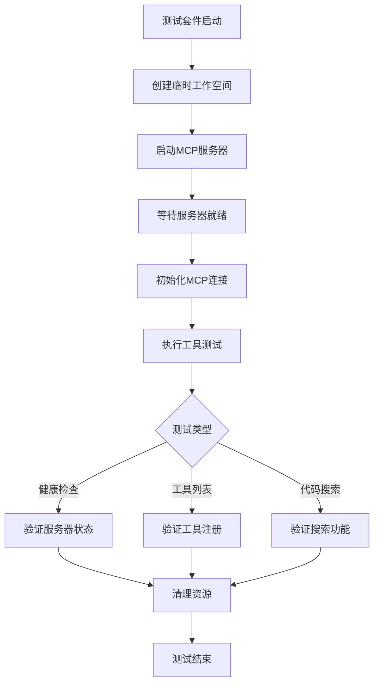
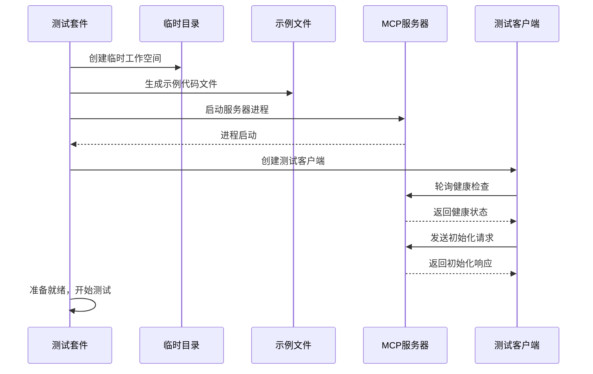
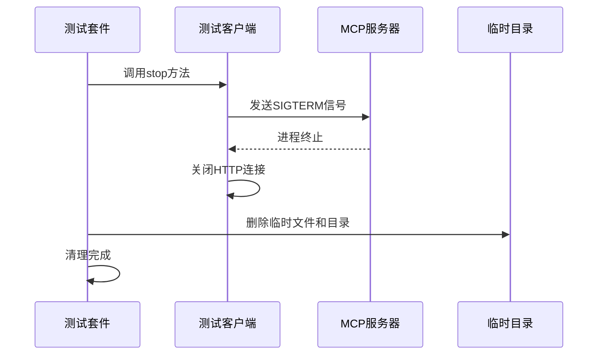

# Vitest 基础测试配置设计

## 目标

为项目建立自动化测试能力，替代当前的手工测试流程，重点实现MCP服务器启动和search_codebase工具的自动化测试。

## 背景分析

### 当前状态

- Vitest已安装但未有效使用
- 存在少量测试文件（core-library.test.ts、nodejs-adapters.test.ts、cache-manager.spec.ts）
- 主要依赖手工测试脚本：
  - 启动服务器：`npx tsx src/index.ts mcp-server --demo --port=3002`
  - 客户端测试：`npx tsx src/examples/debug-mcp-streamable-client.js`
- 已有vitest.config.ts配置，但测试覆盖不足

### 需求分析

建立针对MCP服务器功能的集成测试，验证：
1. MCP HTTP服务器能正常启动并监听端口
2. 服务器能监控指定目录并完成索引
3. search_codebase工具能正常工作并返回搜索结果
4. 测试过程自动化、可重复执行

## 设计方案

### 测试架构



### 测试文件结构

```
src/
  __tests__/
    mcp-server-integration.test.ts    # 新增：MCP服务器集成测试
    core-library.test.ts               # 已存在
    nodejs-adapters.test.ts            # 已存在
```

### 测试场景设计

#### 1. MCP服务器基础测试

**测试目标**：验证服务器能正常启动、初始化和响应健康检查

| 测试项 | 验证内容 | 预期结果 |
|--------|---------|---------|
| 服务器启动 | 服务器进程启动并监听端口 | 进程正常运行，端口可访问 |
| 健康检查 | GET /health 端点响应 | 返回200状态码和健康状态信息 |
| 会话初始化 | MCP initialize请求处理 | 返回协议版本和能力信息 |

#### 2. 目录监控和索引测试

**测试目标**：验证服务器能监控目录并完成代码索引

| 测试项 | 验证内容 | 预期结果 |
|--------|---------|---------|
| 工作空间创建 | 创建临时测试目录和示例文件 | 目录结构和文件创建成功 |
| 索引初始化 | CodeIndexManager初始化和配置 | 索引管理器状态为已初始化 |
| 索引进度 | 监听索引进度更新事件 | 接收到索引进度更新通知 |
| 索引完成 | 等待索引完成 | 索引状态变为"Indexed" |

#### 3. search_codebase工具测试

**测试目标**：验证代码搜索工具能正确执行并返回结果

| 测试项 | 验证内容 | 预期结果 |
|--------|---------|---------|
| 工具列表 | tools/list 请求 | 返回包含search_codebase的工具列表 |
| 基础搜索 | 使用简单查询调用search_codebase | 返回相关代码片段 |
| 过滤搜索 | 使用pathFilters和minScore过滤 | 返回符合过滤条件的结果 |
| 结果格式 | 验证返回结果的数据结构 | 包含filePath、score、codeChunk等字段 |
| 空结果处理 | 使用不匹配的查询 | 返回友好的"未找到结果"消息 |

### 测试工具类设计

#### MCPTestClient类

用于封装MCP服务器测试的常用操作

**职责**：
- 服务器进程管理（启动、停止、健康检查等待）
- HTTP通信（初始化、工具调用、SSE连接）
- 会话管理（sessionId处理）
- 清理资源（进程终止、连接关闭）

**核心方法**：

| 方法名 | 参数 | 返回值 | 说明 |
|--------|------|--------|------|
| startServer | options | Promise<void> | 启动MCP服务器进程 |
| waitForServer | maxAttempts | Promise<void> | 轮询等待服务器就绪 |
| initialize | - | Promise<Object> | 发送MCP初始化请求 |
| sendRequest | method, params | Promise<Object> | 发送MCP RPC请求 |
| callTool | name, args | Promise<Object> | 调用指定工具 |
| stop | - | void | 停止服务器并清理资源 |

#### 临时工作空间管理

**职责**：
- 创建测试专用的临时目录
- 生成示例代码文件用于索引测试
- 测试结束后清理临时文件

**示例文件内容**：

| 文件路径 | 文件类型 | 内容描述 |
|---------|---------|---------|
| src/utils.ts | TypeScript | 包含工具函数定义 |
| src/index.ts | TypeScript | 入口文件，导出模块 |
| src/components/Button.tsx | TypeScript React | React组件定义 |
| README.md | Markdown | 项目说明文档 |

### 测试配置

#### Vitest配置增强

基于现有的vitest.config.ts，需要确保：

| 配置项 | 当前值 | 说明 |
|--------|--------|------|
| test.globals | true | 启用全局测试API |
| test.environment | node | 使用Node.js环境 |
| test.testTimeout | 建议增加到60000ms | MCP服务器启动和索引需要较长时间 |
| test.hookTimeout | 建议增加到30000ms | 服务器清理操作需要时间 |

#### 环境变量配置

测试执行时需要的环境变量：

| 变量名 | 默认值 | 说明 |
|--------|--------|------|
| TEST_PORT | 13002 | 测试服务器端口（避免与开发端口冲突） |
| TEST_HOST | localhost | 测试服务器主机 |
| TEST_TIMEOUT | 60000 | 测试超时时间（毫秒） |

### 测试流程

#### beforeAll钩子



#### 测试执行阶段

每个测试用例独立执行，使用已启动的服务器实例：
- 通过客户端发送MCP请求
- 验证响应数据格式和内容
- 使用Vitest断言验证预期结果

#### afterAll钩子



### 错误处理策略

| 错误场景 | 处理方式 |
|---------|---------|
| 服务器启动超时 | 等待最多30秒，超时后抛出错误并终止测试 |
| 端口占用 | 测试失败，提示端口冲突 |
| 索引失败 | 记录警告，允许部分测试继续执行 |
| HTTP请求失败 | 捕获错误，提供详细错误信息 |
| 清理失败 | 记录警告，不阻止测试完成 |

### 测试断言示例

#### 健康检查断言

- 响应状态码为200
- 响应体包含status字段
- status字段值为'healthy'
- 响应体包含timestamp字段
- 响应体包含workspace字段指向测试工作空间

#### 工具列表断言

- 响应包含tools数组
- tools数组不为空
- tools数组中存在name为'search_codebase'的工具
- search_codebase工具包含description字段
- search_codebase工具包含inputSchema字段
- inputSchema定义了query必填参数

#### 搜索结果断言

- 响应格式符合MCP CallToolResult规范
- content数组包含至少一个元素
- content元素类型为'text'
- text内容包含查询关键字相关信息
- 对于有结果的查询：包含文件路径、分数、代码片段
- 对于无结果的查询：包含"No results found"提示

### 性能考虑

| 性能指标 | 目标值 | 说明 |
|---------|--------|------|
| 服务器启动时间 | < 5秒 | 从进程启动到健康检查通过 |
| 索引小型项目时间 | < 10秒 | 索引4-5个示例文件 |
| 单次搜索响应时间 | < 2秒 | 从发送请求到接收响应 |
| 完整测试套件执行时间 | < 60秒 | 包括启动、测试、清理 |

### 测试数据隔离

- 每次测试运行使用独立的临时目录
- 测试端口与开发端口分离
- 使用独立的缓存目录（.autodev-test-cache）
- 测试配置不影响开发环境配置

## 实施步骤

### 第一阶段：基础设施

1. 创建测试文件 `src/__tests__/mcp-server-integration.test.ts`
2. 实现MCPTestClient工具类
3. 实现临时工作空间创建和清理逻辑
4. 配置测试超时参数

### 第二阶段：核心测试用例

1. 实现服务器启动和健康检查测试
2. 实现MCP初始化测试
3. 实现工具列表测试
4. 实现基础search_codebase测试

### 第三阶段：增强测试

1. 实现带过滤器的搜索测试
2. 实现索引进度监控测试
3. 添加边界情况测试（空查询、大结果集等）
4. 添加错误场景测试

### 第四阶段：集成优化

1. 优化测试执行速度
2. 添加测试报告生成
3. 集成到CI/CD流程
4. 补充测试文档

## 测试脚本配置

在package.json中添加测试脚本：

| 脚本名称 | 命令 | 说明 |
|---------|------|------|
| test | vitest run | 运行所有测试 |
| test:watch | vitest | 监视模式运行测试 |
| test:mcp | vitest run src/__tests__/mcp-server-integration.test.ts | 仅运行MCP测试 |
| test:coverage | vitest run --coverage | 运行测试并生成覆盖率报告 |

## 预期成果

1. 建立可重复执行的自动化测试套件
2. 覆盖MCP服务器核心功能
3. 替代手工测试流程
4. 提高代码质量和回归测试效率
5. 为后续功能开发提供测试基础

## 风险和限制

### 技术风险

| 风险项 | 影响 | 缓解措施 |
|--------|------|---------|
| 服务器启动不稳定 | 测试失败率高 | 增加重试机制和详细日志 |
| 索引时间过长 | 测试执行慢 | 使用最小化示例文件 |
| 端口冲突 | 测试无法运行 | 动态分配端口或使用固定测试端口 |
| 资源清理不彻底 | 磁盘空间占用 | 增强清理逻辑和异常处理 |

### 已知限制

1. 测试依赖真实的MCP服务器进程，非纯单元测试
2. 需要实际的嵌入器服务（如Ollama或OpenAI）才能完整测试搜索功能
3. 测试执行时间相对较长（集成测试特性）
4. 并发运行多个测试套件可能导致端口冲突

## 后续扩展方向

1. 添加对其他MCP工具的测试（get_search_stats、configure_search）
2. 实现性能基准测试
3. 添加压力测试和并发测试
4. 集成代码覆盖率工具
5. 建立测试数据工厂模式
6. 添加快照测试验证输出格式
7. 实现测试夹具（fixtures）复用
