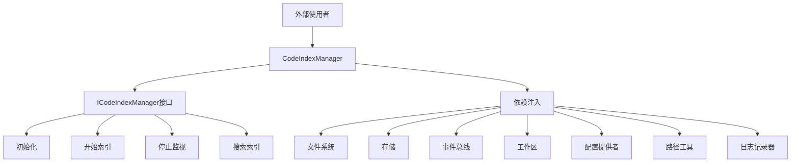
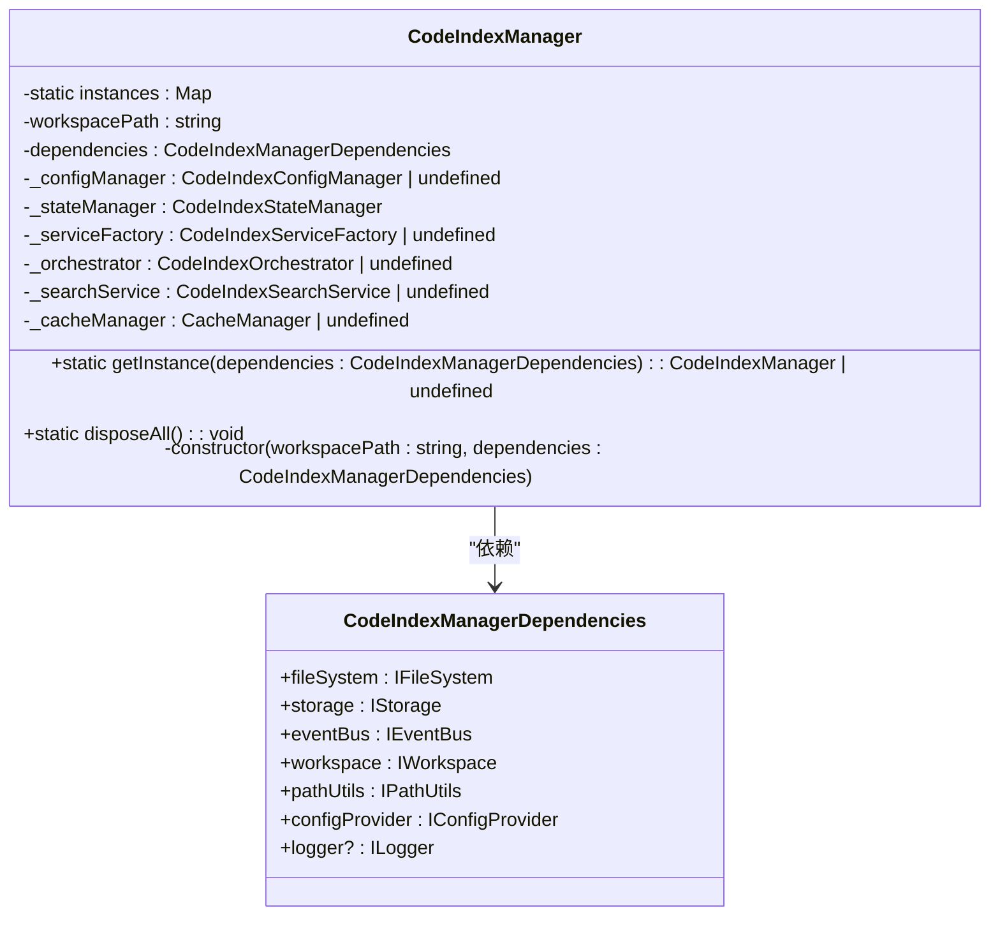
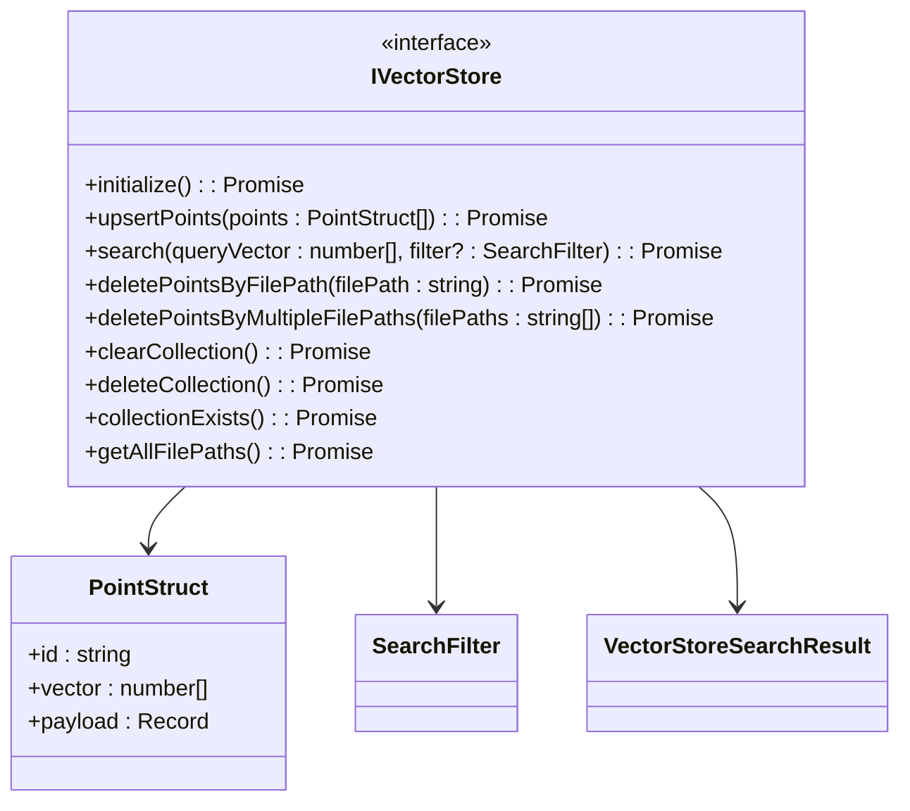

# API参考

<cite>
**Referenced Files in This Document**   
- [src/index.ts](file://src/index.ts)
- [src/code-index/manager.ts](file://src/code-index/manager.ts)
- [src/code-index/interfaces/manager.ts](file://src/code-index/interfaces/manager.ts)
- [src/code-index/interfaces/embedder.ts](file://src/code-index/interfaces/embedder.ts)
- [src/code-index/interfaces/vector-store.ts](file://src/code-index/interfaces/vector-store.ts)
- [src/code-index/interfaces/file-processor.ts](file://src/code-index/interfaces/file-processor.ts)
- [src/examples/nodejs-usage.ts](file://src/examples/nodejs-usage.ts)
- [src/examples/simple-demo.ts](file://src/examples/simple-demo.ts)
- [src/abstractions/core.ts](file://src/abstractions/core.ts)
</cite>

## 目录
1. [简介](#简介)
2. [核心API概览](#核心api概览)
3. [单例模式与实例管理](#单例模式与实例管理)
4. [CodeIndexManager核心API](#codeindexmanager核心api)
5. [关键接口定义](#关键接口定义)
6. [Node.js环境使用示例](#nodejs环境使用示例)
7. [错误处理与异常](#错误处理与异常)

## 简介
本文档提供了`autodev-codebase`库的全面API参考，重点介绍`src/index.ts`中暴露给外部使用者的公共接口。文档详细描述了`CodeIndexManager`类的单例模式实现、`getInstance`方法以及其核心API，包括`initialize`、`startIndexing`、`stopWatcher`和`searchIndex`等方法。同时，文档记录了`code-index/interfaces/`目录下定义的关键接口，如`ICodeIndexManager`、`IEmbedder`和`IVectorStore`，解释其实现契约。最后，文档提供了TypeScript代码片段，展示如何在Node.js环境中导入库并调用这些API来构建自定义应用。

**Section sources**
- [src/index.ts](file://src/index.ts#L1-L80)

## 核心API概览
`autodev-codebase`库通过`src/index.ts`文件暴露其主要API，允许开发者在Node.js或其他JavaScript环境中集成代码索引和搜索功能。该库的核心是`CodeIndexManager`类，它实现了单例模式以确保每个工作区路径只有一个实例。`CodeIndexManager`通过`ICodeIndexManager`接口定义了其公共API，包括初始化、索引、搜索和状态管理等功能。库还定义了多个接口来抽象底层实现，如文件系统、事件总线、日志记录和配置管理，使得库可以在不同平台（如Node.js和VS Code）上运行。



**Diagram sources**
- [src/index.ts](file://src/index.ts#L1-L80)
- [src/code-index/manager.ts](file://src/code-index/manager.ts#L1-L353)

## 单例模式与实例管理
`CodeIndexManager`类采用单例模式设计，确保对于给定的工作区路径，整个应用程序中只有一个实例。这种设计模式通过静态`getInstance`方法实现，该方法接收一个包含所有必要依赖项的`CodeIndexManagerDependencies`对象。`getInstance`方法首先从依赖项中获取工作区路径，如果该路径尚未存在实例，则创建一个新实例并将其存储在静态映射中。如果实例已存在，则返回现有实例。这种模式确保了资源的有效利用和状态的一致性。



**Diagram sources**
- [src/code-index/manager.ts](file://src/code-index/manager.ts#L23-L351)

**Section sources**
- [src/code-index/manager.ts](file://src/code-index/manager.ts#L23-L351)

## CodeIndexManager核心API
`CodeIndexManager`类通过`ICodeIndexManager`接口暴露其核心功能。这些API方法允许使用者控制索引过程、查询索引数据以及管理索引状态。每个方法都有明确的职责和使用场景，确保了API的清晰性和易用性。

### initialize方法
`initialize`方法是使用`CodeIndexManager`的第一步，它负责初始化管理器及其所有依赖服务。该方法必须在调用任何其他方法之前调用。它接受一个可选的`options`参数，其中可以包含`force`标志，用于强制清除现有索引数据。方法返回一个包含`requiresRestart`属性的对象，指示配置更改是否需要重启服务。

**Section sources**
- [src/code-index/manager.ts](file://src/code-index/manager.ts#L135-L208)

### startIndexing方法
`startIndexing`方法启动索引过程，包括对工作区的初始扫描和启动文件监视器以监听后续的文件更改。该方法是异步的，返回一个Promise，当索引过程完成时解析。如果功能未启用，该方法将不执行任何操作。

**Section sources**
- [src/code-index/manager.ts](file://src/code-index/manager.ts#L210-L218)

### stopWatcher方法
`stopWatcher`方法停止文件监视器，防止其对文件系统更改做出反应。这在需要暂停索引或进行维护操作时非常有用。该方法是同步的，立即停止监视器。

**Section sources**
- [src/code-index/manager.ts](file://src/code-index/manager.ts#L220-L228)

### searchIndex方法
`searchIndex`方法允许使用者在已索引的代码中执行语义搜索。它接受一个查询字符串和一个可选的过滤器对象，返回一个Promise，该Promise解析为`VectorStoreSearchResult`对象的数组。这是与索引数据交互的主要方式。

**Section sources**
- [src/code-index/manager.ts](file://src/code-index/manager.ts#L338-L351)

## 关键接口定义
`autodev-codebase`库定义了多个接口来抽象其核心组件，确保了代码的可测试性和可扩展性。这些接口定义了组件之间的契约，使得不同的实现可以互换。

### ICodeIndexManager接口
`ICodeIndexManager`接口是`CodeIndexManager`类的公共API契约。它定义了所有可用的方法和属性，包括事件处理、状态查询、配置加载、索引控制和搜索功能。

```mermaid
classDiagram
class ICodeIndexManager {
<<interface>>
+onProgressUpdate : (handler : (data : { systemStatus : IndexingState; fileStatuses : Record<string, string>; message? : string }) => void) => () => void
+state : IndexingState
+isFeatureEnabled : boolean
+isFeatureConfigured : boolean
+loadConfiguration() : Promise<void>
+startIndexing() : Promise<void>
+stopWatcher() : void
+clearIndexData() : Promise<void>
+searchIndex(query : string, filter? : SearchFilter) : Promise<VectorStoreSearchResult[]>
+getCurrentStatus() : { systemStatus : IndexingState; fileStatuses : Record<string, string>; message? : string }
+dispose() : void
}
class IndexingState {
<<enumeration>>
Standby
Initializing
Indexing
Watching
Error
}
class SearchFilter {
+pathFilters? : string[]
+minScore? : number
+limit? : number
}
class VectorStoreSearchResult {
+id : string | number
+score : number
+payload? : Payload | null
}
class Payload {
+filePath : string
+codeChunk : string
+startLine : number
+endLine : number
+[key : string] : any
}
ICodeIndexManager --> IndexingState
ICodeIndexManager --> SearchFilter
ICodeIndexManager --> VectorStoreSearchResult
VectorStoreSearchResult --> Payload
```

**Diagram sources**
- [src/code-index/interfaces/manager.ts](file://src/code-index/interfaces/manager.ts#L9-L72)

**Section sources**
- [src/code-index/interfaces/manager.ts](file://src/code-index/interfaces/manager.ts#L9-L72)

### IEmbedder接口
`IEmbedder`接口定义了嵌入模型的抽象。任何实现此接口的类都必须提供`createEmbeddings`方法，该方法接受文本数组并返回相应的嵌入向量。这使得库可以支持多种嵌入服务，如OpenAI、Ollama等。

```mermaid
classDiagram
class IEmbedder {
<<interface>>
+createEmbeddings(texts : string[], model? : string) : Promise<EmbeddingResponse>
+embedderInfo : EmbedderInfo
}
class EmbeddingResponse {
+embeddings : number[][]
+usage? : { promptTokens : number; totalTokens : number }
}
class EmbedderInfo {
+name : AvailableEmbedders
}
class AvailableEmbedders {
<<enumeration>>
openai
ollama
openai-compatible
}
IEmbedder --> EmbeddingResponse
IEmbedder --> EmbedderInfo
EmbedderInfo --> AvailableEmbedders
```

**Diagram sources**
- [src/code-index/interfaces/embedder.ts](file://src/code-index/interfaces/embedder.ts#L1-L29)

**Section sources**
- [src/code-index/interfaces/embedder.ts](file://src/code-index/interfaces/embedder.ts#L1-L29)

### IVectorStore接口
`IVectorStore`接口定义了向量数据库客户端的抽象。它提供了初始化、插入、搜索和删除向量点的方法。这使得库可以与不同的向量数据库（如Qdrant）集成。



**Diagram sources**
- [src/code-index/interfaces/vector-store.ts](file://src/code-index/interfaces/vector-store.ts#L9-L84)

**Section sources**
- [src/code-index/interfaces/vector-store.ts](file://src/code-index/interfaces/vector-store.ts#L9-L84)

### ICodeFileWatcher接口
`ICodeFileWatcher`接口定义了代码文件监视器的抽象。它提供了初始化、处理文件和清理资源的方法，以及多个事件来报告批处理进度。

```mermaid
classDiagram
class ICodeFileWatcher {
<<interface>>
+initialize() : Promise<void>
+onDidStartBatchProcessing : (handler : (data : string[]) => void) => () => void
+onBatchProgressUpdate : (handler : (data : { processedInBatch : number; totalInBatch : number; currentFile? : string }) => void) => () => void
+onBatchProgressBlocksUpdate : (handler : (data : { processedBlocks : number; totalBlocks : number }) => void) => () => void
+onDidFinishBatchProcessing : (handler : (data : BatchProcessingSummary) => void) => () => void
+processFile(filePath : string) : Promise<FileProcessingResult>
+dispose() : void
}
class BatchProcessingSummary {
+processedFiles : FileProcessingResult[]
+batchError? : Error
}
class FileProcessingResult {
+path : string
+status : "success" | "skipped" | "error" | "processed_for_batching" | "local_error"
+error? : Error
+reason? : string
+newHash? : string
+pointsToUpsert? : PointStruct[]
}
ICodeFileWatcher --> BatchProcessingSummary
ICodeFileWatcher --> FileProcessingResult
FileProcessingResult --> PointStruct
```

**Diagram sources**
- [src/code-index/interfaces/file-processor.ts](file://src/code-index/interfaces/file-processor.ts#L35-L144)

**Section sources**
- [src/code-index/interfaces/file-processor.ts](file://src/code-index/interfaces/file-processor.ts#L35-L144)

## Node.js环境使用示例
以下示例展示了如何在Node.js环境中使用`autodev-codebase`库。示例代码来自`src/examples/nodejs-usage.ts`和`src/examples/simple-demo.ts`，展示了从基本设置到高级用法的各种场景。

### 基本用法示例
```typescript
import {
  createSimpleNodeDependencies,
  NodeConfigProvider
} from '../adapters/nodejs'
import { CodeIndexManager } from '../code-index/manager'

async function basicUsageExample() {
  const workspacePath = process.cwd()
  const dependencies = createSimpleNodeDependencies(workspacePath)

  // 配置
  await dependencies.configProvider.saveConfig({
    isEnabled: true,
    embedder: {
      provider: "openai",
      apiKey: process.env['OPENAI_API_KEY'] || 'your-api-key-here',
      model: 'text-embedding-3-small',
      dimension: 1536,
    },
    qdrantUrl: 'http://localhost:6333'
  })

  // 获取CodeIndexManager实例
  const manager = CodeIndexManager.getInstance(dependencies)
  if (!manager) {
    throw new Error('无法创建CodeIndexManager')
  }

  // 初始化
  await manager.initialize()

  // 开始索引
  await manager.startIndexing()

  // 搜索
  const results = await manager.searchIndex("如何处理错误")
  console.log('搜索结果:', results)
}
```

**Section sources**
- [src/examples/nodejs-usage.ts](file://src/examples/nodejs-usage.ts#L1-L254)
- [src/examples/simple-demo.ts](file://src/examples/simple-demo.ts#L1-L107)

## 错误处理与异常
`CodeIndexManager`及其相关组件在遇到错误时会抛出异常。使用者应使用try-catch块来处理这些异常。例如，在调用`initialize`方法时，如果配置不正确，可能会抛出错误。此外，`searchIndex`方法在功能未启用时返回空数组，而不是抛出异常，这为使用者提供了更灵活的错误处理方式。

**Section sources**
- [src/code-index/manager.ts](file://src/code-index/manager.ts#L135-L208)
- [src/code-index/manager.ts](file://src/code-index/manager.ts#L338-L351)