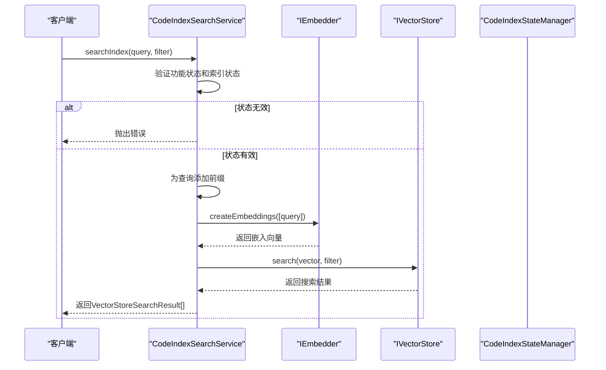
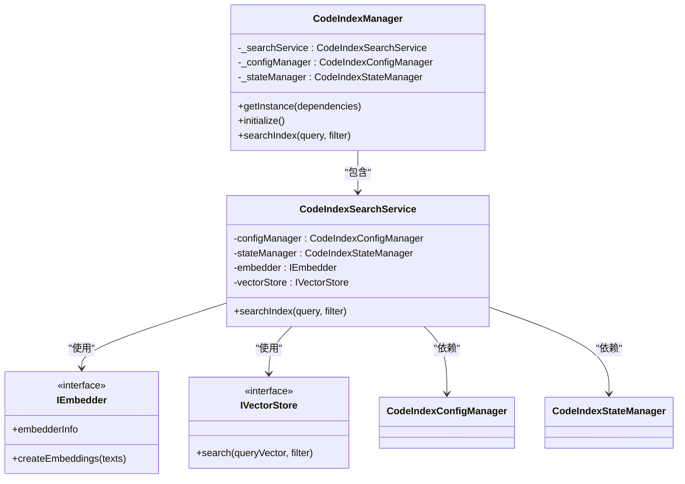

# 搜索API

<cite>
**Referenced Files in This Document**   
- [search-service.ts](file://src/code-index/search-service.ts)
- [vector-store.ts](file://src/code-index/interfaces/vector-store.ts)
- [manager.ts](file://src/code-index/manager.ts)
- [qdrant-client.ts](file://src/code-index/vector-store/qdrant-client.ts)
- [openai.ts](file://src/code-index/embedders/openai.ts)
- [ollama.ts](file://src/code-index/embedders/ollama.ts)
- [SearchInterface.tsx](file://src/examples/tui/SearchInterface.tsx)
</cite>

## 目录
1. [简介](#简介)
2. [核心组件](#核心组件)
3. [搜索API详解](#搜索api详解)
4. [依赖关系与架构](#依赖关系与架构)
5. [错误处理与性能考量](#错误处理与性能考量)
6. [实际应用示例](#实际应用示例)
7. [结论](#结论)

## 简介
本文档详细介绍了`CodeIndexSearchService`提供的语义搜索能力，这是一个基于向量数据库的代码索引搜索服务。该服务允许开发者通过自然语言查询在代码库中进行语义搜索，而不仅仅是基于关键字的匹配。其核心功能是将搜索查询和代码片段转换为高维向量，然后在向量空间中计算相似度，从而找到语义上最相关的代码内容。该服务是`CodeIndexManager`的核心功能之一，与代码索引的构建和管理紧密集成，为开发者提供了强大的代码探索和理解工具。

## 核心组件

`CodeIndexSearchService`是实现语义搜索的核心类，它依赖于多个关键组件来完成搜索任务。该服务通过`IEmbedder`接口与嵌入模型（如OpenAI或Ollama）交互，将文本查询转换为向量。然后，它使用`IVectorStore`接口与向量数据库（如Qdrant）进行通信，执行向量相似度搜索。`CodeIndexConfigManager`负责管理服务的配置状态，确保搜索功能已启用且配置正确。`CodeIndexStateManager`则用于跟踪和报告搜索过程中的系统状态。这些组件共同协作，确保搜索操作的可靠性和高效性。

**Section sources**
- [search-service.ts](file://src/code-index/search-service.ts#L10-L53)
- [manager.ts](file://src/code-index/manager.ts#L23-L351)

## 搜索API详解

### searchIndex方法
`searchIndex`方法是`CodeIndexSearchService`的主要入口点，用于执行语义搜索。该方法接收一个字符串查询`query`和一个可选的`SearchFilter`对象`filter`作为参数。在执行搜索之前，它会进行一系列的前置检查，包括验证功能是否启用、配置是否正确以及索引是否处于可搜索状态（"Indexed"或"Indexing"）。如果这些条件不满足，方法将抛出相应的错误。为了优化搜索上下文，查询字符串会被自动添加`search_code: `前缀。

**Diagram sources **
- [search-service.ts](file://src/code-index/search-service.ts#L25-L52)

### SearchFilter 过滤器
`SearchFilter`接口定义了用于细化搜索结果的可选过滤条件。它包含三个主要属性：`pathFilters`、`minScore`和`limit`。`pathFilters`是一个字符串数组，用于指定文件路径的匹配模式，支持通配符，允许用户将搜索范围限定在特定的目录或文件类型中。`minScore`是一个数值，代表结果的最小相似度分数，低于此分数的结果将被过滤掉。`limit`则用于限制返回结果的最大数量，以提高性能和用户体验。这些过滤器在`QdrantVectorStore`中被转换为Qdrant的查询过滤器，以在数据库层面执行高效的过滤。

**Section sources**
- [vector-store.ts](file://src/code-index/interfaces/vector-store.ts#L65-L69)
- [qdrant-client.ts](file://src/code-index/vector-store/qdrant-client.ts#L226-L234)

### VectorStoreSearchResult 结果
`searchIndex`方法返回一个`VectorStoreSearchResult[]`数组，其中每个结果对象都包含以下字段：`id`是向量数据库中该条目的唯一标识符；`score`是表示查询与该结果相似度的浮点数，分数越高表示越相关；`payload`是一个可选的`Payload`对象，包含了与搜索结果相关的元数据和代码片段。`Payload`接口定义了`filePath`（文件路径）、`codeChunk`（代码片段内容）、`startLine`和`endLine`（代码片段的起始和结束行号）等关键字段，这些信息对于定位和理解搜索结果至关重要。

**Section sources**
- [vector-store.ts](file://src/code-index/interfaces/vector-store.ts#L71-L75)
- [vector-store.ts](file://src/code-index/interfaces/vector-store.ts#L77-L83)

## 依赖关系与架构

### 与CodeIndexManager的集成
`CodeIndexSearchService`并非独立运行，而是作为`CodeIndexManager`的一个核心组件被集成和管理。`CodeIndexManager`是一个单例模式的管理器，负责协调整个代码索引系统的生命周期。它通过`_searchService`私有字段持有`CodeIndexSearchService`的实例，并通过其`searchIndex`方法对外暴露搜索功能。当`CodeIndexManager`被初始化时，它会根据配置创建并注入`CodeIndexSearchService`所需的所有依赖项，如`IEmbedder`和`IVectorStore`。这种设计实现了关注点分离，`CodeIndexManager`负责系统级的协调，而`CodeIndexSearchService`则专注于搜索逻辑的实现。

**Diagram sources **
- [manager.ts](file://src/code-index/manager.ts#L23-L351)
- [search-service.ts](file://src/code-index/search-service.ts#L10-L53)

### 与IEmbedder的依赖
`CodeIndexSearchService`依赖于`IEmbedder`接口来生成文本的向量表示。该接口的实现类，如`OpenAiEmbedder`或`CodeIndexOllamaEmbedder`，负责与具体的嵌入模型API进行通信。`CodeIndexSearchService`调用`IEmbedder.createEmbeddings`方法，将用户的搜索查询转换为一个向量。这个过程是搜索操作的关键第一步，因为后续的向量相似度搜索完全依赖于这个查询向量。`IEmbedder`的实现还处理了API调用的细节，如批处理、速率限制和代理配置，从而将这些复杂性从`CodeIndexSearchService`中抽象出来。

**Section sources**
- [search-service.ts](file://src/code-index/search-service.ts#L25-L52)
- [openai.ts](file://src/code-index/embedders/openai.ts#L14-L170)
- [ollama.ts](file://src/code-index/embedders/ollama.ts#L7-L103)

## 错误处理与性能考量

### 错误处理机制
`CodeIndexSearchService`实现了全面的错误处理机制。在方法的入口处，它会主动检查服务的配置和状态，如果发现功能未启用、配置不完整或索引未就绪，会立即抛出带有明确信息的`Error`。在执行搜索的核心逻辑中，所有可能出错的操作（如生成嵌入和执行向量搜索）都被包裹在`try-catch`块中。一旦捕获到异常，服务会记录详细的错误日志，并通过`CodeIndexStateManager`将系统状态更新为"Error"，以便上层应用能够感知到问题。最后，原始错误会被重新抛出，确保调用者能够正确处理。

**Section sources**
- [search-service.ts](file://src/code-index/search-service.ts#L25-L52)

### 性能考量
搜索过程中的性能主要受两个因素影响：嵌入生成和向量搜索。嵌入生成通常是最耗时的步骤，因为它涉及与远程API的网络通信。`IEmbedder`的实现（如`OpenAiEmbedder`）通过批处理和指数退避重试机制来优化性能和可靠性。向量搜索的性能则取决于`IVectorStore`的实现和底层数据库的配置。`QdrantVectorStore`通过在`filePath`字段上创建索引来优化基于路径的过滤查询。结果排序由向量数据库本身处理，它会根据相似度分数（`score`）自动对结果进行降序排列，确保最相关的结果排在最前面。

**Section sources**
- [openai.ts](file://src/code-index/embedders/openai.ts#L14-L170)
- [qdrant-client.ts](file://src/code-index/vector-store/qdrant-client.ts#L226-L234)

## 实际应用示例

### 构建复杂查询
在`SearchInterface.tsx`中，可以找到一个构建复杂查询的实际示例。该组件允许用户输入搜索查询，并通过一个过滤器面板来设置`minSimilarity`、`fileTypes`和`pathPattern`等条件。当用户执行搜索时，这些UI上的过滤器会被转换为`SearchFilter`对象，并传递给`CodeIndexManager.searchIndex`方法。例如，用户可以搜索"如何处理用户认证"，同时将结果过滤为`.ts`文件，并要求相似度分数大于0.7。

### 处理搜索结果
搜索结果以`VectorStoreSearchResult[]`的形式返回。在`SearchInterface.tsx`中，这些结果被渲染为一个可交互的网格视图。每个结果项都显示了文件名、相似度分数和代码片段的预览。用户可以通过快捷键（如Ctrl+T）展开某个结果以查看完整的代码内容，或通过Ctrl+O在外部编辑器中打开该文件。这展示了如何将`payload`中的`filePath`和`codeChunk`等元数据用于构建丰富的用户界面。

**Section sources**
- [SearchInterface.tsx](file://src/examples/tui/SearchInterface.tsx#L323-L359)

## 结论
`CodeIndexSearchService`提供了一个强大且灵活的语义搜索API，它通过将自然语言查询与代码库中的内容进行向量相似度匹配，极大地提升了代码探索的效率。其设计清晰地分离了关注点，通过依赖注入与`IEmbedder`和`IVectorStore`等组件解耦，使得系统易于维护和扩展。通过`SearchFilter`，开发者可以精确地控制搜索范围和结果质量。该服务与`CodeIndexManager`的紧密集成确保了搜索操作在整个索引生命周期中的协调一致。理解其错误处理和性能特性对于构建稳定、高效的基于此API的应用至关重要。