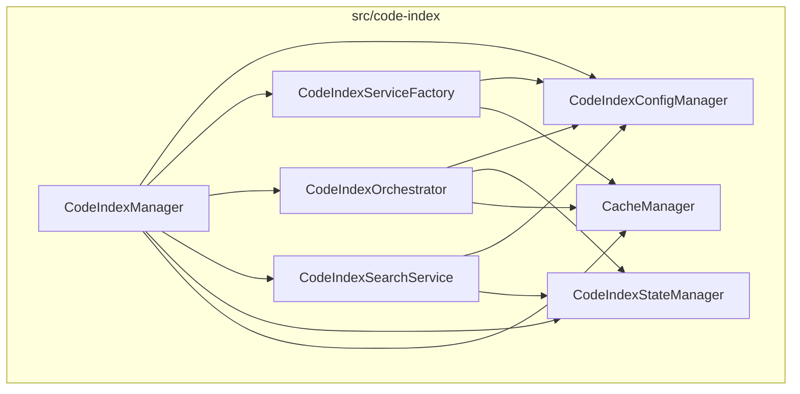
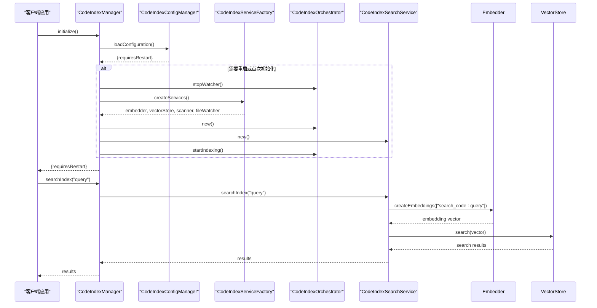
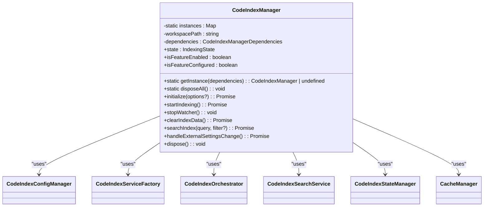
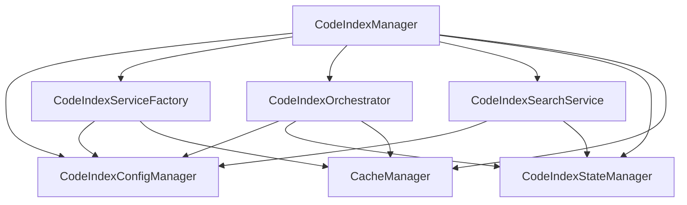

# 管理器API

<cite>
**本文档中引用的文件**   
- [manager.ts](file://src/code-index/manager.ts)
- [config-manager.ts](file://src/code-index/config-manager.ts)
- [service-factory.ts](file://src/code-index/service-factory.ts)
- [orchestrator.ts](file://src/code-index/orchestrator.ts)
- [search-service.ts](file://src/code-index/search-service.ts)
- [state-manager.ts](file://src/code-index/state-manager.ts)
- [interfaces/manager.ts](file://src/code-index/interfaces/manager.ts)
- [nodejs-usage.ts](file://src/examples/nodejs-usage.ts)
</cite>

## 目录
1. [简介](#简介)
2. [项目结构](#项目结构)
3. [核心组件](#核心组件)
4. [架构概述](#架构概述)
5. [详细组件分析](#详细组件分析)
6. [依赖关系分析](#依赖关系分析)
7. [性能考虑](#性能考虑)
8. [故障排除指南](#故障排除指南)
9. [结论](#结论)

## 简介
`CodeIndexManager` 类是代码索引系统的核心管理器，采用单例模式实现，确保每个工作区路径仅存在一个实例。该管理器负责协调配置加载、服务初始化、索引流程控制和搜索功能。它通过 `initialize` 方法执行复杂的初始化流程，包括配置验证、服务工厂重建和强制清除逻辑，并返回 `{ requiresRestart: boolean }` 指示是否需要重启服务。管理器提供了 `startIndexing`、`stopWatcher`、`clearIndexData` 和 `searchIndex` 等核心API来控制索引生命周期和执行搜索。其 `state` 和 `isFeatureEnabled` 属性提供了系统状态的实时视图，而 `handleExternalSettingsChange` 方法则允许在运行时动态响应配置更新。

## 项目结构
代码索引功能的实现分布在 `src/code-index/` 目录下，采用模块化设计。核心管理器 `CodeIndexManager` 位于根目录，它依赖于多个专门的管理器和服务，如 `config-manager.ts` 用于配置管理，`service-factory.ts` 用于创建依赖服务，`orchestrator.ts` 用于协调索引流程，以及 `search-service.ts` 用于处理搜索请求。接口定义位于 `interfaces/` 子目录中，而具体的实现（如嵌入器和向量存储）则分布在各自的模块中。这种结构清晰地分离了关注点，使系统易于维护和扩展。

**图表来源**
- [manager.ts](file://src/code-index/manager.ts#L23-L351)
- [config-manager.ts](file://src/code-index/config-manager.ts#L17-L334)
- [service-factory.ts](file://src/code-index/service-factory.ts#L16-L182)
- [orchestrator.ts](file://src/code-index/orchestrator.ts#L11-L274)
- [search-service.ts](file://src/code-index/search-service.ts#L10-L53)
- [state-manager.ts](file://src/code-index/state-manager.ts#L4-L120)

**章节来源**
- [manager.ts](file://src/code-index/manager.ts#L1-L50)
- [project_structure](file://#L1-L50)

## 核心组件
`CodeIndexManager` 是整个代码索引系统的入口点和控制中心。它通过单例模式的 `getInstance` 静态方法，根据工作区路径管理唯一的实例，防止资源浪费和状态冲突。该类实现了 `ICodeIndexManager` 接口，提供了对索引状态、功能启用状态的访问，以及对索引流程的控制方法。其内部通过组合模式集成了配置管理器、状态管理器、服务工厂、协调器和搜索服务等多个组件，将复杂的初始化和索引逻辑封装起来，为外部调用者提供了一个简洁的API。

**章节来源**
- [manager.ts](file://src/code-index/manager.ts#L23-L351)
- [interfaces/manager.ts](file://src/code-index/interfaces/manager.ts#L9-L72)

## 架构概述
`CodeIndexManager` 的架构是一个典型的分层协调模式。顶层是 `CodeIndexManager` 本身，作为客户端的直接交互接口。它依赖于 `CodeIndexConfigManager` 来获取和验证配置，并根据配置变化决定是否需要重启服务。`CodeIndexServiceFactory` 负责根据当前配置创建 `IEmbedder` 和 `IVectorStore` 等核心服务实例。`CodeIndexOrchestrator` 则负责执行具体的索引任务，如扫描目录和监控文件变化。最后，`CodeIndexSearchService` 使用嵌入器和向量存储来执行搜索查询。`CodeIndexStateManager` 贯穿整个流程，负责管理并广播系统的当前状态。

**图表来源**
- [manager.ts](file://src/code-index/manager.ts#L112-L223)
- [config-manager.ts](file://src/code-index/config-manager.ts#L92-L144)
- [service-factory.ts](file://src/code-index/service-factory.ts#L150-L181)
- [orchestrator.ts](file://src/code-index/orchestrator.ts#L107-L211)
- [search-service.ts](file://src/code-index/search-service.ts#L25-L52)

## 详细组件分析

### CodeIndexManager 分析
`CodeIndexManager` 类是系统的核心，其设计围绕单例模式和依赖注入展开。它通过一个静态的 `Map` 来存储基于工作区路径的实例，确保了全局唯一性。

#### 单例模式与实例管理
`getInstance` 静态方法是获取 `CodeIndexManager` 实例的唯一入口。它接收包含文件系统、事件总线、工作区等依赖项的 `dependencies` 对象。方法首先通过 `dependencies.workspace.getRootPath()` 获取工作区路径，如果路径无效则返回 `undefined`。如果该路径的实例尚不存在，则创建一个新实例并存入 `instances` 映射中。`disposeAll` 静态方法则负责清理所有实例，通过遍历 `instances` 映射并调用每个实例的 `dispose` 方法来释放资源，最后清空映射。

**图表来源**
- [manager.ts](file://src/code-index/manager.ts#L23-L351)

#### 初始化流程
`initialize` 方法是管理器的生命线，它执行一个复杂的多步骤流程。首先，它初始化 `CodeIndexConfigManager` 并加载配置，获取 `requiresRestart` 标志。如果功能未启用，则停止任何现有的监控并返回。接着，它初始化 `CacheManager`。核心逻辑在于判断是否需要重新创建核心服务（当服务工厂不存在或配置变更需要重启时）。如果需要，它会停止现有监控，通过 `CodeIndexServiceFactory` 创建所有依赖服务（嵌入器、向量存储、扫描器、文件监控器），然后重新初始化 `CodeIndexOrchestrator` 和 `CodeIndexSearchService`。如果 `options.force` 为 `true`，它会先清除向量存储和缓存。最后，它会调用 `reconcileIndex` 方法来同步索引与文件系统，并根据情况启动或重启索引流程。

**章节来源**
- [manager.ts](file://src/code-index/manager.ts#L112-L223)

### 核心API分析
`CodeIndexManager` 提供了一组精心设计的API来控制索引系统。

#### 索引控制API
`startIndexing` 方法用于启动索引流程。它首先检查功能是否启用并通过 `assertInitialized` 确保管理器已正确初始化，然后调用 `CodeIndexOrchestrator` 的 `startIndexing` 方法。`stopWatcher` 方法用于停止文件监控，它同样检查功能状态，并调用协调器的 `stopWatcher` 方法。`clearIndexData` 方法用于彻底清除索引数据，它会停止监控、清除向量存储中的集合，并删除本地缓存文件，实现数据的完全重置。

#### 搜索与状态API
`searchIndex` 方法是执行语义搜索的入口。在功能启用和初始化的前提下，它将查询委托给 `CodeIndexSearchService`。该服务会为查询生成嵌入向量，然后在向量数据库中进行相似性搜索。`state`、`isFeatureEnabled` 和 `isFeatureConfigured` 属性提供了系统状态的只读访问，客户端可以据此决定UI的显示逻辑。`handleExternalSettingsChange` 方法用于处理外部配置变更，它会重新加载配置，并在需要重启且管理器已初始化时，自动执行停止和重启索引的流程，这对于动态更新API密钥等场景至关重要。

**章节来源**
- [manager.ts](file://src/code-index/manager.ts#L59-L63)
- [manager.ts](file://src/code-index/manager.ts#L19-L29)
- [search-service.ts](file://src/code-index/search-service.ts#L10-L53)

## 依赖关系分析
`CodeIndexManager` 与多个组件存在紧密的依赖关系。它直接依赖于 `CodeIndexConfigManager` 来获取配置和判断重启需求。`CodeIndexServiceFactory` 是其创建所有下游服务（`IEmbedder`, `IVectorStore`）的关键。`CodeIndexOrchestrator` 和 `CodeIndexSearchService` 是其执行具体任务的代理。`CodeIndexStateManager` 提供了状态管理能力。这些依赖通过构造函数注入，使得 `CodeIndexManager` 的职责清晰，即协调和控制，而不必关心具体服务的创建细节。这种设计提高了代码的可测试性和可维护性。

**图表来源**
- [manager.ts](file://src/code-index/manager.ts#L23-L351)
- [service-factory.ts](file://src/code-index/service-factory.ts#L16-L182)
- [orchestrator.ts](file://src/code-index/orchestrator.ts#L11-L274)
- [search-service.ts](file://src/code-index/search-service.ts#L10-L53)

**章节来源**
- [manager.ts](file://src/code-index/manager.ts#L1-L50)
- [service-factory.ts](file://src/code-index/service-factory.ts#L1-L50)

## 性能考虑
`CodeIndexManager` 的设计考虑了性能和资源管理。单例模式避免了为同一工作区创建多个实例的开销。`initialize` 方法中的 `needsServiceRecreation` 逻辑确保了只有在必要时（配置变更或首次初始化）才重建昂贵的服务实例，如与向量数据库的连接。`clearIndexData` 方法提供了强制清除的能力，允许用户在遇到数据不一致问题时进行重置。然而，`startIndexing` 流程本身是资源密集型的，因为它涉及文件扫描、代码解析和向量生成。因此，建议在后台线程或非高峰时段执行完整的索引操作。

## 故障排除指南
当遇到问题时，应首先检查 `CodeIndexManager` 的 `state` 和 `isFeatureEnabled` 属性。如果状态为 `"Error"`，应查看 `getCurrentStatus` 返回的 `message` 字段以获取错误详情。如果索引无法启动，检查 `isFeatureConfigured` 是否为 `true`，并确认配置（如API密钥、Qdrant URL）是否正确。如果搜索返回空结果，确保索引流程已完成（状态为 `"Indexed"`）。对于配置更新后服务未重启的问题，应检查 `handleExternalSettingsChange` 方法是否被正确调用，并验证 `requiresRestart` 标志的计算逻辑。

**章节来源**
- [manager.ts](file://src/code-index/manager.ts#L23-L351)
- [config-manager.ts](file://src/code-index/config-manager.ts#L293-L295)

## 结论
`CodeIndexManager` 是一个设计精良、功能全面的管理器类，它成功地将复杂的代码索引系统封装在一个简洁的API之下。其单例模式保证了资源的有效利用，而模块化的架构则确保了系统的可扩展性和可维护性。通过 `initialize` 方法的精细控制和 `handleExternalSettingsChange` 的动态响应能力，该管理器能够稳健地处理各种运行时场景。对于开发者而言，理解其核心方法和状态属性是有效集成和使用此代码索引功能的关键。