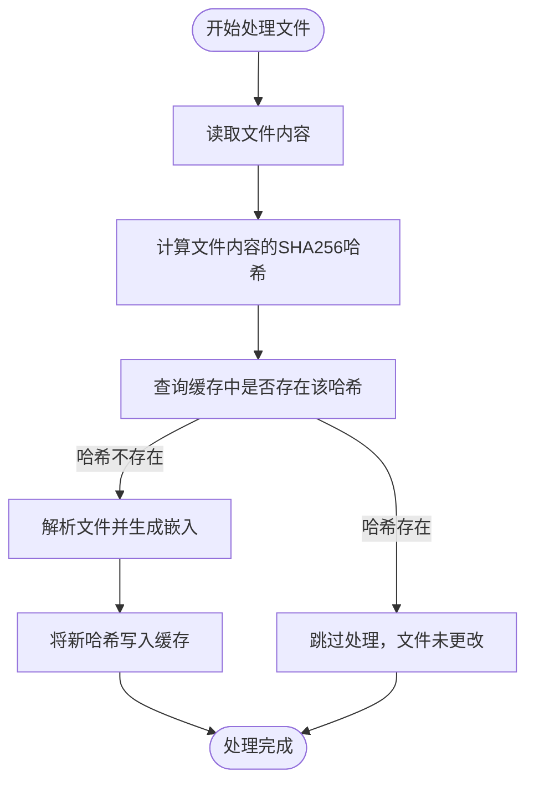
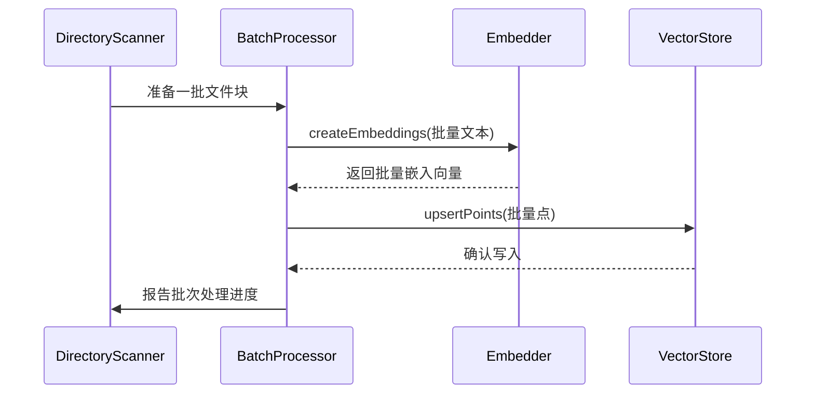

# 性能优化

<cite>
**本文档中引用的文件**  
- [cache-manager.ts](file://src/code-index/cache-manager.ts)
- [batch-processor.ts](file://src/code-index/processors/batch-processor.ts)
- [scanner.ts](file://src/code-index/processors/scanner.ts)
- [file-watcher.ts](file://src/code-index/processors/file-watcher.ts)
- [orchestrator.ts](file://src/code-index/orchestrator.ts)
- [manager.ts](file://src/code-index/manager.ts)
- [config-manager.ts](file://src/code-index/config-manager.ts)
- [constants/index.ts](file://src/code-index/constants/index.ts)
</cite>

## 目录
1. [简介](#简介)
2. [关键性能因素](#关键性能因素)
3. [内置优化机制](#内置优化机制)
4. [配置建议](#配置建议)
5. [大型代码库首次索引优化](#大型代码库首次索引优化)
6. [性能监控与基准测试](#性能监控与基准测试)

## 简介
`autodev-codebase` 项目通过智能索引和向量搜索技术实现高效的代码检索。本指南深入探讨影响系统性能的关键因素，并详细介绍项目内置的优化机制，包括缓存管理、批量处理、文件扫描和监控策略。通过合理的配置和优化策略，可以显著提升在大型代码库上的响应速度和资源利用率。

## 关键性能因素

`autodev-codebase` 的性能受多个关键因素影响，理解这些因素是进行有效优化的基础。

### 代码库大小
代码库的规模直接影响索引的初始构建时间和内存占用。项目通过 `DirectoryScanner` 组件递归扫描工作区目录，其性能与文件数量和总大小成正比。系统通过 `MAX_LIST_FILES_LIMIT` 常量（定义在 `constants/index.ts` 中）限制单次扫描的最大文件数，防止在超大仓库中出现性能问题。

### 文件扫描频率
`FileWatcher` 组件负责监控文件系统的变化，其扫描频率由 `BATCH_DEBOUNCE_DELAY_MS` 常量（定义为 500 毫秒）控制。该延迟机制将短时间内发生的多个文件事件（创建、修改、删除）合并为一个批次进行处理，避免了对每个事件都立即触发昂贵的索引操作，从而显著降低了 CPU 和 I/O 负载。

### 嵌入模型响应时间
嵌入模型（Embedder）的响应时间是影响索引延迟的主要瓶颈。无论是使用 OpenAI、Ollama 还是兼容的 API，生成文本嵌入的过程都涉及网络请求和模型计算。`BatchProcessor` 通过批量处理多个文件的嵌入请求，有效摊销了网络延迟，提高了整体吞吐量。

### 向量数据库查询延迟
向量数据库（如 Qdrant）的查询延迟直接影响搜索功能的响应速度。`IVectorStore` 接口定义了 `search` 方法，其性能取决于向量索引的构建质量、查询向量的维度以及服务器的硬件配置。系统通过 `SEARCH_MIN_SCORE` 常量设置搜索结果的最低相关性分数，以过滤掉低质量的匹配项。

**Section sources**
- [scanner.ts](file://src/code-index/processors/scanner.ts#L35-L394)
- [file-watcher.ts](file://src/code-index/processors/file-watcher.ts#L32-L526)
- [constants/index.ts](file://src/code-index/constants/index.ts#L0-L25)

## 内置优化机制

项目通过 `CacheManager` 和 `BatchProcessor` 等核心组件实现了高效的性能优化。

### CacheManager：避免重复计算
`CacheManager` 是性能优化的核心，它通过文件内容哈希来避免对未更改文件的重复解析和嵌入计算。

**Diagram sources**
- [cache-manager.ts](file://src/code-index/cache-manager.ts#L8-L122)

`CacheManager` 在 `initialize` 时从磁盘加载哈希缓存，并在文件处理成功后通过 `updateHash` 方法更新缓存。这确保了只有内容发生变化的文件才会被重新索引，极大地节省了计算资源。

**Section sources**
- [cache-manager.ts](file://src/code-index/cache-manager.ts#L8-L122)

### BatchProcessor：批量处理提升效率
`BatchProcessor` 通过批量处理文件来提高效率，减少网络请求和数据库操作的开销。

**Diagram sources**
- [batch-processor.ts](file://src/code-index/processors/batch-processor.ts#L44-L207)

`BatchProcessor` 将多个文件的处理任务分组，一次性发送给嵌入模型和向量数据库。它还实现了重试机制（`MAX_BATCH_RETRIES`）和指数退避（`INITIAL_RETRY_DELAY_MS`），以应对临时的网络或服务故障。

**Section sources**
- [batch-processor.ts](file://src/code-index/processors/batch-processor.ts#L44-L207)

## 配置建议

通过调整关键配置参数，可以在资源消耗和响应速度之间取得最佳平衡。

### 调整 batchSize
`BATCH_SEGMENT_THRESHOLD` 常量（定义在 `constants/index.ts` 中）控制了每次批量处理的代码块数量。增大此值可以提高吞吐量，但会增加内存占用和单次处理的延迟。对于内存充足的环境，可以适当增加此值以提升整体索引速度。

### 调整 pollingInterval
`BATCH_DEBOUNCE_DELAY_MS` 常量控制了文件监控的去抖动延迟。减小此值可以使系统对文件更改的响应更迅速，但可能导致更频繁的索引操作。在开发环境中，可以将其设置得更小以获得即时反馈；在生产或大型仓库中，保持默认值或适当增大以减少系统负载。

**Section sources**
- [constants/index.ts](file://src/code-index/constants/index.ts#L0-L25)

## 大型代码库首次索引优化

对于大型代码库的首次索引，可以采用以下策略进行优化。

### 使用 force 选项进行干净的重新索引
当配置发生重大变更（如更换嵌入模型）时，旧的索引数据可能与新配置不兼容。`CodeIndexManager` 的 `initialize` 方法接受一个 `force` 选项。当此选项为 `true` 时，系统会执行以下操作：
1.  删除向量数据库中的整个集合。
2.  重新初始化向量存储，创建一个与新配置兼容的新集合。
3.  清理本地缓存文件。
4.  执行一次完整的、干净的重新索引。

此操作确保了索引数据的一致性，避免了因维度不匹配导致的搜索失败。

**Diagram sources**
- [manager.ts](file://src/code-index/manager.ts#L23-L351)
- [orchestrator.ts](file://src/code-index/orchestrator.ts#L11-L274)

**Section sources**
- [manager.ts](file://src/code-index/manager.ts#L23-L351)

## 性能监控与基准测试

为了持续优化性能，建议实施监控和基准测试。

### 监控指标
- **索引进度**：通过 `onProgressUpdate` 事件监听器监控 `DirectoryScanner` 和 `FileWatcher` 的处理进度。
- **错误日志**：关注 `BatchProcessor` 处理失败的批次，分析错误原因（如网络超时、API 配额耗尽）。
- **资源使用**：监控内存和 CPU 使用率，特别是在处理大型文件或高频率更改时。

### 基准测试
可以通过运行 `test-full-parsing.ts` 等示例脚本来对特定代码库进行基准测试，测量完整索引所需的时间，并与不同配置下的结果进行比较，以评估优化效果。

**Section sources**
- [manager.ts](file://src/code-index/manager.ts#L23-L351)
- [orchestrator.ts](file://src/code-index/orchestrator.ts#L11-L274)