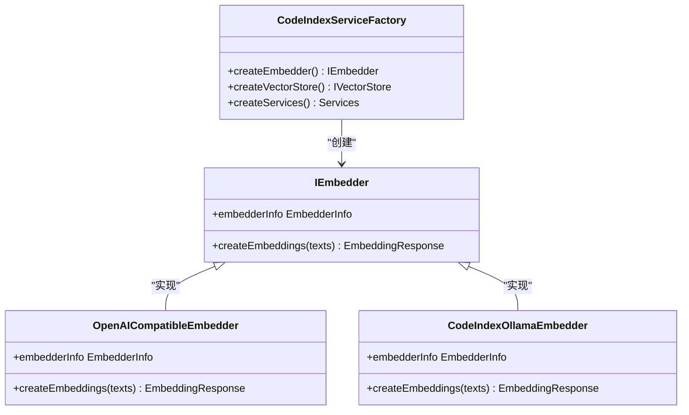

# 扩展开发

<cite>
**本文档中引用的文件**  
- [core.ts](file://src/abstractions/core.ts)
- [embedder.ts](file://src/code-index/interfaces/embedder.ts)
- [service-factory.ts](file://src/code-index/service-factory.ts)
- [openai-compatible.ts](file://src/code-index/embedders/openai-compatible.ts)
- [ollama.ts](file://src/code-index/embedders/ollama.ts)
- [jina-embedder.ts](file://src/code-index/embedders/jina-embedder.ts)
- [factory.ts](file://src/adapters/vscode/factory.ts)
- [config.ts](file://src/adapters/nodejs/config.ts)
</cite>

## 目录
1. [简介](#简介)
2. [嵌入器扩展开发](#嵌入器扩展开发)
3. [适配器扩展开发](#适配器扩展开发)
4. [依赖注入与服务工厂](#依赖注入与服务工厂)
5. [扩展点设计原则](#扩展点设计原则)
6. [最佳实践与代码模板](#最佳实践与代码模板)

## 简介
本文档详细介绍了如何为项目添加新功能的扩展开发流程。重点涵盖如何实现新的嵌入器（Embedder）以支持不同的AI模型提供商，以及如何创建新的适配器（Adapter）来支持不同的编辑器或运行时环境。文档还讨论了扩展点的设计原则，包括如何通过依赖注入将新组件注入到`ServiceFactory`中，并提供从现有实现派生新功能的代码模板和最佳实践。

## 嵌入器扩展开发

要为项目添加新的AI模型提供商支持，需要实现`IEmbedder`接口。该接口定义在`src/code-index/interfaces/embedder.ts`中，要求实现`createEmbeddings`方法和`embedderInfo`属性。开发者可以参考`embedders/`目录下的现有实现，如`ollama.ts`或`jina-embedder.ts`，来创建新的嵌入器。

新嵌入器的实现应遵循`openai-compatible.ts`中的模式，包括错误处理、代理支持和重试机制。特别是，`createEmbeddings`方法需要处理文本批处理、令牌限制和API速率限制，确保在各种网络条件下都能稳定工作。

**Section sources**
- [embedder.ts](file://src/code-index/interfaces/embedder.ts#L4-L13)
- [openai-compatible.ts](file://src/code-index/embedders/openai-compatible.ts#L16-L293)

## 适配器扩展开发

适配器扩展允许项目在不同的编辑器或运行时环境中运行。要创建新的适配器，需要实现`abstractions/`目录中定义的核心接口，如`IFileSystem`、`IStorage`、`IEventBus`等。这些接口提供了平台无关的抽象，使得核心功能可以无缝地在不同环境中工作。

例如，`src/adapters/nodejs/`和`src/adapters/vscode/`目录分别提供了Node.js和VSCode环境的适配器实现。开发者可以参考这些实现来创建针对其他环境的适配器。`factory.ts`文件中的工厂模式展示了如何动态创建和配置适配器实例。

**Section sources**
- [core.ts](file://src/abstractions/core.ts#L3-L64)
- [factory.ts](file://src/adapters/vscode/factory.ts#L1-L65)

## 依赖注入与服务工厂

项目的依赖注入机制通过`ServiceFactory`类实现，该类位于`src/code-index/service-factory.ts`。`CodeIndexServiceFactory`负责创建和配置所有服务依赖，包括嵌入器、向量存储、解析器等组件。

`createEmbedder`方法根据当前配置动态实例化相应的嵌入器，支持OpenAI、Ollama和OpenAI兼容的API。这种设计允许在运行时切换不同的AI提供商，而无需修改核心代码。服务工厂还处理配置验证和错误处理，确保所有依赖项都正确初始化。

**Diagram sources**
- [service-factory.ts](file://src/code-index/service-factory.ts#L16-L182)
- [embedder.ts](file://src/code-index/interfaces/embedder.ts#L4-L13)

## 扩展点设计原则

扩展点的设计遵循单一职责原则和依赖倒置原则。所有扩展点都通过接口定义，实现与使用分离。这使得系统具有高度的可扩展性和可测试性。

配置管理通过`NodeConfigProvider`类实现，支持项目级和全局配置文件，以及命令行参数覆盖。这种分层配置机制允许用户在不同场景下灵活调整系统行为。配置变更通过事件总线广播，确保所有监听器都能及时响应。

**Section sources**
- [config.ts](file://src/adapters/nodejs/config.ts#L35-L371)
- [service-factory.ts](file://src/code-index/service-factory.ts#L16-L182)

## 最佳实践与代码模板

创建新嵌入器时，建议从`openai-compatible.ts`复制代码模板，然后根据目标API的特性进行修改。关键是要保持错误处理、重试机制和代理支持的一致性。对于批处理逻辑，应遵循现有的令牌计算和批处理策略。

对于适配器开发，建议先实现核心接口，然后通过工厂模式进行封装。测试时应覆盖各种边界情况，如网络故障、权限错误和大文件处理。配置参数应提供合理的默认值，并在文档中明确说明。

**Section sources**
- [openai-compatible.ts](file://src/code-index/embedders/openai-compatible.ts#L16-L293)
- [ollama.ts](file://src/code-index/embedders/ollama.ts#L7-L103)
- [jina-embedder.ts](file://src/code-index/embedders/jina-embedder.ts#L7-L169)