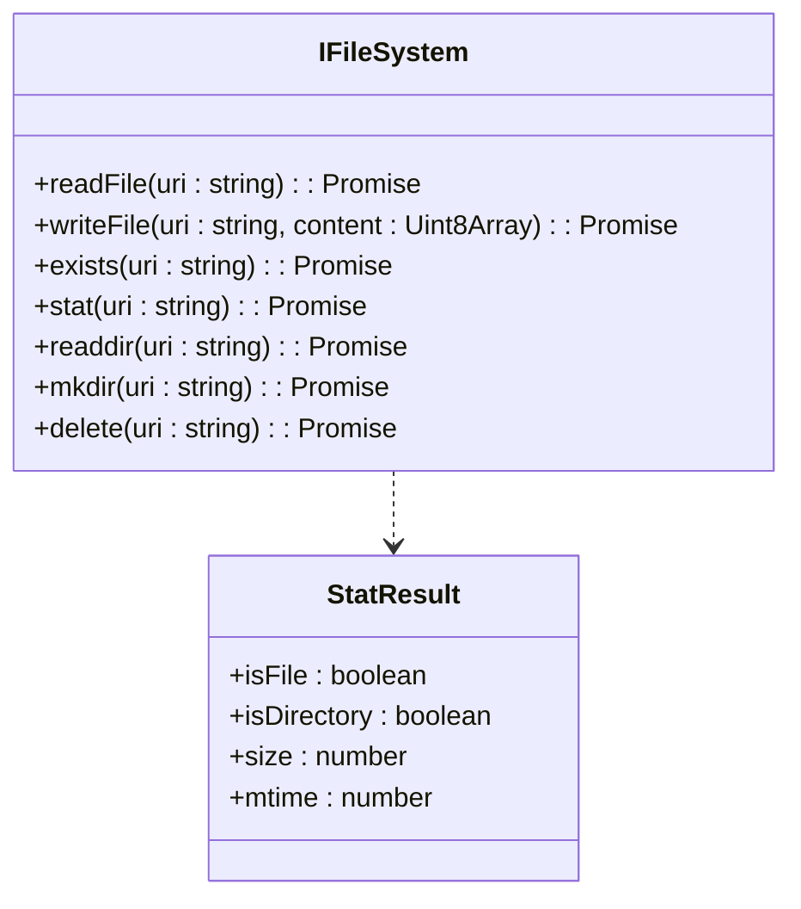
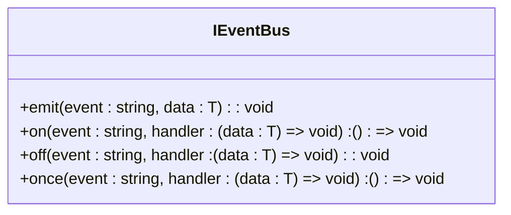
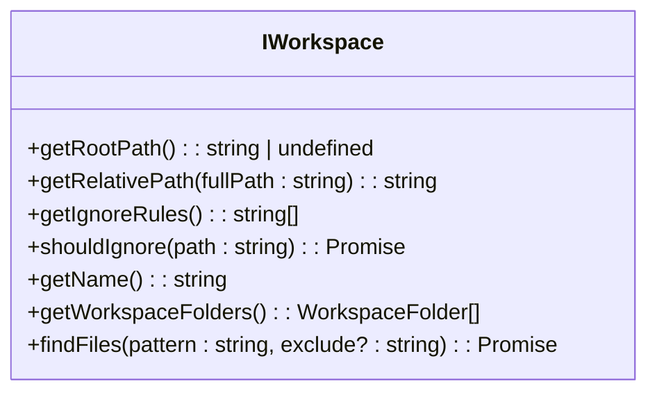
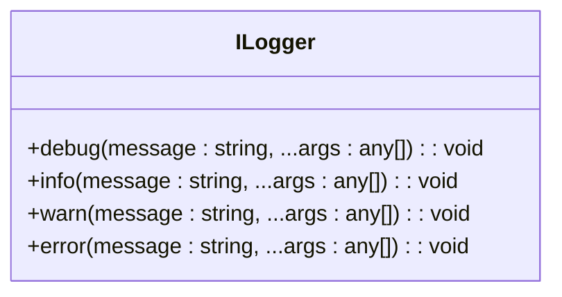
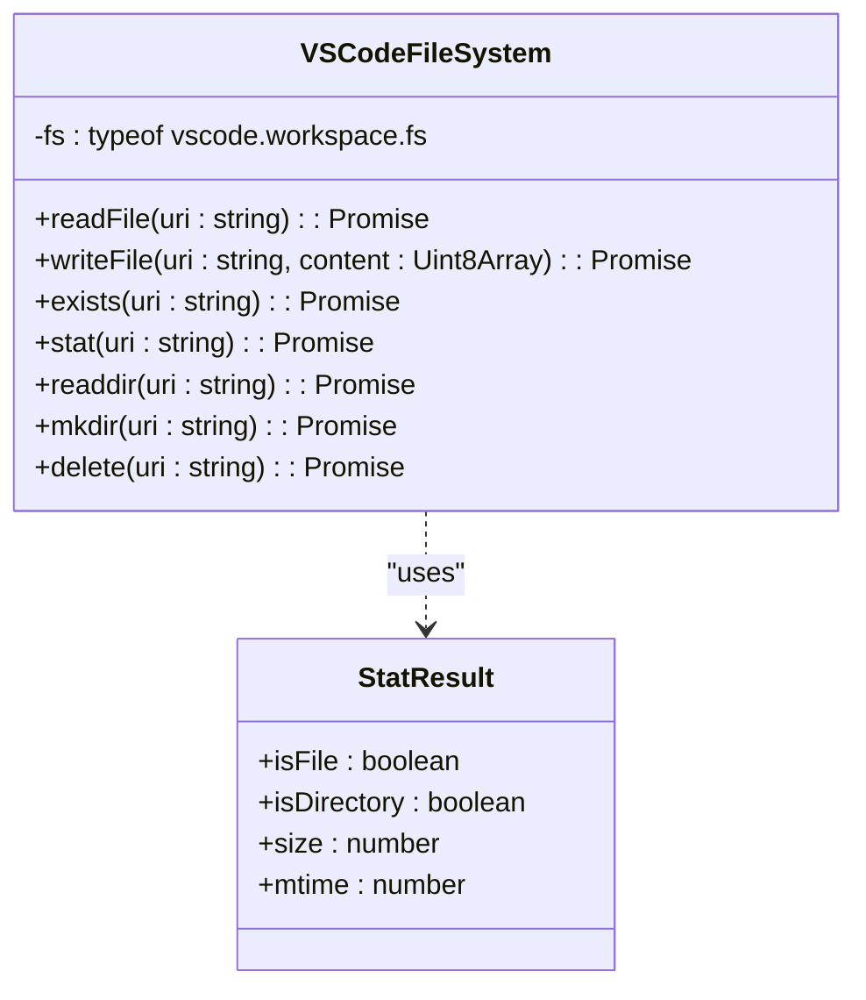
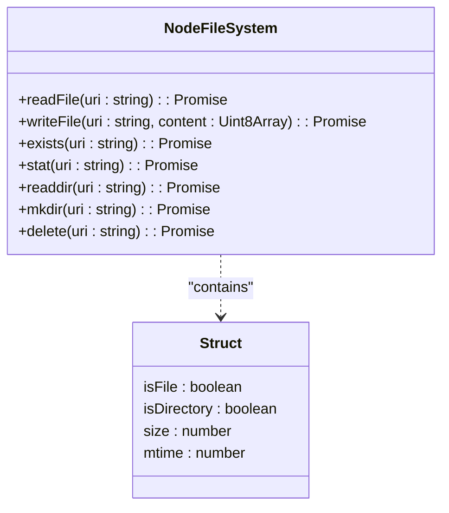
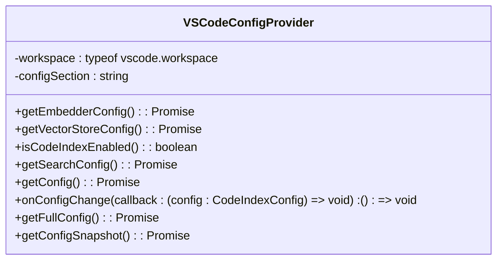
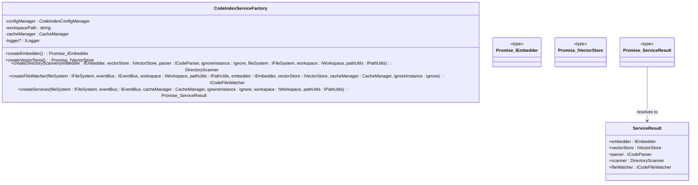
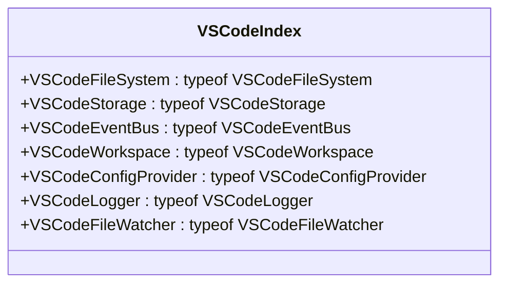

# 新适配器开发

<cite>
**本文档引用的文件**  
- [core.ts](file://src/abstractions/core.ts)
- [workspace.ts](file://src/abstractions/workspace.ts)
- [config.ts](file://src/abstractions/config.ts)
- [VSCodeFileSystem.ts](file://src/adapters/vscode/file-system.ts)
- [NodeFileSystem.ts](file://src/adapters/nodejs/file-system.ts)
- [VSCodeEventBus.ts](file://src/adapters/vscode/event-bus.ts)
- [NodeEventBus.ts](file://src/adapters/nodejs/event-bus.ts)
- [VSCodeWorkspace.ts](file://src/adapters/vscode/workspace.ts)
- [NodeWorkspace.ts](file://src/adapters/nodejs/workspace.ts)
- [VSCodeLogger.ts](file://src/adapters/vscode/logger.ts)
- [NodeLogger.ts](file://src/adapters/nodejs/logger.ts)
- [VSCodeConfigProvider.ts](file://src/adapters/vscode/config.ts)
- [NodeConfigProvider.ts](file://src/adapters/nodejs/config.ts)
- [service-factory.ts](file://src/code-index/service-factory.ts)
- [manager.ts](file://src/code-index/manager.ts)
- [config-manager.ts](file://src/code-index/config-manager.ts)
</cite>

## 目录
1. [简介](#简介)
2. [核心抽象接口](#核心抽象接口)
3. [适配器实现示例](#适配器实现示例)
4. [配置管理实现](#配置管理实现)
5. [依赖注入与服务工厂](#依赖注入与服务工厂)
6. [适配器注册与入口点](#适配器注册与入口点)
7. [调试技巧与常见问题](#调试技巧与常见问题)

## 简介
本文档详细指导开发者如何为新的编辑器或运行时环境（如WebStorm、Neovim等）构建适配器。适配器的作用是桥接底层平台能力与核心库之间的交互，通过实现`abstractions/`目录中定义的核心接口，确保不同平台的统一性和兼容性。文档以`vscode/`和`nodejs/`适配器为例，说明适配器的实现方法、配置管理、依赖注入机制以及与`CodeIndexManager`的兼容性。

## 核心抽象接口
适配器必须实现`abstractions/`目录中定义的核心接口，包括`IFileSystem`、`IEventBus`、`IWorkspace`和`ILogger`。这些接口定义了平台无关的文件系统操作、事件系统、工作区操作和日志记录功能。

### 文件系统接口 (IFileSystem)
`IFileSystem`接口定义了平台无关的文件系统操作，包括读取、写入、检查文件是否存在、获取文件状态、读取目录、创建目录和删除文件。

**Diagram sources**
- [core.ts](file://src/abstractions/core.ts#L3-L11)

### 事件总线接口 (IEventBus)
`IEventBus`接口定义了平台无关的事件系统，包括发射事件、监听事件、取消监听和一次性监听。

**Diagram sources**
- [core.ts](file://src/abstractions/core.ts#L25-L30)

### 工作区接口 (IWorkspace)
`IWorkspace`接口定义了平台无关的工作区操作，包括获取工作区根路径、获取相对路径、获取忽略规则、检查路径是否应被忽略、获取工作区名称、获取工作区文件夹和查找文件。

**Diagram sources**
- [workspace.ts](file://src/abstractions/workspace.ts#L3-L38)

### 日志记录接口 (ILogger)
`ILogger`接口定义了平台无关的日志记录功能，包括调试、信息、警告和错误日志记录。

**Diagram sources**
- [core.ts](file://src/abstractions/core.ts#L35-L40)

## 适配器实现示例
以`vscode/`和`nodejs/`适配器为例，说明如何实现核心接口。

### VSCode 适配器
`vscode/`适配器使用VSCode API实现核心接口。例如，`VSCodeFileSystem`类使用`vscode.workspace.fs`实现文件系统操作。

**Diagram sources**
- [file-system.ts](file://src/adapters/vscode/file-system.ts#L6-L72)

### Node.js 适配器
`nodejs/`适配器使用Node.js API实现核心接口。例如，`NodeFileSystem`类使用`fs`模块实现文件系统操作。

**Diagram sources**
- [file-system.ts](file://src/adapters/nodejs/file-system.ts#L8-L82)

## 配置管理实现
配置管理通过`IConfigProvider`接口实现，适配器需要根据平台特性提供配置读取和监听功能。以`vscode/config.ts`为例，`VSCodeConfigProvider`类实现了配置管理。

### 配置映射逻辑
`VSCodeConfigProvider`类通过`vscode.workspace.getConfiguration`读取配置，并根据配置节名称映射到相应的配置项。

**Diagram sources**
- [config.ts](file://src/adapters/vscode/config.ts#L6-L157)

## 依赖注入与服务工厂
适配器通过依赖注入机制被`ServiceFactory`使用，确保与`CodeIndexManager`的兼容性。

### 服务工厂
`CodeIndexServiceFactory`类负责创建和配置代码索引服务依赖项，包括嵌入器、向量存储、目录扫描器和文件监视器。

**Diagram sources**
- [service-factory.ts](file://src/code-index/service-factory.ts#L16-L182)

## 适配器注册与入口点
适配器通过`index.ts`文件注册，提供类型声明和工厂函数。

### 入口点
`vscode/index.ts`和`nodejs/index.ts`文件导出适配器类和类型声明，方便在其他模块中使用。

**Diagram sources**
- [index.ts](file://src/adapters/vscode/index.ts#L1-L38)

## 调试技巧与常见问题
### 调试技巧
- 使用`ILogger`接口记录调试信息，帮助定位问题。
- 在`VSCodeLogger`中使用`show()`方法显示输出通道，查看日志信息。

### 常见问题
- **配置未生效**：确保`onConfigChange`回调正确处理配置变化。
- **文件系统操作失败**：检查文件路径和权限，确保文件系统操作正确执行。
- **事件监听未触发**：确保事件总线正确初始化，并正确监听事件。

**Section sources**
- [logger.ts](file://src/adapters/vscode/logger.ts#L6-L51)
- [config.ts](file://src/adapters/vscode/config.ts#L6-L157)
- [file-system.ts](file://src/adapters/vscode/file-system.ts#L6-L72)
- [event-bus.ts](file://src/adapters/vscode/event-bus.ts#L7-L89)