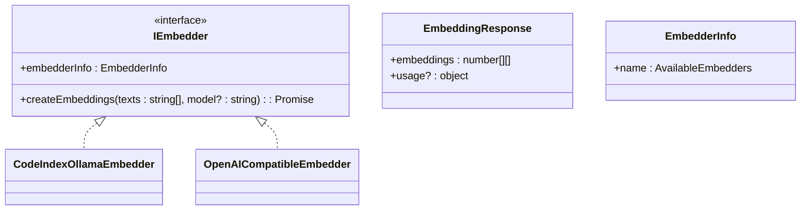
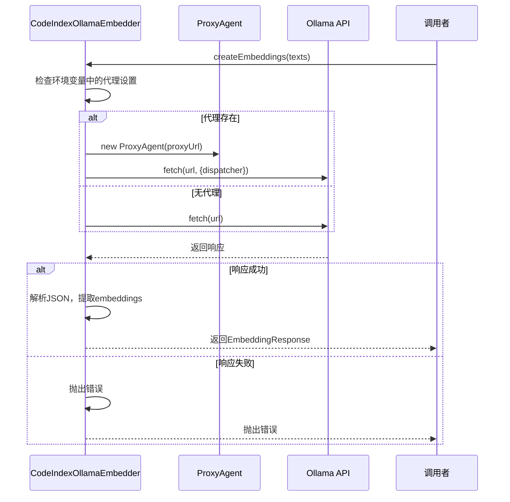
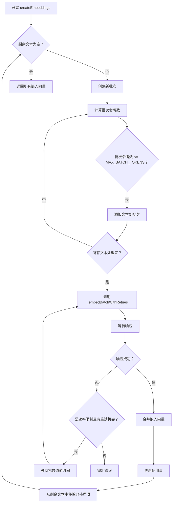

# 自定义嵌入器

<cite>
**Referenced Files in This Document**   
- [embedder.ts](file://src/code-index/interfaces/embedder.ts)
- [service-factory.ts](file://src/code-index/service-factory.ts)
- [ollama.ts](file://src/code-index/embedders/ollama.ts)
- [openai-compatible.ts](file://src/code-index/embedders/openai-compatible.ts)
- [autodev-config.json](file://autodev-config.json)
- [index.ts](file://src/code-index/constants/index.ts)
</cite>

## 目录
1. [接口定义](#接口定义)
2. [核心实现](#核心实现)
3. [集成与实例化](#集成与实例化)
4. [配置与验证](#配置与验证)
5. [性能优化建议](#性能优化建议)
6. [完整代码模板](#完整代码模板)

## 接口定义

开发者必须实现 `IEmbedder` 接口，该接口定义了嵌入器的核心功能。此接口位于 `src/code-index/interfaces/embedder.ts` 文件中。



**Diagram sources**
- [embedder.ts](file://src/code-index/interfaces/embedder.ts#L4-L13)

**Section sources**
- [embedder.ts](file://src/code-index/interfaces/embedder.ts#L4-L27)

### IEmbedder 接口

`IEmbedder` 接口是所有嵌入器实现的基础，它强制要求实现两个成员：

- **`createEmbeddings` 方法**：这是核心方法，用于为给定的文本数组创建嵌入向量。它接收一个字符串数组 `texts` 和一个可选的模型标识符 `model`，并返回一个 `Promise`，该 `Promise` 解析为一个 `EmbeddingResponse` 对象。
- **`embedderInfo` 属性**：这是一个只读属性，返回一个包含嵌入器名称的 `EmbedderInfo` 对象。该名称必须是 `AvailableEmbedders` 类型的联合值之一（如 `"ollama"` 或 `"openai-compatible"`），用于在系统中唯一标识该嵌入器。

### EmbeddingResponse 与 EmbedderInfo

- `EmbeddingResponse` 接口定义了 `createEmbeddings` 方法的返回结构，其中 `embeddings` 是一个二维数字数组，每个子数组代表一个文本的嵌入向量。
- `EmbedderInfo` 接口则简单地包含一个 `name` 字段，用于标识嵌入器的提供者。

## 核心实现

以 `ollama.ts` 和 `openai-compatible.ts` 文件中的实现为例，可以学习如何处理 HTTP 请求、错误、代理和模型参数。

### Ollama 嵌入器实现

`CodeIndexOllamaEmbedder` 类实现了 `IEmbedder` 接口，用于与本地 Ollama 服务交互。

**Section sources**
- [ollama.ts](file://src/code-index/embedders/ollama.ts#L7-L103)

#### HTTP 请求与代理配置

该实现使用 `undici` 库的 `fetch` 函数来发送 HTTP POST 请求。它会检查环境变量 `HTTPS_PROXY` 或 `HTTP_PROXY` 来配置代理。代理的创建使用了 `ProxyAgent`，并根据目标 URL 的协议（HTTP 或 HTTPS）选择合适的代理地址。



**Diagram sources**
- [ollama.ts](file://src/code-index/embedders/ollama.ts#L23-L96)

#### 错误处理

错误处理非常全面。代码首先检查 HTTP 响应的状态码，如果请求失败，会尝试读取错误体以提供更详细的错误信息。在 `try-catch` 块中，原始错误会被记录用于调试，然后会抛出一个更具体的、面向调用者的错误。

### OpenAI 兼容嵌入器实现

`OpenAICompatibleEmbedder` 类为任何兼容 OpenAI API 的服务提供了实现。

**Section sources**
- [openai-compatible.ts](file://src/code-index/embedders/openai-compatible.ts#L28-L292)

#### 批处理与重试机制

该实现包含了高级功能，如批处理和指数退避重试。`createEmbeddings` 方法会将输入的文本数组分割成更小的批次，以遵守 API 的令牌限制。`_embedBatchWithRetries` 私有方法负责处理单个批次，并在遇到速率限制错误（HTTP 429）时进行重试。



**Diagram sources**
- [openai-compatible.ts](file://src/code-index/embedders/openai-compatible.ts#L95-L146)

#### 模型参数与 Base64 编码

该实现通过 `encoding_format: "base64"` 参数请求以 Base64 格式返回嵌入向量。这是为了解决 OpenAI 客户端库在处理大型嵌入向量时的解析问题。代码随后会手动将 Base64 字符串解码为 `Float32Array`，并处理可能的 NaN 值或无效数据，甚至为无效的嵌入生成随机的占位符。

## 集成与实例化

新的嵌入器通过 `ServiceFactory.createEmbedder` 方法被集成到系统中，并根据配置动态实例化。

### ServiceFactory.createEmbedder 方法

`CodeIndexServiceFactory` 类的 `createEmbedder` 方法是嵌入器实例化的中心。它读取配置，根据 `provider` 字段的值决定实例化哪个具体的嵌入器类。

```mermaid
flowchart TD
    A["调用 createEmbedder"] --> B["读取配置"]
    B --> C{"provider == \"openai\" ?"}
    C --> |是| D["实例化 OpenAiEmbedder"]
    C --> |否| E{"provider == \"ollama\" ?"}
    E --> |是| F["实例化 CodeIndexOllamaEmbedder"]
    E --> |否| G{"provider == \"openai-compatible\" ?"}
    G --> |是| H["实例化 OpenAICompatibleEmbedder"]
    G --> |否| I["抛出错误"]
    D --> J["返回嵌入器实例"]
    F --> J
    H --> J
```

**Diagram sources**
- [service-factory.ts](file://src/code-index/service-factory.ts#L46-L78)

**Section sources**
- [service-factory.ts](file://src/code-index/service-factory.ts#L16-L182)

### 动态实例化流程

1.  **配置读取**：`createEmbedder` 方法首先从 `configManager` 获取当前配置。
2.  **条件判断**：它检查 `embedder.provider` 的值。
3.  **实例化**：根据不同的 `provider` 值，它会使用相应的构造函数参数创建 `OpenAiEmbedder`、`CodeIndexOllamaEmbedder` 或 `OpenAICompatibleEmbedder` 的实例。
4.  **返回**：最后，返回新创建的嵌入器实例，该实例符合 `IEmbedder` 接口。

## 配置与验证

### autodev-config.json 配置

新的嵌入器提供商需要在 `autodev-config.json` 文件中进行配置。以下是一个配置示例：

```json
{
  "isEnabled": true,
  "isConfigured": true,
  "embedder": {
    "provider": "ollama",
    "model": "dengcao/Qwen3-Embedding-0.6B:Q8_0",
    "dimension": 1024,
    "baseUrl": "http://localhost:11434"
  }
}
```

**Section sources**
- [autodev-config.json](file://autodev-config.json#L1-L10)

关键配置项包括：
- `provider`: 必须与 `embedderInfo.name` 属性返回的值完全匹配。
- `model`: 要使用的具体模型名称。
- `dimension`: 嵌入向量的维度，必须与所选模型的实际输出维度一致。
- `baseUrl`: 嵌入服务的 API 基础 URL。

### 向量维度验证

系统在创建向量存储 (`QdrantVectorStore`) 时会严格验证向量维度。`createVectorStore` 方法会从配置中获取 `dimension` 值，并在创建 Qdrant 集合时使用它。如果集合已存在但维度不匹配，系统会自动删除旧集合并创建一个新集合，以确保数据一致性。

## 性能优化建议

### 连接池与超时设置

虽然代码中未显式配置，但 `undici` 的 `ProxyAgent` 和 `fetch` 函数内部通常会管理连接池。建议在 `fetch` 选项中设置 `timeout` 属性来防止请求无限期挂起。

### 缓存策略

系统内置了强大的缓存机制。`CacheManager` 会根据文件内容的哈希值来缓存文件的解析结果和嵌入向量。在 `createEmbeddings` 方法中，应首先检查缓存，如果存在且内容未变，则直接返回缓存结果，避免重复计算。

### 批处理与并发

如 `openai-compatible.ts` 中所示，对大量文本进行批处理是提高效率的关键。常量 `MAX_BATCH_TOKENS` (100,000) 和 `MAX_ITEM_TOKENS` (8,191) 定义了批处理的限制。此外，`BATCH_PROCESSING_CONCURRENCY` 常量可用于控制并发处理的批次数量。

**Section sources**
- [index.ts](file://src/code-index/constants/index.ts#L17-L23)

## 完整代码模板

以下是一个实现自定义嵌入器的完整代码模板，包含了必要的类型导入、类定义、异常捕获和日志记录。

```typescript
import { EmbedderInfo, EmbeddingResponse, IEmbedder } from "../interfaces/embedder";
import { fetch, ProxyAgent } from "undici";

/**
 * 自定义嵌入器的实现示例。
 */
export class CustomEmbedder implements IEmbedder {
	private readonly baseUrl: string;
	private readonly defaultModelId: string;
	private readonly apiKey: string;

	constructor(baseUrl: string, apiKey: string, modelId?: string) {
		if (!baseUrl) {
			throw new Error("Base URL is required for Custom Embedder");
		}
		if (!apiKey) {
			throw new Error("API key is required for Custom Embedder");
		}

		this.baseUrl = baseUrl;
		this.apiKey = apiKey;
		this.defaultModelId = modelId || "default-model";
	}

	/**
	 * 为给定的文本创建嵌入向量。
	 * @param texts 要嵌入的字符串数组。
	 * @param model 可选的模型ID，用于覆盖默认值。
	 * @returns 一个 Promise，解析为包含嵌入向量的 EmbeddingResponse。
	 */
	async createEmbeddings(texts: string[], model?: string): Promise<EmbeddingResponse> {
		const modelToUse = model || this.defaultModelId;
		const url = `${this.baseUrl}/api/embeddings`;

		// 处理代理
		const proxyUrl = process.env['HTTPS_PROXY'] || process.env['HTTP_PROXY'];
		let dispatcher: any = undefined;
		if (proxyUrl) {
			try {
				dispatcher = new ProxyAgent(proxyUrl);
			} catch (error) {
				console.error('Failed to create proxy agent:', error);
			}
		}

		const fetchOptions: any = {
			method: "POST",
			headers: {
				"Content-Type": "application/json",
				"Authorization": `Bearer ${this.apiKey}`,
			},
			body: JSON.stringify({
				model: modelToUse,
				inputs: texts,
			}),
		};

		if (dispatcher) {
			fetchOptions.dispatcher = dispatcher;
		}

		try {
			const response = await fetch(url, fetchOptions);

			if (!response.ok) {
				const errorBody = await response.text().catch(() => "Could not read error body");
				throw new Error(`API request failed: ${response.status} ${response.statusText}: ${errorBody}`);
			}

			const data = await response.json();

			// 提取嵌入向量
			const embeddings = data.embeddings;
			if (!embeddings || !Array.isArray(embeddings)) {
				throw new Error('Invalid response structure: "embeddings" array not found.');
			}

			return {
				embeddings: embeddings,
			};
		} catch (error: any) {
			console.error("Custom embedding failed:", error);
			throw new Error(`Custom embedding failed: ${error.message}`);
		}
	}

	/**
	 * 返回此嵌入器的信息。
	 */
	get embedderInfo(): EmbedderInfo {
		return {
			name: "custom-provider", // 此名称必须与配置中的 provider 匹配
		};
	}
}
```