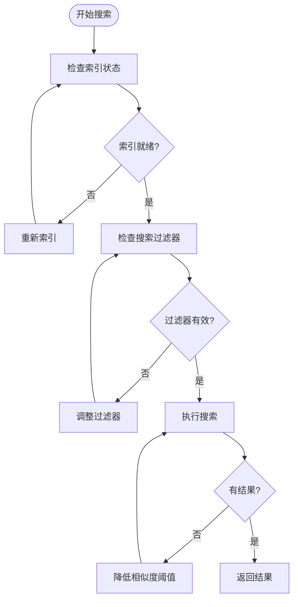
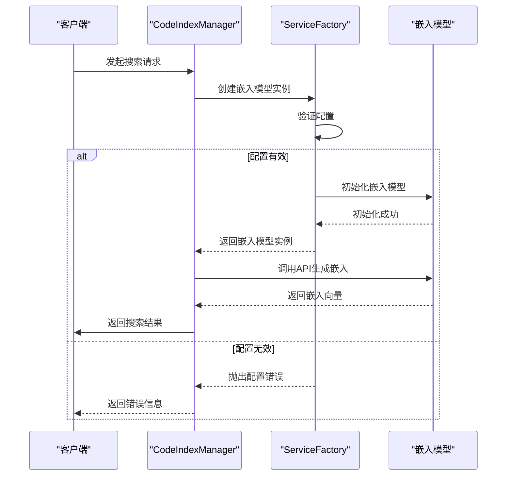

# 故障排除

<cite>
**本文档中引用的文件**   
- [autodev-config.json](file://autodev-config.json)
- [manager.ts](file://src/code-index/manager.ts)
- [config-manager.ts](file://src/code-index/config-manager.ts)
- [orchestrator.ts](file://src/code-index/orchestrator.ts)
- [qdrant-client.ts](file://src/code-index/vector-store/qdrant-client.ts)
- [service-factory.ts](file://src/code-index/service-factory.ts)
- [scanner.ts](file://src/code-index/processors/scanner.ts)
- [mcp/server.ts](file://src/mcp/server.ts)
- [debug-parser.js](file://src/examples/debug-parser.js)
- [debug-qdrant-query.js](file://debug-qdrant-query.js)
</cite>

## 目录
1. [简介](#简介)
2. [常见问题与解决方案](#常见问题与解决方案)
3. [日志解读](#日志解读)
4. [诊断脚本使用](#诊断脚本使用)
5. [配置错误](#配置错误)
6. [权限问题](#权限问题)
7. [检查清单](#检查清单)

## 简介
本指南旨在帮助用户解决在使用代码索引系统时可能遇到的各种问题。系统通过MCP服务器、向量搜索和嵌入模型API等组件实现代码语义搜索功能。当系统无法正常工作时，通常涉及服务器启动、向量搜索、API调用、配置和权限等方面的问题。本指南将提供详细的故障排除步骤和解决方案。

## 常见问题与解决方案

### MCP服务器无法启动
当MCP服务器无法启动时，最常见的原因是端口被占用或配置错误。

**解决方案：**
1. 检查端口占用情况：
   ```bash
   lsof -i :11434
   ```
   如果端口被占用，可以终止占用进程或更改Ollama服务器端口。

2. 验证配置文件 `autodev-config.json` 是否正确：
   - 确保 `isEnabled` 设置为 `true`
   - 检查 `embedder` 配置中的 `baseUrl` 是否正确指向Ollama服务
   - 确认 `qdrantUrl` 是否正确

3. 检查依赖服务是否运行：
   - 确保Ollama服务正在运行
   - 确保Qdrant向量数据库服务正在运行

**Section sources**
- [autodev-config.json](file://autodev-config.json)
- [mcp/server.ts](file://src/mcp/server.ts#L14-L14)
- [config-manager.ts](file://src/code-index/config-manager.ts#L17-L334)

### 向量搜索返回空结果
向量搜索返回空结果通常与索引状态或文件扫描范围有关。

**解决方案：**
1. 检查索引状态：
   - 使用 `get_search_stats` 工具检查索引状态
   - 确认索引是否已完成初始化和扫描

2. 验证文件扫描范围：
   - 检查 `.gitignore` 和 `.rooignore` 文件，确保没有意外排除需要索引的文件
   - 确认 `scannerExtensions` 中包含需要索引的文件类型

3. 检查搜索过滤器：
   - 确保 `pathFilters` 参数正确
   - 调整 `minScore` 阈值，降低相似度要求



**Diagram sources **
- [manager.ts](file://src/code-index/manager.ts#L112-L223)
- [scanner.ts](file://src/code-index/processors/scanner.ts#L23-L394)
- [qdrant-client.ts](file://src/code-index/vector-store/qdrant-client.ts#L23-L340)

**Section sources**
- [manager.ts](file://src/code-index/manager.ts#L112-L223)
- [scanner.ts](file://src/code-index/processors/scanner.ts#L23-L394)
- [qdrant-client.ts](file://src/code-index/vector-store/qdrant-client.ts#L23-L340)

### 嵌入模型API调用失败
嵌入模型API调用失败通常由API密钥错误或网络连接问题引起。

**解决方案：**
1. 验证API密钥：
   - 检查 `autodev-config.json` 中的 `apiKey` 是否正确
   - 确认API密钥没有过期

2. 检查网络连接：
   - 测试与嵌入模型服务的网络连接
   - 确认防火墙设置没有阻止连接

3. 验证模型维度：
   - 确保配置中的 `dimension` 与模型实际维度匹配
   - 检查模型是否支持配置的维度



**Diagram sources **
- [service-factory.ts](file://src/code-index/service-factory.ts#L16-L182)
- [config-manager.ts](file://src/code-index/config-manager.ts#L17-L334)

**Section sources**
- [service-factory.ts](file://src/code-index/service-factory.ts#L16-L182)
- [config-manager.ts](file://src/code-index/config-manager.ts#L17-L334)

## 日志解读
正确解读日志输出是定位问题的关键。`CodeIndexManager` 在初始化和索引过程中的关键日志提供了重要的调试信息。

### 初始化日志
初始化过程中的关键日志包括：
- `[CodeIndexOrchestrator] 🚀 开始索引进程...` - 索引进程开始
- `[CodeIndexOrchestrator] 💾 初始化向量存储...` - 开始初始化向量存储
- `[CodeIndexOrchestrator] ✅ 向量存储初始化完成` - 向量存储初始化成功

### 索引过程日志
索引过程中的关键日志包括：
- `[CodeIndexOrchestrator] 📁 开始扫描工作区` - 开始扫描工作区
- `[CodeIndexOrchestrator] 🔍 开始扫描目录...` - 开始扫描目录
- `[CodeIndexOrchestrator] ✅ 目录扫描完成` - 目录扫描完成
- `[CodeIndexOrchestrator] 👀 开始文件监控...` - 开始文件监控

### 错误日志
错误日志通常以 ❌ 开头，包含错误堆栈信息：
- `[CodeIndexOrchestrator] ❌ 索引过程中发生错误:` - 索引过程中的错误
- `[CodeIndexOrchestrator] ❌ 错误堆栈:` - 错误堆栈信息

**Section sources**
- [orchestrator.ts](file://src/code-index/orchestrator.ts#L11-L274)
- [manager.ts](file://src/code-index/manager.ts#L23-L351)

## 诊断脚本使用
系统提供了多个诊断脚本帮助用户排查问题。

### debug-parser.js 使用方法
`debug-parser.js` 脚本用于调试代码解析器。

**使用步骤：**
1. 准备测试文件
2. 运行脚本：
   ```bash
   node src/examples/debug-parser.js /path/to/test/file.ts
   ```
3. 检查输出，确认解析器能否正确解析代码块

### debug-qdrant-query.js 使用方法
`debug-qdrant-query.js` 脚本用于调试Qdrant查询。

**使用步骤：**
1. 确保Qdrant服务正在运行
2. 运行脚本：
   ```bash
   node debug-qdrant-query.js "搜索查询"
   ```
3. 检查查询结果，确认向量搜索是否正常工作

**Section sources**
- [debug-parser.js](file://src/examples/debug-parser.js)
- [debug-qdrant-query.js](file://debug-qdrant-query.js)

## 配置错误
配置错误是导致系统无法正常工作的常见原因。

### autodev-config.json 格式错误
`autodev-config.json` 文件必须是有效的JSON格式。

**常见错误：**
- 缺少逗号
- 多余的逗号
- 使用单引号而不是双引号
- 缺少引号

**验证方法：**
```bash
node -e "console.log(JSON.parse(require('fs').readFileSync('autodev-config.json', 'utf8')))"
```

### 配置项错误
确保配置项的值正确：
- `embedder.provider` 必须是 "openai"、"ollama" 或 "openai-compatible"
- `embedder.model` 必须是支持的模型名称
- `embedder.dimension` 必须与模型维度匹配

**Section sources**
- [autodev-config.json](file://autodev-config.json)
- [config-manager.ts](file://src/code-index/config-manager.ts#L17-L334)

## 权限问题
权限问题可能导致系统无法访问文件或服务。

### 文件系统权限
确保系统有权限访问工作区目录：
- 检查目录读取权限
- 确保没有文件锁定

### 网络权限
确保网络连接没有被防火墙阻止：
- 检查Ollama服务端口（默认11434）
- 检查Qdrant服务端口（默认6333）

**Section sources**
- [manager.ts](file://src/code-index/manager.ts#L23-L351)
- [scanner.ts](file://src/code-index/processors/scanner.ts#L23-L394)

## 检查清单
使用以下检查清单系统性地排查问题：

### 服务器启动检查
- [ ] Ollama服务正在运行
- [ ] Qdrant服务正在运行
- [ ] 端口未被占用
- [ ] autodev-config.json 配置正确

### 索引状态检查
- [ ] CodeIndexManager 已初始化
- [ ] 向量存储已创建
- [ ] 文件扫描已完成
- [ ] 文件监控已启动

### 搜索功能检查
- [ ] 嵌入模型API可访问
- [ ] 向量搜索返回结果
- [ ] 搜索过滤器配置正确
- [ ] 相似度阈值设置合理

### 配置检查
- [ ] autodev-config.json 是有效JSON
- [ ] API密钥正确
- [ ] 模型维度匹配
- [ ] 服务URL正确