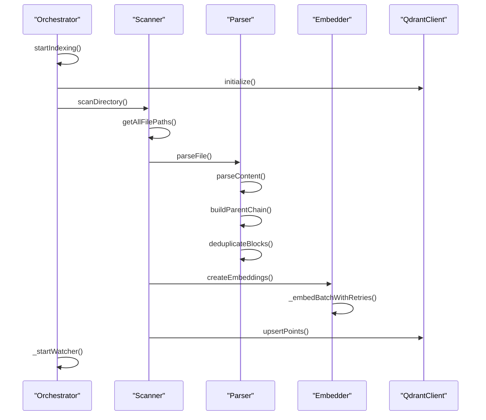
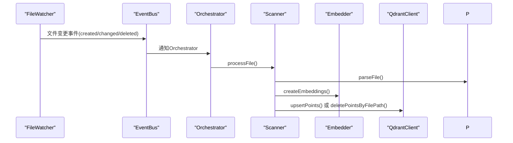
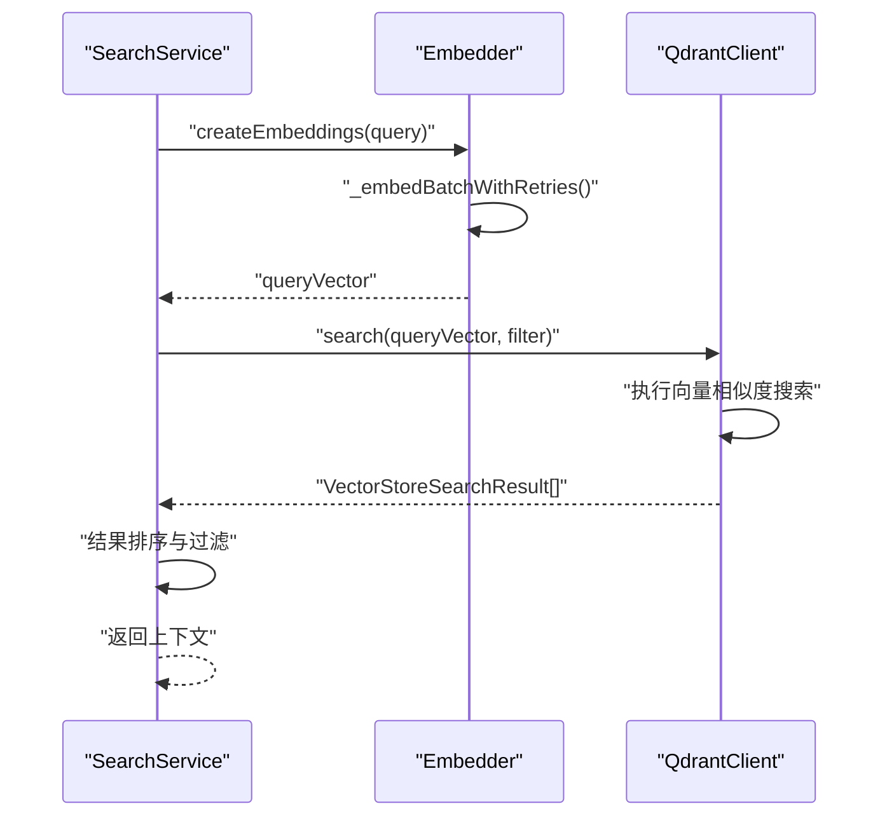

# 数据流

<cite>
**本文档引用的文件**
- [mcp/server.ts](file://src/mcp/server.ts)
- [code-index/manager.ts](file://src/code-index/manager.ts)
- [code-index/config-manager.ts](file://src/code-index/config-manager.ts)
- [code-index/service-factory.ts](file://src/code-index/service-factory.ts)
- [code-index/orchestrator.ts](file://src/code-index/orchestrator.ts)
- [code-index/processors/scanner.ts](file://src/code-index/processors/scanner.ts)
- [code-index/processors/parser.ts](file://src/code-index/processors/parser.ts)
- [code-index/embedders/openai.ts](file://src/code-index/embedders/openai.ts)
- [code-index/vector-store/qdrant-client.ts](file://src/code-index/vector-store/qdrant-client.ts)
- [code-index/processors/file-watcher.ts](file://src/code-index/processors/file-watcher.ts)
- [code-index/search-service.ts](file://src/code-index/search-service.ts)
</cite>

## 目录
1. [请求入口与初始化](#请求入口与初始化)
2. [配置加载与服务创建](#配置加载与服务创建)
3. [代码库索引流程](#代码库索引流程)
4. [文件变更增量更新](#文件变更增量更新)
5. [语义搜索处理流程](#语义搜索处理流程)
6. [性能瓶颈与优化策略](#性能瓶颈与优化策略)

## 请求入口与初始化
当MCP服务器（`mcp/server.ts`）接收到请求时，会触发代码索引系统的初始化流程。该流程的核心是`CodeIndexManager`，它作为整个系统的单例管理器，负责协调所有组件。`CodeIndexManager`的`initialize`方法是启动的入口点，它首先检查并初始化`ConfigManager`，加载用户配置。如果代码索引功能已启用，系统将继续初始化`CacheManager`以管理文件缓存。整个初始化过程确保了所有核心服务在开始工作前都已正确配置。

**Section sources**
- [code-index/manager.ts](file://src/code-index/manager.ts#L23-L351)
- [mcp/server.ts](file://src/mcp/server.ts#L305-L309)

## 配置加载与服务创建
`ConfigManager`负责加载`autodev-config.json`配置文件。它通过`_loadAndSetConfiguration`方法读取配置，并将新的统一配置结构转换为内部状态，包括嵌入模型提供者（如OpenAI、Ollama）、模型ID、API密钥以及Qdrant向量数据库的URL和API密钥。`ServiceFactory`是服务创建的核心工厂，它根据`ConfigManager`提供的配置动态创建所需的服务。`createServices`方法会依次创建`Embedder`实例（用于生成向量）、`VectorStore`实例（即`QdrantVectorStore`，用于存储向量）以及`DirectoryScanner`和`FileWatcher`等处理器实例，确保所有组件都基于最新的配置。

**Section sources**
- [code-index/config-manager.ts](file://src/code-index/config-manager.ts#L17-L334)
- [code-index/service-factory.ts](file://src/code-index/service-factory.ts#L16-L182)

## 代码库索引流程

**Diagram sources**
- [code-index/orchestrator.ts](file://src/code-index/orchestrator.ts#L11-L274)
- [code-index/processors/scanner.ts](file://src/code-index/processors/scanner.ts#L35-L394)
- [code-index/processors/parser.ts](file://src/code-index/processors/parser.ts#L12-L588)
- [code-index/embedders/openai.ts](file://src/code-index/embedders/openai.ts#L14-L170)
- [code-index/vector-store/qdrant-client.ts](file://src/code-index/vector-store/qdrant-client.ts#L12-L339)

`Orchestrator`启动`Scanner`对代码库进行扫描。`Scanner`首先通过`getAllFilePaths`获取所有需要处理的文件路径，然后对每个文件调用`Parser`的`parseFile`方法。`Parser`使用Tree-sitter解析器将源文件解析成多个`CodeChunk`（代码块），并构建其父容器链和层次结构显示。解析后的代码块被批量发送给`Embedder`（如`OpenAiEmbedder`），后者调用AI模型生成对应的向量。最后，`QdrantClient`将这些向量连同其元数据（如文件路径、代码片段）一起存入向量数据库。

**Section sources**
- [code-index/orchestrator.ts](file://src/code-index/orchestrator.ts#L11-L274)
- [code-index/processors/scanner.ts](file://src/code-index/processors/scanner.ts#L35-L394)
- [code-index/processors/parser.ts](file://src/code-index/processors/parser.ts#L12-L588)
- [code-index/embedders/openai.ts](file://src/code-index/embedders/openai.ts#L14-L170)
- [code-index/vector-store/qdrant-client.ts](file://src/code-index/vector-store/qdrant-client.ts#L12-L339)

## 文件变更增量更新

**Diagram sources**
- [code-index/processors/file-watcher.ts](file://src/code-index/processors/file-watcher.ts#L32-L549)
- [code-index/orchestrator.ts](file://src/code-index/orchestrator.ts#L11-L274)

当文件系统发生变更时，`FileWatcher`会捕获到`created`、`changed`或`deleted`事件。`FileWatcher`通过`EventBus`发布这些事件，`Orchestrator`作为订阅者会收到通知。`Orchestrator`随后调用`Scanner`的`processFile`方法来处理变更的文件。对于新建或修改的文件，流程与初始索引相同：解析、生成嵌入、更新向量数据库。对于删除的文件，`Scanner`会调用`QdrantClient`的`deletePointsByFilePath`方法，从向量数据库中移除对应的向量点，从而保持索引与文件系统的一致性。

**Section sources**
- [code-index/processors/file-watcher.ts](file://src/code-index/processors/file-watcher.ts#L32-L549)
- [code-index/orchestrator.ts](file://src/code-index/orchestrator.ts#L11-L274)

## 语义搜索处理流程

**Diagram sources**
- [code-index/search-service.ts](file://src/code-index/search-service.ts#L10-L53)
- [code-index/embedders/openai.ts](file://src/code-index/embedders/openai.ts#L14-L170)
- [code-index/vector-store/qdrant-client.ts](file://src/code-index/vector-store/qdrant-client.ts#L12-L339)

`SearchService`处理语义查询。首先，它将用户的查询文本（query）发送给`Embedder`，生成一个查询向量（queryVector）。然后，`SearchService`调用`QdrantClient`的`search`方法，传入查询向量和可选的过滤条件（如路径过滤、最小分数）。`QdrantClient`在向量数据库中执行近似最近邻搜索（ANN），返回一组按相似度分数排序的结果。`SearchService`接收结果后，会进行最终的排序和过滤，然后将包含代码上下文的结果返回给调用者。

**Section sources**
- [code-index/search-service.ts](file://src/code-index/search-service.ts#L10-L53)

## 性能瓶颈与优化策略
1.  **性能瓶颈点**:
    *   **AI模型调用**: `Embedder`调用AI模型生成向量是主要的I/O瓶颈，尤其是当处理大量文件时，网络延迟和API速率限制会显著影响索引速度。
    *   **文件解析**: 对于大型或复杂的源文件，`Parser`的解析过程可能成为CPU瓶颈。
    *   **向量数据库写入**: 将大量向量点批量写入Qdrant数据库时，网络带宽和数据库性能可能成为瓶颈。
2.  **优化策略**:
    *   **缓存机制**: `CacheManager`通过文件内容的哈希值缓存，避免对未更改的文件重复解析和生成嵌入，这是最有效的优化。
    *   **批量处理**: `Scanner`和`Embedder`均采用批量处理策略，将多个文件或代码块合并为一个批次进行处理，显著减少了AI API和数据库的调用次数。
    *   **并发控制**: 使用`p-limit`库限制文件解析和批处理的并发数，防止系统资源耗尽。
    *   **错误重试**: `Embedder`实现了指数退避重试机制，以应对AI API的临时性速率限制错误。

**Section sources**
- [code-index/cache-manager.ts](file://src/code-index/cache-manager.ts#L8-L122)
- [code-index/processors/scanner.ts](file://src/code-index/processors/scanner.ts#L35-L394)
- [code-index/embedders/openai.ts](file://src/code-index/embedders/openai.ts#L14-L170)