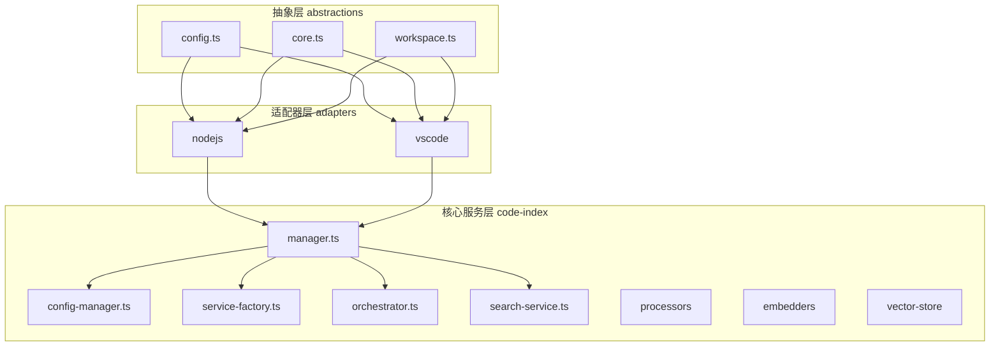
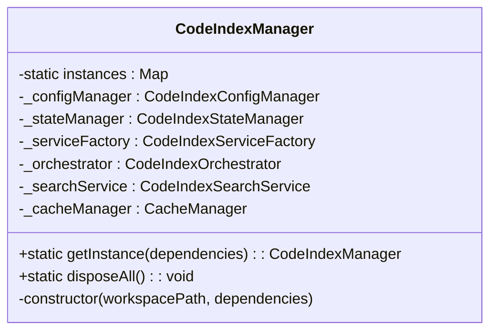
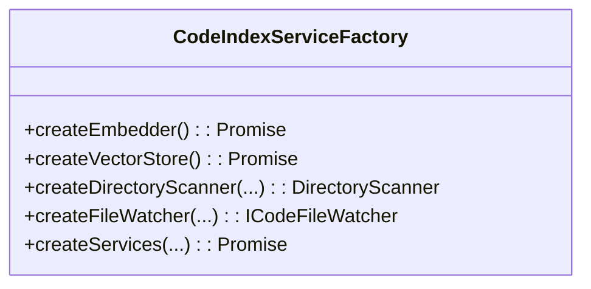
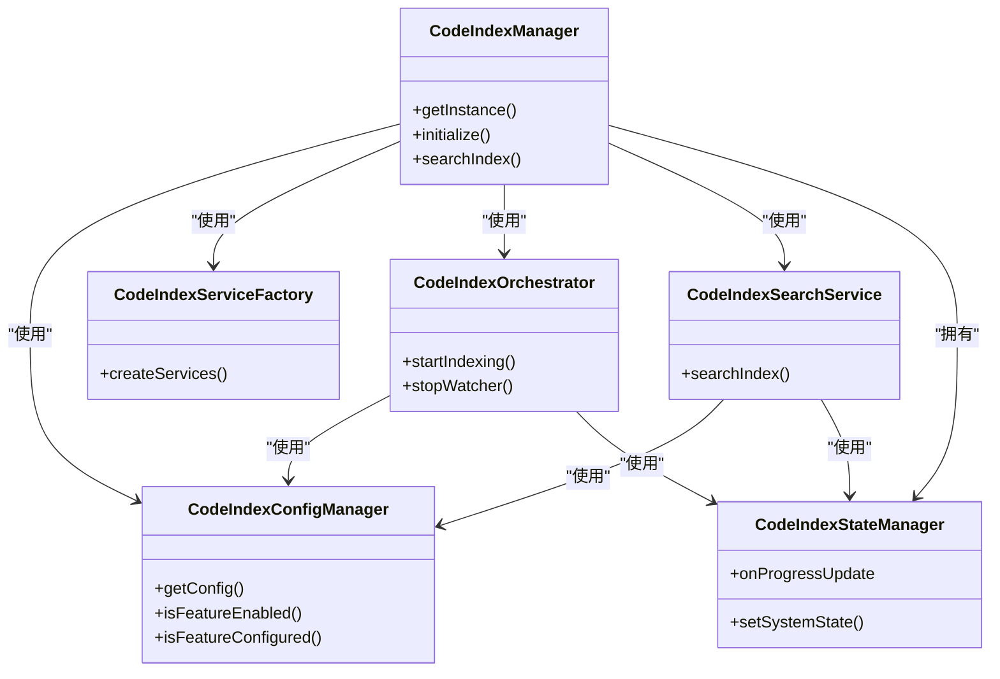
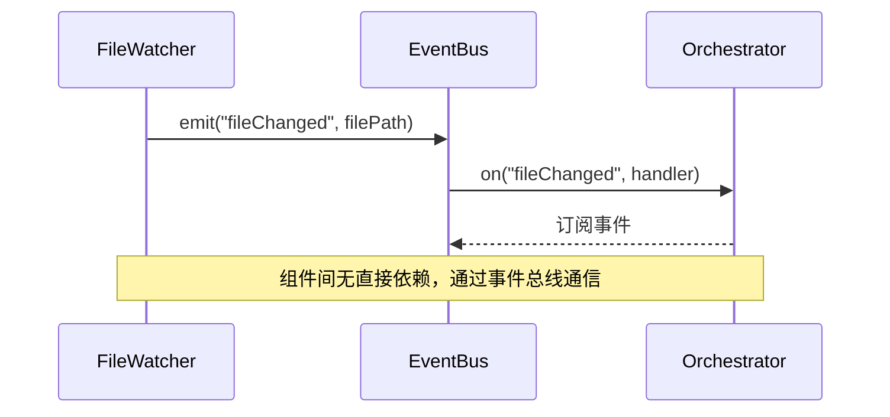
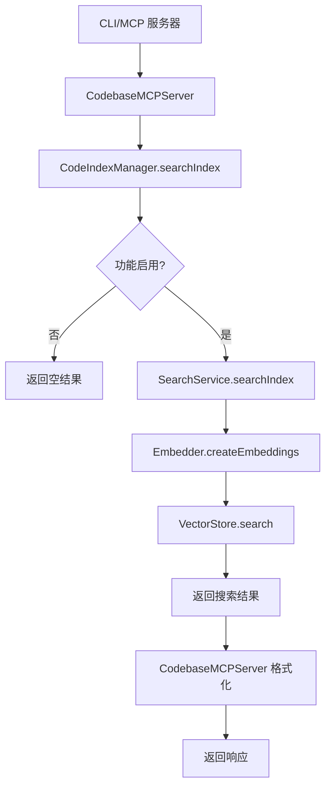

# 架构设计

<cite>
**本文档中引用的文件**  
- [manager.ts](file://src/code-index/manager.ts)
- [service-factory.ts](file://src/code-index/service-factory.ts)
- [orchestrator.ts](file://src/code-index/orchestrator.ts)
- [config-manager.ts](file://src/code-index/config-manager.ts)
- [search-service.ts](file://src/code-index/search-service.ts)
- [event-bus.ts](file://src/adapters/nodejs/event-bus.ts)
- [core.ts](file://src/abstractions/core.ts)
- [server.ts](file://src/mcp/server.ts)
</cite>

## 目录
1. [项目结构](#项目结构)
2. [核心架构分层](#核心架构分层)
3. [关键设计模式](#关键设计模式)
4. [组件关系图](#组件关系图)
5. [事件总线通信机制](#事件总线通信机制)
6. [数据流分析](#数据流分析)
7. [架构权衡与优势](#架构权衡与优势)

## 项目结构

项目采用分层架构设计，主要分为三个核心目录：`abstractions`、`adapters` 和 `code-index`。`abstractions` 目录定义了跨平台的核心接口，包括文件系统、存储、事件总线和工作区抽象。`adapters` 目录为不同运行环境（Node.js 和 VS Code）提供了这些抽象的具体实现。`code-index` 目录是核心服务层，包含了索引管理、配置管理、服务工厂、编排器、搜索服务等核心业务逻辑。

**Diagram sources**
- [abstractions](file://src/abstractions)
- [adapters](file://src/adapters)
- [code-index](file://src/code-index)

**Section sources**
- [project_structure](file://project_structure)

## 核心架构分层

本项目采用清晰的分层架构，分为抽象层（abstractions）、适配器层（adapters）和核心服务层（code-index）。

**抽象层 (abstractions)** 提供了与具体平台无关的接口定义，确保了代码的可移植性。`core.ts` 文件定义了 `IFileSystem`、`IStorage`、`IEventBus` 和 `ILogger` 等核心接口，而 `workspace.ts` 定义了 `IWorkspace` 接口，用于抽象工作区相关的操作，如获取根路径、相对路径和忽略规则。

**适配器层 (adapters)** 实现了抽象层定义的接口，为不同的运行环境提供具体功能。`nodejs` 目录下的 `event-bus.ts` 使用 Node.js 的 `EventEmitter` 实现了 `IEventBus` 接口，`file-system.ts` 和 `storage.ts` 则提供了基于 Node.js 文件系统的具体实现。`vscode` 目录提供了针对 VS Code 环境的适配器实现。

**核心服务层 (code-index)** 是业务逻辑的核心，包含了所有与代码索引相关的功能。`CodeIndexManager` 作为顶层协调者，负责初始化和管理其他服务。`ConfigManager` 负责加载和管理配置。`ServiceFactory` 负责创建和配置依赖服务。`Orchestrator` 负责协调索引流程。`SearchService` 提供搜索功能。这一层通过依赖注入的方式，接收来自适配器层的具体实现，从而实现了与底层平台的解耦。

**Section sources**
- [abstractions](file://src/abstractions)
- [adapters](file://src/adapters)
- [code-index](file://src/code-index)

## 关键设计模式

### 单例模式 (Singleton Pattern)

`CodeIndexManager` 类采用了单例模式，确保在整个应用程序生命周期中，每个工作区路径仅存在一个管理器实例。该模式通过一个静态的 `Map` 来存储实例，键为工作区路径。`getInstance` 静态方法负责检查并返回现有实例或创建新实例。这种设计避免了资源的重复创建和状态的不一致，特别适用于管理全局状态和共享资源。

**Diagram sources**
- [manager.ts](file://src/code-index/manager.ts#L23-L351)

**Section sources**
- [manager.ts](file://src/code-index/manager.ts#L23-L351)

### 工厂模式 (Factory Pattern)

`ServiceFactory` 类是工厂模式的典型应用。它封装了创建复杂依赖对象（如 `embedder`、`vectorStore`、`scanner` 和 `fileWatcher`）的逻辑。`createServices` 方法根据当前配置，动态地创建并返回一组相互协作的服务实例。这种模式将对象的创建与使用分离，提高了代码的灵活性和可维护性，使得添加新的嵌入提供者（如 OpenAI、Ollama）或向量存储变得非常容易。

**Diagram sources**
- [service-factory.ts](file://src/code-index/service-factory.ts#L16-L182)

**Section sources**
- [service-factory.ts](file://src/code-index/service-factory.ts#L16-L182)

### 依赖注入 (Dependency Injection)

项目广泛使用了依赖注入模式，特别是在 `CodeIndexManager` 的构造函数和 `ServiceFactory` 的方法中。`CodeIndexManager` 的构造函数接收一个包含 `fileSystem`、`storage`、`eventBus` 等依赖项的 `dependencies` 对象。`ServiceFactory` 在创建服务时，也接收这些依赖项作为参数。这种模式使得组件之间的耦合度降低，提高了代码的可测试性，因为可以在单元测试中轻松地注入模拟对象（mocks）来替代真实的依赖。

**Section sources**
- [manager.ts](file://src/code-index/manager.ts#L23-L351)
- [service-factory.ts](file://src/code-index/service-factory.ts#L16-L182)

## 组件关系图

下图展示了 `CodeIndexManager`、`ConfigManager`、`Orchestrator`、`ServiceFactory` 和 `SearchService` 之间的核心关系。

**Diagram sources**
- [manager.ts](file://src/code-index/manager.ts#L23-L351)
- [config-manager.ts](file://src/code-index/config-manager.ts#L17-L334)
- [service-factory.ts](file://src/code-index/service-factory.ts#L16-L182)
- [orchestrator.ts](file://src/code-index/orchestrator.ts#L11-L274)
- [search-service.ts](file://src/code-index/search-service.ts#L10-L53)
- [state-manager.ts](file://src/code-index/state-manager.ts#L4-L120)

**Section sources**
- [manager.ts](file://src/code-index/manager.ts#L23-L351)
- [config-manager.ts](file://src/code-index/config-manager.ts#L17-L334)
- [service-factory.ts](file://src/code-index/service-factory.ts#L16-L182)
- [orchestrator.ts](file://src/code-index/orchestrator.ts#L11-L274)
- [search-service.ts](file://src/code-index/search-service.ts#L10-L53)

## 事件总线通信机制

事件总线（event-bus）是实现组件间松耦合通信的核心机制。系统定义了 `IEventBus` 接口，规定了 `emit`、`on`、`off` 和 `once` 等方法。在 Node.js 环境中，`NodeEventBus` 类通过继承 `EventEmitter` 来实现该接口。组件之间不直接调用对方的方法，而是通过事件总线发布和订阅事件。例如，`FileWatcher` 可以在文件发生变化时 `emit` 一个事件，而 `Orchestrator` 可以通过 `on` 方法订阅该事件并做出响应。这种发布-订阅模式极大地降低了组件间的直接依赖，使得系统更易于扩展和维护。

**Diagram sources**
- [event-bus.ts](file://src/adapters/nodejs/event-bus.ts#L1-L55)
- [core.ts](file://src/abstractions/core.ts#L3-L11)

**Section sources**
- [event-bus.ts](file://src/adapters/nodejs/event-bus.ts#L1-L55)
- [core.ts](file://src/abstractions/core.ts#L3-L11)

## 数据流分析

数据流从请求入口开始，贯穿整个系统，最终返回响应。

1.  **请求入口**: 请求可以来自 CLI 或 MCP 服务器。`server.ts` 中的 `CodebaseMCPServer` 接收来自 MCP 客户端的 `search_codebase` 工具调用请求。
2.  **配置加载**: `CodeIndexManager` 的 `initialize` 方法首先创建并初始化 `ConfigManager`，从存储中加载配置，确定功能是否启用以及是否已正确配置。
3.  **服务创建**: 如果配置发生变化或服务需要重建，`ServiceFactory` 会被调用，根据配置创建 `embedder`、`vectorStore` 等服务实例。
4.  **索引编排**: `Orchestrator` 负责执行索引流程。它首先初始化向量存储，然后通过 `DirectoryScanner` 扫描工作区文件，将代码块解析、生成嵌入并向量存储中。
5.  **搜索响应**: 当收到搜索请求时，`SearchService` 会使用 `embedder` 将查询转换为向量，然后在 `vectorStore` 中执行向量搜索，最后将结果返回给 `CodeIndexManager`，再由 `CodebaseMCPServer` 格式化并返回给客户端。

**Diagram sources**
- [server.ts](file://src/mcp/server.ts#L1-L309)
- [manager.ts](file://src/code-index/manager.ts#L23-L351)
- [search-service.ts](file://src/code-index/search-service.ts#L10-L53)

**Section sources**
- [server.ts](file://src/mcp/server.ts#L1-L309)
- [manager.ts](file://src/code-index/manager.ts#L23-L351)
- [search-service.ts](file://src/code-index/search-service.ts#L10-L53)

## 架构权衡与优势

该架构设计在可测试性、可扩展性和可维护性方面具有显著优势。

**可测试性**: 通过依赖注入和接口抽象，核心服务层的代码可以轻松地与外部依赖（如文件系统、网络请求）解耦。在单元测试中，可以为 `IFileSystem`、`IEventBus` 等接口提供模拟实现，从而对 `CodeIndexManager`、`Orchestrator` 等复杂组件进行隔离测试。

**可扩展性**: 工厂模式和接口抽象使得系统易于扩展。添加新的嵌入提供者（如 Hugging Face）或向量数据库（如 Pinecone）只需实现相应的接口，并在 `ServiceFactory` 中添加创建逻辑，而无需修改现有核心代码。适配器层的设计也使得支持新的 IDE 环境（如 JetBrains）成为可能。

**权衡**: 这种分层和抽象设计虽然带来了灵活性，但也增加了代码的复杂性。开发者需要理解多个层次和接口之间的关系。此外，事件总线虽然解耦了组件，但如果事件过多或命名不规范，可能会导致“事件爆炸”，使得代码的执行流程难以追踪。

**Section sources**
- [abstractions](file://src/abstractions)
- [adapters](file://src/adapters)
- [code-index](file://src/code-index)