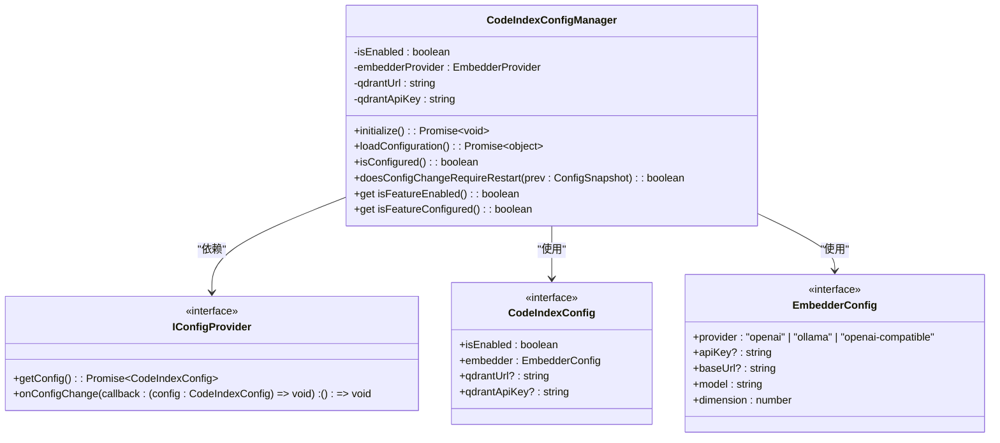
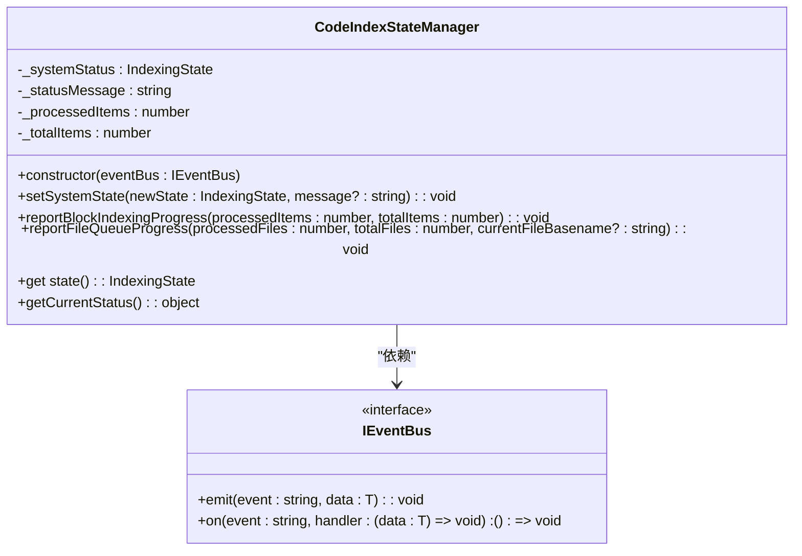
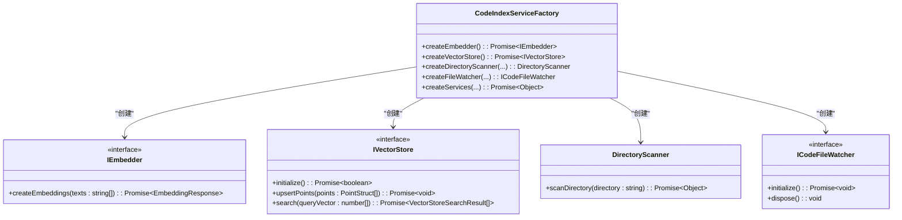
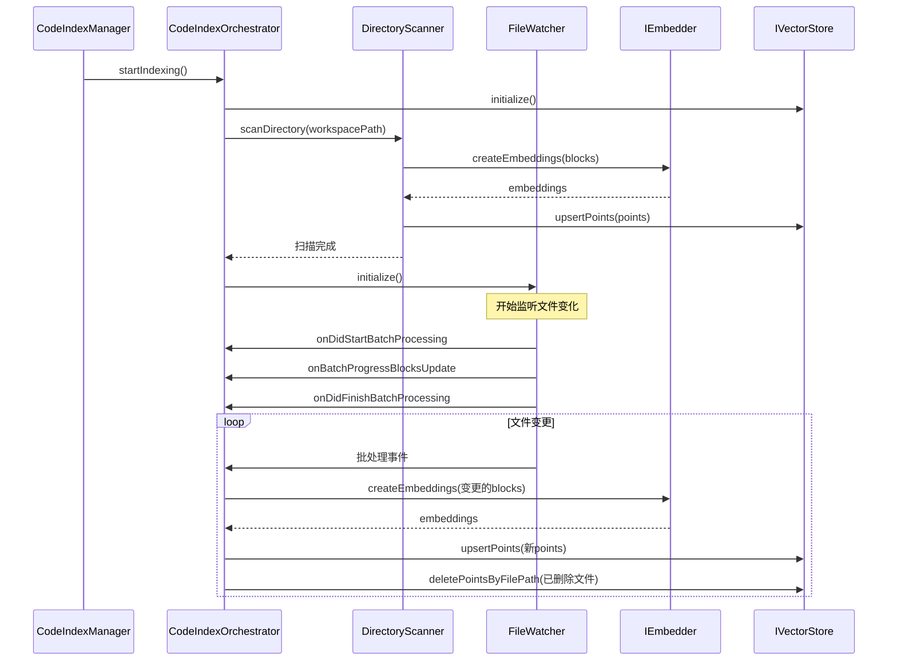
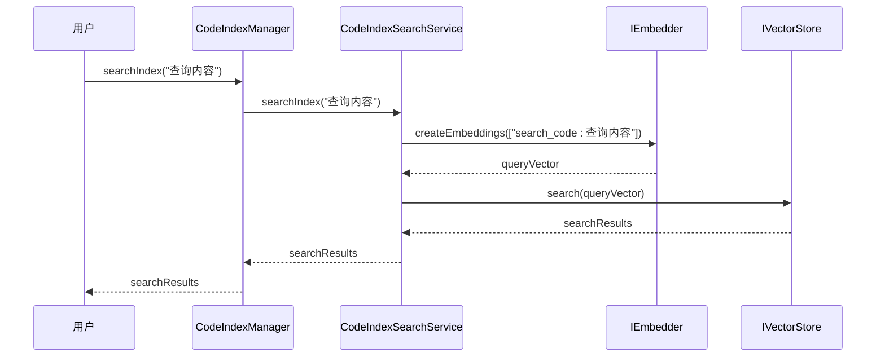
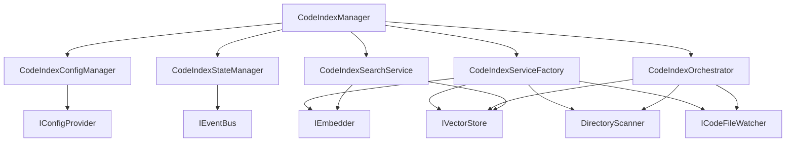

# 组件关系

<cite>
**本文档引用的文件 **  
- [manager.ts](file://src/code-index/manager.ts)
- [config-manager.ts](file://src/code-index/config-manager.ts)
- [state-manager.ts](file://src/code-index/state-manager.ts)
- [service-factory.ts](file://src/code-index/service-factory.ts)
- [orchestrator.ts](file://src/code-index/orchestrator.ts)
- [search-service.ts](file://src/code-index/search-service.ts)
- [interfaces/config.ts](file://src/code-index/interfaces/config.ts)
- [interfaces/embedder.ts](file://src/code-index/interfaces/embedder.ts)
- [interfaces/vector-store.ts](file://src/code-index/interfaces/vector-store.ts)
- [processors/scanner.ts](file://src/code-index/processors/scanner.ts)
- [processors/file-watcher.ts](file://src/code-index/processors/file-watcher.ts)
- [abstractions/config.ts](file://src/abstractions/config.ts)
</cite>

## 目录
1. [简介](#简介)
2. [核心协调者：CodeIndexManager](#核心协调者codeindexmanager)
3. [配置与状态管理](#配置与状态管理)
4. [服务工厂与动态实例化](#服务工厂与动态实例化)
5. [索引编排与工作流](#索引编排与工作流)
6. [搜索服务](#搜索服务)
7. [组件依赖关系图](#组件依赖关系图)

## 简介
本文档详细阐述了代码索引系统中各核心组件之间的关系。重点分析了`CodeIndexManager`作为核心协调者，如何与`ConfigManager`、`StateManager`和`ServiceFactory`协同工作。文档解释了`ServiceFactory`如何根据配置动态创建`Embedder`、`VectorStore`、`Scanner`和`Watcher`等服务实例。同时，说明了`Orchestrator`如何管理`Scanner`和`Watcher`以实现全量与增量索引。最后，阐述了`SearchService`如何利用`Embedder`生成查询向量并从`VectorStore`中检索结果。

## 核心协调者：CodeIndexManager

`CodeIndexManager`是整个代码索引系统的单一入口和核心协调者。它采用单例模式实现，确保每个工作区路径对应一个唯一的实例。该类负责协调所有其他组件的生命周期和交互。

`CodeIndexManager`通过其`initialize`方法启动整个系统。此方法是组件协同工作的起点，它按特定顺序初始化和协调各个依赖组件。`CodeIndexManager`持有对`ConfigManager`、`StateManager`、`ServiceFactory`、`Orchestrator`和`SearchService`等关键组件的引用，充当它们之间的“粘合剂”。

**Section sources**
- [manager.ts](file://src/code-index/manager.ts#L23-L351)

## 配置与状态管理

### 配置管理 (ConfigManager)
`CodeIndexConfigManager`负责管理系统的配置状态。它通过`IConfigProvider`接口（来自`abstractions/config.ts`）从外部源（如VS Code设置或Node.js配置文件）加载配置。`ConfigManager`不仅存储配置，还负责验证其有效性，并判断配置的更改是否需要重启索引服务。

`CodeIndexManager`在初始化过程中首先创建并初始化`ConfigManager`。`ConfigManager`会加载最新的配置，包括嵌入模型提供者（如OpenAI、Ollama）、API密钥、向量数据库（Qdrant）的URL和密钥等。`ConfigManager`还提供`isFeatureEnabled`和`isFeatureConfigured`等属性，供`CodeIndexManager`判断功能是否已启用和正确配置。

**Diagram sources **
- [config-manager.ts](file://src/code-index/config-manager.ts#L17-L334)
- [abstractions/config.ts](file://src/abstractions/config.ts#L24-L54)
- [interfaces/config.ts](file://src/code-index/interfaces/config.ts#L5-L60)

### 状态管理 (StateManager)
`CodeIndexStateManager`负责维护和报告系统的当前状态。它通过`IEventBus`（事件总线）与其他组件通信，发布状态更新事件。状态包括`Standby`（待机）、`Indexing`（索引中）、`Indexed`（已索引）和`Error`（错误）。

`CodeIndexManager`在构造函数中就创建了`StateManager`的实例，并将其传递给`Orchestrator`等其他组件。当`Orchestrator`开始扫描或处理文件时，它会调用`StateManager`的方法（如`setSystemState`和`reportBlockIndexingProgress`）来更新进度。`CodeIndexManager`通过`onProgressUpdate`属性暴露了这个事件，供外部UI组件订阅以显示实时进度。

**Diagram sources **
- [state-manager.ts](file://src/code-index/state-manager.ts#L4-L120)
- [abstractions/core.ts](file://src/abstractions/core.ts#L16-L20)

## 服务工厂与动态实例化

`CodeIndexServiceFactory`是系统中负责创建和配置所有核心服务实例的工厂类。`CodeIndexManager`在初始化过程中，当检测到需要重新创建服务（例如配置发生重大更改时），会创建一个新的`ServiceFactory`实例。

`ServiceFactory`根据`ConfigManager`提供的当前配置，动态地创建以下服务：
- **Embedder**: 根据`embedder.provider`配置，创建`OpenAiEmbedder`、`CodeIndexOllamaEmbedder`或`OpenAICompatibleEmbedder`的实例。
- **VectorStore**: 创建`QdrantVectorStore`实例，使用配置中的Qdrant URL和API密钥。
- **Scanner**: 创建`DirectoryScanner`实例，用于执行全量文件扫描。
- **FileWatcher**: 创建`FileWatcher`实例，用于监控文件系统的增量变化。

这种工厂模式实现了松耦合设计。`CodeIndexManager`不直接依赖于`OpenAiEmbedder`或`QdrantVectorStore`的具体实现，而是依赖于`IEmbedder`和`IVectorStore`等接口。这使得系统可以轻松地替换不同的嵌入模型提供者或向量数据库，而无需修改核心协调逻辑。

**Diagram sources **
- [service-factory.ts](file://src/code-index/service-factory.ts#L16-L182)
- [interfaces/embedder.ts](file://src/code-index/interfaces/embedder.ts#L4-L13)
- [interfaces/vector-store.ts](file://src/code-index/interfaces/vector-store.ts#L9-L63)
- [processors/scanner.ts](file://src/code-index/processors/scanner.ts#L35-L394)
- [processors/file-watcher.ts](file://src/code-index/processors/file-watcher.ts#L32-L549)

## 索引编排与工作流

`CodeIndexOrchestrator`是索引工作流的编排者。`CodeIndexManager`在`initialize`方法中，通过`ServiceFactory`创建了`Orchestrator`实例，并将`Scanner`和`FileWatcher`等组件传递给它。

`Orchestrator`的核心方法是`startIndexing`，它协调了全量索引和增量索引的整个流程：
1.  **初始化**: 首先初始化`VectorStore`，确保向量集合存在。
2.  **全量扫描**: 调用`Scanner`的`scanDirectory`方法，对工作区进行深度扫描。`Scanner`会解析支持的文件，生成代码块（CodeBlock），并通过`Embedder`为每个代码块生成向量，然后将这些向量点（PointStruct）批量插入到`VectorStore`中。
3.  **增量监控**: 全量扫描完成后，`Orchestrator`启动`FileWatcher`。`FileWatcher`会监听文件系统的创建、修改和删除事件。
4.  **增量处理**: 当`FileWatcher`检测到文件变化时，它会将事件累积并触发一个批处理。`Orchestrator`通过事件总线接收这些批处理事件，并协调对变更文件的重新解析、向量化和索引更新。

**Diagram sources **
- [orchestrator.ts](file://src/code-index/orchestrator.ts#L11-L274)
- [processors/scanner.ts](file://src/code-index/processors/scanner.ts#L35-L394)
- [processors/file-watcher.ts](file://src/code-index/processors/file-watcher.ts#L32-L549)

## 搜索服务

`CodeIndexSearchService`负责处理搜索请求。`CodeIndexManager`在初始化时，通过`ServiceFactory`创建`SearchService`实例，并将`Embedder`和`VectorStore`注入其中。

当用户发起搜索时，`CodeIndexManager`的`searchIndex`方法会委托给`SearchService`。`SearchService`的工作流程如下：
1.  **生成查询向量**: 使用注入的`Embedder`为用户的查询字符串生成一个向量。
2.  **向量搜索**: 将生成的查询向量传递给`VectorStore`的`search`方法。
3.  **返回结果**: `VectorStore`在向量空间中执行相似性搜索，返回最相关的向量点。`SearchService`将这些结果包装后返回给`CodeIndexManager`。

**Diagram sources **
- [search-service.ts](file://src/code-index/search-service.ts#L10-L53)
- [interfaces/embedder.ts](file://src/code-index/interfaces/embedder.ts#L4-L13)
- [interfaces/vector-store.ts](file://src/code-index/interfaces/vector-store.ts#L9-L63)

## 组件依赖关系图

下图总结了系统中主要组件之间的依赖关系。

**Diagram sources **
- [manager.ts](file://src/code-index/manager.ts#L23-L351)
- [config-manager.ts](file://src/code-index/config-manager.ts#L17-L334)
- [state-manager.ts](file://src/code-index/state-manager.ts#L4-L120)
- [service-factory.ts](file://src/code-index/service-factory.ts#L16-L182)
- [orchestrator.ts](file://src/code-index/orchestrator.ts#L11-L274)
- [search-service.ts](file://src/code-index/search-service.ts#L10-L53)