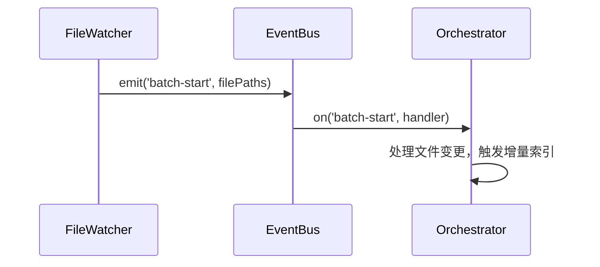

# 设计模式

<cite>
**本文档中引用的文件**  
- [manager.ts](file://src/code-index/manager.ts)
- [service-factory.ts](file://src/code-index/service-factory.ts)
- [orchestrator.ts](file://src/code-index/orchestrator.ts)
- [file-watcher.ts](file://src/code-index/processors/file-watcher.ts)
- [state-manager.ts](file://src/code-index/state-manager.ts)
- [config-manager.ts](file://src/code-index/config-manager.ts)
- [nodejs/event-bus.ts](file://src/adapters/nodejs/event-bus.ts)
- [manager.spec.ts](file://src/code-index/__tests__/manager.spec.ts)
- [service-factory.spec.ts](file://src/code-index/__tests__/service-factory.spec.ts)
</cite>

## 目录
1. [单例模式](#单例模式)
2. [工厂模式](#工厂模式)
3. [依赖注入](#依赖注入)
4. [观察者模式](#观察者模式)
5. [测试支持](#测试支持)

## 单例模式

`CodeIndexManager` 类通过静态实例和私有构造函数实现了单例模式，确保在每个工作区路径下仅存在一个实例。该类维护一个静态的 `Map<string, CodeIndexManager>`，以工作区路径作为键来存储和检索实例。`getInstance` 静态方法负责检查实例是否存在，如果不存在则创建并存储新实例，从而保证全局唯一性。私有构造函数防止了类的外部直接实例化，强制使用 `getInstance` 方法来获取实例。这种设计确保了索引状态的集中管理，避免了多个实例之间可能产生的状态冲突。

**Section sources**
- [manager.ts](file://src/code-index/manager.ts#L13-L21)
- [manager.ts](file://src/code-index/manager.ts#L23-L351)

## 工厂模式

`ServiceFactory` 类应用了工厂模式，根据配置动态地实例化不同的嵌入模型和向量存储客户端。`createEmbedder` 方法根据配置中的 `provider` 字段（如 "openai"、"ollama" 或 "openai-compatible"）来决定创建哪种嵌入器实例。例如，当 `provider` 为 "openai" 时，它会创建并返回一个 `OpenAiEmbedder` 实例。类似地，`createVectorStore` 方法会根据配置创建相应的向量存储实例，如 `QdrantVectorStore`。这种模式将对象的创建逻辑与使用逻辑分离，使得系统能够灵活地扩展以支持新的服务提供商，而无需修改客户端代码。

```mermaid
classDiagram
class ServiceFactory {
+createEmbedder() IEmbedder
+createVectorStore() IVectorStore
+createServices() Promise~{embedder, vectorStore...}~
}
class IEmbedder {
<<interface>>
+createEmbeddings(texts string[]) Promise~{embeddings number[][]}~
}
class OpenAiEmbedder {
+createEmbeddings(texts string[]) Promise~{embeddings number[][]}~
}
class CodeIndexOllamaEmbedder {
+createEmbeddings(texts string[]) Promise~{embeddings number[][]}~
}
class OpenAICompatibleEmbedder {
+createEmbeddings(texts string[]) Promise~{embeddings number[][]}~
}
class IVectorStore {
<<interface>>
+initialize() Promise~boolean~
+upsertPoints(points PointStruct[]) Promise~void~
+deletePointsByMultipleFilePaths(filePaths string[]) Promise~void~
}
class QdrantVectorStore {
+initialize() Promise~boolean~
+upsertPoints(points PointStruct[]) Promise~void~
+deletePointsByMultipleFilePaths(filePaths string[]) Promise~void~
}
ServiceFactory --> IEmbedder : "creates"
ServiceFactory --> IVectorStore : "creates"
IEmbedder <|-- OpenAiEmbedder
IEmbedder <|-- CodeIndexOllamaEmbedder
IEmbedder <|-- OpenAICompatibleEmbedder
IVectorStore <|-- QdrantVectorStore
```

**Diagram sources **
- [service-factory.ts](file://src/code-index/service-factory.ts#L16-L182)
- [embedders/openai.ts](file://src/code-index/embedders/openai.ts#L14-L170)
- [embedders/ollama.ts](file://src/code-index/embedders/ollama.ts#L7-L103)
- [embedders/openai-compatible.ts](file://src/code-index/embedders/openai-compatible.ts#L28-L292)
- [vector-store/qdrant-client.ts](file://src/code-index/vector-store/qdrant-client.ts#L12-L339)

## 依赖注入

依赖注入通过构造函数参数传递依赖项，提升了代码的可测试性和模块化。例如，`Orchestrator` 类在其构造函数中接收 `ConfigManager`、`StateManager`、`CacheManager` 等多个依赖项。这种方式使得 `Orchestrator` 不需要关心这些依赖项是如何创建的，只需要使用它们提供的接口。这不仅降低了类之间的耦合度，还使得在单元测试中可以轻松地用模拟对象（mocks）替换真实的依赖项，从而隔离测试目标组件。

**Section sources**
- [orchestrator.ts](file://src/code-index/orchestrator.ts#L11-L274)
- [manager.ts](file://src/code-index/manager.ts#L23-L351)

## 观察者模式

事件总线（EventBus）实现了观察者模式，使得 `FileWatcher` 能够发布变更事件，而 `Orchestrator` 可以订阅这些事件并触发增量索引。`FileWatcher` 在检测到文件变化时，会调用 `eventBus.emit('batch-start', filePaths)` 来发布事件。`Orchestrator` 则通过 `eventBus.on('batch-start', handler)` 订阅该事件，并在事件触发时执行相应的处理逻辑。这种松耦合的通信机制允许组件独立变化，提高了系统的灵活性和可维护性。



**Diagram sources **
- [file-watcher.ts](file://src/code-index/processors/file-watcher.ts#L32-L549)
- [orchestrator.ts](file://src/code-index/orchestrator.ts#L11-L274)
- [nodejs/event-bus.ts](file://src/adapters/nodejs/event-bus.ts#L7-L55)

## 测试支持

这些设计模式通过在测试文件中使用模拟（mock）对象来支持单元测试。例如，在 `manager.spec.ts` 中，`CodeIndexManager` 的依赖项（如 `configProvider` 和 `eventBus`）被模拟，以测试 `handleExternalSettingsChange` 方法的行为。同样，在 `service-factory.spec.ts` 中，`createEmbedder` 和 `createVectorStore` 方法的返回值被模拟，以验证工厂是否根据配置正确地创建了相应的服务实例。这种基于依赖注入和接口的测试方法确保了测试的隔离性和可靠性。

**Section sources**
- [manager.spec.ts](file://src/code-index/__tests__/manager.spec.ts#L0-L118)
- [service-factory.spec.ts](file://src/code-index/__tests__/service-factory.spec.ts#L0-L516)