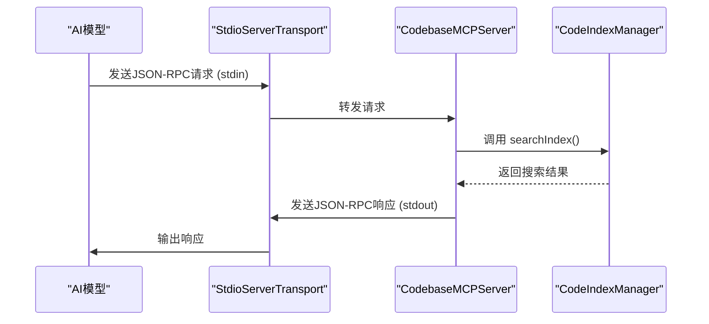
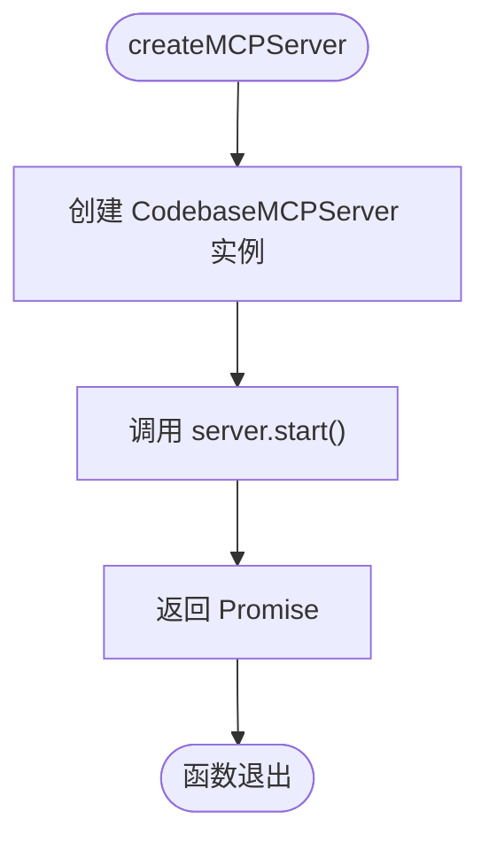

# MCP服务器

<cite>
**Referenced Files in This Document**   
- [server.ts](file://src/mcp/server.ts)
- [manager.ts](file://src/code-index/manager.ts)
- [stdio-adapter.ts](file://src/mcp/stdio-adapter.ts)
</cite>

## 目录
1. [简介](#简介)
2. [核心架构与组件](#核心架构与组件)
3. [核心工具详解](#核心工具详解)
4. [通信与流式处理](#通信与流式处理)
5. [工具注册与请求分发](#工具注册与请求分发)
6. [工厂函数与使用示例](#工厂函数与使用示例)
7. [依赖关系与集成](#依赖关系与集成)

## 简介

MCP（Model Context Protocol）服务器是连接AI模型与本地代码库的桥梁，它通过标准化的工具协议，将代码库的语义搜索能力暴露给外部模型。`CodebaseMCPServer`类是这一功能的核心实现，它封装了与代码索引的交互逻辑，并通过MCP协议提供服务。该服务器允许AI模型以自然语言查询代码库，执行代码搜索、获取索引状态和配置搜索参数等操作，极大地增强了AI在代码理解和开发辅助方面的能力。

**Section sources**
- [server.ts](file://src/mcp/server.ts#L17-L302)

## 核心架构与组件

`CodebaseMCPServer`的核心架构围绕`Server`实例和`CodeIndexManager`依赖构建。服务器在构造时接收一个`CodeIndexManager`实例，该实例负责管理代码索引的生命周期和搜索操作。服务器通过`setupTools`方法注册其提供的工具，并通过`StdioServerTransport`与外部模型进行通信。整个系统的设计遵循了依赖注入原则，使得`CodebaseMCPServer`本身不直接处理索引逻辑，而是作为`CodeIndexManager`功能的MCP协议适配器。

```mermaid
classDiagram
class CodebaseMCPServer {
    -server : Server
    -codeIndexManager : CodeIndexManager
    +constructor(options : MCPServerOptions)
    +start() : Promise~void~
    +stop() : Promise~void~
    -setupTools() : void
    -handleSearchCodebase(args : any) : Promise~CallToolResult~
    -handleGetSearchStats(args : any) : Promise~CallToolResult~
    -handleConfigureSearch(args : any) : Promise~CallToolResult~
}

class CodeIndexManager {
    -workspacePath : string
    -dependencies : CodeIndexManagerDependencies
    -_stateManager : CodeIndexStateManager
    +get state() : IndexingState
    +get isFeatureEnabled() : boolean
    +get isInitialized() : boolean
    +initialize(options? : { force? : boolean }) : Promise~{ requiresRestart : boolean }~[]
    +startIndexing() : Promise~void~
    +stopWatcher() : void
    +dispose() : void
    +searchIndex(query : string, filter? : SearchFilter) : Promise~VectorStoreSearchResult[]~
}

class Server {
    +connect(transport : ServerTransport) : void
    +setRequestHandler(schema : any, handler : Function) : void
    +close() : void
}

class StdioServerTransport {
    +constructor()
}

CodebaseMCPServer --> CodeIndexManager : "依赖"
CodebaseMCPServer --> Server : "拥有"
CodebaseMCPServer --> StdioServerTransport : "创建并连接"
Server --> StdioServerTransport : "通信"
```

**Diagram sources**
- [server.ts](file://src/mcp/server.ts#L17-L302)
- [manager.ts](file://src/code-index/manager.ts#L1-L352)

**Section sources**
- [server.ts](file://src/mcp/server.ts#L17-L302)
- [manager.ts](file://src/code-index/manager.ts#L1-L352)

## 核心工具详解

`CodebaseMCPServer`通过`setupTools`方法注册了三个核心工具，这些工具的定义和行为构成了其对外暴露的功能集。

### search_codebase 工具

`search_codebase`是服务器的核心功能，它允许外部模型执行语义搜索。该工具的输入参数包括：
- `query` (必需): 搜索查询字符串。
- `limit` (可选): 返回结果的最大数量，默认为10。
- `filters` (可选): 包含`pathFilters`和`minScore`的过滤对象。

工具的输出是一个包含搜索结果摘要的文本内容。结果会格式化为文件路径、相似度分数和代码片段的组合。在执行搜索前，工具会检查`CodeIndexManager`的初始化状态，确保索引已准备就绪。搜索逻辑通过调用`codeIndexManager.searchIndex`方法实现，并对结果进行格式化处理。

**Section sources**
- [server.ts](file://src/mcp/server.ts#L100-L150)

### get_search_stats 工具

`get_search_stats`工具用于获取代码库索引的当前状态和统计信息。它不接受任何输入参数。输出内容包含一个结构化的文本摘要，显示索引的就绪状态、初始化状态、功能启用状态、当前索引状态和相关消息。该工具通过查询`CodeIndexManager`的`state`、`isInitialized`和`isFeatureEnabled`等属性来收集信息。

**Section sources**
- [server.ts](file://src/mcp/server.ts#L152-L180)

### configure_search 工具

`configure_search`工具用于配置搜索参数。其输入参数包括：
- `similarityThreshold`: 结果的最小相似度阈值（0.0到1.0）。
- `includeContext`: 布尔值，指示结果中是否包含周围的代码上下文。

该工具的实现目前是一个占位符，它会返回一个确认配置已更新的摘要，但并未实际修改`CodeIndexManager`的内部状态。在完整的实现中，此工具应能持久化或临时修改搜索行为。

**Section sources**
- [server.ts](file://src/mcp/server.ts#L182-L210)

## 通信与流式处理

`CodebaseMCPServer`通过`StdioServerTransport`与外部模型进行通信。`start`方法创建一个`StdioServerTransport`实例，并将其连接到`Server`对象。这使得服务器能够通过标准输入（stdin）接收来自模型的JSON-RPC请求，并通过标准输出（stdout）发送响应。

虽然`CodebaseMCPServer`本身使用标准I/O，但项目中存在一个`StdioToStreamableHTTPAdapter`类，它展示了如何将基于标准I/O的客户端桥接到基于HTTP/流式HTTP的服务器。这表明系统支持SSE（Server-Sent Events）流式响应，允许服务器在处理长时间运行的操作时，将结果分块发送给客户端，从而实现更流畅的用户体验。



**Diagram sources**
- [server.ts](file://src/mcp/server.ts#L280-L302)
- [stdio-adapter.ts](file://src/mcp/stdio-adapter.ts#L1-L417)

**Section sources**
- [server.ts](file://src/mcp/server.ts#L280-L302)
- [stdio-adapter.ts](file://src/mcp/stdio-adapter.ts#L1-L417)

## 工具注册与请求分发

工具的注册和请求分发机制是`CodebaseMCPServer`的关键逻辑。`setupTools`方法首先为`ListToolsRequestSchema`设置一个请求处理器，该处理器返回一个包含所有已注册工具元数据（名称、描述、输入模式）的列表。这使得客户端能够发现服务器提供的功能。

随后，为`CallToolRequestSchema`设置一个请求处理器，该处理器负责分发所有工具调用。它接收一个包含工具名称和参数的请求，使用`switch`语句根据工具名称调用相应的处理方法（`handleSearchCodebase`, `handleGetSearchStats`, `handleConfigureSearch`）。所有处理方法都包裹在`try-catch`块中，以捕获并返回任何错误，确保服务器的稳定性。

**Section sources**
- [server.ts](file://src/mcp/server.ts#L40-L98)

## 工厂函数与使用示例

为了简化服务器的创建和启动，代码库提供了一个名为`createMCPServer`的工厂函数。该函数接收一个`CodeIndexManager`实例作为参数，创建一个新的`CodebaseMCPServer`实例，调用其`start`方法，并返回一个已启动的服务器Promise。



**Diagram sources**
- [server.ts](file://src/mcp/server.ts#L305-L309)

**Section sources**
- [server.ts](file://src/mcp/server.ts#L305-L309)

## 依赖关系与集成

`CodebaseMCPServer`的核心依赖是`CodeIndexManager`，它负责执行实际的搜索操作。`CodeIndexManager`是一个复杂的单例类，它管理代码索引的配置、状态、缓存、向量存储和搜索服务。`CodebaseMCPServer`通过委托模式，将所有与索引相关的操作（如`searchIndex`）转发给`CodeIndexManager`，从而实现了关注点分离。

这种设计使得`CodebaseMCPServer`可以专注于MCP协议的实现，而`CodeIndexManager`则专注于代码索引的管理和优化。这种架构非常适合集成到IDE中，其中`CodeIndexManager`可以在后台持续索引代码，而`CodebaseMCPServer`则作为一个轻量级的网关，为AI插件提供实时的代码搜索能力。

**Section sources**
- [server.ts](file://src/mcp/server.ts#L17-L302)
- [manager.ts](file://src/code-index/manager.ts#L1-L352)