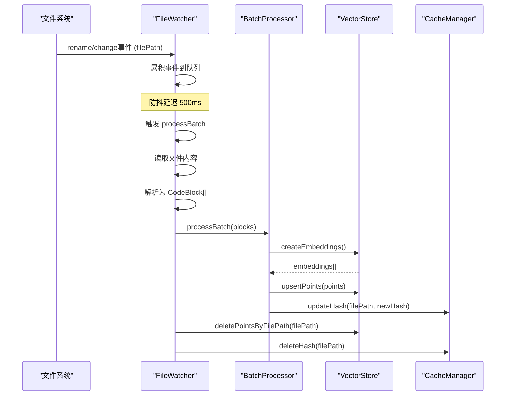

# 代码索引系统

<cite>
**Referenced Files in This Document**   
- [manager.ts](file://src/code-index/manager.ts)
- [orchestrator.ts](file://src/code-index/orchestrator.ts)
- [scanner.ts](file://src/code-index/processors/scanner.ts)
- [cache-manager.ts](file://src/code-index/cache-manager.ts)
- [qdrant-client.ts](file://src/code-index/vector-store/qdrant-client.ts)
- [file-watcher.ts](file://src/code-index/processors/file-watcher.ts)
- [state-manager.ts](file://src/code-index/state-manager.ts)
- [manager.ts](file://src/code-index/interfaces/manager.ts)
- [vector-store.ts](file://src/code-index/interfaces/vector-store.ts)
- [cache.ts](file://src/code-index/interfaces/cache.ts)
- [file-processor.ts](file://src/code-index/interfaces/file-processor.ts)
- [index.ts](file://src/code-index/constants/index.ts)
</cite>

## 目录
1. [自动化工作流](#自动化工作流)
2. [初始扫描阶段](#初始扫描阶段)
3. [增量更新机制](#增量更新机制)
4. [索引一致性维护](#索引一致性维护)
5. [缓存管理](#缓存管理)
6. [状态管理](#状态管理)
7. [索引数据清理](#索引数据清理)

## 自动化工作流

代码索引系统的自动化工作流始于 `CodeIndexManager` 的 `initialize` 和 `startIndexing` 方法，由 `CodeIndexOrchestrator` 协调整个索引过程。

当系统启动时，`CodeIndexManager.initialize` 方法首先初始化配置管理器 (`CodeIndexConfigManager`) 并加载配置。如果代码索引功能已启用，它会继续初始化缓存管理器 (`CacheManager`)。接着，系统会判断是否需要重新创建核心服务（如嵌入模型、向量存储、扫描器和文件监视器），这通常发生在配置发生需要重启的变更时。如果需要，系统会通过 `CodeIndexServiceFactory` 重新创建这些服务，并重新初始化 `CodeIndexOrchestrator` 和搜索服务。

在初始化完成后，如果需要启动或重启索引过程，`CodeIndexManager` 会调用其内部 `CodeIndexOrchestrator` 实例的 `startIndexing` 方法，从而正式开启索引流程。

**Section sources**
- [manager.ts](file://src/code-index/manager.ts#L112-L223)
- [orchestrator.ts](file://src/code-index/orchestrator.ts#L107-L211)

## 初始扫描阶段

初始扫描阶段是索引过程的核心，由 `CodeIndexOrchestrator` 协调 `DirectoryScanner`、`CacheManager` 和 `VectorStore` 共同完成。

`CodeIndexOrchestrator.startIndexing` 方法首先会初始化向量存储（`QdrantVectorStore`）。如果向量集合不存在或其向量维度与当前配置不匹配，系统会自动创建或重建集合。如果创建了新的集合，系统会清理缓存文件以确保数据一致性。

随后，`DirectoryScanner.scanDirectory` 方法被调用，开始对工作区文件进行扫描。该方法首先使用 `listFiles` 工具递归获取工作区内的所有文件路径，并过滤掉目录。接着，它会应用工作区的忽略规则（如 `.gitignore`）和系统内置的忽略规则（来自 `.rooignore`），并根据 `scannerExtensions` 常量中定义的支持扩展名列表来筛选文件。

对于每个筛选后的文件，系统会检查其大小是否超过 `MAX_FILE_SIZE_BYTES`（1MB）的限制。如果文件过大，则跳过处理。然后，系统会读取文件内容并计算其 SHA-256 哈希值。`CacheManager.getHash` 方法被用来获取该文件在缓存中的哈希值。如果缓存中的哈希值与当前计算的哈希值一致，说明文件未发生变化，系统会跳过该文件以避免重复处理。

对于新文件或已更改的文件，`DirectoryScanner` 会使用 `codeParser` 将其解析成多个 `CodeBlock` 对象。这些代码块会被分批处理，通过 `IEmbedder` 生成向量嵌入，并最终由 `VectorStore.upsertPoints` 方法存储到向量数据库中。

**Section sources**
- [orchestrator.ts](file://src/code-index/orchestrator.ts#L107-L211)
- [scanner.ts](file://src/code-index/processors/scanner.ts#L57-L281)
- [cache-manager.ts](file://src/code-index/cache-manager.ts#L81-L83)
- [qdrant-client.ts](file://src/code-index/vector-store/qdrant-client.ts#L145-L183)

## 增量更新机制

系统通过 `ICodeFileWatcher` 接口的实现（`FileWatcher` 类）来监控文件系统的变化，从而实现增量索引。

`FileWatcher` 使用 Node.js 的 `fs.watch` API 来监听工作区目录及其子目录。当检测到文件的 `rename` 或 `change` 事件时，它会将事件（包括文件路径和事件类型）添加到一个累积队列中。为了优化性能，系统使用 `BATCH_DEBOUNCE_DELAY_MS`（500毫秒）的防抖机制，将短时间内发生的多个文件变更事件合并为一个批次进行处理。

当防抖计时器到期后，`FileWatcher` 会触发 `processBatch` 方法。该方法会处理累积的事件，包括：
- **创建/修改**：读取文件内容，解析为代码块，并通过 `BatchProcessor` 将其向量嵌入上载到向量存储中。
- **删除**：直接调用 `VectorStore.deletePointsByFilePath` 方法，从向量数据库中删除与该文件关联的所有索引点。

在整个过程中，`CacheManager` 会同步更新其缓存，记录文件的最新哈希值或删除已删除文件的记录。

**Diagram sources**
- [file-watcher.ts](file://src/code-index/processors/file-watcher.ts#L121-L550)
- [scanner.ts](file://src/code-index/processors/scanner.ts#L57-L281)
- [qdrant-client.ts](file://src/code-index/vector-store/qdrant-client.ts#L145-L183)
- [cache-manager.ts](file://src/code-index/cache-manager.ts#L94-L106)

**Section sources**
- [file-watcher.ts](file://src/code-index/processors/file-watcher.ts#L121-L550)

## 索引一致性维护

`reconcileIndex` 方法是确保向量数据库与文件系统保持一致性的关键机制，它在 `CodeIndexManager.initialize` 方法的末尾被调用。

该方法的执行流程如下：
1.  **获取索引文件路径**：调用 `VectorStore.getAllFilePaths()` 方法，从向量数据库中获取所有已被索引的文件路径（这些路径是相对路径）。
2.  **获取本地文件路径**：调用 `DirectoryScanner.getAllFilePaths()` 方法，扫描当前工作区，获取所有存在于本地文件系统中的文件的绝对路径。
3.  **识别陈旧文件**：将本地文件的绝对路径转换为相对路径，并与索引中的路径进行对比。那些存在于索引中但不在本地文件列表中的路径，即为已删除或已移动的“陈旧”文件。
4.  **清理陈旧索引**：如果发现陈旧文件，系统会调用 `VectorStore.deletePointsByMultipleFilePaths()` 方法，批量删除向量数据库中对应的索引点。同时，`CacheManager.deleteHashes()` 方法会被调用，从缓存中移除这些已删除文件的哈希记录。

通过这个过程，系统确保了向量数据库不会包含指向不存在文件的“僵尸”索引，从而维护了索引的准确性和完整性。

**Section sources**
- [manager.ts](file://src/code-index/manager.ts#L287-L321)
- [qdrant-client.ts](file://src/code-index/vector-store/qdrant-client.ts#L303-L339)
- [scanner.ts](file://src/code-index/processors/scanner.ts#L360-L393)
- [cache-manager.ts](file://src/code-index/cache-manager.ts#L108-L113)

## 缓存管理

`CacheManager` 在避免重复处理未变更文件方面起着至关重要的作用。它通过一个 JSON 文件来持久化存储工作区中每个文件的哈希值。

其核心工作流程如下：
- **初始化**：`initialize` 方法在启动时读取缓存文件，将所有文件路径和哈希值加载到内存中的 `fileHashes` 记录中。
- **检查变更**：在扫描或处理文件时，系统会计算文件内容的当前哈希值，并通过 `getHash` 方法查询缓存。如果缓存中存在且哈希值匹配，则认为文件未变，跳过后续的解析和索引步骤。
- **更新缓存**：当一个文件被成功处理（无论是新文件还是已更改的文件），`updateHash` 方法会被调用，更新内存中的哈希记录，并通过一个防抖的 `saveCache` 操作（延迟1500毫秒）将其异步写入磁盘，以减少频繁的 I/O 操作。
- **清理缓存**：`clearCacheFile` 方法会将缓存文件重置为空的 JSON 对象 `{}`，并清空内存中的记录。

这种基于哈希的缓存机制极大地提升了索引效率，尤其是在大型项目中，可以显著减少不必要的计算和数据库操作。

**Section sources**
- [cache-manager.ts](file://src/code-index/cache-manager.ts#L8-L122)

## 状态管理

`CodeIndexStateManager` 负责管理索引系统的全局状态，并通过事件总线 (`IEventBus`) 向外部（如UI）广播状态更新。

系统定义了四种主要状态：
- **Standby (待机)**：系统已初始化但未开始索引，或索引已停止。
- **Indexing (索引中)**：系统正在进行初始扫描或处理文件变更。
- **Indexed (已索引)**：初始扫描完成，文件监控已启动，索引处于最新状态。
- **Error (错误)**：在索引过程中发生了不可恢复的错误。

状态转换逻辑如下：
- 当调用 `startIndexing` 时，状态从 `Standby` 变为 `Indexing`。
- 初始扫描成功完成后，状态变为 `Indexed`。
- 如果在索引过程中发生错误，状态会变为 `Error`。
- 调用 `stopWatcher` 或发生错误后，状态可能回到 `Standby`。

`CodeIndexStateManager` 还提供了 `reportBlockIndexingProgress` 和 `reportFileQueueProgress` 等方法，用于报告索引进度，这些信息会与状态一起通过 `progress-update` 事件广播出去。

**Section sources**
- [state-manager.ts](file://src/code-index/state-manager.ts#L4-L120)

## 索引数据清理

`clearIndexData` 方法提供了彻底清理索引数据的能力。该操作是分层次进行的：

1.  **`CodeIndexManager.clearIndexData`**：这是对外的入口方法。它首先确保系统已初始化，然后依次调用其内部 `CodeIndexOrchestrator` 和 `CacheManager` 的清理方法。
2.  **`CodeIndexOrchestrator.clearIndexData`**：这是核心清理逻辑。它首先调用 `stopWatcher` 停止文件监控。然后，它会尝试删除整个向量集合（`deleteCollection`），并立即重新初始化（`initialize`）以创建一个新的、空的集合。最后，它会清理缓存文件。
3.  **`CacheManager.clearCacheFile`**：此方法将缓存文件的内容清空为 `{}`，并重置内存中的哈希记录。

通过这一系列操作，系统可以完全清除所有索引数据，为重新开始索引提供一个干净的环境。

**Section sources**
- [manager.ts](file://src/code-index/manager.ts#L272-L279)
- [orchestrator.ts](file://src/code-index/orchestrator.ts#L231-L266)
- [cache-manager.ts](file://src/code-index/cache-manager.ts#L66-L74)