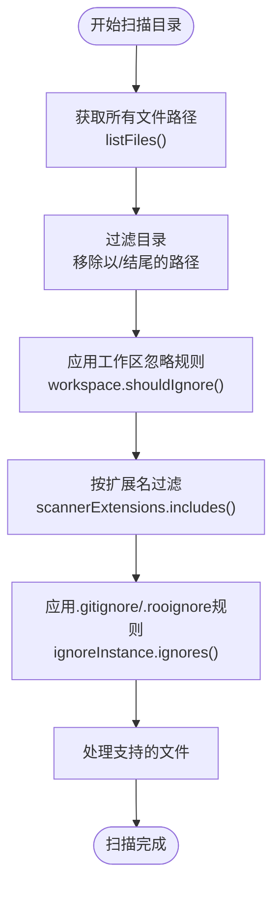
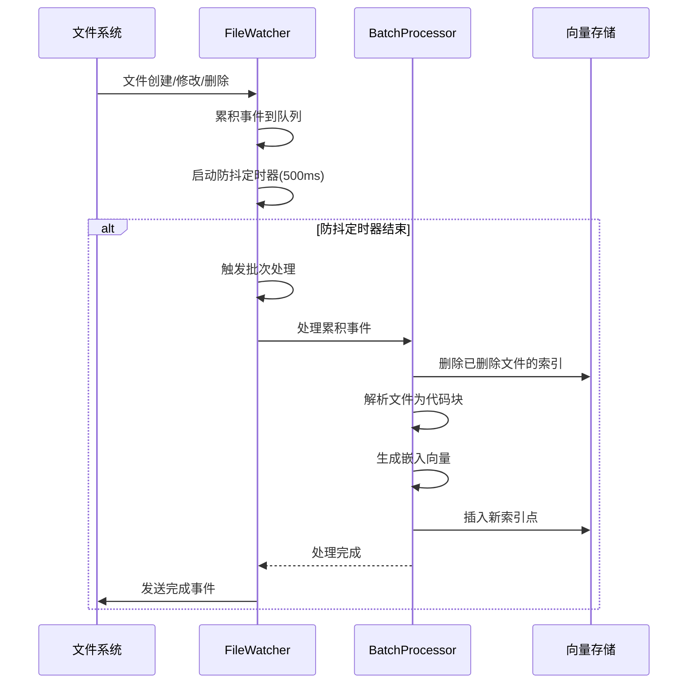
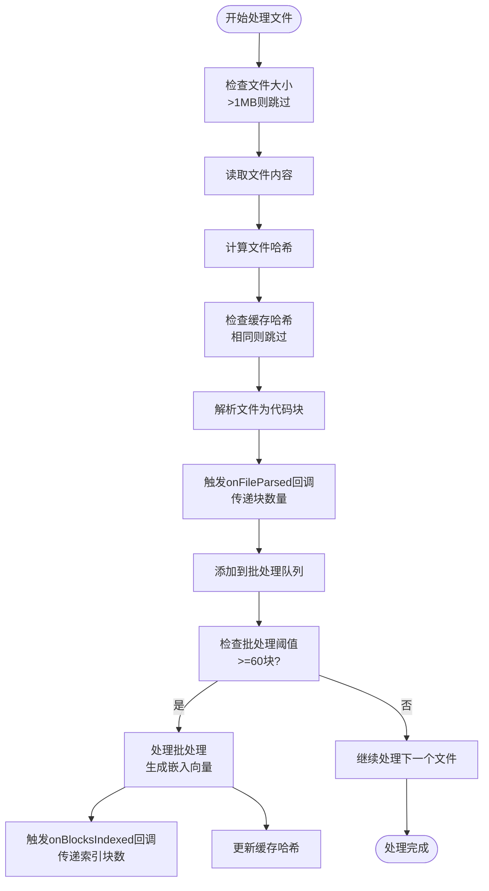
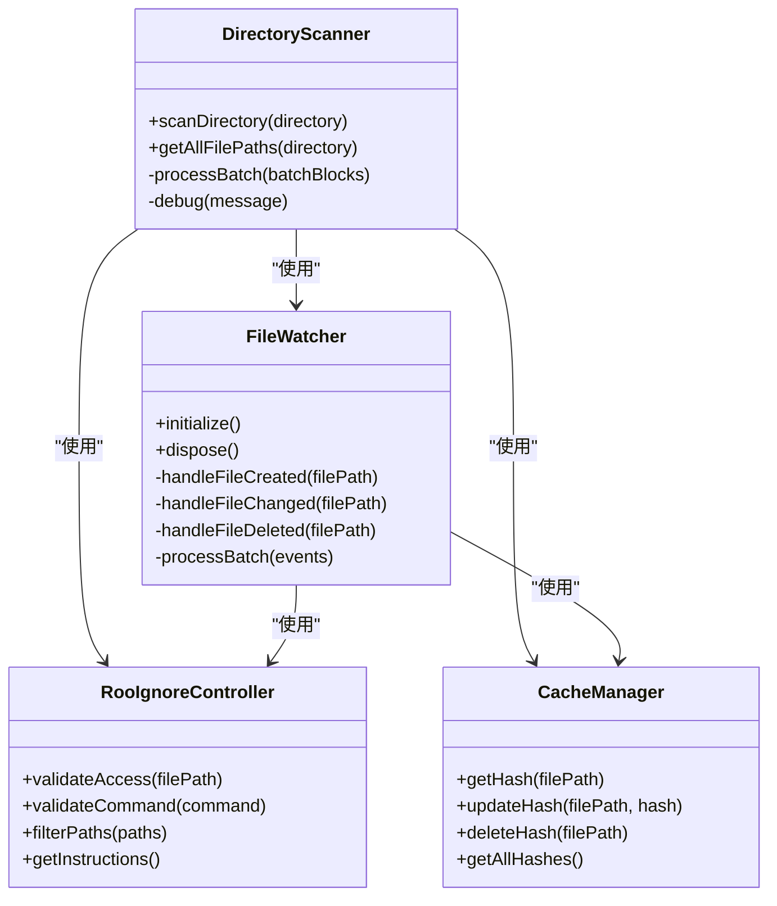

# 文件处理

<cite>
**Referenced Files in This Document**   
- [scanner.ts](file://src/code-index/processors/scanner.ts)
- [RooIgnoreController.ts](file://src/ignore/RooIgnoreController.ts)
- [file-watcher.ts](file://src/code-index/processors/file-watcher.ts)
- [supported-extensions.ts](file://src/code-index/shared/supported-extensions.ts)
- [index.ts](file://src/code-index/constants/index.ts)
</cite>

## 目录
1. [文件处理机制概述](#文件处理机制概述)
2. [目录扫描与文件识别](#目录扫描与文件识别)
3. [文件系统监控与增量索引](#文件系统监控与增量索引)
4. [文件块统计与进度报告](#文件块统计与进度报告)
5. [大文件分割与文件类型过滤](#大文件分割与文件类型过滤)

## 文件处理机制概述

本系统实现了一套完整的文件处理机制，用于索引和管理代码库中的文件。该机制由`DirectoryScanner`和`FileWatcher`两个核心组件构成，分别负责全量扫描和增量更新。系统通过`RooIgnoreController`处理`.gitignore`和`.rooignore`规则，确保被忽略的文件不会被索引。文件处理过程包括文件遍历、内容解析、块分割、嵌入向量生成和向量存储等步骤，所有操作都通过回调函数和事件机制进行进度报告和错误处理。

**Section sources**
- [scanner.ts](file://src/code-index/processors/scanner.ts#L35-L394)
- [file-watcher.ts](file://src/code-index/processors/file-watcher.ts#L32-L549)

## 目录扫描与文件识别

`DirectoryScanner`类负责遍历工作区目录并识别可索引的文件。扫描过程从指定目录开始，递归地获取所有文件路径。系统首先使用`listFiles`工具获取所有路径，然后过滤掉目录条目（以斜杠结尾的路径）。接下来，系统应用多层过滤规则来确定哪些文件需要被处理。

第一层过滤是工作区忽略规则，通过`workspace.shouldIgnore`方法检查每个文件路径是否应被忽略。第二层过滤基于文件扩展名，系统使用`supported-extensions.ts`中定义的支持格式列表来判断文件类型是否受支持。第三层过滤是`.gitignore`和`.rooignore`规则，通过`RooIgnoreController`实例的`ignores`方法检查文件是否被忽略规则排除。

**Diagram sources**
- [scanner.ts](file://src/code-index/processors/scanner.ts#L35-L394)
- [supported-extensions.ts](file://src/code-index/shared/supported-extensions.ts#L4-L4)

**Section sources**
- [scanner.ts](file://src/code-index/processors/scanner.ts#L35-L394)
- [RooIgnoreController.ts](file://src/ignore/RooIgnoreController.ts#L32-L218)

## 文件系统监控与增量索引

`ICodeFileWatcher`接口的实现`FileWatcher`类负责监控文件系统的变化并触发增量索引。该组件通过Node.js的`fs.watch` API监听工作区目录的递归变化，能够检测文件的创建、修改和删除事件。为了提高效率，系统使用防抖机制（debounce）将短时间内发生的多个文件事件合并为一个批次处理，防抖延迟为500毫秒。

当文件系统事件发生时，`FileWatcher`将事件添加到累积队列中，并安排批次处理。对于重命名事件，系统通过同步文件访问检查来区分文件创建/移动和文件删除/移动。文件处理过程与全量扫描类似，但针对单个文件或文件批次进行。系统首先检查文件扩展名是否受支持，然后根据事件类型进行相应处理：创建和修改事件会读取文件内容并解析为代码块，删除事件会从向量存储中移除相应的索引点。

**Diagram sources**
- [file-watcher.ts](file://src/code-index/processors/file-watcher.ts#L32-L549)
- [scanner.ts](file://src/code-index/processors/scanner.ts#L35-L394)

**Section sources**
- [file-watcher.ts](file://src/code-index/processors/file-watcher.ts#L32-L549)

## 文件块统计与进度报告

在扫描过程中，系统对文件块（blocks）进行统计并提供详细的进度报告机制。`scanDirectory`方法的回调函数允许客户端代码监控处理进度。`onFileParsed`回调在每个文件解析完成后触发，参数为该文件生成的代码块数量。`onBlocksIndexed`回调在一批代码块成功索引后触发，参数为已索引的块数量。

系统通过`BatchProcessor`类管理批量处理过程，当累积的代码块数量达到`BATCH_SEGMENT_THRESHOLD`（默认60个）时，系统会启动批量处理。批量处理包括生成嵌入向量、更新缓存和向量存储等操作。系统还统计处理的文件总数、跳过的文件数和总块数，并在扫描结束时返回这些统计信息。对于大文件，系统会跳过处理并增加跳过计数；对于未更改的文件，系统会通过哈希比较跳过处理并增加跳过计数。

**Diagram sources**
- [scanner.ts](file://src/code-index/processors/scanner.ts#L35-L394)
- [index.ts](file://src/code-index/constants/index.ts#L20-L21)

**Section sources**
- [scanner.ts](file://src/code-index/processors/scanner.ts#L35-L394)

## 大文件分割与文件类型过滤

系统实现了大文件分割策略和文件类型过滤逻辑，以优化索引效率和资源使用。对于大文件，系统设置了1MB的大小限制（`MAX_FILE_SIZE_BYTES`），超过此限制的文件会被跳过处理，防止内存溢出和性能下降。文件类型过滤基于`supported-extensions.ts`文件中定义的支持格式列表，该列表从`tree-sitter`解析器支持的扩展名中过滤掉Markdown格式（.md和.markdown）后得到。

文件分割策略由代码解析器（`codeParser`）实现，它将源代码文件分割为逻辑块（如函数、类、方法等），每个块的字符数在100到1000之间。系统还实现了删除文件的处理逻辑，在全量扫描结束后，系统会检查缓存中的文件哈希，对于未在当前扫描中处理的文件（即已被删除或不再支持的文件），系统会从向量存储中删除相应的索引点并清除缓存。

**Diagram sources**
- [scanner.ts](file://src/code-index/processors/scanner.ts#L35-L394)
- [file-watcher.ts](file://src/code-index/processors/file-watcher.ts#L32-L549)
- [RooIgnoreController.ts](file://src/ignore/RooIgnoreController.ts#L32-L218)
- [supported-extensions.ts](file://src/code-index/shared/supported-extensions.ts#L4-L4)

**Section sources**
- [scanner.ts](file://src/code-index/processors/scanner.ts#L35-L394)
- [file-watcher.ts](file://src/code-index/processors/file-watcher.ts#L32-L549)
- [RooIgnoreController.ts](file://src/ignore/RooIgnoreController.ts#L32-L218)
- [supported-extensions.ts](file://src/code-index/shared/supported-extensions.ts#L4-L4)
- [index.ts](file://src/code-index/constants/index.ts#L18-L19)