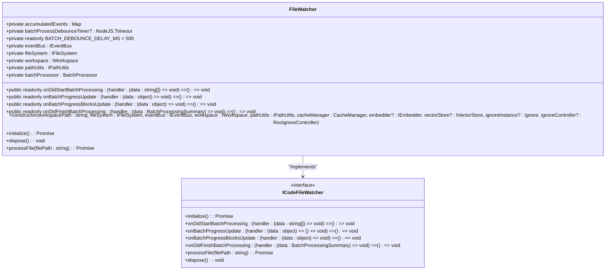
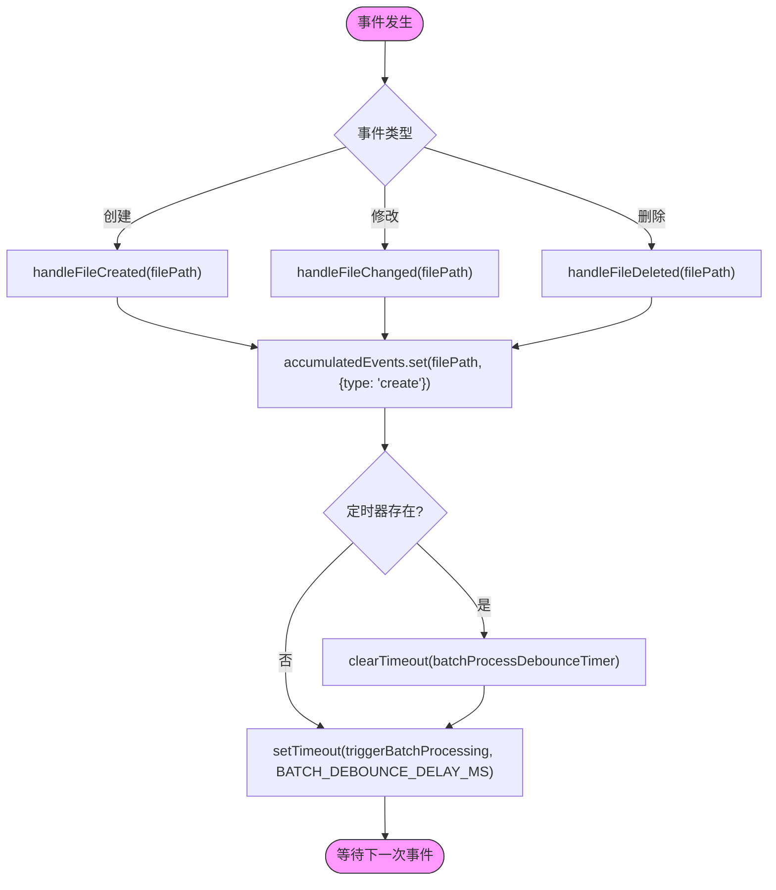
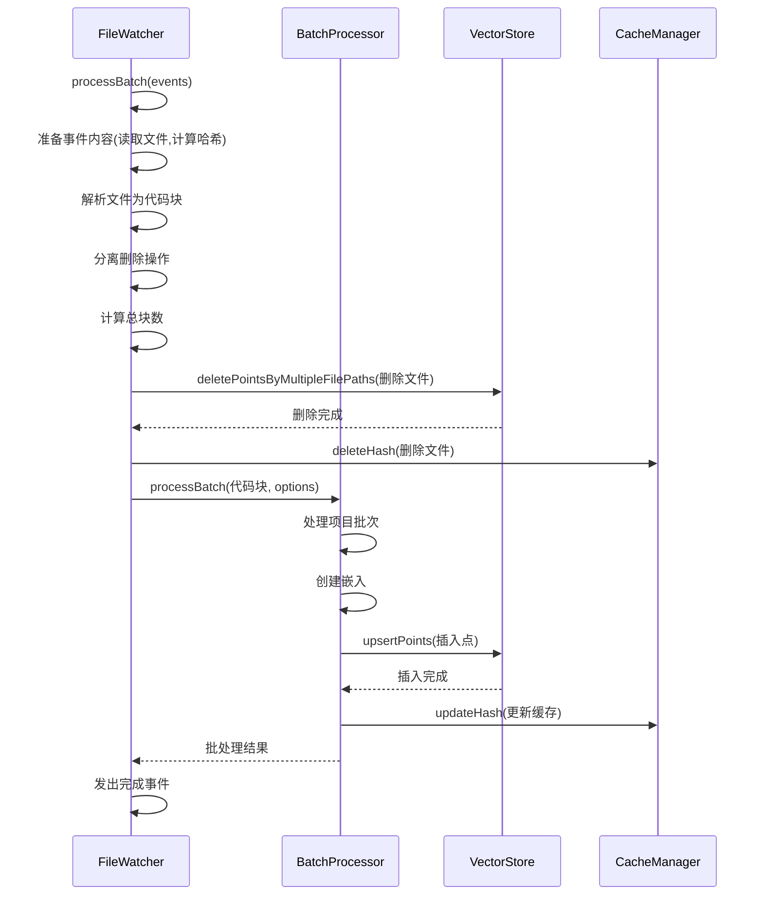
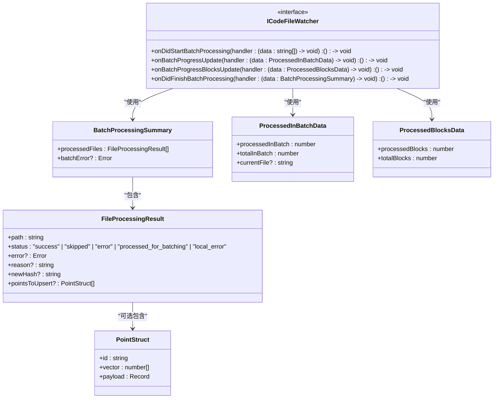
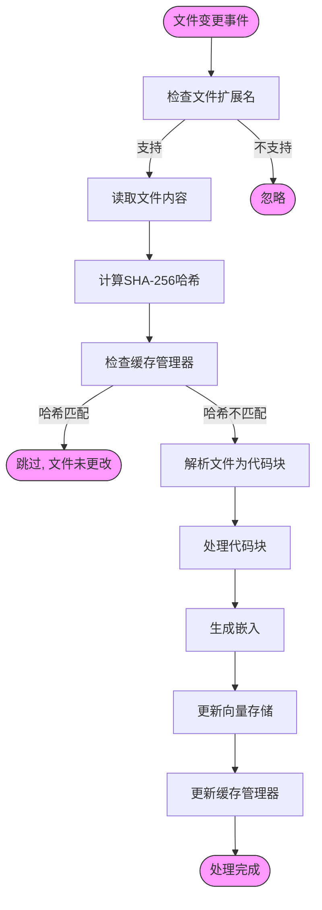
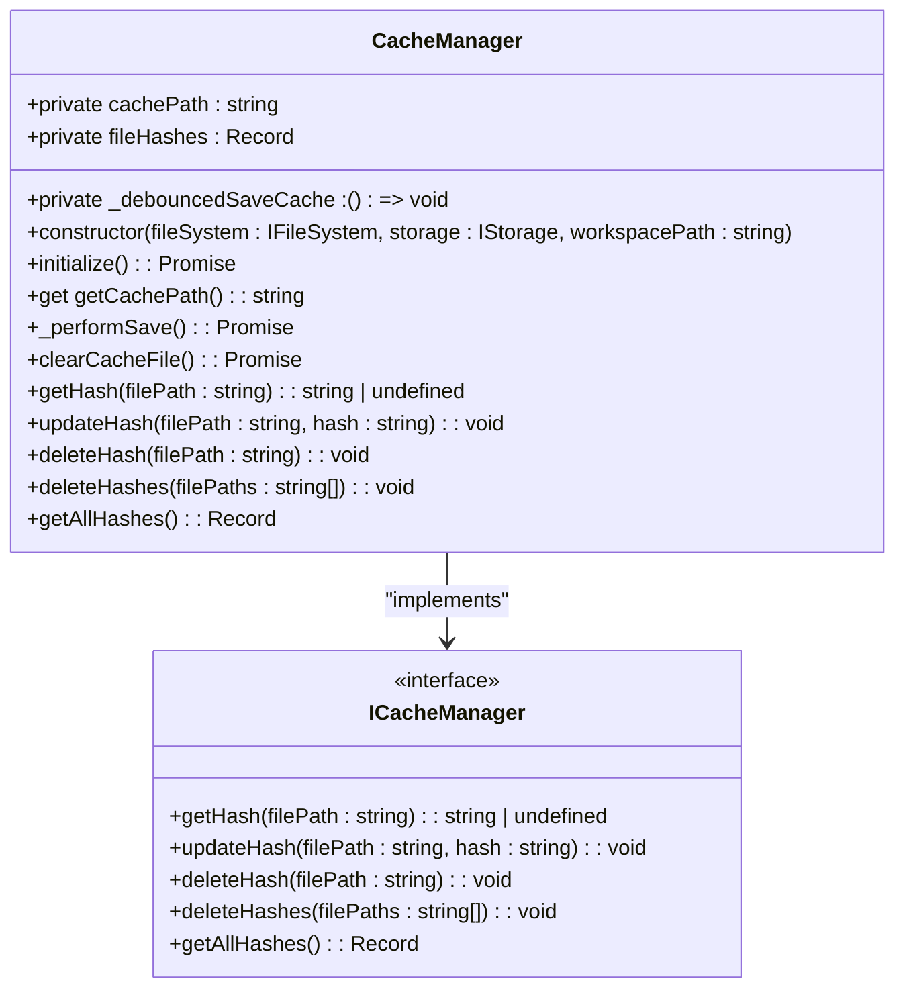

# 文件监控

<cite>
**本文档引用的文件**
- [file-watcher.ts](file://src/code-index/processors/file-watcher.ts)
- [batch-processor.ts](file://src/code-index/processors/batch-processor.ts)
- [file-processor.ts](file://src/code-index/interfaces/file-processor.ts)
- [cache-manager.ts](file://src/code-index/cache-manager.ts)
- [parser.ts](file://src/code-index/processors/parser.ts)
- [vector-store.ts](file://src/code-index/interfaces/vector-store.ts)
- [embedder.ts](file://src/code-index/interfaces/embedder.ts)
- [core.ts](file://src/abstractions/core.ts)
</cite>

## 目录
1. [文件监控系统概述](#文件监控系统概述)
2. [FileWatcher核心机制](#filewatcher核心机制)
3. [事件去重与防抖处理](#事件去重与防抖处理)
4. [批量处理流程](#批量处理流程)
5. [进度通知与状态同步](#进度通知与状态同步)
6. [文件变更处理流程](#文件变更处理流程)
7. [缓存管理与一致性](#缓存管理与一致性)

## 文件监控系统概述

文件监控系统是代码索引服务的核心组件，负责实时监控工作区目录中的文件变更。该系统基于Node.js的`fs.watch` API实现递归监控，能够捕获文件的创建、修改和删除事件。通过事件去重和防抖机制，系统将频繁的文件变更事件合并为批次处理，避免了重复处理和性能瓶颈。系统通过`ICodeFileWatcher`接口定义的事件机制实现进度通知和状态同步，并利用`BatchProcessor`协调嵌入生成和向量存储更新，确保索引的一致性和完整性。

**Section sources**
- [file-watcher.ts](file://src/code-index/processors/file-watcher.ts#L32-L549)
- [file-processor.ts](file://src/code-index/interfaces/file-processor.ts#L58-L104)

## FileWatcher核心机制

`FileWatcher`类实现了`ICodeFileWatcher`接口，利用Node.js的`fs.watch` API对工作区目录进行递归监控。在`initialize`方法中，系统创建文件监视器，设置`recursive: true`选项以监控所有子目录。监视器通过事件回调函数捕获文件变更，支持`rename`和`change`两种事件类型。`rename`事件通过同步文件访问检查来区分文件创建和删除操作，而`change`事件则直接表示文件内容修改。

**Diagram sources**
- [file-watcher.ts](file://src/code-index/processors/file-watcher.ts#L32-L549)
- [file-processor.ts](file://src/code-index/interfaces/file-processor.ts#L58-L104)

**Section sources**
- [file-watcher.ts](file://src/code-index/processors/file-watcher.ts#L32-L160)
- [file-processor.ts](file://src/code-index/interfaces/file-processor.ts#L58-L104)

## 事件去重与防抖处理

文件监控系统通过累积事件映射和防抖定时器实现事件去重与防抖处理。当文件事件发生时，系统将事件信息存储在`accumulatedEvents`映射中，使用文件路径作为键，确保同一文件的多个事件被合并。系统通过`BATCH_DEBOUNCE_DELAY_MS`常量（默认500毫秒）设置防抖延迟，使用`setTimeout`在事件发生后延迟处理。每次新事件到达时，系统会清除之前的定时器并重新设置，确保在事件流停止后才触发批量处理。

**Diagram sources**
- [file-watcher.ts](file://src/code-index/processors/file-watcher.ts#L32-L549)

**Section sources**
- [file-watcher.ts](file://src/code-index/processors/file-watcher.ts#L161-L234)

## 批量处理流程

批量处理流程由`processBatch`方法协调，通过`BatchProcessor`统一处理文件创建、修改和删除事件。系统首先准备事件内容，读取文件并计算SHA-256哈希值。然后解析文件为代码块，分离删除操作。系统计算总块数，包括要插入的块和要删除的文件（每个计为一个块）。处理过程首先执行删除操作，然后使用`BatchProcessor`处理插入操作，确保修改文件的旧版本被正确删除。

**Diagram sources**
- [file-watcher.ts](file://src/code-index/processors/file-watcher.ts#L32-L549)
- [batch-processor.ts](file://src/code-index/processors/batch-processor.ts#L44-L207)
- [vector-store.ts](file://src/code-index/interfaces/vector-store.ts#L9-L63)

**Section sources**
- [file-watcher.ts](file://src/code-index/processors/file-watcher.ts#L235-L401)
- [batch-processor.ts](file://src/code-index/processors/batch-processor.ts#L44-L207)

## 进度通知与状态同步

文件监控系统通过`ICodeFileWatcher`接口定义的事件实现进度通知和状态同步。`onDidStartBatchProcessing`事件在批处理开始时发出，携带批处理中包含的文件路径数组。`onBatchProgressBlocksUpdate`事件提供块级别的进度更新，包含已处理块数和总块数。`onDidFinishBatchProcessing`事件在批处理完成时发出，携带包含处理结果摘要的`BatchProcessingSummary`对象。这些事件通过`eventBus`发布-订阅模式实现，允许UI组件和其他系统组件订阅并响应进度变化。

**Diagram sources**
- [file-processor.ts](file://src/code-index/interfaces/file-processor.ts#L58-L104)
- [file-watcher.ts](file://src/code-index/processors/file-watcher.ts#L32-L549)

**Section sources**
- [file-processor.ts](file://src/code-index/interfaces/file-processor.ts#L58-L104)
- [file-watcher.ts](file://src/code-index/processors/file-watcher.ts#L32-L549)

## 文件变更处理流程

文件变更处理流程从事件捕获开始，经过内容读取、哈希计算、代码块解析，最终与缓存管理器协同工作。系统首先检查文件扩展名是否受支持，然后读取文件内容并计算SHA-256哈希值。通过`codeParser.parseFile`方法将文件解析为代码块，利用Tree-sitter语法解析器提取代码结构。系统与`CacheManager`协同工作，检查文件是否已缓存，避免重复处理。对于新文件或已更改文件，系统生成嵌入并更新向量存储，同时更新缓存以确保索引一致性。

**Diagram sources**
- [file-watcher.ts](file://src/code-index/processors/file-watcher.ts#L32-L549)
- [cache-manager.ts](file://src/code-index/cache-manager.ts#L8-L122)
- [parser.ts](file://src/code-index/processors/parser.ts#L32-L592)

**Section sources**
- [file-watcher.ts](file://src/code-index/processors/file-watcher.ts#L32-L549)
- [cache-manager.ts](file://src/code-index/cache-manager.ts#L8-L122)
- [parser.ts](file://src/code-index/processors/parser.ts#L32-L592)

## 缓存管理与一致性

缓存管理器（`CacheManager`）负责维护文件哈希缓存，确保索引一致性。系统使用JSON文件存储缓存，文件路径基于工作区路径的SHA-256哈希生成。`CacheManager`提供`getHash`、`updateHash`和`deleteHash`方法，支持哈希的读取、更新和删除操作。所有缓存操作都通过防抖机制（1500毫秒延迟）批量保存到磁盘，提高性能。当文件被处理或删除时，系统相应地更新或删除缓存条目，确保缓存状态与向量存储保持同步。

**Diagram sources**
- [cache-manager.ts](file://src/code-index/cache-manager.ts#L8-L122)

**Section sources**
- [cache-manager.ts](file://src/code-index/cache-manager.ts#L8-L122)