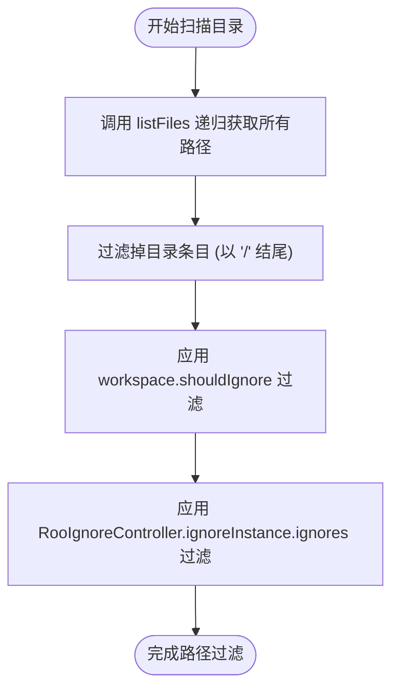
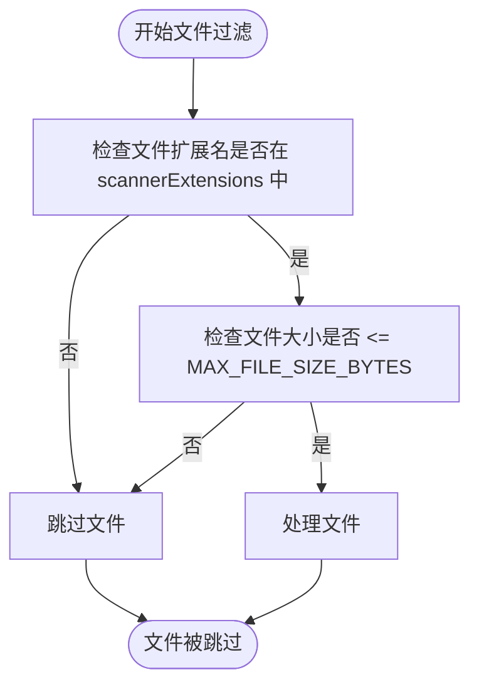
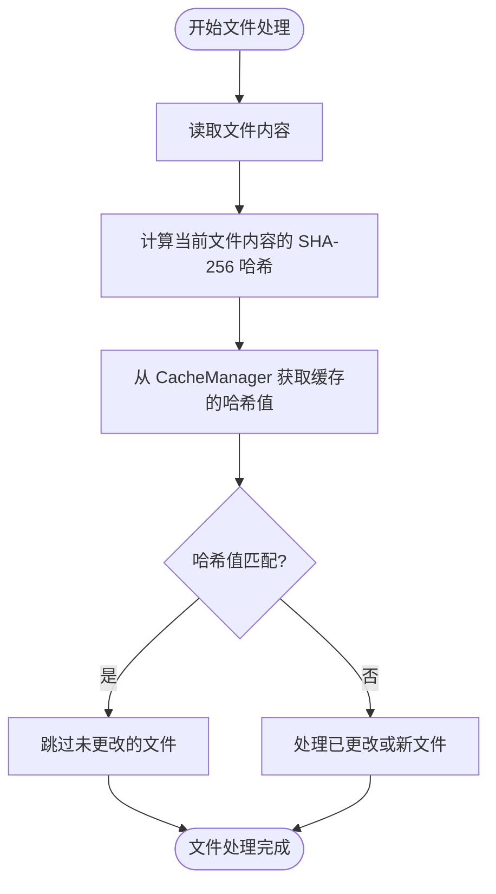
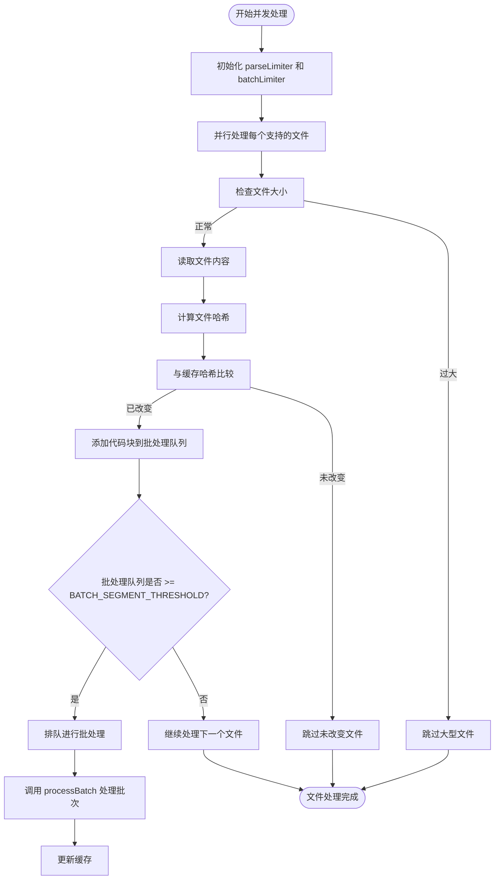
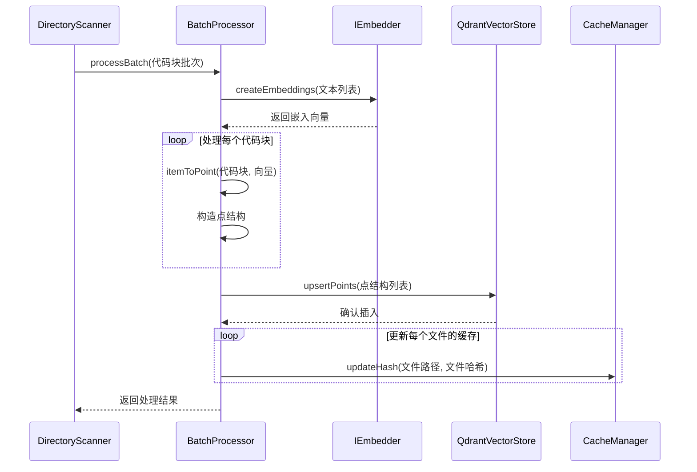
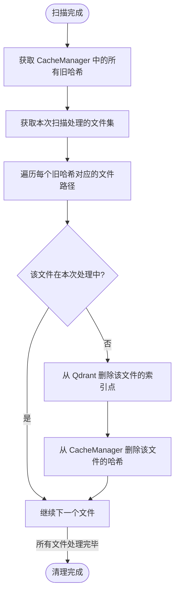

# 目录扫描

<cite>
**本文档引用的文件**   
- [scanner.ts](file://src/code-index/processors/scanner.ts)
- [list-files.ts](file://src/glob/list-files.ts)
- [RooIgnoreController.ts](file://src/ignore/RooIgnoreController.ts)
- [batch-processor.ts](file://src/code-index/processors/batch-processor.ts)
- [qdrant-client.ts](file://src/code-index/vector-store/qdrant-client.ts)
- [cache-manager.ts](file://src/code-index/cache-manager.ts)
- [supported-extensions.ts](file://src/code-index/shared/supported-extensions.ts)
- [index.ts](file://src/code-index/constants/index.ts)
</cite>

## 目录结构
1. [目录扫描机制](#目录扫描机制)
2. [文件遍历与路径过滤](#文件遍历与路径过滤)
3. [文件类型与大小过滤](#文件类型与大小过滤)
4. [缓存与哈希比对](#缓存与哈希比对)
5. [并发控制与批处理](#并发控制与批处理)
6. [向量数据库索引](#向量数据库索引)
7. [文件删除处理](#文件删除处理)

## 目录扫描机制

`DirectoryScanner` 类负责递归扫描工作区目录，识别可索引文件，并通过一系列过滤规则和优化策略处理文件。该机制通过 `scanDirectory` 方法实现核心功能，结合 `RooIgnoreController` 和 `.gitignore` 规则进行路径过滤，并利用并发控制和批处理技术优化性能。

**Section sources**
- [scanner.ts](file://src/code-index/processors/scanner.ts#L35-L394)

## 文件遍历与路径过滤

`DirectoryScanner` 使用 `listFiles` 函数递归遍历指定目录。该函数通过 `ripgrep` 工具高效地列出所有文件路径，并自动处理 `.gitignore` 文件中的忽略规则。遍历结果首先过滤掉目录条目（以 `/` 结尾的路径），然后通过 `workspace.shouldIgnore` 方法应用工作区级别的忽略规则。

`RooIgnoreController` 负责管理 `.rooignore` 文件中的自定义忽略模式。它使用 `ignore` 库支持标准的 `.gitignore` 语法，并通过文件监视器实时响应 `.rooignore` 文件的更改。当扫描文件时，`validateAccess` 方法会检查文件路径是否被 `.rooignore` 或 `.gitignore` 规则忽略。

**Diagram sources **
- [list-files.ts](file://src/glob/list-files.ts#L43-L70)
- [RooIgnoreController.ts](file://src/ignore/RooIgnoreController.ts#L11-L217)
- [scanner.ts](file://src/code-index/processors/scanner.ts#L57-L88)

**Section sources**
- [scanner.ts](file://src/code-index/processors/scanner.ts#L57-L88)
- [list-files.ts](file://src/glob/list-files.ts#L43-L70)
- [RooIgnoreController.ts](file://src/ignore/RooIgnoreController.ts#L11-L217)

## 文件类型与大小过滤

在路径过滤后，`DirectoryScanner` 会根据文件扩展名和大小进行进一步筛选。文件扩展名列表来自 `shared/supported-extensions.ts`，其中排除了 `.md` 和 `.markdown` 文件。`scannerExtensions` 常量定义了支持的文件格式列表。

文件大小限制由 `MAX_FILE_SIZE_BYTES` 常量定义，当前设置为 1MB。扫描过程中，系统会调用 `fileSystem.stat` 获取文件大小，并跳过超过此限制的文件。此过滤步骤确保了大文件不会被加载到内存中，从而避免性能问题。

**Diagram sources **
- [supported-extensions.ts](file://src/code-index/shared/supported-extensions.ts#L3-L3)
- [index.ts](file://src/code-index/constants/index.ts#L12-L12)
- [scanner.ts](file://src/code-index/processors/scanner.ts#L104-L105)

**Section sources**
- [scanner.ts](file://src/code-index/processors/scanner.ts#L104-L105)
- [supported-extensions.ts](file://src/code-index/shared/supported-extensions.ts#L3-L3)
- [index.ts](file://src/code-index/constants/index.ts#L12-L12)

## 缓存与哈希比对

为了优化性能，`DirectoryScanner` 实现了基于 SHA-256 哈希的缓存机制。系统使用 `CacheManager` 类来管理文件哈希缓存，该缓存存储在工作区根目录下的 JSON 文件中。

扫描过程中，系统会为每个文件计算当前内容的哈希值，并与 `CacheManager` 中存储的哈希值进行比较。如果哈希值匹配，说明文件未发生变化，系统会跳过该文件的解析和索引过程。只有当文件是新文件或内容已更改时，才会进行后续处理。这种机制显著减少了重复工作，提高了扫描效率。

**Diagram sources **
- [cache-manager.ts](file://src/code-index/cache-manager.ts#L8-L122)
- [scanner.ts](file://src/code-index/processors/scanner.ts#L121-L142)

**Section sources**
- [scanner.ts](file://src/code-index/processors/scanner.ts#L121-L142)
- [cache-manager.ts](file://src/code-index/cache-manager.ts#L8-L122)

## 并发控制与批处理

`DirectoryScanner` 使用 `p-limit` 库实现并发控制，以优化性能并防止资源耗尽。系统定义了两个并发限制：`PARSING_CONCURRENCY`（文件解析并发数）和 `BATCH_PROCESSING_CONCURRENCY`（批处理并发数），两者均设置为 10。

文件处理过程采用批处理策略。系统使用 `BatchProcessor` 类将代码块分批处理，每批达到 `BATCH_SEGMENT_THRESHOLD`（60个代码块）时触发批处理。批处理过程中，系统会收集文件信息（路径、哈希、是否为新文件），并在批处理完成后统一更新缓存。这种批处理机制减少了对向量数据库的频繁写入操作，提高了整体效率。

**Diagram sources **
- [scanner.ts](file://src/code-index/processors/scanner.ts#L142-L248)
- [batch-processor.ts](file://src/code-index/processors/batch-processor.ts#L44-L207)

**Section sources**
- [scanner.ts](file://src/code-index/processors/scanner.ts#L142-L248)
- [batch-processor.ts](file://src/code-index/processors/batch-processor.ts#L44-L207)

## 向量数据库索引

`processBatch` 方法负责将代码块转换为 Qdrant 向量数据库的点结构。该方法使用 `BatchProcessor` 类执行实际的批处理操作。每个代码块首先通过嵌入模型（embedder）转换为向量，然后构造成包含向量和有效载荷（payload）的点结构。

点结构的 ID 使用 `uuidv5` 基于文件路径和起始行号生成，确保唯一性。有效载荷包含文件路径、代码片段、起始和结束行号、代码块类型等元数据。处理完成后，系统会将点结构批量插入 Qdrant 数据库，并更新缓存中的文件哈希值。该过程包含重试机制，在失败时最多重试 `MAX_BATCH_RETRIES`（3次）。

**Diagram sources **
- [scanner.ts](file://src/code-index/processors/scanner.ts#L292-L345)
- [batch-processor.ts](file://src/code-index/processors/batch-processor.ts#L44-L207)
- [qdrant-client.ts](file://src/code-index/vector-store/qdrant-client.ts#L12-L339)

**Section sources**
- [scanner.ts](file://src/code-index/processors/scanner.ts#L292-L345)
- [batch-processor.ts](file://src/code-index/processors/batch-processor.ts#L44-L207)
- [qdrant-client.ts](file://src/code-index/vector-store/qdrant-client.ts#L12-L339)

## 文件删除处理

`DirectoryScanner` 会处理文件删除或不再支持的情况。在扫描完成后，系统会获取 `CacheManager` 中存储的所有旧文件哈希，并与本次扫描中处理的文件集进行比较。任何存在于旧缓存中但未在本次扫描中出现的文件，都会被视为已删除或不再支持。

对于这些文件，系统会调用 `QdrantVectorStore.deletePointsByFilePath` 方法从向量数据库中删除对应的索引点，并从缓存中移除其哈希记录。此清理过程确保了索引的准确性和一致性，防止了陈旧数据的存在。

**Diagram sources **
- [scanner.ts](file://src/code-index/processors/scanner.ts#L347-L385)
- [qdrant-client.ts](file://src/code-index/vector-store/qdrant-client.ts#L12-L339)
- [cache-manager.ts](file://src/code-index/cache-manager.ts#L8-L122)

**Section sources**
- [scanner.ts](file://src/code-index/processors/scanner.ts#L347-L385)
- [qdrant-client.ts](file://src/code-index/vector-store/qdrant-client.ts#L12-L339)
- [cache-manager.ts](file://src/code-index/cache-manager.ts#L8-L122)