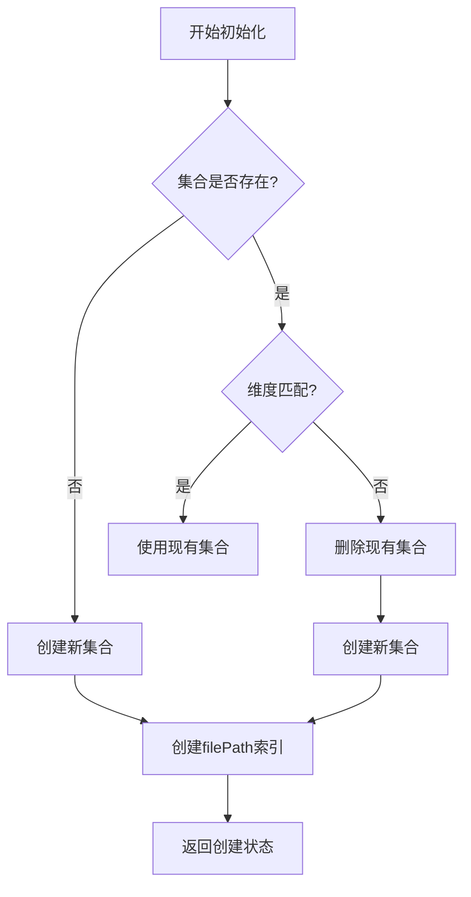
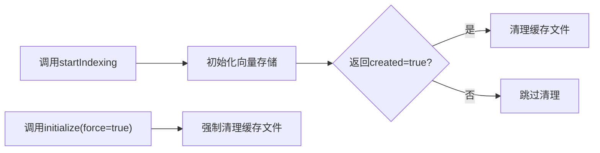
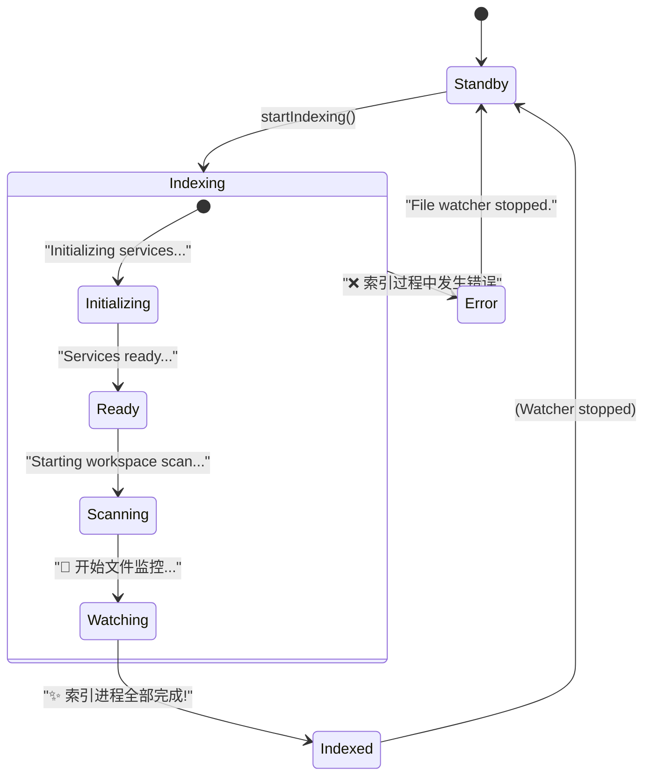

# 初始化流程

<cite>
**本文档中引用的文件**  
- [manager.ts](file://src/code-index/manager.ts)
- [orchestrator.ts](file://src/code-index/orchestrator.ts)
- [qdrant-client.ts](file://src/code-index/vector-store/qdrant-client.ts)
- [cache-manager.ts](file://src/code-index/cache-manager.ts)
- [state-manager.ts](file://src/code-index/state-manager.ts)
</cite>

## 目录
1. [简介](#简介)
2. [核心组件](#核心组件)
3. [向量存储初始化](#向量存储初始化)
4. [缓存清理机制](#缓存清理机制)
5. [服务准备与状态管理](#服务准备与状态管理)
6. [配置加载与依赖关系](#配置加载与依赖关系)
7. [错误处理与资源清理](#错误处理与资源清理)

## 简介
本文档详细阐述了索引系统的初始化流程，重点分析 `startIndexing` 方法的执行过程。该流程涉及向量存储初始化、缓存清理、服务准备等多个阶段，确保代码索引系统能够正确启动并维护数据一致性。通过结合 `CodeIndexManager.initialize()` 方法，说明了配置加载与服务初始化之间的依赖关系，并描述了在初始化失败时的错误处理和资源清理机制。

## 核心组件

`startIndexing` 方法是索引系统启动的核心入口，其执行依赖于多个关键组件的协同工作。`CodeIndexManager` 作为主控制器，负责协调 `CodeIndexOrchestrator`、`QdrantVectorStore`、`CacheManager` 和 `CodeIndexStateManager` 等组件。`CodeIndexOrchestrator` 管理整个索引工作流，包括服务初始化、工作区扫描和文件监控。`QdrantVectorStore` 负责与 Qdrant 向量数据库交互，处理集合的创建、验证和数据操作。`CacheManager` 管理本地文件哈希缓存，用于增量索引。`CodeIndexStateManager` 则负责维护和报告系统的当前状态。

**Section sources**
- [manager.ts](file://src/code-index/manager.ts#L23-L351)
- [orchestrator.ts](file://src/code-index/orchestrator.ts#L15-L24)

## 向量存储初始化

`vectorStore.initialize()` 方法是向量存储初始化的核心，负责创建或验证 Qdrant 集合。该方法首先尝试获取集合信息，如果集合不存在（`getCollectionInfo()` 返回 `null`），则会创建一个新集合，其名称基于工作区路径的哈希值生成，并使用预设的向量维度和余弦距离度量。

如果集合已存在，该方法会检查现有集合的向量维度是否与当前配置的 `vectorSize` 匹配。如果维度不匹配，系统会记录警告，删除现有集合，并重新创建一个具有正确维度的新集合。这种自动重建机制确保了向量存储的结构始终与当前嵌入模型的配置保持一致，避免了因模型变更导致的兼容性问题。

**Diagram sources**
- [qdrant-client.ts](file://src/code-index/vector-store/qdrant-client.ts#L12-L339)

**Section sources**
- [qdrant-client.ts](file://src/code-index/vector-store/qdrant-client.ts#L12-L339)

## 缓存清理机制

`cacheManager.clearCacheFile()` 方法在特定时机被调用以清理本地缓存文件。该方法的主要调用时机有两个：

1.  **首次索引或集合重建时**：当 `vectorStore.initialize()` 方法返回 `true`（表示创建了一个新集合）时，`CodeIndexOrchestrator` 会立即调用 `cacheManager.clearCacheFile()`。这是因为向量存储中的所有数据已被清除或重建，本地的文件哈希缓存已失效，必须同步清理以确保后续的扫描能够重新处理所有文件，从而保证数据一致性。
2.  **强制清除时**：当 `CodeIndexManager.initialize()` 方法被调用并传入 `{ force: true }` 选项时，系统会执行强制清除操作。在此模式下，无论集合是否重建，都会显式调用 `clearCacheFile()` 来清除缓存，确保索引从一个完全干净的状态开始。

**Diagram sources**
- [orchestrator.ts](file://src/code-index/orchestrator.ts#L107-L211)
- [cache-manager.ts](file://src/code-index/cache-manager.ts#L8-L122)

**Section sources**
- [orchestrator.ts](file://src/code-index/orchestrator.ts#L107-L211)
- [cache-manager.ts](file://src/code-index/cache-manager.ts#L8-L122)

## 服务准备与状态管理

`CodeIndexOrchestrator` 通过 `CodeIndexStateManager` 管理系统状态的转换。在 `startIndexing` 方法执行期间，状态转换流程如下：

1.  **`Initializing services...`**: 方法开始执行后，状态管理器立即将系统状态设置为 `"Indexing"`，并附带消息 `"Initializing services..."`，表示初始化流程已启动。
2.  **`Services ready...`**: 在成功完成向量存储初始化和（如果需要）缓存清理后，状态管理器会更新消息为 `"Services ready. Starting workspace scan..."`，表示核心服务已准备就绪，即将开始扫描工作区。
3.  **`Indexed`**: 当工作区扫描和文件监控启动完成后，状态管理器会将最终状态设置为 `"Indexed"`，并附带一条描述索引结果的详细消息（例如，处理了多少个新文件）。

这种状态转换机制为用户和外部系统提供了清晰的进度反馈。

**Diagram sources**
- [orchestrator.ts](file://src/code-index/orchestrator.ts#L107-L211)
- [state-manager.ts](file://src/code-index/state-manager.ts#L4-L120)

**Section sources**
- [orchestrator.ts](file://src/code-index/orchestrator.ts#L107-L211)
- [state-manager.ts](file://src/code-index/state-manager.ts#L4-L120)

## 配置加载与依赖关系

`CodeIndexManager.initialize()` 方法定义了配置加载与服务初始化的依赖关系。其执行流程如下：

1.  **配置加载**：首先初始化 `CodeIndexConfigManager` 并加载配置。这是所有后续操作的前提，因为配置决定了功能是否启用以及向量维度等关键参数。
2.  **功能检查**：根据加载的配置，检查索引功能是否启用。如果未启用，则直接返回。
3.  **缓存初始化**：初始化 `CacheManager`，为后续的文件变更检测做准备。
4.  **服务重建决策**：根据配置是否要求重启或服务工厂是否已存在，决定是否需要重建核心服务（如 `vectorStore` 和 `scanner`）。
5.  **服务创建与初始化**：如果需要重建，则创建 `CodeIndexServiceFactory`，并用它来创建和初始化 `vectorStore`、`scanner` 等共享服务实例，然后用这些实例初始化 `CodeIndexOrchestrator` 和 `CodeIndexSearchService`。
6.  **启动索引**：最后，根据决策结果，调用 `startIndexing()` 方法启动索引流程。

这表明，配置加载是整个初始化流程的起点和决策依据，而服务的创建和初始化是配置加载后的结果。

**Section sources**
- [manager.ts](file://src/code-index/manager.ts#L23-L351)

## 错误处理与资源清理

在 `startIndexing` 方法的执行过程中，如果发生错误，系统会进入 `catch` 块进行错误处理和资源清理：

1.  **向量存储清理**：尝试调用 `vectorStore.clearCollection()` 清除集合中的所有点，以避免留下不完整或损坏的数据。
2.  **缓存清理**：调用 `cacheManager.clearCacheFile()` 清理本地缓存文件，确保系统状态的一致性。
3.  **状态更新**：将系统状态设置为 `"Error"`，并附带错误信息。
4.  **停止监控**：调用 `stopWatcher()` 停止文件监控服务，防止在错误状态下继续处理文件变更。

这些清理操作确保了系统在初始化失败后能够恢复到一个相对干净和稳定的状态，为下一次重试做好准备。

**Section sources**
- [orchestrator.ts](file://src/code-index/orchestrator.ts#L107-L211)