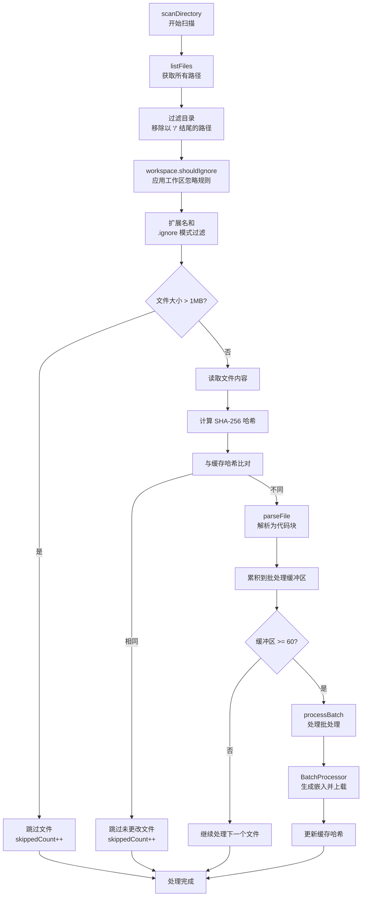

# 扫描协调

<cite>
**本文档中引用的文件**  
- [scanner.ts](file://src/code-index/processors/scanner.ts)
- [list-files.ts](file://src/glob/list-files.ts)
- [RooIgnoreController.ts](file://src/ignore/RooIgnoreController.ts)
- [batch-processor.ts](file://src/code-index/processors/batch-processor.ts)
- [orchestrator.ts](file://src/code-index/orchestrator.ts)
- [supported-extensions.ts](file://src/code-index/shared/supported-extensions.ts)
- [index.ts](file://src/code-index/constants/index.ts)
</cite>

## 目录

1. [文件过滤流程](#文件过滤流程)  
2. [大文件跳过与缓存比对机制](#大文件跳过与缓存比对机制)  
3. [代码块解析与批处理](#代码块解析与批处理)  
4. [扫描进度报告机制](#扫描进度报告机制)  
5. [依赖关系图](#依赖关系图)

## 文件过滤流程

`DirectoryScanner.scanDirectory` 方法通过多阶段过滤机制确定需要处理的文件。首先调用 `listFiles` 函数从工作区递归获取所有路径，该函数利用 `ripgrep` 工具并自动处理 `.gitignore` 规则。获取的路径列表包含文件和目录，目录路径以斜杠结尾。

接下来，系统过滤掉所有目录路径，仅保留文件路径。随后，应用工作区级别的忽略规则：对每个文件路径调用 `workspace.shouldIgnore` 方法进行检查。该方法依赖于 `RooIgnoreController` 实例，其内部使用 `ignore` 库解析项目根目录下的 `.rooignore` 文件，并根据其中定义的模式判断是否应忽略该路径。

最后，执行基于文件扩展名和 `.gitignore` 模式的最终过滤。系统检查文件扩展名是否在 `scannerExtensions` 列表中（该列表包含所有受支持的编程语言扩展名，但排除了 `.md` 和 `.markdown`）。同时，使用 `deps.ignoreInstance.ignores(relativeFilePath)` 方法检查路径是否匹配任何 `.gitignore` 模式。只有同时满足扩展名支持且不被任何忽略模式匹配的文件才会被纳入后续处理流程。

**Section sources**  
- [scanner.ts](file://src/code-index/processors/scanner.ts#L57-L281)
- [list-files.ts](file://src/glob/list-files.ts#L43-L70)
- [RooIgnoreController.ts](file://src/ignore/RooIgnoreController.ts#L107-L129)

## 大文件跳过与缓存比对机制

为了优化性能并防止内存溢出，系统实现了大文件跳过机制。在处理每个文件前，`scanDirectory` 方法会调用 `fileSystem.stat` 获取文件元数据，并检查其大小是否超过 `MAX_FILE_SIZE_BYTES`（默认为 1MB）。如果文件过大，则直接跳过该文件，并将跳过计数器加一。

对于大小合适的文件，系统采用基于 SHA-256 哈希的缓存比对逻辑来避免重复处理未更改的文件。首先，读取文件内容并计算其当前哈希值。然后，从 `CacheManager` 中查询该文件路径对应的缓存哈希值。如果两者完全一致，则认为文件自上次索引以来未发生变更，因此跳过解析和嵌入步骤，直接计入跳过统计。

此机制确保了只有新文件或内容已修改的文件才会被重新解析和索引，极大地提升了增量扫描的效率。哈希值的更新仅在文件未被批处理时直接进行；若文件参与批处理，则由 `BatchProcessor` 在成功处理后统一更新缓存。

**Section sources**  
- [scanner.ts](file://src/code-index/processors/scanner.ts#L57-L281)
- [index.ts](file://src/code-index/constants/index.ts#L12-L12)

## 代码块解析与批处理

当文件通过所有过滤和检查后，系统调用注入的 `codeParser.parseFile` 方法对其进行解析，生成一个 `CodeBlock` 对象数组。每个代码块代表文件中的一个逻辑单元（如函数、类等），包含其内容、位置信息和元数据。

解析完成后，若配置了嵌入器（`embedder`）和向量存储（`qdrantClient`），系统会将这些代码块加入批处理队列。批处理过程由 `processBatch` 方法驱动，该方法利用 `BatchProcessor` 类实现。代码块被累积在共享的批处理缓冲区中，当数量达到 `BATCH_SEGMENT_THRESHOLD`（默认为60）时，会触发一次批处理操作。

`processBatch` 方法构建一个包含策略函数和回调的选项对象，用于指导 `BatchProcessor` 的工作。关键策略包括 `itemToText`（提取代码块内容用于生成嵌入）、`itemToPoint`（将代码块和嵌入向量转换为向量数据库的点结构）以及 `getFileHash`（获取文件哈希以更新缓存）。`BatchProcessor` 负责管理重试逻辑、错误处理，并最终将生成的嵌入向量上载到向量数据库中。

**Section sources**  
- [scanner.ts](file://src/code-index/processors/scanner.ts#L57-L281)
- [batch-processor.ts](file://src/code-index/processors/batch-processor.ts#L46-L79)
- [scanner.ts](file://src/code-index/processors/scanner.ts#L283-L358)

## 扫描进度报告机制

扫描进度通过 `startIndexing` 方法中的回调函数进行报告。`CodeIndexOrchestrator.startIndexing` 在启动索引过程时，会创建两个闭包函数：`handleFileParsed` 和 `handleBlocksIndexed`，并将它们作为回调传递给 `scanDirectory`。

`handleFileParsed` 回调在每次成功解析一个文件时被调用，其参数为该文件生成的代码块数量。该回调将此数量累加到 `cumulativeBlocksFoundSoFar` 计数器中，并调用 `stateManager.reportBlockIndexingProgress` 报告当前已发现的总代码块数。

`handleBlocksIndexed` 回调在每次完成一个批处理操作时被调用，其参数为该批次中成功索引的代码块数量。该回调将此数量累加到 `cumulativeBlocksIndexed` 计数器中，并同样调用 `reportBlockIndexingProgress` 报告当前已索引的总代码块数。

`stateManager` 利用这两个计数器，能够向用户界面提供精确的进度信息，例如“已索引 150/300 个代码块”，从而清晰地展示扫描和索引的实时进展。

**Section sources**  
- [orchestrator.ts](file://src/code-index/orchestrator.ts#L107-L211)
- [scanner.ts](file://src/code-index/processors/scanner.ts#L57-L281)

## 依赖关系图

**Diagram sources**  
- [scanner.ts](file://src/code-index/processors/scanner.ts#L57-L281)
- [list-files.ts](file://src/glob/list-files.ts#L43-L70)
- [batch-processor.ts](file://src/code-index/processors/batch-processor.ts#L46-L79)

**Section sources**  
- [scanner.ts](file://src/code-index/processors/scanner.ts#L57-L281)
- [list-files.ts](file://src/glob/list-files.ts#L43-L70)
- [batch-processor.ts](file://src/code-index/processors/batch-processor.ts#L46-L79)