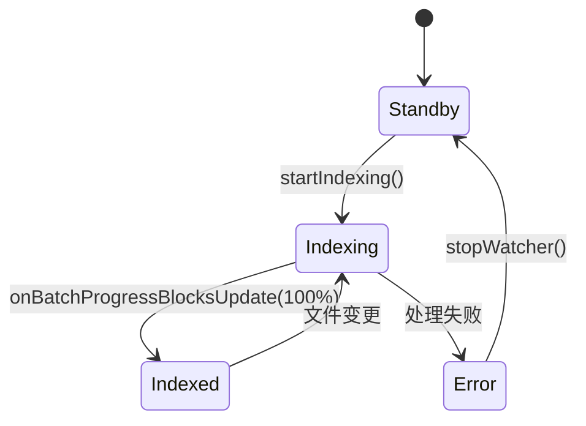
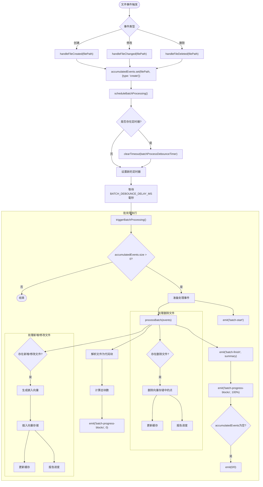
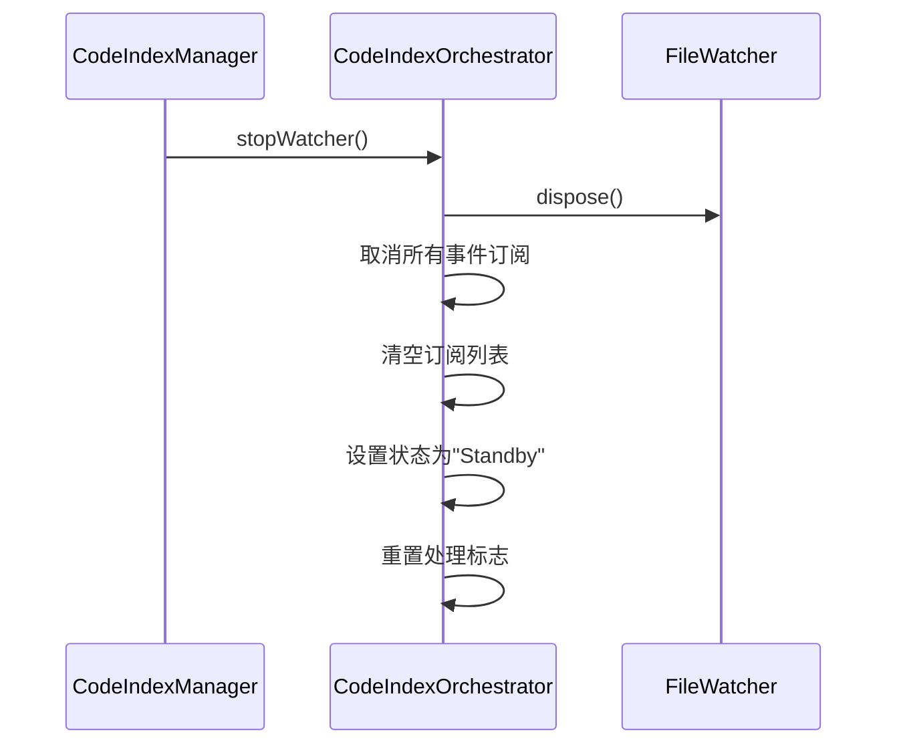
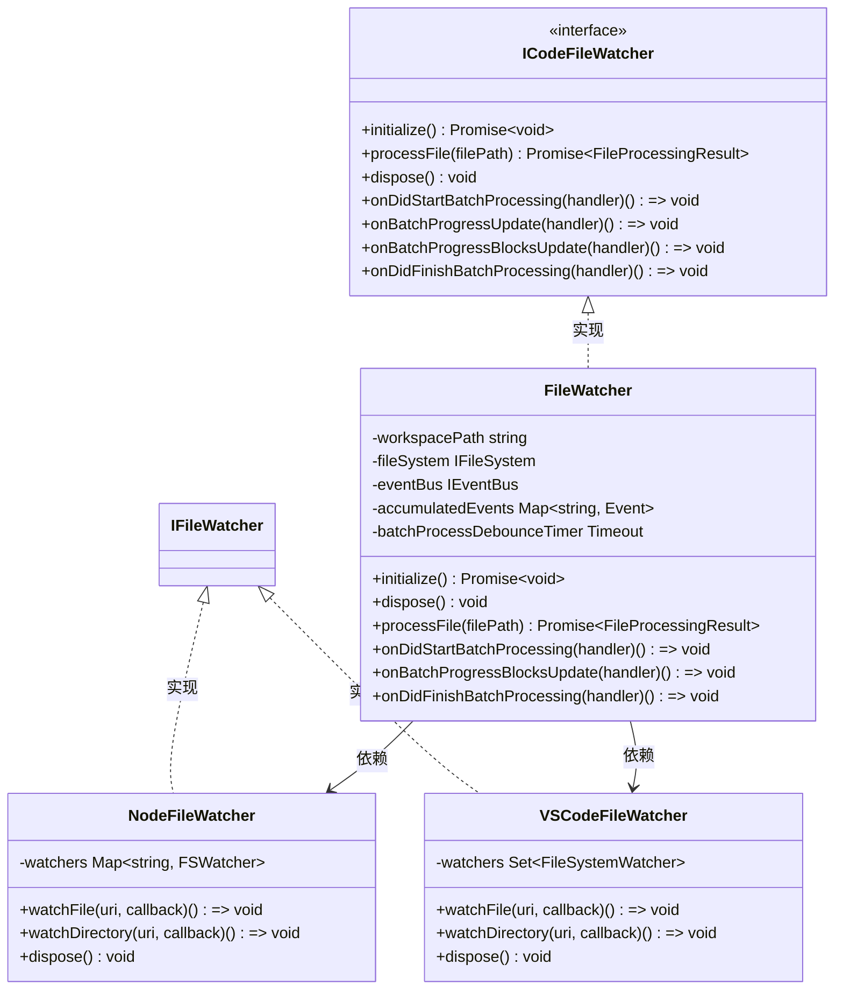

# 监控管理

<cite>
**本文档中引用的文件**  
- [orchestrator.ts](file://src/code-index/orchestrator.ts)
- [file-watcher.ts](file://src/code-index/processors/file-watcher.ts)
- [file-processor.ts](file://src/code-index/interfaces/file-processor.ts)
- [state-manager.ts](file://src/code-index/state-manager.ts)
- [nodejs/file-watcher.ts](file://src/adapters/nodejs/file-watcher.ts)
- [vscode/file-watcher.ts](file://src/adapters/vscode/file-watcher.ts)
</cite>

## 目录
1. [简介](#简介)
2. [核心监控流程](#核心监控流程)
3. [状态管理机制](#状态管理机制)
4. [事件处理逻辑](#事件处理逻辑)
5. [资源清理与停止](#资源清理与停止)
6. [跨平台适配器设计](#跨平台适配器设计)
7. [增量索引处理流程](#增量索引处理流程)

## 简介
本文档详细阐述了文件监控管理系统的核心机制，重点分析了监控器的初始化、事件处理、状态转换和资源管理。系统通过统一的接口设计实现了Node.js和VSCode环境下的跨平台文件监控能力，支持对文件创建、修改和删除事件的实时响应与增量索引更新。

## 核心监控流程

`_startWatcher`方法是文件监控系统的核心初始化入口，负责启动文件监视器并订阅批处理事件。该方法首先检查配置状态，确保服务已正确配置后，将系统状态设置为"Indexing"（索引中），并调用文件监视器的`initialize()`方法进行初始化。

在初始化成功后，系统会建立三个关键的事件订阅：
- `onDidStartBatchProcessing`：批处理开始事件
- `onBatchProgressBlocksUpdate`：块级进度更新事件
- `onDidFinishBatchProcessing`：批处理完成事件

这些事件订阅形成了完整的监控闭环，确保系统能够实时响应文件变化并更新索引状态。

**Section sources**
- [orchestrator.ts](file://src/code-index/orchestrator.ts#L48-L98)

## 状态管理机制

### 状态转换逻辑

`onBatchProgressBlocksUpdate`事件处理器负责根据处理进度更新状态管理器的状态。当接收到进度更新时，系统会执行以下逻辑：

1. 如果总块数大于0且当前状态不是"Indexing"，则将状态设置为"Indexing"，并更新状态消息为"Processing file changes..."（处理文件变更中...）
2. 调用`reportBlockIndexingProgress`方法报告当前块级索引进度
3. 当处理完成的块数等于总块数时，进行状态转换：
   - 如果总块数大于0，表示有实际内容处理完成，状态转换为"Indexed"（已索引），消息为"File changes processed. Index up-to-date."（文件变更已处理，索引已更新）
   - 如果总块数为0且当前状态为"Indexing"，状态转换为"Indexed"，消息为"Index up-to-date. File queue empty."（索引已更新，文件队列为空）

这种状态转换机制确保了系统状态的准确性和及时性，为用户提供清晰的索引进度反馈。

**Diagram sources**
- [orchestrator.ts](file://src/code-index/orchestrator.ts#L48-L98)
- [state-manager.ts](file://src/code-index/state-manager.ts#L1-L121)

**Section sources**
- [orchestrator.ts](file://src/code-index/orchestrator.ts#L48-L98)
- [state-manager.ts](file://src/code-index/state-manager.ts#L1-L121)

## 事件处理逻辑

### 批处理完成事件

`onDidFinishBatchProcessing`事件处理器在批处理完成后执行统计逻辑，分析处理成功和失败的文件数量：

1. 如果批处理存在错误（`summary.batchError`），记录错误日志
2. 如果批处理成功，统计处理结果：
   - 成功文件数：状态为"success"的文件数量
   - 错误文件数：状态为"error"或"local_error"的文件数量

该统计逻辑为系统提供了详细的处理结果分析能力，有助于监控系统健康状况和诊断问题。

### 增量索引处理

文件监视器在检测到文件变化时，会根据事件类型执行相应的增量索引处理：

**Diagram sources**
- [file-watcher.ts](file://src/code-index/processors/file-watcher.ts#L32-L549)

**Section sources**
- [file-watcher.ts](file://src/code-index/processors/file-watcher.ts#L32-L549)
- [orchestrator.ts](file://src/code-index/orchestrator.ts#L48-L98)

## 资源清理与停止

### 停止监控器

`stopWatcher`方法负责正确释放资源并清理事件订阅，确保系统能够优雅地停止监控服务：

1. 调用`fileWatcher.dispose()`释放文件监视器资源
2. 遍历并执行所有事件订阅的取消函数，清理事件监听器
3. 清空订阅列表
4. 如果当前状态不是"Error"，将系统状态设置为"Standby"（待机），消息为"File watcher stopped."（文件监视器已停止）
5. 重置处理标志位`_isProcessing`为false

该方法确保了资源的完全释放，避免了内存泄漏和事件监听器堆积问题。

**Diagram sources**
- [orchestrator.ts](file://src/code-index/orchestrator.ts#L216-L225)
- [manager.ts](file://src/code-index/manager.ts#L249-L256)

**Section sources**
- [orchestrator.ts](file://src/code-index/orchestrator.ts#L216-L225)
- [manager.ts](file://src/code-index/manager.ts#L249-L256)

## 跨平台适配器设计

### 统一接口设计

系统通过`ICodeFileWatcher`接口实现了跨平台文件监控的统一设计，该接口定义了文件监视器的核心功能：

**Diagram sources**
- [file-processor.ts](file://src/code-index/interfaces/file-processor.ts#L58-L104)
- [nodejs/file-watcher.ts](file://src/adapters/nodejs/file-watcher.ts#L1-L87)
- [vscode/file-watcher.ts](file://src/adapters/vscode/file-watcher.ts#L1-L84)

**Section sources**
- [file-processor.ts](file://src/code-index/interfaces/file-processor.ts#L58-L104)
- [nodejs/file-watcher.ts](file://src/adapters/nodejs/file-watcher.ts#L1-L87)
- [vscode/file-watcher.ts](file://src/adapters/vscode/file-watcher.ts#L1-L84)

## 增量索引处理流程

### 文件事件处理

监控器在文件创建、修改、删除时的增量索引处理流程如下：

1. **事件检测**：通过Node.js的`fs.watch`或VSCode的文件系统监视器检测文件事件
2. **事件分类**：
   - `rename`事件：通过同步检查文件是否存在来区分创建和删除
   - `change`事件：表示文件内容修改
3. **事件累积**：将事件添加到`accumulatedEvents`映射中，并调度批处理
4. **防抖处理**：使用`BATCH_DEBOUNCE_DELAY_MS`毫秒的防抖机制，避免频繁触发批处理
5. **批处理执行**：将累积的事件作为批处理单元进行处理

### 批处理执行

批处理执行包含以下步骤：
1. **事件准备**：读取非删除操作文件的内容并计算哈希值
2. **代码解析**：使用`codeParser`将文件解析为代码块
3. **删除处理**：首先处理删除文件，从向量存储中删除对应的数据点
4. **新增/修改处理**：处理新增和修改的文件，生成嵌入向量并插入向量存储
5. **进度报告**：通过事件总线报告块级进度更新
6. **结果汇总**：生成批处理摘要，包含处理结果和可能的错误

该流程确保了增量索引的高效性和准确性，同时通过批处理和防抖机制优化了系统性能。

**Section sources**
- [file-watcher.ts](file://src/code-index/processors/file-watcher.ts#L32-L549)
- [batch-processor.ts](file://src/code-index/processors/batch-processor.ts#L1-L207)