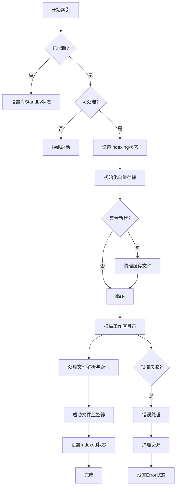
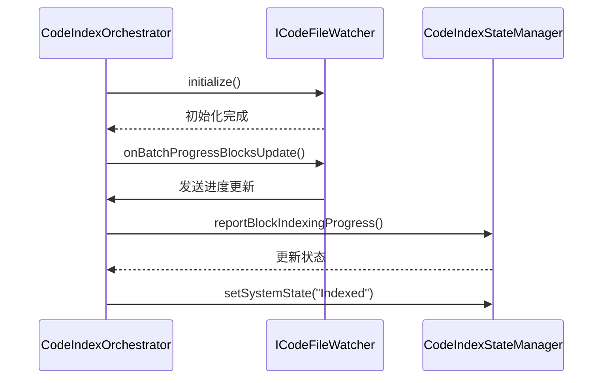
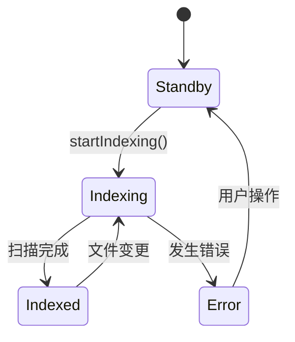
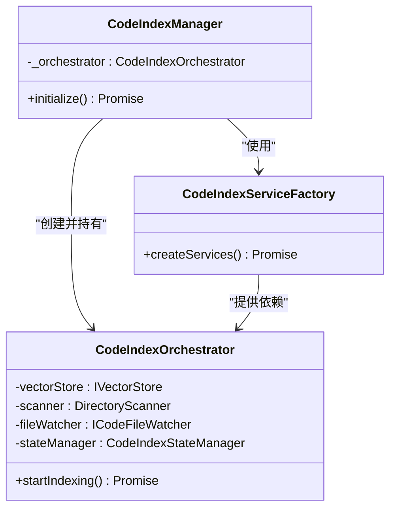

# 索引协调

<cite>
**本文档中引用的文件**  
- [orchestrator.ts](file://src/code-index/orchestrator.ts)
- [state-manager.ts](file://src/code-index/state-manager.ts)
- [manager.ts](file://src/code-index/manager.ts)
- [qdrant-client.ts](file://src/code-index/vector-store/qdrant-client.ts)
- [cache-manager.ts](file://src/code-index/cache-manager.ts)
</cite>

## 目录
1. [索引协调器概述](#索引协调器概述)
2. [索引生命周期流程](#索引生命周期流程)
3. [文件监控机制](#文件监控机制)
4. [状态管理机制](#状态管理机制)
5. [错误处理与资源清理](#错误处理与资源清理)
6. [与管理器的依赖关系](#与管理器的依赖关系)

## 索引协调器概述

`CodeIndexOrchestrator` 类是索引工作流的核心协调组件，负责管理从初始扫描到文件监控的整个生命周期。该类通过依赖注入模式接收多个服务实例，包括配置管理器、状态管理器、向量存储、目录扫描器和文件监控器等，确保各组件之间的松耦合和高内聚。

协调器通过 `startIndexing` 方法启动索引流程，并在过程中协调向量存储初始化、工作区扫描和文件监控器的启动。同时，它利用状态管理器来跟踪和更新系统状态，确保用户界面能够实时反映索引进度。

**本节来源**
- [orchestrator.ts](file://src/code-index/orchestrator.ts#L11-L274)

## 索引生命周期流程

`startIndexing` 方法是索引流程的入口点，其执行流程如下：

1. **前置检查**：首先检查功能是否已配置，以及当前状态是否允许启动索引（仅在 `Standby`、`Error` 或 `Indexed` 状态下允许启动）。
2. **状态初始化**：将系统状态设置为 `Indexing`，并记录日志信息。
3. **向量存储初始化**：调用 `vectorStore.initialize()` 方法初始化向量数据库集合。如果集合不存在或向量维度不匹配，则会自动创建新集合。
4. **缓存清理**：如果新集合被创建，则清理本地缓存文件，以确保数据一致性。
5. **工作区扫描**：使用 `scanner.scanDirectory` 方法递归扫描工作区目录，解析源代码文件并生成嵌入向量。
6. **进度报告**：通过回调函数 `handleFileParsed` 和 `handleBlocksIndexed` 实时更新已发现和已索引的代码块数量。
7. **启动文件监控**：调用私有方法 `_startWatcher` 启动文件变更监听器，以便后续捕获文件的增删改操作。
8. **状态更新**：根据扫描结果设置最终状态消息，如“所有文件已缓存”或“已索引 N 个文件”。

该方法采用异步编程模型，确保长时间运行的操作不会阻塞主线程。

**图表来源**
- [orchestrator.ts](file://src/code-index/orchestrator.ts#L107-L211)

**本节来源**
- [orchestrator.ts](file://src/code-index/orchestrator.ts#L107-L211)
- [qdrant-client.ts](file://src/code-index/vector-store/qdrant-client.ts#L59-L119)
- [cache-manager.ts](file://src/code-index/cache-manager.ts#L66-L74)

## 文件监控机制

`_startWatcher` 方法负责启动文件监控器并订阅文件变更事件。其主要职责包括：

1. **初始化监控器**：调用 `fileWatcher.initialize()` 方法启动基于 `fs.watch` 的递归文件监听。
2. **订阅批处理事件**：
   - `onDidStartBatchProcessing`：当批量处理开始时触发（当前为空实现）。
   - `onBatchProgressBlocksUpdate`：监听批处理进度更新，实时报告已处理和总代码块数，并在完成时更新系统状态为 `Indexed`。
   - `onDidFinishBatchProcessing`：处理批处理完成后的结果，记录成功与失败文件数量。

当文件发生 `rename` 或 `change` 事件时，监控器会判断文件扩展名是否受支持，并分别调用 `handleFileCreated`、`handleFileDeleted` 或 `handleFileChanged` 进行处理。

**图表来源**
- [orchestrator.ts](file://src/code-index/orchestrator.ts#L48-L98)
- [file-watcher.ts](file://src/code-index/processors/file-watcher.ts#L115-L144)

**本节来源**
- [orchestrator.ts](file://src/code-index/orchestrator.ts#L48-L98)

## 状态管理机制

`CodeIndexStateManager` 负责维护索引系统的状态，支持四种状态：`Standby`、`Indexing`、`Indexed` 和 `Error`。状态转换逻辑如下：

- **setSystemState**：设置系统状态和消息。若状态非 `Indexing`，则重置进度计数器。
- **reportBlockIndexingProgress**：报告代码块索引进度，自动将状态切换为 `Indexing`，并广播进度更新事件。
- **reportFileQueueProgress**：报告文件队列处理进度，适用于文件监控场景。

状态变更通过 `eventBus.emit('progress-update')` 通知所有监听者，确保 UI 组件能够及时刷新。

**图表来源**
- [state-manager.ts](file://src/code-index/state-manager.ts#L4-L120)

**本节来源**
- [state-manager.ts](file://src/code-index/state-manager.ts#L4-L120)

## 错误处理与资源清理

当索引过程中发生错误时，`startIndexing` 方法的 `catch` 块会执行以下清理操作：

1. **清理向量存储**：调用 `vectorStore.clearCollection()` 删除当前集合中的所有点。
2. **清理缓存文件**：调用 `cacheManager.clearCacheFile()` 重置本地哈希缓存。
3. **设置错误状态**：通过 `stateManager.setSystemState("Error", message)` 更新系统状态。
4. **停止监控器**：调用 `stopWatcher()` 释放文件监控资源。

此外，`clearIndexData` 方法提供了手动清理功能，可用于重置整个索引状态，包括删除集合、重新初始化向量存储和清除缓存。

**本节来源**
- [orchestrator.ts](file://src/code-index/orchestrator.ts#L185-L205)
- [qdrant-client.ts](file://src/code-index/vector-store/qdrant-client.ts#L285-L297)
- [cache-manager.ts](file://src/code-index/cache-manager.ts#L66-L74)

## 与管理器的依赖关系

`CodeIndexManager` 通过 `initialize` 方法创建并注入 `CodeIndexOrchestrator` 实例。具体流程如下：

1. 创建 `CodeIndexServiceFactory` 工厂类。
2. 工厂类生成 `vectorStore`、`scanner` 和 `fileWatcher` 实例。
3. 使用这些实例构造 `CodeIndexOrchestrator`。
4. 调用 `orchestrator.startIndexing()` 启动索引流程。

这种依赖注入模式使得组件之间解耦，便于测试和维护。

**图表来源**
- [manager.ts](file://src/code-index/manager.ts#L112-L223)
- [orchestrator.ts](file://src/code-index/orchestrator.ts#L11-L274)

**本节来源**
- [manager.ts](file://src/code-index/manager.ts#L112-L223)
- [orchestrator.ts](file://src/code-index/orchestrator.ts#L11-L274)