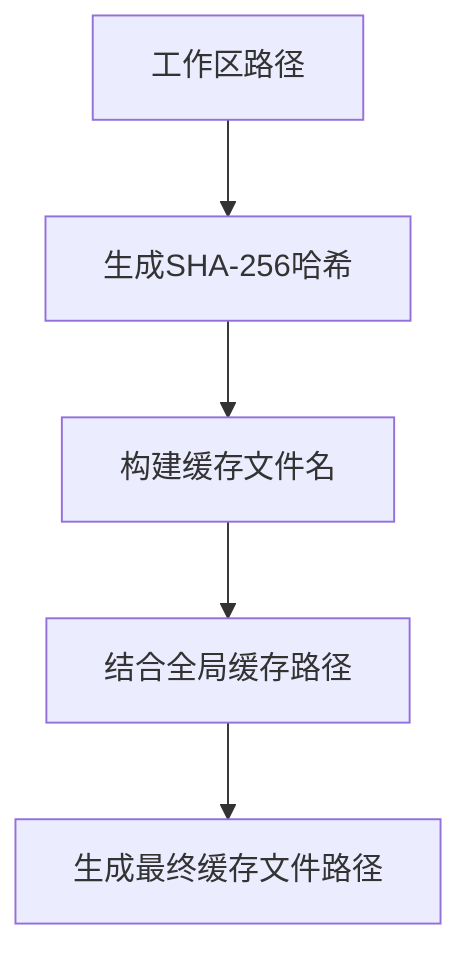
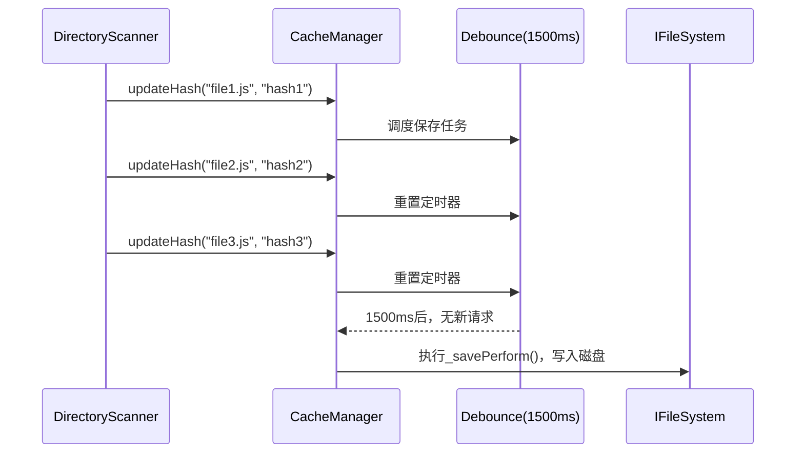
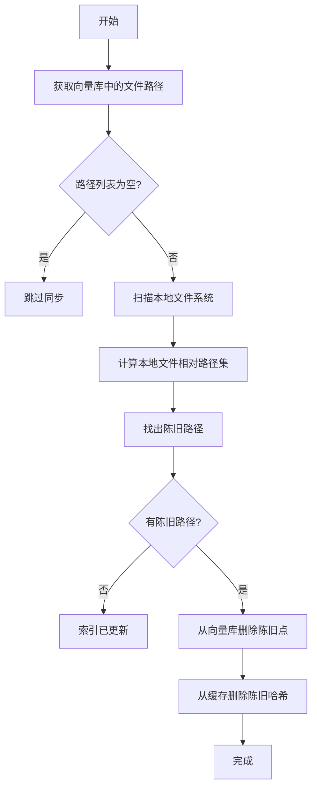

# 缓存管理

<cite>
**Referenced Files in This Document**   
- [cache-manager.ts](file://src/code-index/cache-manager.ts)
- [interfaces/cache.ts](file://src/code-index/interfaces/cache.ts)
- [adapters/nodejs/storage.ts](file://src/adapters/nodejs/storage.ts)
- [processors/scanner.ts](file://src/code-index/processors/scanner.ts)
- [manager.ts](file://src/code-index/manager.ts)
</cite>

## 目录
1. [缓存管理概述](#缓存管理概述)
2. [缓存文件路径生成策略](#缓存文件路径生成策略)
3. [缓存初始化与重置](#缓存初始化与重置)
4. [哈希值更新与删除](#哈希值更新与删除)
5. [防抖保存机制](#防抖保存机制)
6. [缓存一致性维护](#缓存一致性维护)

## 缓存管理概述

`CacheManager` 类是代码索引系统中的核心组件，负责管理文件变更状态的跟踪和缓存数据的持久化。它通过 SHA-256 哈希值来高效地识别文件是否发生变更，从而避免对未修改的文件进行重复处理。该类实现了 `ICacheManager` 接口，提供了初始化、读取、更新和清除缓存的完整功能。`CacheManager` 与文件系统和存储适配器紧密协作，确保缓存数据的可靠性和一致性。

**Section sources**
- [cache-manager.ts](file://src/code-index/cache-manager.ts#L8-L122)
- [interfaces/cache.ts](file://src/code-index/interfaces/cache.ts#L0-L36)

## 缓存文件路径生成策略

缓存文件的存储路径采用基于工作区路径哈希值的唯一命名策略。当 `CacheManager` 被实例化时，其构造函数会接收 `workspacePath` 作为参数，并利用 Node.js 的 `crypto` 模块生成一个 SHA-256 哈希值。这个哈希值被用作缓存文件名的一部分，以确保不同工作区的缓存文件不会发生冲突。

具体的路径生成逻辑由 `NodeStorage` 适配器实现。`NodeStorage` 的 `createCachePath` 方法接收工作区路径，通过 `createHash("sha256").update(workspacePath).digest("hex")` 生成哈希值，并将其嵌入到一个固定的文件名模板中（如 `roo-index-cache-{hash}.json`）。最终的缓存文件会被存储在由 `NodeStorage` 配置的全局缓存基础路径下，形成一个唯一的、可预测的文件路径。

**Diagram sources**
- [cache-manager.ts](file://src/code-index/cache-manager.ts#L19-L30)
- [adapters/nodejs/storage.ts](file://src/adapters/nodejs/storage.ts#L29-L33)

**Section sources**
- [cache-manager.ts](file://src/code-index/cache-manager.ts#L19-L30)
- [adapters/nodejs/storage.ts](file://src/adapters/nodejs/storage.ts#L29-L33)

## 缓存初始化与重置

`CacheManager` 的 `initialize` 方法负责在应用启动时加载现有的缓存数据。该方法会尝试从构造函数中确定的 `cachePath` 读取 JSON 文件。如果文件存在且可读，它会将文件内容解析为一个包含文件路径到哈希值映射的 JavaScript 对象，并将其存储在 `fileHashes` 成员变量中。如果文件不存在或读取失败（例如首次运行），则 `fileHashes` 会被初始化为空对象，表示没有已知的文件状态。

`clearCacheFile` 方法用于重置缓存状态。它会向 `cachePath` 写入一个空的 JSON 对象 `{}`，并同时将内存中的 `fileHashes` 对象清空。此操作通常在需要强制重新索引所有文件时调用，例如当用户更改了索引配置或遇到缓存损坏时。

**Section sources**
- [cache-manager.ts](file://src/code-index/cache-manager.ts#L42-L49)
- [cache-manager.ts](file://src/code-index/cache-manager.ts#L66-L74)

## 哈希值更新与删除

`updateHash` 和 `deleteHash` 方法是 `CacheManager` 用于维护文件状态的核心接口。`updateHash(filePath, hash)` 方法接收一个文件路径和一个新的 SHA-256 哈希值，将其更新到内存中的 `fileHashes` 记录里。`deleteHash(filePath)` 方法则从记录中移除指定文件路径的条目，通常用于处理已被删除的文件。

这两个方法在执行更新或删除操作后，都会立即触发一个防抖的保存操作（通过调用 `this._debouncedSaveCache()`），而不是立即写入磁盘。这种设计确保了频繁的文件变更不会导致过多的 I/O 操作。

**Section sources**
- [cache-manager.ts](file://src/code-index/cache-manager.ts#L90-L93)
- [cache-manager.ts](file://src/code-index/cache-manager.ts#L99-L102)

## 防抖保存机制

为了优化性能并减少磁盘 I/O，`CacheManager` 实现了基于 `lodash.debounce` 的防抖保存机制。在构造函数中，`this._debouncedSaveCache` 被定义为一个异步函数，该函数包装了实际的 `_performSave` 方法，并设置了 1500 毫秒的延迟。

这意味着，当 `updateHash` 或 `deleteHash` 方法被调用时，它们会调度一个保存任务。如果在 1500 毫秒内没有新的更新请求，该任务将被执行，将当前内存中的 `fileHashes` 对象序列化为 JSON 并写入磁盘。如果在这段时间内有新的更新，计时器会被重置。这种机制有效地将短时间内对多个文件的多次变更合并为一次磁盘写入操作，显著提高了效率。

**Diagram sources**
- [cache-manager.ts](file://src/code-index/cache-manager.ts#L25-L30)
- [cache-manager.ts](file://src/code-index/cache-manager.ts#L42-L49)

**Section sources**
- [cache-manager.ts](file://src/code-index/cache-manager.ts#L25-L30)
- [cache-manager.ts](file://src/code-index/cache-manager.ts#L42-L49)

## 缓存一致性维护

缓存一致性维护是通过 `CodeIndexManager` 中的 `reconcileIndex` 过程来实现的。该过程在系统初始化时被调用，旨在确保向量数据库（如 Qdrant）中的索引数据与文件系统中的实际文件状态保持一致。

`reconcileIndex` 的工作流程如下：
1.  **获取索引文件列表**：从 `IVectorStore` 中获取所有已索引文件的相对路径。
2.  **获取本地文件列表**：使用 `DirectoryScanner` 扫描工作区，获取所有当前存在的、受支持的文件的绝对路径，并转换为相对路径。
3.  **识别陈旧文件**：通过比较两个列表，找出存在于索引中但已从文件系统中移除的文件（即“陈旧”文件）。
4.  **清理不一致数据**：对于每一个陈旧文件，系统会同时从向量数据库中删除其对应的索引点，并从 `CacheManager` 的缓存中删除其哈希记录。

这一过程确保了系统不会保留对已删除文件的引用，从而维护了整个索引系统的准确性和完整性。

**Diagram sources**
- [manager.ts](file://src/code-index/manager.ts#L287-L321)
- [processors/scanner.ts](file://src/code-index/processors/scanner.ts#L248-L248)

**Section sources**
- [manager.ts](file://src/code-index/manager.ts#L287-L321)
- [processors/scanner.ts](file://src/code-index/processors/scanner.ts#L248-L248)