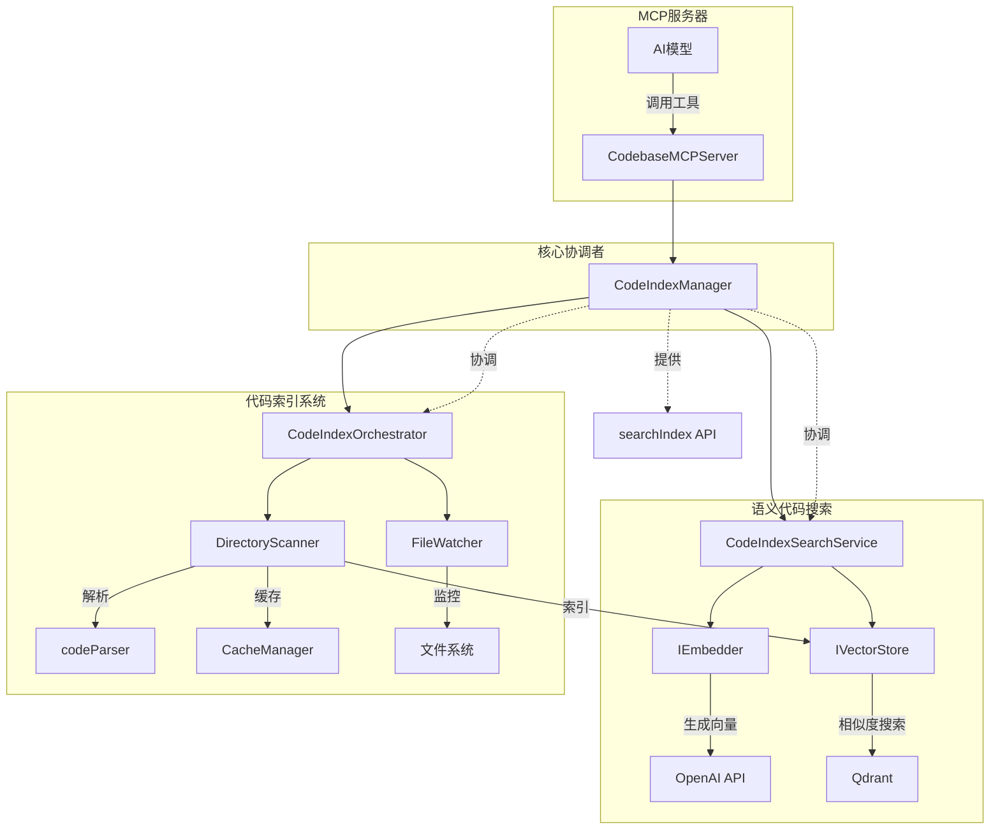

# 核心功能

<cite>
**本文档中引用的文件**   
- [manager.ts](file://src/code-index/manager.ts)
- [orchestrator.ts](file://src/code-index/orchestrator.ts)
- [search-service.ts](file://src/code-index/search-service.ts)
- [qdrant-client.ts](file://src/code-index/vector-store/qdrant-client.ts)
- [openai.ts](file://src/code-index/embedders/openai.ts)
- [server.ts](file://src/mcp/server.ts)
- [cache-manager.ts](file://src/code-index/cache-manager.ts)
- [config-manager.ts](file://src/code-index/config-manager.ts)
- [service-factory.ts](file://src/code-index/service-factory.ts)
- [scanner.ts](file://src/code-index/processors/scanner.ts)
</cite>

## 目录
1. [语义代码搜索](#语义代码搜索)
2. [MCP服务器](#mcp服务器)
3. [代码索引系统](#代码索引系统)
4. [架构概览](#架构概览)

## 语义代码搜索

语义代码搜索功能通过将自然语言查询与代码库中的代码片段进行语义匹配，实现智能搜索。其工作流程从用户查询开始，经过向量嵌入生成，最终在Qdrant向量数据库中进行相似度搜索。

搜索流程始于`CodeIndexManager`的`searchIndex`方法，该方法作为外部调用的入口点。当接收到搜索请求时，系统首先验证功能是否已启用并正确配置。随后，请求被委托给`CodeIndexSearchService`实例进行处理。

在`CodeIndexSearchService`中，搜索过程分为两个关键步骤。第一步是**向量嵌入生成**，系统调用`IEmbedder`接口的`createEmbeddings`方法，将用户查询文本转换为高维向量。该接口由`OpenAiEmbedder`等具体实现，利用OpenAI的`text-embedding-3-small`等模型生成嵌入向量。此过程包含批处理和重试机制，以应对API速率限制。

第二步是**向量相似度搜索**。生成的查询向量被传递给`IVectorStore`接口的`search`方法。在Qdrant实现中，该方法构建一个包含查询向量、相似度阈值和路径过滤器的搜索请求，并通过`qdrant-js-client-rest`库的`query`方法发送到Qdrant服务器。Qdrant使用余弦相似度算法计算向量间的距离，返回最相似的代码块。

搜索结果包含代码块的ID、相似度分数和有效载荷（payload），其中payload包含文件路径、代码片段和行号等元数据。`CodeIndexSearchService`负责将这些原始结果封装并返回给调用者。

**Section sources**
- [manager.ts](file://src/code-index/manager.ts#L238-L244)
- [search-service.ts](file://src/code-index/search-service.ts#L25-L52)
- [qdrant-client.ts](file://src/code-index/vector-store/qdrant-client.ts#L164-L211)
- [openai.ts](file://src/code-index/embedders/openai.ts#L75-L170)

## MCP服务器

MCP（Model Context Protocol）服务器作为本地代码库与AI模型之间的桥梁，通过暴露标准化的工具接口，使AI模型能够安全地访问和查询代码库的上下文信息。

MCP服务器的核心是`CodebaseMCPServer`类，它基于`@modelcontextprotocol/sdk`库构建。服务器在初始化时会注册一系列工具，其中`search_codebase`是核心功能。该工具允许AI模型通过语义搜索来查找相关代码，其输入参数包括查询字符串、结果数量限制和过滤器。

当AI模型调用`search_codebase`工具时，MCP服务器的请求处理器会拦截该调用。处理器首先检查`CodeIndexManager`的状态，确保代码索引已准备就绪。如果索引未初始化或功能被禁用，服务器会返回相应的错误信息。

一旦验证通过，请求处理器会调用`CodeIndexManager`的`searchIndex`方法执行实际的语义搜索。搜索结果返回后，服务器会将其格式化为MCP协议要求的`TextContent`格式，包含文件路径、代码片段和相似度分数。此过程支持SSE（Server-Sent Events）流式响应，允许结果分块传输，提升用户体验。

MCP服务器还提供了`get_search_stats`等辅助工具，用于查询索引状态和统计信息，帮助AI模型了解代码库的当前状况。整个服务器通过`StdioServerTransport`与外部环境通信，实现了与各种AI平台的无缝集成。

**Section sources**
- [server.ts](file://src/mcp/server.ts#L30-L150)
- [manager.ts](file://src/code-index/manager.ts#L238-L244)
- [manager.ts](file://src/code-index/manager.ts#L272-L279)

## 代码索引系统

代码索引系统是一个自动化的工作流，负责将代码库中的代码块解析、嵌入并存储到向量数据库中，同时维护一个文件哈希缓存以实现增量更新。

该系统以`CodeIndexManager`为核心协调者，通过`CodeIndexOrchestrator`管理整个索引流程。工作流始于`startIndexing`方法的调用，该方法首先初始化`QdrantVectorStore`。如果Qdrant中不存在对应集合，或集合的向量维度不匹配，系统会自动创建或重建集合。

初始化向量存储后，系统会启动一个全量扫描过程。`DirectoryScanner`负责递归扫描工作区目录，它会：
1.  列出所有文件路径。
2.  根据`.gitignore`和`.rooignore`规则过滤文件。
3.  检查文件大小和扩展名。
4.  通过`CacheManager`比较文件哈希值，跳过未更改的文件。

对于新文件或已更改的文件，`DirectoryScanner`使用`codeParser`将其解析为`CodeBlock`对象。这些代码块随后被分批处理，通过`OpenAiEmbedder`生成向量嵌入，并由`QdrantVectorStore`以`upsertPoints`操作存入Qdrant。每个向量点的ID由文件路径和起始行号生成，确保唯一性。

系统还包含一个`FileWatcher`，用于监控文件系统的实时变更。当文件被创建、修改或删除时，`FileWatcher`会累积事件，并在短暂的防抖延迟后触发批量处理，确保索引的实时性。

**Section sources**
- [manager.ts](file://src/code-index/manager.ts#L112-L223)
- [orchestrator.ts](file://src/code-index/orchestrator.ts#L107-L211)
- [scanner.ts](file://src/code-index/processors/scanner.ts#L57-L281)
- [cache-manager.ts](file://src/code-index/cache-manager.ts#L19-L30)
- [config-manager.ts](file://src/code-index/config-manager.ts#L92-L144)

## 架构概览

以下架构图展示了`CodeIndexManager`如何作为核心协调者，串联语义搜索、MCP服务器和代码索引系统三大功能。

**Diagram sources **
- [manager.ts](file://src/code-index/manager.ts#L23-L351)
- [orchestrator.ts](file://src/code-index/orchestrator.ts#L11-L274)
- [search-service.ts](file://src/code-index/search-service.ts#L10-L53)
- [server.ts](file://src/mcp/server.ts#L11-L309)

**Section sources**
- [manager.ts](file://src/code-index/manager.ts#L23-L351)
- [orchestrator.ts](file://src/code-index/orchestrator.ts#L11-L274)
- [search-service.ts](file://src/code-index/search-service.ts#L10-L53)
- [server.ts](file://src/mcp/server.ts#L11-L309)