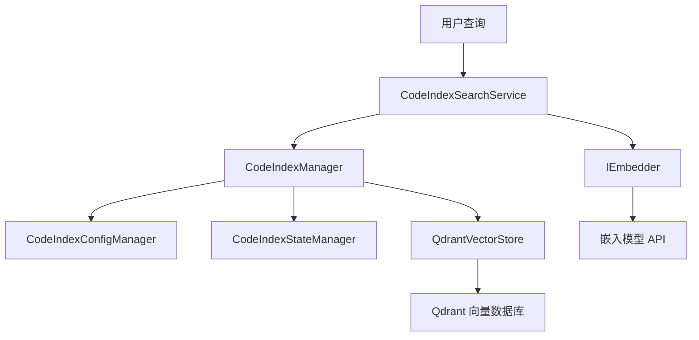
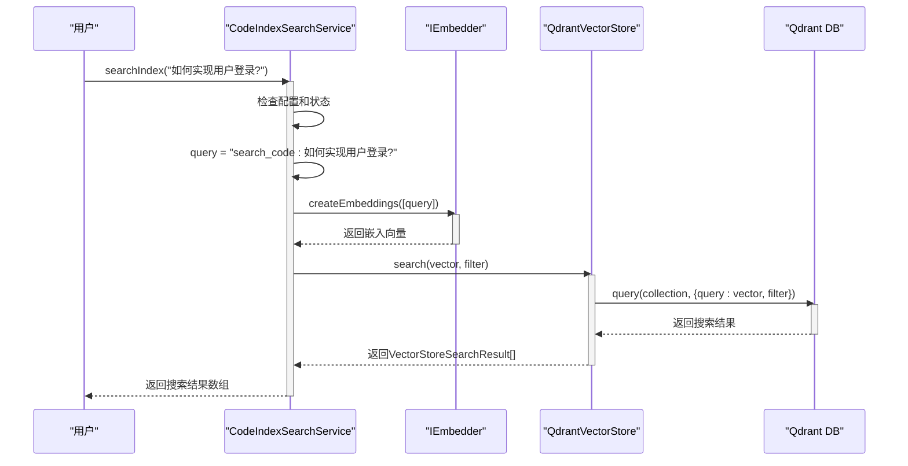

# 语义代码搜索

<cite>
**Referenced Files in This Document**   
- [search-service.ts](file://src/code-index/search-service.ts)
- [manager.ts](file://src/code-index/manager.ts)
- [qdrant-client.ts](file://src/code-index/vector-store/qdrant-client.ts)
- [vector-store.ts](file://src/code-index/interfaces/vector-store.ts)
</cite>

## 目录
1. [语义代码搜索概述](#语义代码搜索概述)
2. [核心组件与集成关系](#核心组件与集成关系)
3. [搜索流程详解](#搜索流程详解)
4. [搜索过滤器（SearchFilter）](#搜索过滤器searchfilter)
5. [错误处理与状态检查](#错误处理与状态检查)
6. [性能考虑](#性能考虑)

## 语义代码搜索概述

语义代码搜索功能通过将自然语言查询与代码库中的代码片段在向量空间中进行相似度匹配，实现超越传统关键字匹配的智能搜索。该功能的核心是`CodeIndexSearchService`，它负责处理用户查询，生成查询向量，并在Qdrant向量数据库中执行相似度搜索。整个流程从用户输入查询开始，经过嵌入模型生成向量，最终返回最相关的代码结果。

**Section sources**
- [search-service.ts](file://src/code-index/search-service.ts#L10-L53)

## 核心组件与集成关系

语义代码搜索功能由多个核心组件协同工作。`CodeIndexSearchService`是搜索功能的直接入口，它依赖于`CodeIndexManager`进行高层协调。`CodeIndexManager`作为系统的中心枢纽，负责管理`CodeIndexConfigManager`、`CodeIndexStateManager`、`CodeIndexSearchService`和`QdrantVectorStore`等服务的生命周期和依赖关系。`QdrantVectorStore`作为`IVectorStore`接口的具体实现，直接与Qdrant向量数据库交互，执行向量的存储和检索操作。

**Diagram sources **
- [search-service.ts](file://src/code-index/search-service.ts#L10-L53)
- [manager.ts](file://src/code-index/manager.ts#L23-L351)
- [qdrant-client.ts](file://src/code-index/vector-store/qdrant-client.ts#L12-L339)

**Section sources**
- [search-service.ts](file://src/code-index/search-service.ts#L10-L53)
- [manager.ts](file://src/code-index/manager.ts#L23-L351)
- [qdrant-client.ts](file://src/code-index/vector-store/qdrant-client.ts#L12-L339)

## 搜索流程详解

`searchIndex`方法是语义搜索的核心实现，其执行流程如下：

1.  **前置检查**：首先检查功能是否已启用且正确配置，然后验证索引状态是否为`Indexed`或`Indexing`。
2.  **查询预处理**：在用户查询前添加`search_code: `前缀，以提供上下文，引导嵌入模型更好地理解查询意图。
3.  **嵌入生成**：调用`IEmbedder`服务（如OpenAI或Ollama）的`createEmbeddings`方法，将查询文本转换为高维向量。
4.  **向量搜索**：将生成的向量传递给`IVectorStore`（即`QdrantVectorStore`）的`search`方法，在向量数据库中执行近似最近邻（ANN）搜索。
5.  **结果返回**：将搜索结果返回给调用者。

**Diagram sources **
- [search-service.ts](file://src/code-index/search-service.ts#L25-L52)
- [qdrant-client.ts](file://src/code-index/vector-store/qdrant-client.ts#L184-L232)

**Section sources**
- [search-service.ts](file://src/code-index/search-service.ts#L25-L52)

## 搜索过滤器（SearchFilter）

`SearchFilter`接口允许对搜索结果进行精细化控制，包含以下参数：
- **`limit`**：限制返回结果的最大数量，默认值由`MAX_SEARCH_RESULTS`常量定义。
- **`minScore`**：设置返回结果的最低相似度分数阈值，默认值由`SEARCH_MIN_SCORE`常量定义。低于此分数的结果将被过滤掉。
- **`pathFilters`**：一个字符串数组，用于按文件路径过滤结果。搜索时，文件路径中包含任一`pathFilters`中模式的代码片段才会被返回。

`QdrantVectorStore`在执行`search`方法时，会根据`SearchFilter`构建Qdrant的查询过滤器（filter），利用`filePath`字段的索引进行高效过滤。

**Section sources**
- [vector-store.ts](file://src/code-index/interfaces/vector-store.ts#L65-L69)
- [qdrant-client.ts](file://src/code-index/vector-store/qdrant-client.ts#L184-L232)

## 错误处理与状态检查

`CodeIndexSearchService`实现了严格的错误处理机制。在`searchIndex`方法执行前，会进行双重检查：
1.  **配置检查**：通过`CodeIndexConfigManager`的`isFeatureEnabled`和`isFeatureConfigured`属性，确保功能已启用且配置正确。若未满足，将抛出错误。
2.  **状态检查**：通过`CodeIndexStateManager`获取当前系统状态。只有当状态为`Indexed`（索引完成）或`Indexing`（索引中）时，才允许执行搜索。如果索引未完成（例如处于`Standby`或`Error`状态），则会抛出错误，提示“Code index is not ready for search”。

当搜索过程中发生异常时，服务会捕获错误，通过`stateManager`将系统状态设置为`Error`，并记录错误日志，最后将原始错误重新抛出。

**Section sources**
- [search-service.ts](file://src/code-index/search-service.ts#L25-L52)
- [manager.ts](file://src/code-index/manager.ts#L38-L61)

## 性能考虑

语义代码搜索的性能主要受以下因素影响：
- **查询延迟**：延迟主要由网络往返时间（调用嵌入模型API）和向量数据库的搜索速度决定。Qdrant使用HNSW等高效索引算法来保证搜索速度。
- **结果排序**：搜索结果会根据相似度分数（`score`）自动排序，分数最高的结果排在最前面。
- **过滤效率**：`QdrantVectorStore`为`filePath`字段创建了关键词索引（keyword index），使得`pathFilters`能够高效执行，避免了全库扫描。

**Section sources**
- [qdrant-client.ts](file://src/code-index/vector-store/qdrant-client.ts#L184-L232)
- [search-service.ts](file://src/code-index/search-service.ts#L25-L52)