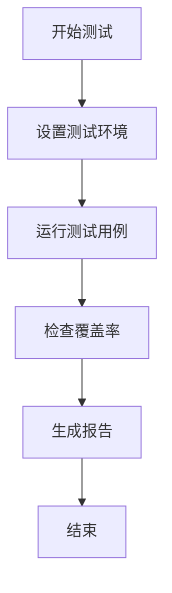

# 贡献指南

<cite>
**本文档中引用的文件**  
- [README.md](file://README.md)
- [package.json](file://package.json)
- [vitest.config.ts](file://vitest.config.ts)
- [tsconfig.json](file://tsconfig.json)
- [src/\_\_tests\_\_/core-library.test.ts](file://src/__tests__/core-library.test.ts)
- [src/code-index/\_\_tests\_\_/manager.spec.ts](file://src/code-index/__tests__/manager.spec.ts)
- [CLAUDE.md](file://CLAUDE.md)
</cite>

## 目录
1. [简介](#简介)
2. [开发环境设置](#开发环境设置)
3. [测试策略](#测试策略)
4. [代码风格指南](#代码风格指南)
5. [提交信息格式](#提交信息格式)
6. [Pull Request 审查流程](#pull-request-审查流程)
7. [如何开始贡献](#如何开始贡献)
8. [结论](#结论)

## 简介
欢迎为 `@autodev/codebase` 项目做出贡献！这是一个平台无关的代码分析库，支持语义搜索和 MCP（Model Context Protocol）服务器功能。本指南旨在帮助外部开发者顺利参与项目开发，从环境配置到代码提交的全过程提供清晰指引。

我们鼓励所有技能水平的开发者参与，无论您是修复文档错误、添加测试用例，还是实现新功能，您的贡献都至关重要。

**Section sources**
- [README.md](file://README.md#L1-L340)

## 开发环境设置
要开始为项目贡献代码，请按照以下步骤设置开发环境。

### 1. 安装 Node.js 和 pnpm
确保您的系统已安装 Node.js（建议版本 18 或更高）和 pnpm 包管理器。

```bash
# 安装 pnpm
npm install -g pnpm

# 验证安装
node --version
pnpm --version
```

### 2. 克隆并安装项目依赖
```bash
git clone https://github.com/anrgct/autodev-codebase
cd autodev-codebase
pnpm install
```

### 3. 安装额外依赖服务
项目依赖以下外部服务，请确保它们已正确安装并运行：

- **Ollama**：用于嵌入模型
- **ripgrep**：用于快速代码索引
- **Qdrant**：向量数据库

安装命令如下：
```bash
# 安装 Ollama (macOS)
brew install ollama

# 安装 ripgrep (macOS)
brew install ripgrep

# 启动 Qdrant (Docker)
docker run -p 6333:6333 -p 6334:6334 qdrant/qdrant
```

### 4. 构建项目
```bash
pnpm run build
```

**Section sources**
- [README.md](file://README.md#L34-L150)
- [package.json](file://package.json#L1-L74)

## 测试策略
项目采用 Vitest 作为测试框架，确保代码质量和稳定性。

### 运行测试
```bash
# 运行所有单元测试
pnpm test

# 运行类型检查
pnpm run type-check

# 运行特定测试文件
npx vitest src/__tests__/core-library.test.ts
```

### 测试覆盖率
我们高度重视测试覆盖率。所有新功能必须包含相应的测试用例。当前核心模块的测试覆盖情况如下：

- **CacheManager**：验证缓存初始化、哈希管理与清除
- **StateManager**：测试索引进度跟踪与状态管理
- **ConfigManager**：确保配置加载与变更检测正常
- **DirectoryScanner**：验证目录扫描与代码块生成

测试文件位于 `src/__tests__/` 和 `src/*/__tests__/` 目录下。



**Diagram sources**
- [src/__tests__/core-library.test.ts](file://src/__tests__/core-library.test.ts#L1-L372)
- [vitest.config.ts](file://vitest.config.ts#L1-L11)

**Section sources**
- [src/__tests__/core-library.test.ts](file://src/__tests__/core-library.test.ts#L1-L372)
- [vitest.config.ts](file://vitest.config.ts#L1-L11)

## 代码风格指南
为保持代码一致性，请遵循以下 TypeScript 编码规范。

### TypeScript 规范
- 使用严格模式（strict: true）
- 遵循接口优先原则（编程针对接口而非具体实现）
- 采用依赖注入模式
- 核心逻辑保持平台无关性
- 使用 `I` 前缀命名接口（如 `IFileSystem`）

### 工具支持
- **TypeScript**：版本 5.6.2
- **ESLint**：未显式配置，依赖 TypeScript 严格检查
- **Prettier**：未显式配置，建议使用默认格式化

**Section sources**
- [tsconfig.json](file://tsconfig.json#L1-L42)
- [CLAUDE.md](file://CLAUDE.md#L1-L172)

## 提交信息格式
请使用清晰、描述性的提交信息，遵循以下格式：

```
<类型>: <简短描述>

<详细描述（可选）>

<关联的 Issue 或 PR（可选）>
```

### 类型说明
- `feat`：新增功能
- `fix`：修复 bug
- `docs`：文档更新
- `test`：测试相关
- `chore`：构建或辅助工具变更
- `refactor`：代码重构

示例：
```
feat: 添加对 Qwen3 嵌入模型的支持

支持 dengcao/Qwen3-Embedding-0.6B:Q8_0 模型
通过 Ollama 提供语义搜索能力

Closes #123
```

**Section sources**
- [CLAUDE.md](file://CLAUDE.md#L1-L172)

## Pull Request 审查流程
1. Fork 仓库并创建新分支
2. 实现功能或修复问题
3. 确保所有测试通过且覆盖率达标
4. 提交 Pull Request
5. 维护者将进行代码审查
6. 根据反馈修改代码
7. 合并 PR

### 合并标准
- 所有 CI 检查通过
- 至少一名维护者批准
- 代码符合风格指南
- 包含适当的测试
- 提交信息格式正确

**Section sources**
- [CLAUDE.md](file://CLAUDE.md#L1-L172)

## 如何开始贡献
我们鼓励贡献者从以下任务开始：
- 修复文档中的拼写错误或格式问题
- 为现有功能添加更多测试用例
- 实现小型功能或优化
- 报告并修复 bug

请先查看 [Issues](https://github.com/anrgct/autodev-codebase/issues) 中标记为 `good first issue` 的任务。

**Section sources**
- [README.md](file://README.md#L1-L340)

## 结论
感谢您阅读本贡献指南！我们期待您的参与。如有任何疑问，请在 Issues 中提问或联系项目维护者。通过共同努力，我们可以打造一个更强大、更智能的代码分析工具。

**Section sources**
- [README.md](file://README.md#L1-L340)