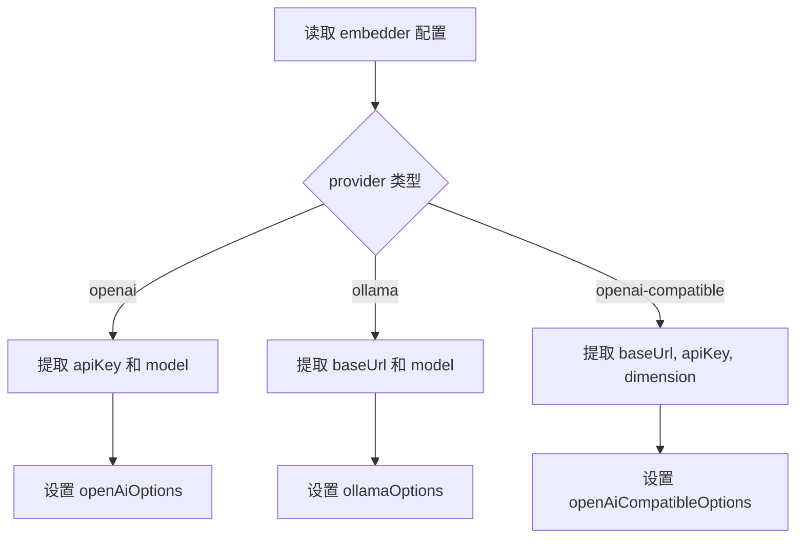
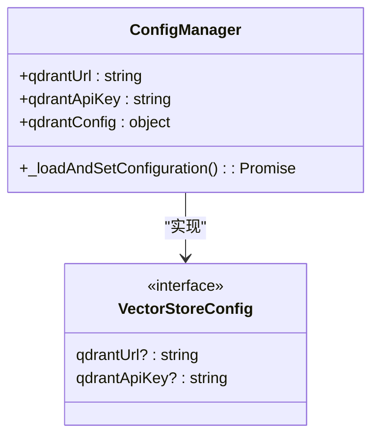
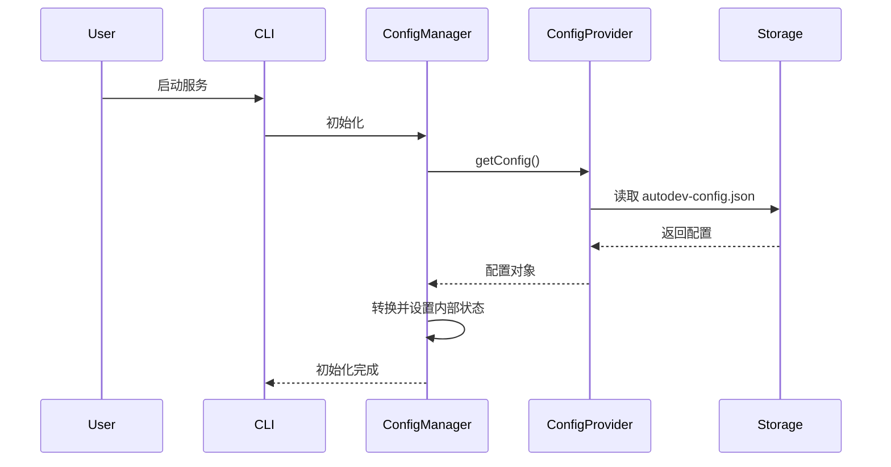

# 配置系统

<cite>
**本文档中引用的文件**  
- [autodev-config.json](file://autodev-config.json)
- [config-manager.ts](file://src/code-index/config-manager.ts)
- [config.ts](file://src/code-index/interfaces/config.ts)
- [embeddingModels.ts](file://src/shared/embeddingModels.ts)
- [RooIgnoreController.ts](file://src/ignore/RooIgnoreController.ts)
</cite>

## 目录
1. [简介](#简介)
2. [配置文件结构](#配置文件结构)
3. [嵌入模型配置](#嵌入模型配置)
4. [向量数据库连接](#向量数据库连接)
5. [文件忽略规则](#文件忽略规则)
6. [日志与调试](#日志与调试)
7. [配置优先级规则](#配置优先级规则)
8. [ConfigManager 类解析](#configmanager-类解析)
9. [完整配置示例](#完整配置示例)
10. [配置变更处理机制](#配置变更处理机制)
11. [常见配置错误排查](#常见配置错误排查)

## 简介
`autodev-config.json` 是 AutoDev 项目的核心配置文件，用于定义代码索引、嵌入模型、向量存储和搜索行为。该配置系统支持多种嵌入提供程序（如 OpenAI、Ollama 和兼容 OpenAI 的服务），并允许用户自定义向量维度、API 端点和认证信息。配置管理器（`ConfigManager`）负责加载、验证和应用这些设置，并在运行时检测是否需要重启索引服务以反映更改。

**Section sources**
- [autodev-config.json](file://autodev-config.json#L1-L10)

## 配置文件结构
`autodev-config.json` 文件采用 JSON 格式，包含以下顶级字段：

- `isEnabled`: 布尔值，指示代码索引功能是否启用。
- `isConfigured`: 布尔值，表示当前配置是否完整有效。
- `embedder`: 包含嵌入模型提供商、模型名称、维度和基础 URL 的对象。
- `qdrantUrl`: 可选字符串，指定 Qdrant 向量数据库的地址，默认为 `http://localhost:6333`。
- `qdrantApiKey`: 可选字符串，用于访问受保护的 Qdrant 实例。

该结构由 `CodeIndexConfig` 接口定义，确保类型安全和一致性。

**Section sources**
- [config.ts](file://src/code-index/interfaces/config.ts#L20-L34)

## 嵌入模型配置
嵌入模型配置通过 `embedder` 字段指定，支持三种提供程序：`openai`、`ollama` 和 `openai-compatible`。每种提供程序都有特定的配置参数：

- **provider**: 指定嵌入服务提供商。
- **model**: 使用的模型标识符（例如 `"dengcao/Qwen3-Embedding-0.6B:Q8_0"`）。
- **dimension**: 模型生成的向量维度（例如 1024）。
- **baseUrl**: 对于 Ollama 或 OpenAI 兼容服务，指定 API 的基础 URL。

系统根据 `provider` 类型动态解析配置，并通过 `getModelDimension()` 函数验证模型维度是否匹配。



**Diagram sources**
- [config-manager.ts](file://src/code-index/config-manager.ts#L55-L85)

**Section sources**
- [config-manager.ts](file://src/code-index/config-manager.ts#L55-L85)
- [embeddingModels.ts](file://src/shared/embeddingModels.ts#L10-L95)

## 向量数据库连接
向量数据库使用 Qdrant 存储和检索嵌入向量。相关配置项包括：

- **qdrantUrl**: Qdrant 服务的 HTTP 地址，默认为 `http://localhost:6333`。
- **qdrantApiKey**: 访问 Qdrant 所需的 API 密钥（可选）。

这些值在 `ConfigManager` 初始化时从配置中读取，并用于构建向量存储客户端。如果未提供，则使用默认值或空密钥。



**Diagram sources**
- [config-manager.ts](file://src/code-index/config-manager.ts#L90-L95)
- [config.ts](file://src/abstractions/config.ts#L40-L43)

**Section sources**
- [config-manager.ts](file://src/code-index/config-manager.ts#L90-L95)

## 文件忽略规则
文件访问控制由 `RooIgnoreController` 类实现，它读取项目根目录下的 `.rooignore` 文件，遵循 `.gitignore` 语法来决定哪些文件对 LLM 不可见。

- `.rooignore` 中列出的文件路径将被屏蔽。
- 支持通配符、目录匹配和否定模式。
- 当文件被忽略时，尝试读取其内容会返回错误。
- 命令行操作（如 `cat`、`grep`）也会受到此规则限制。

控制器监听 `.rooignore` 文件的变化，并在文件修改时自动重新加载规则。

**Section sources**
- [RooIgnoreController.ts](file://src/ignore/RooIgnoreController.ts#L1-L218)

## 日志与调试
日志级别未在 `autodev-config.json` 中直接配置，而是通过适配器中的 `logger.ts` 文件实现。Node.js 和 VSCode 适配器分别提供了各自的日志记录机制，支持不同级别的输出（如 info、warn、error）。日志行为可通过环境变量或运行时参数控制，但不涉及配置文件本身的结构。

**Section sources**
- [logger.ts](file://src/adapters/nodejs/logger.ts)
- [logger.ts](file://src/adapters/vscode/logger.ts)

## 配置优先级规则
配置值的优先级顺序如下（从高到低）：

1. **CLI 参数**：命令行提供的参数优先级最高，可覆盖配置文件中的设置。
2. **配置文件 (`autodev-config.json`)**：作为持久化配置来源。
3. **默认值**：当配置缺失时，系统使用内置默认值（如 `qdrantUrl` 默认为 `http://localhost:6333`）。

例如，若 CLI 指定了不同的 `--model` 参数，则即使配置文件中已定义模型，也将使用 CLI 提供的模型。

**Section sources**
- [config-manager.ts](file://src/code-index/config-manager.ts#L55-L85)

## ConfigManager 类解析
`CodeIndexConfigManager` 类是配置系统的核心，负责加载、解析和验证所有配置项。其主要职责包括：

- 从 `IConfigProvider` 获取配置。
- 将新格式的 `embedder` 配置转换为内部兼容格式。
- 验证配置完整性（`isConfigured()` 方法）。
- 检测配置变更是否需要重启服务（`doesConfigChangeRequireRestart()`）。

初始化流程如下：
1. 调用 `initialize()` 方法。
2. 执行 `_loadAndSetConfiguration()` 加载配置。
3. 根据 `provider` 类型设置相应的选项对象。
4. 更新 `qdrantUrl` 和 `searchMinScore` 等共享配置。



**Diagram sources**
- [config-manager.ts](file://src/code-index/config-manager.ts#L17-L334)

**Section sources**
- [config-manager.ts](file://src/code-index/config-manager.ts#L17-L334)

## 完整配置示例
以下是 `autodev-config.json` 的完整示例，包含详细注释说明：

```json
{
  "isEnabled": true,                    // 是否启用代码索引功能
  "isConfigured": true,                 // 配置是否已完成（由系统自动设置）
  "embedder": {
    "provider": "ollama",               // 嵌入模型提供商：openai | ollama | openai-compatible
    "model": "dengcao/Qwen3-Embedding-0.6B:Q8_0", // 使用的模型名称
    "dimension": 1024,                  // 向量维度，必须与模型输出一致
    "baseUrl": "http://localhost:11434" // Ollama 服务地址
  },
  "qdrantUrl": "http://localhost:6333", // Qdrant 向量数据库地址
  "qdrantApiKey": "your-secret-key"     // Qdrant API 密钥（可选）
}
```

**Section sources**
- [autodev-config.json](file://autodev-config.json#L1-L10)

## 配置变更处理机制
当配置发生变化时，系统会判断是否需要重启索引服务。以下情况将触发重启需求：

- 启用功能或从非配置状态变为已配置状态。
- 更改嵌入模型提供程序（如从 `openai` 切换到 `ollama`）。
- 模型变更导致向量维度变化（通过 `_hasVectorDimensionChanged()` 检测）。
- API 密钥、基础 URL 或 Qdrant 连接信息发生更改。

`doesConfigChangeRequireRestart()` 方法通过比较新旧配置快照来决定是否需要重启。

**Section sources**
- [config-manager.ts](file://src/code-index/config-manager.ts#L148-L223)

## 常见配置错误排查
以下是一些常见的配置问题及其解决方案：

| 问题现象 | 可能原因 | 解决方法 |
|--------|--------|--------|
| 嵌入失败 | API 密钥无效或缺失 | 检查 `apiKey` 是否正确，对于 OpenAI 兼容服务确保 `baseUrl` 可访问 |
| 向量搜索无结果 | 模型维度不匹配 | 确认 `dimension` 与实际模型输出一致，参考 `EMBEDDING_MODEL_PROFILES` |
| 无法连接 Qdrant | URL 错误或网络不通 | 验证 `qdrantUrl` 是否可达，检查防火墙设置 |
| 忽略规则未生效 | `.rooignore` 文件格式错误 | 使用标准 `.gitignore` 语法，确保文件位于项目根目录 |

此外，可通过查看日志输出确认配置加载过程，并利用 `getConfig()` 方法获取当前运行时配置进行调试。

**Section sources**
- [config-manager.ts](file://src/code-index/config-manager.ts#L148-L223)
- [embeddingModels.ts](file://src/shared/embeddingModels.ts#L50-L95)
- [RooIgnoreController.ts](file://src/ignore/RooIgnoreController.ts#L1-L218)