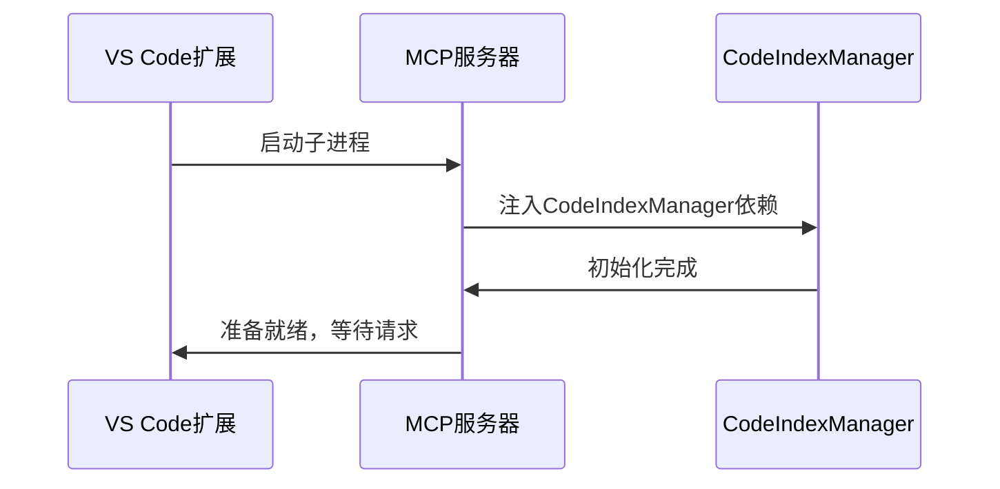
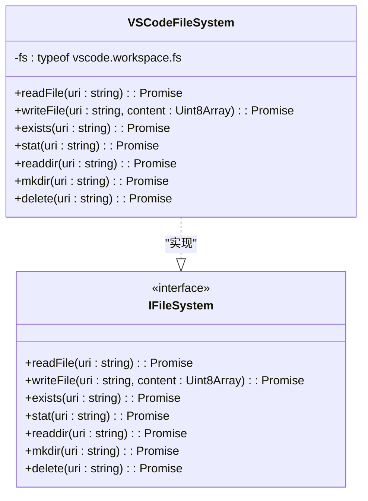
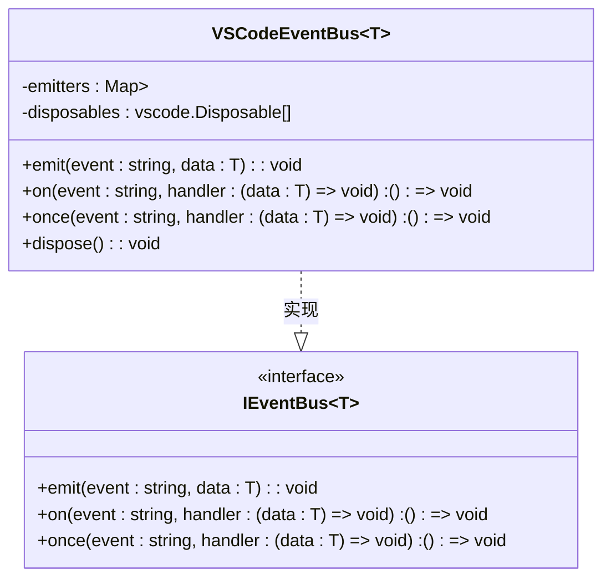
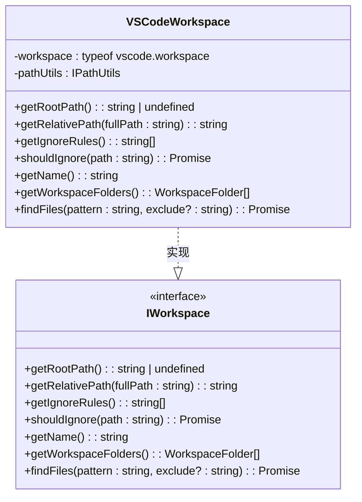
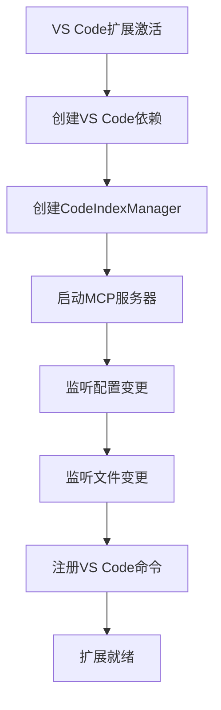
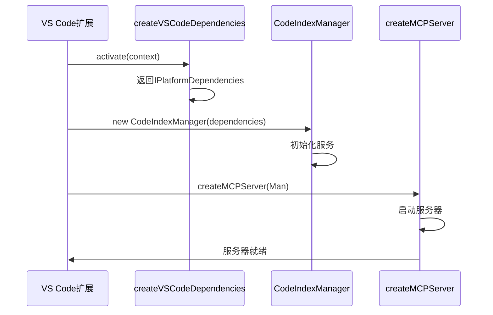

# IDE集成

<cite>
**本文档中引用的文件**  
- [server.ts](file://src/mcp/server.ts)
- [vscode-usage.ts](file://src/examples/vscode-usage.ts)
- [config.ts](file://src/adapters/vscode/config.ts)
- [event-bus.ts](file://src/adapters/vscode/event-bus.ts)
- [file-system.ts](file://src/adapters/vscode/file-system.ts)
- [file-watcher.ts](file://src/adapters/vscode/file-watcher.ts)
- [logger.ts](file://src/adapters/vscode/logger.ts)
- [storage.ts](file://src/adapters/vscode/storage.ts)
- [workspace.ts](file://src/adapters/vscode/workspace.ts)
- [index.ts](file://src/adapters/vscode/index.ts)
- [manager.ts](file://src/code-index/manager.ts)
</cite>

## 目录
1. [简介](#简介)
2. [MCP服务器配置](#mcp服务器配置)
3. [VS Code适配器详解](#vs-code适配器详解)
4. [客户端连接步骤](#客户端连接步骤)
5. [完整集成示例](#完整集成示例)
6. [常见问题排查](#常见问题排查)

## 简介
本文档详细介绍了如何将`autodev-codebase`与支持MCP（Model Context Protocol）协议的IDE（如VS Code）进行集成。文档涵盖了MCP服务器的启动配置、VS Code适配器的实现原理、客户端连接的具体步骤以及常见问题的解决方案。通过本指南，开发者可以将语义搜索、代码索引等高级功能无缝集成到其开发环境中。

## MCP服务器配置

MCP服务器是`autodev-codebase`的核心服务，负责处理来自IDE的工具调用请求。其配置主要在`src/mcp/server.ts`中实现。

### 服务器启动与端口设置
MCP服务器通过标准输入/输出（Stdio）进行通信，而非传统的网络端口。这使得它能够作为子进程被IDE扩展直接启动和管理，避免了复杂的网络配置和端口冲突问题。服务器的启动是通过`createMCPServer`工厂函数完成的，该函数接收一个`CodeIndexManager`实例作为依赖。

**Diagram sources**
- [server.ts](file://src/mcp/server.ts#L1-L50)

### 认证方式
当前实现中，MCP服务器本身不包含独立的认证机制。认证责任被下放到了其依赖的`CodeIndexManager`和具体的适配器上。例如，`VSCodeConfigProvider`会从VS Code的配置中读取OpenAI、Ollama或兼容API的`apiKey`，这些密钥在执行嵌入（embedding）和向量搜索时被使用。

### 超时参数
服务器的超时控制主要由客户端（即IDE扩展）管理。服务器本身的设计是异步的，每个工具调用（如`search_codebase`）都是一个Promise。IDE扩展在调用这些工具时，可以设置自己的超时逻辑。核心库内部的超时（如与Qdrant数据库或嵌入模型API的通信）则由`CodeIndexManager`的各个服务组件（如`OpenAIEmbedder`）自行处理。

**Section sources**
- [server.ts](file://src/mcp/server.ts#L1-L309)

## VS Code适配器详解

`src/adapters/vscode/`目录下的适配器实现了`autodev-codebase`核心库定义的抽象接口，将VS Code平台的原生API映射到通用的抽象层。

### 核心适配器组件

#### 文件系统适配器 (VSCodeFileSystem)
`VSCodeFileSystem`实现了`IFileSystem`接口，利用`vscode.workspace.fs` API来执行文件操作。它将文件路径字符串转换为`vscode.Uri`对象，然后调用相应的异步方法。

**Diagram sources**
- [file-system.ts](file://src/adapters/vscode/file-system.ts#L1-L72)

#### 事件总线适配器 (VSCodeEventBus)
`VSCodeEventBus`实现了`IEventBus`接口，使用`vscode.EventEmitter`作为底层事件系统。它允许核心库在状态变化（如索引进度更新）时通知VS Code扩展。

**Diagram sources**
- [event-bus.ts](file://src/adapters/vscode/event-bus.ts#L1-L89)

#### 工作区适配器 (VSCodeWorkspace)
`VSCodeWorkspace`实现了`IWorkspace`接口，提供了对当前VS Code工作区的访问。它能获取工作区根路径、相对路径，并解析`.gitignore`等忽略规则。

**Diagram sources**
- [workspace.ts](file://src/adapters/vscode/workspace.ts#L1-L121)

#### 其他适配器
- **VSCodeStorage**: 使用`vscode.ExtensionContext.globalStorageUri`为扩展提供持久化存储。
- **VSCodeLogger**: 将日志输出到VS Code的专用输出通道。
- **VSCodeFileWatcher**: 利用`vscode.workspace.createFileSystemWatcher`监听文件系统变化。
- **VSCodeConfigProvider**: 从VS Code的配置（`autodev`节）中读取嵌入模型、向量数据库等配置。

**Section sources**
- [config.ts](file://src/adapters/vscode/config.ts#L1-L157)
- [storage.ts](file://src/adapters/vscode/storage.ts#L1-L37)
- [logger.ts](file://src/adapters/vscode/logger.ts#L1-L51)
- [file-watcher.ts](file://src/adapters/vscode/file-watcher.ts#L1-L84)
- [index.ts](file://src/adapters/vscode/index.ts#L1-L38)

## 客户端连接步骤

在VS Code扩展中集成MCP服务器需要以下步骤：

1.  **创建平台依赖**: 使用`createVSCodeDependencies`工厂函数创建一套适配器实例。
2.  **初始化核心管理器**: 创建`CodeIndexManager`实例，并注入上一步创建的依赖。
3.  **启动MCP服务器**: 调用`createMCPServer`，传入`CodeIndexManager`实例。
4.  **注册MCP工具**: 在VS Code扩展中，通过MCP客户端库连接到正在运行的服务器，并注册可用的工具（如`search_codebase`）。
5.  **处理SSE流**: MCP协议使用Server-Sent Events (SSE) 进行流式响应。客户端需要监听`text`内容类型的事件，并将接收到的文本片段累积起来，最终展示完整的搜索结果。

## 完整集成示例

`examples/vscode-usage.ts`文件提供了一个完整的集成示例。

该示例展示了从`activate`函数开始的完整流程：创建依赖、初始化管理器、监听事件以及注册命令。虽然示例中的`CodeIndexManager`被注释掉了，但它清晰地指明了实际集成时需要实例化的核心组件。

**Diagram sources**
- [vscode-usage.ts](file://src/examples/vscode-usage.ts#L1-L104)

**Section sources**
- [vscode-usage.ts](file://src/examples/vscode-usage.ts#L1-L104)
- [manager.ts](file://src/code-index/manager.ts#L1-L351)

## 常见问题排查

### 连接失败
*   **现象**: 无法启动MCP服务器或客户端连接超时。
*   **原因**: 通常是`CodeIndexManager`初始化失败，或者`createMCPServer`函数抛出异常。
*   **解决方案**: 检查`VSCodeLogger`输出的错误日志，确认`CodeIndexManager`的依赖（如配置、文件系统权限）是否正确。确保`autodev`功能已启用且配置完整。

### 认证错误
*   **现象**: 搜索返回错误，提示API密钥无效或无法连接到嵌入服务。
*   **原因**: `VSCodeConfigProvider`未能正确读取配置，或在`autodev`设置中输入了错误的`apiKey`或`baseUrl`。
*   **解决方案**: 打开VS Code设置，检查`autodev`节下的`embedder`配置。确保`apiKey`正确无误，对于Ollama或OpenAI兼容API，确认`baseUrl`可访问。

### 性能瓶颈
*   **现象**: 首次索引耗时过长，或搜索响应缓慢。
*   **原因**: 大型代码库的向量化过程计算密集，或向量数据库（Qdrant）性能不足。
*   **解决方案**: 
    *   确保使用了性能良好的嵌入模型（如`text-embedding-3-small`）。
    *   优化Qdrant的配置，确保其有足够的内存和计算资源。
    *   利用`VSCodeFileWatcher`的增量索引功能，避免全量重建。
    *   检查`VSCodeLogger`中的进度日志，定位瓶颈环节。