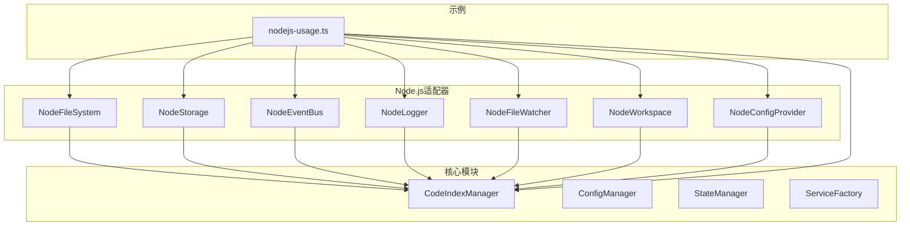
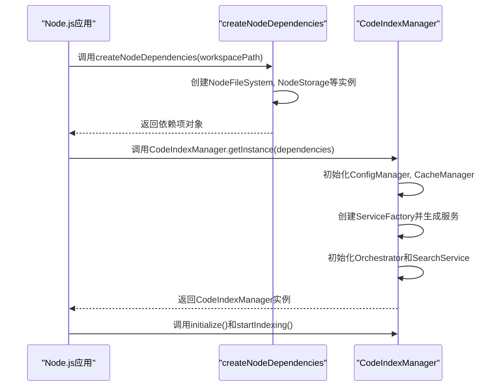
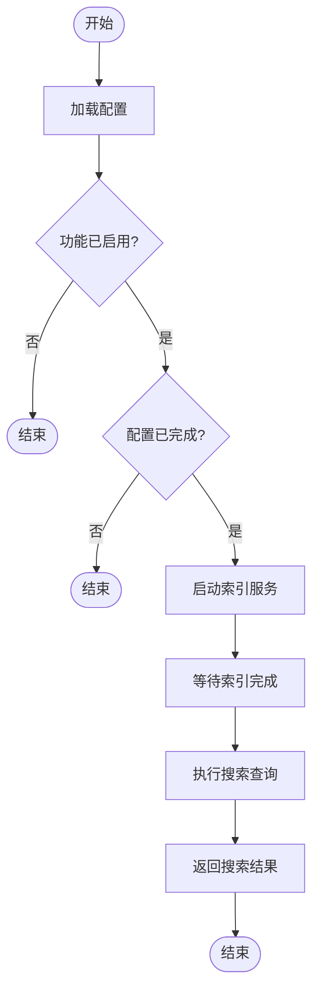

# 自定义应用集成

<cite>
**本文档中引用的文件**   
- [nodejs-usage.ts](file://src/examples/nodejs-usage.ts)
- [index.ts](file://src/index.ts)
- [manager.ts](file://src/code-index/manager.ts)
- [config-manager.ts](file://src/code-index/config-manager.ts)
- [state-manager.ts](file://src/code-index/state-manager.ts)
- [file-system.ts](file://src/adapters/nodejs/file-system.ts)
- [storage.ts](file://src/adapters/nodejs/storage.ts)
- [event-bus.ts](file://src/adapters/nodejs/event-bus.ts)
- [logger.ts](file://src/adapters/nodejs/logger.ts)
- [file-watcher.ts](file://src/adapters/nodejs/file-watcher.ts)
- [workspace.ts](file://src/adapters/nodejs/workspace.ts)
- [config.ts](file://src/adapters/nodejs/config.ts)
</cite>

## 目录
1. [项目结构](#项目结构)
2. [核心组件](#核心组件)
3. [Node.js适配器详解](#nodejs适配器详解)
4. [代码索引管理器集成](#代码索引管理器集成)
5. [语义搜索功能配置](#语义搜索功能配置)
6. [错误处理与资源管理](#错误处理与资源管理)
7. [适配器行为定制](#适配器行为定制)

## 项目结构

本项目采用模块化设计，核心功能位于`src/`目录下。`src/adapters/nodejs/`目录提供了Node.js环境下的具体实现，而`src/code-index/`目录包含了核心的索引和搜索逻辑。`src/examples/`目录中的`nodejs-usage.ts`文件为开发者提供了在Node.js应用中集成核心功能的参考示例。

**图示来源**
- [nodejs-usage.ts](file://src/examples/nodejs-usage.ts)
- [index.ts](file://src/index.ts)

## 核心组件

`autodev-codebase`的核心功能由`CodeIndexManager`类驱动，该类实现了`ICodeIndexManager`接口。它负责协调配置加载、索引编排、状态管理和搜索服务。`ConfigManager`负责管理应用的配置状态，`StateManager`通过事件总线广播索引进度，而`ServiceFactory`则根据配置创建具体的嵌入式模型和向量存储实例。

**节来源**
- [manager.ts](file://src/code-index/manager.ts#L23-L351)
- [config-manager.ts](file://src/code-index/config-manager.ts#L17-L334)
- [state-manager.ts](file://src/code-index/state-manager.ts#L4-L120)

## Node.js适配器详解

`src/adapters/nodejs/`目录下的适配器为`autodev-codebase`的核心库提供了Node.js环境的具体实现，满足了`IPlatformDependencies`抽象依赖。

### 文件系统适配器

`NodeFileSystem`类实现了`IFileSystem`接口，利用Node.js的`fs/promises` API提供异步文件操作。它封装了读取、写入、检查存在性、获取文件状态、读取目录、创建目录和删除文件等基本操作，并在写入文件时自动创建必要的目录结构。

**节来源**
- [file-system.ts](file://src/adapters/nodejs/file-system.ts#L8-L82)

### 存储适配器

`NodeStorage`类实现了`IStorage`接口，负责管理全局存储路径和工作区缓存路径。它通过`createCachePath`方法为每个工作区生成唯一的缓存路径，该路径基于工作区路径的哈希值，确保了不同工作区之间的缓存隔离。

**节来源**
- [storage.ts](file://src/adapters/nodejs/storage.ts#L16-L56)

### 事件总线适配器

`NodeEventBus`类实现了`IEventBus`接口，基于Node.js的`EventEmitter`构建。它提供了事件的发布(`emit`)、订阅(`on`)、取消订阅(`off`)和一次性订阅(`once`)功能。`on`方法返回一个取消订阅函数，便于资源清理。

**节来源**
- [event-bus.ts](file://src/adapters/nodejs/event-bus.ts#L7-L55)

### 日志适配器

`NodeLogger`类实现了`ILogger`接口，提供`debug`、`info`、`warn`和`error`四个级别的日志记录。它支持可选的时间戳和彩色输出（在TTY环境中），并允许通过`setLevel`方法动态调整日志级别。

**节来源**
- [logger.ts](file://src/adapters/nodejs/logger.ts#L13-L104)

### 文件监视器适配器

`NodeFileWatcher`类实现了`IFileWatcher`接口，利用Node.js的`fs.watch` API监视文件和目录的变化。`watchFile`和`watchDirectory`方法返回一个清理函数，调用该函数可以关闭监视器并释放资源。

**节来源**
- [file-watcher.ts](file://src/adapters/nodejs/file-watcher.ts#L7-L87)

### 工作区适配器

`NodeWorkspace`类实现了`IWorkspace`接口，代表一个基于文件系统的工作区。它提供了获取根路径、相对路径、忽略规则以及查找文件等功能。`shouldIgnore`方法结合默认忽略模式和`.gitignore`等文件中的规则来判断文件是否应被忽略。

**节来源**
- [workspace.ts](file://src/adapters/nodejs/workspace.ts#L14-L154)

### 路径工具适配器

`NodePathUtils`类实现了`IPathUtils`接口，对Node.js的`path`模块进行了封装，提供了路径拼接、目录名、文件名、扩展名、路径解析、绝对路径判断、相对路径计算和路径规范化等常用操作。

**节来源**
- [workspace.ts](file://src/adapters/nodejs/workspace.ts#L156-L188)

### 配置提供者适配器

`NodeConfigProvider`类实现了`IConfigProvider`接口，负责从JSON文件中加载和保存配置。它支持项目级配置(`autodev-config.json`)和全局级配置(`~/.autodev-cache/autodev-config.json`)，并允许通过CLI参数进行覆盖。配置加载遵循全局配置 < 项目配置 < CLI覆盖的优先级。

**节来源**
- [config.ts](file://src/adapters/nodejs/config.ts#L35-L371)

## 代码索引管理器集成

`src/index.ts`文件通过`export * from './code-index';`将`CodeIndexManager`等核心API暴露给外部应用。开发者可以通过`createNodeDependencies`或`createSimpleNodeDependencies`工厂函数快速初始化Node.js环境所需的依赖项。

**图示来源**
- [index.ts](file://src/index.ts#L0-L79)
- [manager.ts](file://src/code-index/manager.ts#L23-L351)

## 语义搜索功能配置

通过`examples/nodejs-usage.ts`中的示例，开发者可以学习如何配置和使用语义搜索功能。首先，需要通过`configProvider.saveConfig`方法保存包含嵌入式模型和向量数据库配置的`CodeIndexConfig`对象。然后，初始化`CodeIndexManager`并启动索引服务。最后，调用`searchIndex`方法执行搜索查询。

**图示来源**
- [nodejs-usage.ts](file://src/examples/nodejs-usage.ts#L0-L253)
- [manager.ts](file://src/code-index/manager.ts#L23-L351)

## 错误处理与资源管理

在集成过程中，必须妥善处理异步操作可能抛出的错误。例如，文件读写、配置加载和网络请求都应使用`try-catch`块进行包裹。资源管理方面，`CodeIndexManager`提供了`dispose`方法来清理所有资源，`NodeEventBus`的`on`方法返回的函数可用于取消事件订阅，`NodeFileWatcher`的`watch`方法返回的函数可用于停止文件监视。

**节来源**
- [nodejs-usage.ts](file://src/examples/nodejs-usage.ts#L0-L253)
- [manager.ts](file://src/code-index/manager.ts#L23-L351)

## 适配器行为定制

开发者可以根据应用需求定制适配器的行为。例如，在调用`createNodeDependencies`时，可以通过`loggerOptions`参数自定义日志记录器的名称、级别和是否启用颜色；通过`storageOptions`参数指定全局存储和缓存的路径；通过`configOptions`参数指定配置文件的路径和默认配置。

**节来源**
- [nodejs-usage.ts](file://src/examples/nodejs-usage.ts#L0-L253)
- [index.ts](file://src/adapters/nodejs/index.ts#L28-L75)