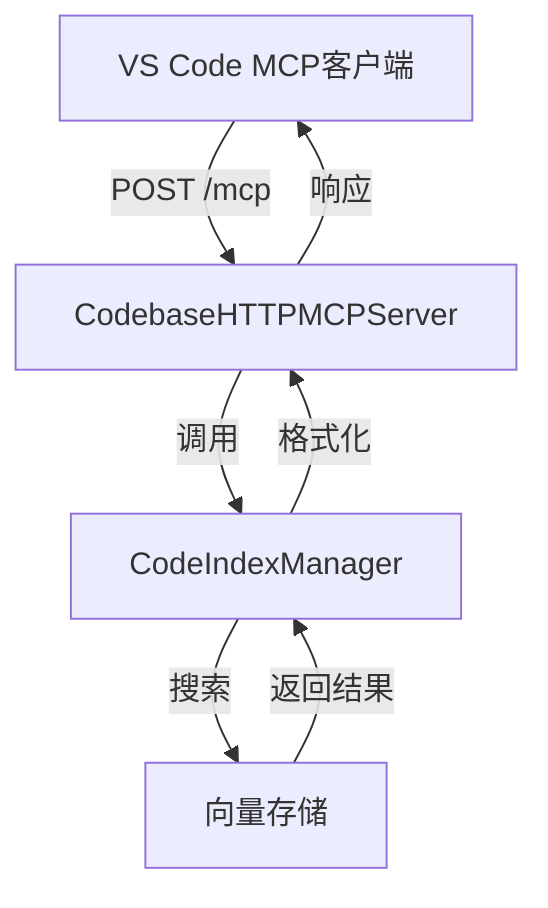
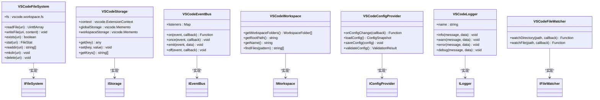
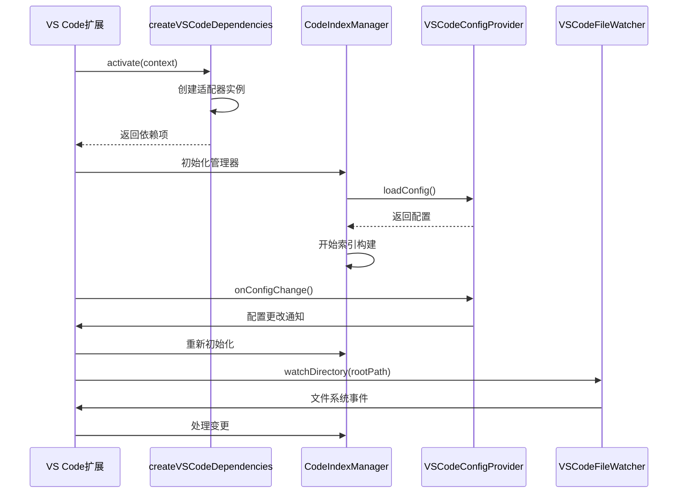
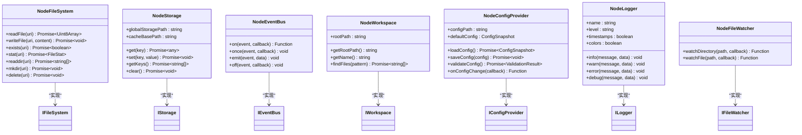
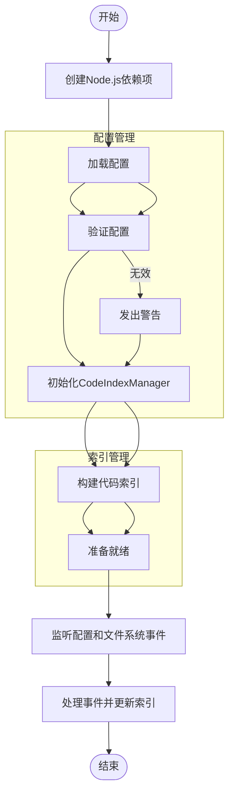

# 集成指南

<cite>
**本文档中引用的文件**   
- [server.ts](file://src/mcp/server.ts)
- [http-server.ts](file://src/mcp/http-server.ts)
- [vscode/index.ts](file://src/adapters/vscode/index.ts)
- [nodejs/index.ts](file://src/adapters/nodejs/index.ts)
- [vscode-usage.ts](file://src/examples/vscode-usage.ts)
- [nodejs-usage.ts](file://src/examples/nodejs-usage.ts)
</cite>

## 目录
1. [MCP服务器集成](#mcp服务器集成)
2. [VS Code适配器使用](#vs-code适配器使用)
3. [Node.js适配器使用](#nodejs适配器使用)

## MCP服务器集成

本节介绍如何将MCP（Model Context Protocol）服务器与支持MCP的IDE（如VS Code）集成。MCP服务器提供了语义代码搜索功能，允许开发者通过自然语言查询代码库。

### 服务器启动与配置

MCP服务器有两种实现方式：基于标准输入输出（stdio）的服务器和基于HTTP的服务器。对于IDE集成，推荐使用HTTP服务器，因为它支持流式响应和会话管理。

HTTP服务器的默认配置如下：
- **端口**: 3001
- **主机**: localhost
- **MCP端点**: `http://localhost:3001/mcp`
- **健康检查**: `http://localhost:3001/health`

**Diagram sources**
- [http-server.ts](file://src/mcp/http-server.ts#L20-L516)
- [server.ts](file://src/mcp/server.ts#L1-L309)

### 客户端连接步骤

1. **启动MCP服务器**：运行启动命令以启动HTTP服务器
2. **配置IDE**：在VS Code中配置MCP客户端扩展，指定MCP端点URL
3. **建立会话**：客户端发送初始化请求，服务器创建会话并返回会话ID
4. **执行查询**：客户端通过POST请求发送工具调用，包含查询参数
5. **接收结果**：服务器返回格式化的搜索结果，包括代码片段和元数据

服务器支持以下工具调用：
- `search_codebase`: 执行语义代码搜索
- `get_search_stats`: 获取索引状态统计信息
- `configure_search`: 配置搜索参数

**Section sources**
- [http-server.ts](file://src/mcp/http-server.ts#L20-L516)
- [server.ts](file://src/mcp/server.ts#L1-L309)

## VS Code适配器使用

VS Code适配器位于`src/adapters/vscode/`目录下，它桥接了VS Code的API与核心库的抽象接口。这些适配器允许核心库在VS Code扩展环境中运行。

### 适配器组件

VS Code适配器提供以下核心组件的实现：
- `VSCodeFileSystem`: 使用VS Code的`workspace.fs`API实现文件系统操作
- `VSCodeStorage`: 使用VS Code的`ExtensionContext`实现存储功能
- `VSCodeEventBus`: 实现事件总线模式，用于组件间通信
- `VSCodeWorkspace`: 提供工作区信息访问
- `VSCodeConfigProvider`: 管理配置的加载和保存
- `VSCodeLogger`: 提供日志记录功能
- `VSCodeFileWatcher`: 监听文件系统变化

**Diagram sources**
- [vscode/index.ts](file://src/adapters/vscode/index.ts#L1-L38)
- [vscode/file-system.ts](file://src/adapters/vscode/file-system.ts#L6-L72)

### 集成示例

`src/examples/vscode-usage.ts`文件提供了在VS Code扩展中使用这些适配器的完整示例。关键集成步骤包括：

1. **创建依赖项**：使用`createVSCodeDependencies`工厂函数创建平台依赖项
2. **初始化组件**：创建`CodeIndexManager`实例并传入适配器
3. **监听配置变化**：订阅配置更改事件以重新初始化索引
4. **文件系统监控**：设置文件监视器以响应代码库变化
5. **注册命令**：向VS Code命令系统注册自定义命令

**Diagram sources**
- [vscode-usage.ts](file://src/examples/vscode-usage.ts#L19-L27)
- [vscode-usage.ts](file://src/examples/vscode-usage.ts#L30-L104)

**Section sources**
- [vscode/index.ts](file://src/adapters/vscode/index.ts#L1-L38)
- [vscode-usage.ts](file://src/examples/vscode-usage.ts#L1-L104)

## Node.js适配器使用

Node.js适配器位于`src/adapters/nodejs/`目录下，它为在Node.js应用中嵌入代码搜索功能提供了必要的组件。这些适配器使用Node.js原生模块实现核心抽象。

### 适配器组件

Node.js适配器提供以下核心组件的实现：
- `NodeFileSystem`: 使用Node.js的`fs`模块实现文件系统操作
- `NodeStorage`: 实现基于文件系统的存储功能
- `NodeEventBus`: 实现事件总线模式
- `NodeWorkspace`: 提供工作区信息访问
- `NodeConfigProvider`: 管理配置的加载和保存
- `NodeLogger`: 提供日志记录功能
- `NodeFileWatcher`: 使用`fs.watch`监听文件系统变化

### 工厂函数

适配器提供了两个工厂函数来简化依赖项的创建：
- `createNodeDependencies`: 创建具有自定义选项的依赖项
- `createSimpleNodeDependencies`: 创建具有默认选项的依赖项

**Diagram sources**
- [nodejs/index.ts](file://src/adapters/nodejs/index.ts#L1-L92)
- [nodejs/file-system.ts](file://src/adapters/nodejs/file-system.ts#L1-L50)

### 使用示例

`src/examples/nodejs-usage.ts`文件提供了在Node.js应用中使用这些适配器的多种示例，包括基本用法、高级配置、与`CodeIndexManager`的集成以及CLI工具的实现。

关键使用模式包括：
- **基本集成**：使用`createSimpleNodeDependencies`快速设置
- **自定义配置**：通过选项参数定制存储路径、日志级别等
- **事件系统**：使用事件总线进行组件间通信
- **文件监控**：监听工作区文件变化
- **测试支持**：为测试环境创建隔离的依赖项

**Diagram sources**
- [nodejs-usage.ts](file://src/examples/nodejs-usage.ts#L1-L253)
- [nodejs/index.ts](file://src/adapters/nodejs/index.ts#L28-L75)

**Section sources**
- [nodejs/index.ts](file://src/adapters/nodejs/index.ts#L1-L92)
- [nodejs-usage.ts](file://src/examples/nodejs-usage.ts#L1-L253)