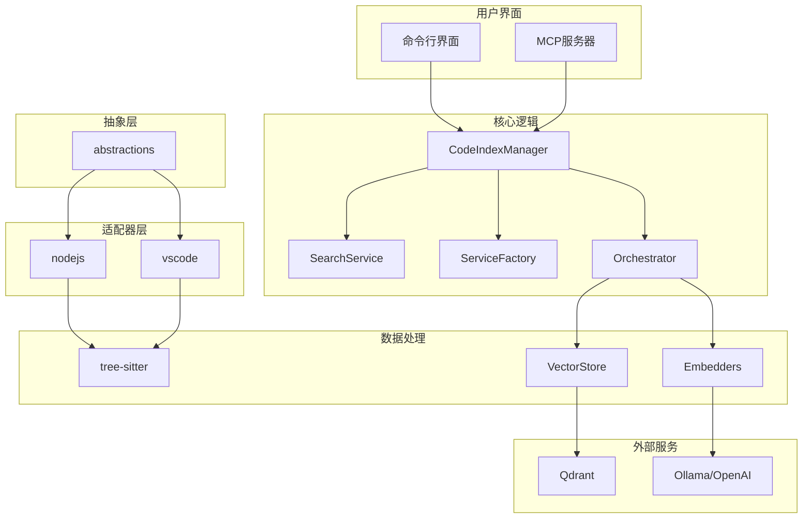
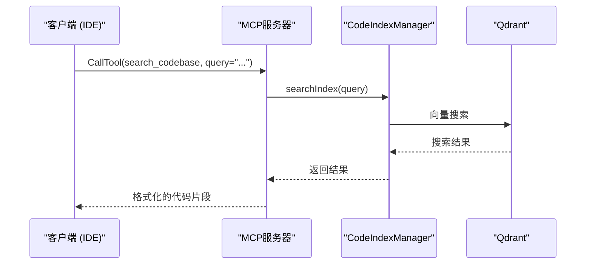

# 项目概述

<cite>
**本文档中引用的文件**  
- [README.md](file://README.md)
- [package.json](file://package.json)
- [src/abstractions/core.ts](file://src/abstractions/core.ts)
- [src/adapters/nodejs/index.ts](file://src/adapters/nodejs/index.ts)
- [src/adapters/vscode/index.ts](file://src/adapters/vscode/index.ts)
- [src/code-index/index.ts](file://src/code-index/index.ts)
- [src/code-index/manager.ts](file://src/code-index/manager.ts)
- [src/mcp/server.ts](file://src/mcp/server.ts)
- [src/tree-sitter/index.ts](file://src/tree-sitter/index.ts)
</cite>

## 目录

1. [简介](#简介)
2. [核心功能](#核心功能)
3. [技术栈](#技术栈)
4. [架构概览](#架构概览)
5. [主要目录结构](#主要目录结构)
6. [双重角色：CLI工具与可集成库](#双重角色：cli工具与可集成库)
7. [配置系统](#配置系统)
8. [MCP服务器详解](#mcp服务器详解)
9. [代码解析与语义搜索机制](#代码解析与语义搜索机制)
10. [总结](#总结)

## 简介

`autodev-codebase` 是一个平台无关的代码分析库，旨在为开发工具和集成开发环境（IDE）提供强大的代码理解能力。该项目的核心目标是通过先进的语义搜索、代码解析和向量索引技术，增强AI辅助开发的体验。它不仅能够对代码库进行深度索引和分析，还能通过MCP（Model Context Protocol）协议为大语言模型（LLM）提供上下文信息，使其能够更智能地理解和操作代码。

该项目特别适用于需要在本地或私有环境中进行代码分析的场景，支持多种嵌入模型和向量数据库，确保了灵活性和可扩展性。无论是作为独立的命令行工具运行，还是作为库集成到其他应用中，`autodev-codebase` 都能提供一致且强大的功能。

**Section sources**
- [README.md](file://README.md#L1-L341)
- [package.json](file://package.json#L0-L73)

## 核心功能

`autodev-codebase` 提供了多项关键功能，使其成为AI辅助开发生态中的重要组件。

### 语义代码搜索
该项目的核心功能是基于向量嵌入的语义代码搜索。它利用嵌入模型（如Ollama、OpenAI等）将代码片段转换为高维向量，并存储在Qdrant向量数据库中。这使得用户可以通过自然语言查询来搜索代码，而不仅仅是基于关键字的匹配。例如，用户可以搜索“如何创建一个React组件”，系统将返回相关的代码片段，即使这些片段中没有直接出现“React”或“创建”这样的字眼。

### Tree-sitter驱动的代码解析
项目使用Tree-sitter作为其代码解析引擎。Tree-sitter能够为多种编程语言生成精确的语法树（AST），从而实现对代码结构的深度分析。通过自定义的查询语言，`autodev-codebase` 可以从AST中提取出函数、类、变量等关键定义，并将其作为索引的一部分。这不仅提高了搜索的准确性，还为代码导航和理解提供了结构化数据。

### Qdrant向量数据库集成
为了高效地存储和检索向量数据，项目集成了Qdrant向量数据库。Qdrant是一个专为相似性搜索设计的开源数据库，支持高维向量的快速插入、查询和管理。`autodev-codebase` 通过`@qdrant/js-client-rest`库与Qdrant进行交互，实现了向量索引的创建、更新和搜索。

### MCP服务器支持
项目实现了MCP（Model Context Protocol）服务器，这是一个专为AI模型设计的上下文协议。MCP服务器允许IDE或开发工具将代码库的上下文信息以标准化的方式提供给AI模型。`autodev-codebase` 的MCP服务器暴露了`search_codebase`、`get_search_stats`和`configure_search`等工具，使得AI模型可以动态地查询代码库，获取相关信息。

**Section sources**
- [README.md](file://README.md#L1-L341)
- [src/mcp/server.ts](file://src/mcp/server.ts#L0-L309)

## 技术栈

`autodev-codebase` 的技术栈以TypeScript为核心，构建了一个现代化、类型安全的后端框架。

### 核心依赖
- **TypeScript**: 项目的主要编程语言，提供了强大的类型系统，有助于构建健壮和可维护的代码。
- **@qdrant/js-client-rest**: 用于与Qdrant向量数据库进行REST API交互的官方客户端库。
- **tree-sitter**: 一个解析器生成工具，用于为多种编程语言生成语法树，是代码解析功能的基础。
- **OpenAI**: 作为可选的嵌入模型提供商，项目通过`openai`库与OpenAI的API进行通信，获取文本嵌入。
- **@modelcontextprotocol/sdk**: MCP协议的官方SDK，用于实现MCP服务器和处理协议相关的请求与响应。

### 其他关键库
- **async-mutex**: 用于处理异步操作中的互斥锁，确保在并发环境下的数据一致性。
- **ignore**: 用于处理`.gitignore`风格的忽略规则，决定哪些文件应该被索引。
- **undici**: 一个高性能的HTTP客户端，用于底层的网络请求。
- **vitest**: 用于单元测试和集成测试的测试框架。

**Section sources**
- [package.json](file://package.json#L0-L73)
- [README.md](file://README.md#L1-L341)

## 架构概览

`autodev-codebase` 的架构设计遵循模块化和平台无关的原则，其核心组件可以分为以下几个层次：

**Diagram sources**
- [src/abstractions/core.ts](file://src/abstractions/core.ts#L0-L64)
- [src/adapters/nodejs/index.ts](file://src/adapters/nodejs/index.ts#L0-L92)
- [src/code-index/manager.ts](file://src/code-index/manager.ts#L23-L351)
- [src/mcp/server.ts](file://src/mcp/server.ts#L0-L309)

**Section sources**
- [src/abstractions/core.ts](file://src/abstractions/core.ts#L0-L64)
- [src/adapters/nodejs/index.ts](file://src/adapters/nodejs/index.ts#L0-L92)

## 主要目录结构

项目的源代码组织在`src/`目录下，其结构清晰，职责分明。

### abstractions
该目录定义了项目的核心抽象接口，如`IFileSystem`、`IStorage`、`IEventBus`等。这些接口确保了项目的平台无关性，使得同一套核心逻辑可以在Node.js和VSCode等不同环境中运行。

### adapters
适配器层实现了`abstractions`中定义的接口。`nodejs/`目录提供了基于Node.js原生API的实现，而`vscode/`目录则利用VSCode的API来实现相同的功能。这种设计模式使得项目可以轻松地集成到不同的开发环境中。

### code-index
这是项目的核心模块，负责代码索引的整个生命周期管理。它包含了配置管理、缓存管理、服务工厂、编排器（Orchestrator）和搜索服务等子模块。`CodeIndexManager`类是这一模块的入口点，负责协调所有组件。

### mcp
该目录实现了MCP服务器的功能。`server.ts`文件定义了`CodebaseMCPServer`类，它注册了`search_codebase`等工具，并处理来自客户端的请求。

### tree-sitter
此模块封装了Tree-sitter的使用，提供了`parseSourceCodeDefinitionsForFile`等函数，用于解析单个文件或整个目录的代码结构。

### 其他目录
- `cli/`: 包含命令行界面的实现。
- `examples/`: 提供了各种使用示例。
- `shared/`: 存放跨模块共享的工具函数。

**Section sources**
- [project_structure](file://#L1-L200)

## 双重角色：CLI工具与可集成库

`autodev-codebase` 具有双重身份，既可以作为一个独立的CLI工具使用，也可以作为一个库被其他项目集成。

### 作为CLI工具
通过`npm install -g @autodev/codebase`安装后，用户可以使用`codebase`命令来启动服务。它支持两种主要模式：
- **交互式TUI模式**：提供一个基于终端的用户界面，方便用户进行搜索和配置。
- **MCP服务器模式**：启动一个长期运行的HTTP服务器，供IDE或其他工具连接。

### 作为可集成库
项目通过`index.ts`文件暴露了其核心API。其他项目可以通过`import { CodeIndexManager } from '@autodev/codebase'`来引入并使用其功能。例如，在一个VSCode扩展中，开发者可以创建一个`CodeIndexManager`实例，并将其与VSCode的文件系统和事件总线连接起来，从而为用户提供智能的代码搜索功能。

这种双重设计极大地扩展了项目的适用范围，使其不仅是一个独立的工具，更是一个可以构建在之上的平台。

**Section sources**
- [package.json](file://package.json#L0-L73)
- [README.md](file://README.md#L1-L341)
- [src/index.ts](file://src/index.ts#L0-L28)

## 配置系统

项目采用分层的配置系统，允许用户在不同级别上进行定制。

### 配置优先级
配置的优先级从高到低依次为：
1. **CLI参数**：在命令行中直接指定的参数，具有最高优先级。
2. **项目配置文件**：位于项目根目录下的`autodev-config.json`。
3. **全局配置文件**：位于`~/.autodev-cache/autodev-config.json`。
4. **内置默认值**：当以上配置均未提供时，使用内置的默认设置。

### 配置选项
主要的配置选项包括：
- `embedder.provider`: 指定嵌入模型提供商（如`ollama`、`openai`）。
- `qdrantUrl`: Qdrant向量数据库的URL。
- `searchMinScore`: 搜索结果的最低相似度阈值。

这种灵活的配置机制使得用户可以根据自己的环境和需求轻松地调整项目行为。

**Section sources**
- [README.md](file://README.md#L1-L341)

## MCP服务器详解

MCP服务器是`autodev-codebase`与外部世界交互的主要方式。

### 工具注册
服务器在启动时会注册三个核心工具：
- `search_codebase`: 允许客户端提交搜索查询，返回相关的代码片段。
- `get_search_stats`: 返回当前索引的状态信息，如索引的文件数量和状态。
- `configure_search`: 允许客户端动态调整搜索参数。

### 请求处理
服务器使用`@modelcontextprotocol/sdk`中的`Server`类来处理请求。每个工具都有一个对应的请求处理器，当收到请求时，服务器会根据工具名称调用相应的处理函数。例如，`handleSearchCodebase`函数会调用`CodeIndexManager`的`searchIndex`方法来执行实际的搜索。

### 传输层
服务器支持通过标准输入输出（stdio）或HTTP进行通信。`StdioServerTransport`类负责处理stdio流，而`http-server.ts`则提供了HTTP端点。

**Diagram sources**
- [src/mcp/server.ts](file://src/mcp/server.ts#L0-L309)
- [src/code-index/manager.ts](file://src/code-index/manager.ts#L23-L351)

**Section sources**
- [src/mcp/server.ts](file://src/mcp/server.ts#L0-L309)

## 代码解析与语义搜索机制

`autodev-codebase` 的强大功能源于其精密的代码解析和语义搜索机制。

### 代码解析流程
1. **文件扫描**：使用`ripgrep`快速扫描工作区，获取所有相关文件的路径。
2. **语法树生成**：对于每个文件，根据其扩展名加载相应的Tree-sitter解析器，并生成AST。
3. **定义提取**：使用预定义的查询（queries）从AST中提取出函数、类等定义。
4. **内容格式化**：将提取的定义格式化为易于理解的文本，包括行号和代码上下文。

### 语义搜索流程
1. **查询嵌入**：将用户的自然语言查询通过嵌入模型转换为向量。
2. **向量搜索**：在Qdrant中执行近似最近邻搜索（ANN），找到与查询向量最相似的代码向量。
3. **结果过滤**：根据配置的过滤器（如路径、最小分数）对结果进行筛选。
4. **结果呈现**：将搜索结果格式化为包含文件路径、相似度分数和代码块的文本。

这一机制确保了搜索不仅快速，而且高度相关，极大地提升了开发者的效率。

**Section sources**
- [src/tree-sitter/index.ts](file://src/tree-sitter/index.ts#L0-L429)
- [src/code-index/search-service.ts](file://src/code-index/search-service.ts#L0-L28)
- [src/code-index/manager.ts](file://src/code-index/manager.ts#L23-L351)

## 总结

`autodev-codebase` 是一个功能强大且设计精良的后端框架/库，为AI辅助开发提供了坚实的基础。它通过结合Tree-sitter的精确代码解析、向量数据库的高效语义搜索以及MCP协议的标准化接口，创造了一个智能的代码理解环境。其模块化的架构和平台无关的设计使其具有极高的灵活性和可扩展性，既可以作为独立工具使用，也可以无缝集成到现有的开发工具链中。对于希望提升代码分析和搜索能力的开发者和团队来说，`autodev-codebase` 是一个极具价值的解决方案。