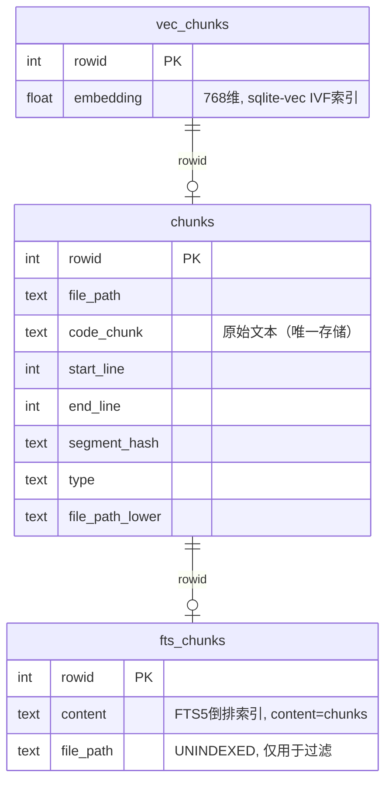

# 260529-Local Vector Store

## 主题/需求

将当前依赖外部 Qdrant 服务的向量存储替换为本地嵌入式方案，支持混合搜索（Dense Embedding + BM25），单文件存储，零外部服务依赖。

### 目标

- 去掉对 Qdrant 独立服务的依赖（不再需要 `brew install qdrant` + 守护进程）
- 数据文件统一收归 `~/.autodev-cache/` 缓存体系
- 保持与现有 `IVectorStore` 接口兼容
- 保持混合搜索（RRF Fusion）的搜索质量

## 代码背景

### 相关文件

| 文件 | 角色 |
|------|------|
| `src/code-index/interfaces/vector-store.ts` | `IVectorStore` 接口定义 |
| `src/code-index/vector-store/qdrant-client.ts` | 当前 Qdrant 实现（895 行） |
| `src/code-index/search-service.ts` | 搜索服务，调用 `IVectorStore.search()` |
| `src/code-index/config-manager.ts` | 配置管理，含 hybridSearch 相关配置 |
| `src/code-index/interfaces/config.ts` | 配置类型定义 |
| `src/code-index/cache-manager.ts` | 文件哈希变更检测缓存 |
| `src/cli-tools/summary-cache.ts` | AI 摘要缓存 |
| `src/dependency/cache-manager.ts` | 依赖分析缓存 |

### 当前数据流

```
代码块 ─→ 嵌入模型 → [0.1, 0.5, ...] ─┐
                                       ├── Qdrant RRF Fusion → 结果
原始文本 ─→ qdrant/bm25 (服务端分词) ──┘
```

Qdrant 内部存储三样东西：
1. **Dense 向量** → HNSW 索引（`vector: { "": [...] }`）
2. **BM25 稀疏向量** → 内置 sparse_vectors（`vector: { "bm25": { text, model: "qdrant/bm25" } }`）
3. **Payload** → Qdrant 私有存储引擎（filePath, codeChunk, startLine, endLine, pathSegments 等）

### 当前缓存体系

```
~/.autodev-cache/
├── roo-index-cache-{hash}.json          ← 文件哈希映射（变更检测）
├── summary-cache/{hash}/files/          ← AI 摘要（每文件 JSON）
├── dependency-cache/{hash}/...          ← 依赖分析缓存
  ~~ Qdrant 在外部（~/.local/share/qdrant/），与缓存体系割裂 ~~
```

## 运行现象

当前 Qdrant 方案的问题：
1. 运行前必须启动 Qdrant 服务（`qdrant` 或 docker）
2. Qdrant 占用额外 ~50MB RAM（即使 idle）
3. 配置需要填 `qdrantUrl`、`qdrantApiKey`，复杂度高
4. 重启或搬机器要重新搭 Qdrant 服务
5. 数据和项目缓存体系割裂（存在不同位置）

## 归因分析

根本原因是 Qdrant 是一个 **C/S 架构** 的专用向量数据库，而本项目的场景更适合**嵌入式数据库**：

- 搜索是单用户本地使用，不需要并发
- 数据量级在 10 万条以下级别，不需要分布式
- 不需要跨进程/跨机器共享
- 真正的需求是：本地代码索引工具，不是生产级搜索服务

## 关键决策

### 方案选型

| 方案 | 单文件 | BM25 | 向量搜索 | 决策 |
|------|--------|------|----------|------|
| **SQLite + sqlite-vec + FTS5** | ✅ | ✅ (FTS5 BM25) | ✅ | **采纳** |
| LanceDB | ❌ 目录 | ✅ Tantivy | ✅ | 淘汰（非单文件） |
| DuckDB | ✅ | ⚠️ 扩展 | ⚠️ 扩展 | 淘汰（非专用） |

### 存储结构设计

**文件位置**：`~/.autodev-cache/vector-store/{project-hash}/index.db`

**表结构**（文本只存一份，FTS5 外部内容表）：



FTS5 使用 `content=chunks, content_rowid=rowid` 配置为**外部内容表**，`code_chunk` 文本只在 `chunks` 表中存一份，FTS5 只维护倒排索引（term dictionary + segment data），约原始文本大小的 30%。

### 与其他缓存的关系

| 缓存 | 存放位置 | 是否被 SQLite 替代 |
|------|---------|-------------------|
| **向量 + payload + BM25** | `vector-store/{hash}/index.db` | ✅ 替代 Qdrant |
| **文件哈希 (roo-index-cache)** | `~/.autodev-cache/roo-index-cache-{hash}.json` | ❌ 保持 JSON（纯 KV，读入内存最快） |
| **AI 摘要** | `~/.autodev-cache/summary-cache/` | ❌ 保持 JSON |
| **依赖分析** | `~/.autodev-cache/dependency-cache/` | ❌ 保持 JSON |

### 混合搜索策略

沿用当前 Qdrant 实现的 RRF（Reciprocal Rank Fusion）算法：

```
Dense: sqlite-vec cosine → rank ─┐
                                  ├── RRF → 最终排序
BM25:  FTS5 bm25() score → rank ─┘
```

与当前配置无缝对接：
- `hybridSearchDenseWeight` / `hybridSearchSparseWeight` → RRF rank 加权
- `vectorSearchMinScore` → dense 端 score 过滤
- `vectorSearchMaxResults` → 最终 limit

### 与 Qdrant 对比

| 维度 | Qdrant | SQLite 方案 | 变化方向 |
|------|--------|-------------|---------|
| 架构 | C/S 服务 | 嵌入式 | 🎯 简化 |
| 部署 | `brew install` + 守护进程 | 无 | 🎯 简化 |
| RAM 占用 | ~50MB | ~0（按需读取） | ✅ 降低 |
| 数据便携 | 多目录二进制块 | 单文件 `.db` | ✅ 提升 |
| 文本存储 | payload + BM25 词袋编码 | chunks 表一份 | ✅ 更省 |
| 分布式 | ✅ | ❌ | 本项目不需要 |

## 实施计划

- [ ] **阶段 1：实现 `SQLiteVectorStore` 核心类**
  - 实现 `IVectorStore` 接口
  - 建表（vec_chunks, chunks, fts_chunks）
  - 实现 `initialize`, `upsertPoints`, `search`, `deletePointsByFilePath`, `clearCollection`, `collectionExists` 等方法
  - 实现 RRF Fusion 混合搜索

- [ ] **阶段 2：配置与工厂类**
  - `CodeIndexConfigManager` 中添加 SQLite 路径配置
  - 去掉 `qdrantUrl` / `qdrantApiKey` 强校验
  - 选择合适的 db 路径（按 workspace hash 隔离）

- [ ] **阶段 3：迁移与验证**
  - 测试基础 CRUD：索引 → 搜索 → 删除 → 重建
  - 测试混合搜索结果与 Qdrant 版本对比
  - 运行现有单元测试和 e2e 测试
  - 性能基准测试（索引速度、搜索延迟）

- [ ] **阶段 4：清理**
  - 移除 `@qdrant/js-client-rest` 依赖
  - 添加 `better-sqlite3` + `sqlite-vec` 依赖
  - 更新配置文档和默认值
  - 去掉 Qdrant 启动相关注释和文档

### 使用的 npm 包

```json
{
  "dependencies": {
    "better-sqlite3": "^11.7.0",
    "sqlite-vec": "^0.1.6"
  },
  "devDependencies": {
    "@types/better-sqlite3": "^7.6.0"
  }
}
```

`better-sqlite3` 是同步 API（比异步更快，适合本地工具场景），`sqlite-vec` 是 sqlite3 的向量搜索扩展。

## 实施记录

### 2026-05-29
- 讨论并确定了从 Qdrant 迁移到 SQLite 的可行性
- 明确了存储结构：SQLite + sqlite-vec（向量）+ FTS5（BM25）
- 确认文本只存一份（FTS5 外部内容表，`content=chunks`）
- 确认 file hash 缓存保持 JSON（纯 KV 场景 SQLite 反而不如内存快）
- 确认其他缓存（摘要、依赖分析）不受影响

## 修订记录

### 2026-05-29
**问题：** 初版方案中 `fts_chunks` 与 `chunks` 中有重复文本存储
**修复：** 采用 FTS5 外部内容表机制（`content=chunks, content_rowid=rowid`），文本只在 `chunks.code_chunk` 存一份

## 总结

### 关键收获
1. SQLite + FTS5 外部内容表 + sqlite-vec 的组合完美覆盖 Qdrant 的三大功能（向量搜索、BM25、payload 存储）
2. 文本只需存一份，利用 FTS5 的 `content=` 机制
3. 文件哈希（纯 KV 高频读写）不适合放进 SQLite，JSON 全量读入内存更快
4. 整体迁移影响面可控——只替换 `QdrantVectorStore` 一个类，上层 `search-service.ts` 无感知

### 后续考虑
- 是否需要兼容模式（同时支持 Qdrant 和 SQLite，通过配置切换）？
- sqlite-vec 的写入延迟是否会拖慢批量索引速度？（可用 WAL 模式缓解）
- 是否需要在 `codebase config` 中暴露 db 路径给用户？
