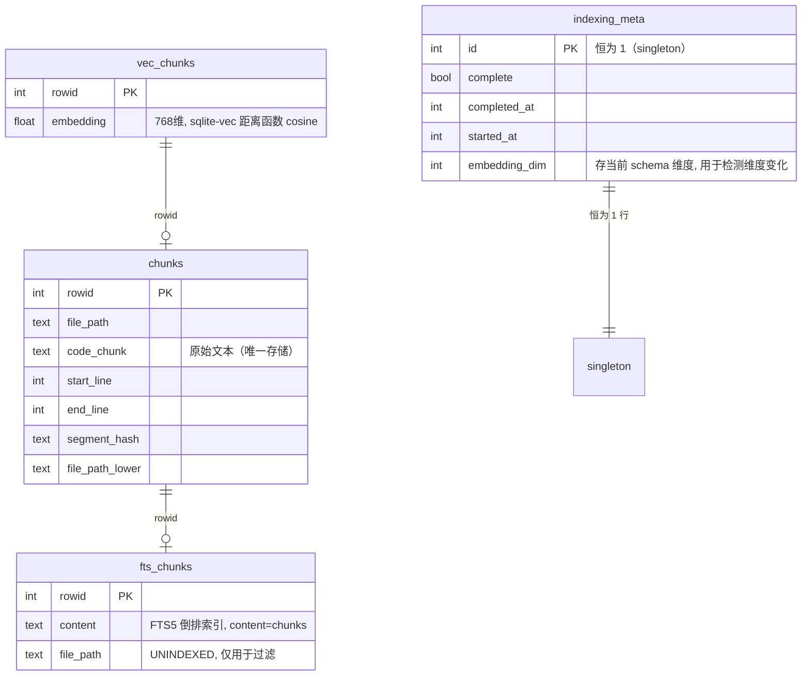

# 260529-Local Vector Store

## 主题/需求

将当前依赖外部 Qdrant 服务的向量存储**增加本地嵌入式方案作为默认选项**，保留 Qdrant 作为可选后端。SQLite 后端支持混合搜索（Dense Embedding + BM25），单文件存储，零外部服务依赖。

### 目标

- 提供本地 SQLite 后端作为**默认选项**（不需要 `brew install qdrant` + 守护进程）
- 数据文件统一收归 `~/.autodev-cache/` 缓存体系
- 保持与现有 `IVectorStore` 接口兼容
- 保持混合搜索（RRF Fusion）的搜索质量
- **支持通过 `vectorStoreBackend` 配置项在 Qdrant 和 SQLite 之间切换**（默认 SQLite）

## 代码背景

### 相关文件

| 文件 | 角色 |
|------|------|
| `src/code-index/interfaces/vector-store.ts` | `IVectorStore` 接口定义 |
| `src/code-index/vector-store/qdrant-client.ts` | 当前 Qdrant 实现（895 行） |
| `src/code-index/search-service.ts` | 搜索服务，调用 `IVectorStore.search()` |
| `src/code-index/config-manager.ts` | 配置管理，含 hybridSearch 相关配置 |
| `src/code-index/interfaces/config.ts` | 配置类型定义 |
| `src/code-index/cache-manager.ts` | 文件哈希变更检测缓存 |
| `src/cli-tools/summary-cache.ts` | AI 摘要缓存 |
| `src/dependency/cache-manager.ts` | 依赖分析缓存 |

### 当前数据流

```
代码块 ─→ 嵌入模型 → [0.1, 0.5, ...] ─┐
                                       ├── Qdrant RRF Fusion → 结果
原始文本 ─→ qdrant/bm25 (服务端分词) ──┘
```

Qdrant 内部存储三样东西：
1. **Dense 向量** → HNSW 索引（`vector: { "": [...] }`）
2. **BM25 稀疏向量** → 内置 sparse_vectors（`vector: { "bm25": { text, model: "qdrant/bm25" } }`）
3. **Payload** → Qdrant 私有存储引擎（filePath, codeChunk, startLine, endLine, pathSegments 等）

### 当前缓存体系

```
~/.autodev-cache/
├── roo-index-cache-{hash}.json          ← 文件哈希映射（变更检测）
├── summary-cache/{hash}/files/          ← AI 摘要（每文件 JSON）
├── dependency-cache/{hash}/...          ← 依赖分析缓存
  ~~ Qdrant 在外部（~/.local/share/qdrant/），与缓存体系割裂 ~~
```

## 运行现象

当前 Qdrant 方案的问题：
1. 运行前必须启动 Qdrant 服务（`qdrant` 或 docker）
2. Qdrant 占用额外 ~50MB RAM（即使 idle）
3. 配置需要填 `qdrantUrl`、`qdrantApiKey`，复杂度高
4. 重启或搬机器要重新搭 Qdrant 服务
5. 数据和项目缓存体系割裂（存在不同位置）

## 归因分析

根本原因是 Qdrant 是一个 **C/S 架构** 的专用向量数据库，而本项目的场景更适合**嵌入式数据库**：

- 搜索是单用户本地使用，不需要并发
- 数据量级在 10 万条以下级别，不需要分布式
- 不需要跨进程/跨机器共享
- 真正的需求是：本地代码索引工具，不是生产级搜索服务

## 关键决策

### 方案选型

| 方案 | 单文件 | BM25 | 向量搜索 | 决策 |
|------|--------|------|----------|------|
| **SQLite + sqlite-vec + FTS5** | ✅ | ✅ (FTS5 BM25) | ✅ | **默认后端** |
| LanceDB | ❌ 目录 | ✅ Tantivy | ✅ | 淘汰（非单文件） |
| DuckDB | ✅ | ⚠️ 扩展 | ⚠️ 扩展 | 淘汰（非专用） |
| **Qdrant**（保留） | ❌ 服务 | ✅ 内置 | ✅ | **可选后端，兼容场景** |

### 后端选型与工厂

`CodeIndexConfig` 新增字段：

```typescript
vectorStoreBackend?: "qdrant" | "sqlite"  // 默认 "sqlite"
```

**默认值推导**：

```
启动 → 读 config.vectorStoreBackend
     → 未设置且 qdrantUrl 存在 → "qdrant"（向旧配置兼容）
     → 未设置且 qdrantUrl 不存在 → "sqlite"（新用户默认）
     → 显式设置 → 以设置为准
```

**工厂函数**（独立文件 `src/code-index/vector-store/factory.ts`）：

```typescript
export function createVectorStore(
  config: CodeIndexConfig,
  workspacePath: string,
  logger?: LoggerLike,
): IVectorStore {
  const backend = resolveBackend(config)
  const dimension = config.embedderModelDimension ?? 768

  switch (backend) {
    case "qdrant":
      return new QdrantVectorStore(
        workspacePath,
        dimension,
        config.qdrantUrl,
        config.qdrantApiKey,
        logger,
      )
    case "sqlite":
      return new SQLiteVectorStore(workspacePath, dimension, logger)
    default:
      throw new Error(`Unknown vector store backend: ${backend}`)
  }
}
```

`orchestrator.ts` 不再直接 `new QdrantVectorStore(...)`，改为调用 `createVectorStore(config, workspacePath, logger)`。

**`isConfigured()` 分支**（config-manager.ts）：

```typescript
if (config.vectorStoreBackend === "qdrant") {
  // 仍需要 qdrantUrl
  return !!(qdrantUrl)
}
// sqlite 后端不再需要额外配置（路径走 workspace hash 推导）
return true
```

**`REQUIRES_RESTART_KEYS` 新增**：

```typescript
'vectorStoreBackend',  // 切换后端必须重新初始化 vector store
```

**切换后端的影响**：

- 两后端数据**互不兼容**（Qdrant 存多目录二进制，SQLite 存 `.db` 文件）
- 切换后需要重新索引，不提供自动数据迁移
- CLI 提示：`codebase index --force` 或手动删 `~/.autodev-cache/vector-store/`

### 存储结构设计

**文件位置**：`~/.autodev-cache/vector-store/{project-hash}/index.db`

**表结构**（文本只存一份，FTS5 外部内容表）：



FTS5 使用 `content=chunks, content_rowid=rowid` 配置为**外部内容表**，`code_chunk` 文本只在 `chunks` 表中存一份，FTS5 只维护倒排索引（term dictionary + segment data），约原始文本大小的 30%。

**`indexing_meta` 表**：替代 Qdrant 方案中"特殊 UUID + `type=metadata` 标记点"的实现，单独建一张单行表存索引状态。这样：
- 不污染 `chunks` / `fts_chunks` 搜索结果
- 不需要在每次 `search` 时加 `must_not type=metadata` 过滤
- 顺带存 `embedding_dim`，用于启动时检测维度变化触发 schema 重建

#### DDL 与 PRAGMA

建表 SQL（核心部分）：

```sql
-- chunks: 原始数据 + payload
CREATE TABLE chunks (
  rowid INTEGER PRIMARY KEY,
  file_path TEXT NOT NULL,
  code_chunk TEXT NOT NULL,
  start_line INTEGER NOT NULL,
  end_line INTEGER NOT NULL,
  segment_hash TEXT NOT NULL,
  file_path_lower TEXT NOT NULL  -- 预计算小写, path filter 加速
);
CREATE INDEX idx_chunks_file_path ON chunks(file_path);
CREATE INDEX idx_chunks_file_path_lower ON chunks(file_path_lower);

-- vec_chunks: 向量, rowid 关联 chunks
CREATE VIRTUAL TABLE vec_chunks USING vec0(
  embedding float[768] distance_metric=cosine
);

-- fts_chunks: BM25 倒排索引（外部内容表）
CREATE VIRTUAL TABLE fts_chunks USING fts5(
  content,
  file_path UNINDEXED,
  content='chunks',
  content_rowid='rowid',
  tokenize='unicode61 remove_diacritics 2 tokenchars ''_.$'''
);

-- FTS5 外部表的同步触发器（官方不自动维护）
CREATE TRIGGER chunks_ai AFTER INSERT ON chunks BEGIN
  INSERT INTO fts_chunks(rowid, file_path) VALUES (new.rowid, new.file_path);
END;
CREATE TRIGGER chunks_ad AFTER DELETE ON chunks BEGIN
  INSERT INTO fts_chunks(fts_chunks, rowid, file_path) VALUES('delete', old.rowid, old.file_path);
END;
CREATE TRIGGER chunks_au AFTER UPDATE ON chunks BEGIN
  INSERT INTO fts_chunks(fts_chunks, rowid, file_path) VALUES('delete', old.rowid, old.file_path);
  INSERT INTO fts_chunks(rowid, file_path) VALUES (new.rowid, new.file_path);
END;

-- indexing_meta: 索引状态 singleton
CREATE TABLE indexing_meta (
  id INTEGER PRIMARY KEY CHECK (id = 1),
  complete INTEGER NOT NULL DEFAULT 0,
  completed_at INTEGER,
  started_at INTEGER,
  embedding_dim INTEGER
);
INSERT OR IGNORE INTO indexing_meta(id, complete) VALUES (1, 0);
```

`initialize()` 第一步设置 PRAGMA：

```sql
PRAGMA journal_mode = WAL;             -- 读不阻塞写
PRAGMA synchronous = NORMAL;           -- WAL 配套, 性能/安全平衡
PRAGMA busy_timeout = 5000;            -- 写写并发等待
PRAGMA cache_size = -32000;            -- 32MB 页缓存
PRAGMA mmap_size = 268435456;          -- 256MB mmap
PRAGMA temp_store = MEMORY;            -- 临时表放内存
```

**FTS5 tokenizer** 选择 `unicode61` + `tokenchars '_.$'`，让 `getUserById` / `CodeIndexManager` / `code128` 之类的代码标识符能切出有效 token（默认 unicode61 会把它们当作一整个词）。与 Qdrant 内置 BM25 分词行为最接近。

#### 维度变化处理

`vec_chunks` 虚拟表的维度是 schema 级固定的（`float[768]`）。当 `embedderModelDimension` 变化时（用户切换 embedder 模型），必须重建：

```
启动 → 读 indexing_meta.embedding_dim
     → 与 config.embedderModelDimension 比较
     → 不一致 → drop 所有表 → 重新 DDL → 写新维度
     → 一致 → 正常打开
```

这块逻辑要放在 `initialize()` 早期，**比 PRAGMA 还早**——维度不匹配时 WAL 文件结构也会不一致，必须先处理。

#### Path Filter 处理

当前 `qdrant-client.ts` 里的 `PatternCompiler`（约 130 行，glob 解析 + 大小写不敏感匹配）**必须 1:1 移植**到 `SQLiteVectorStore`：

- 抽到独立文件 `src/code-index/vector-store/path-filter.ts`
- SQLite 端用 `WHERE file_path_lower LIKE ?` + `NOT LIKE` 拼装 include / exclude 子句
- brace expansion `{a,b}` 必须在应用层展开（SQLite 无原生展开）

> 计划里的 "保持与现有 `IVectorStore` 接口兼容" 隐含了 `pathFilters` 行为兼容, 任何 glob 差异都是 regression。

#### upsertPoints 事务策略

`upsertPoints` 是 upsert 语义（按 id 替换）。SQLite 端必须保证 chunks / vec_chunks / fts_chunks 三表原子性：

```typescript
db.transaction((points) => {
  for (const p of points) {
    // 1. chunks 主表
    db.prepare(`
      INSERT INTO chunks (rowid, file_path, code_chunk, start_line, end_line, segment_hash, file_path_lower)
      VALUES (?, ?, ?, ?, ?, ?, ?)
      ON CONFLICT(rowid) DO UPDATE SET
        file_path=excluded.file_path,
        code_chunk=excluded.code_chunk,
        start_line=excluded.start_line,
        end_line=excluded.end_line,
        segment_hash=excluded.segment_hash,
        file_path_lower=excluded.file_path_lower
    `).run(p.id, p.payload.filePath, p.payload.codeChunk, ...)

    // 2. vec_chunks
    db.prepare(`
      INSERT OR REPLACE INTO vec_chunks (rowid, embedding) VALUES (?, ?)
    `).run(p.id, vectorToBlob(p.vector))

    // 3. FTS5 同步由 chunks_au 触发器自动完成
  }
})(points)
```

**注意顺序**：先 `chunks` 后 `vec_chunks`。反过来 `vec_chunks` 写成功但 `chunks` 失败时, FTS5 不会有这条记录, 搜索时 BM25 端丢一条结果但向量端有, RRF 会引入偏差。

### 与其他缓存的关系

| 缓存 | 存放位置 | 是否被 SQLite 替代 |
|------|---------|-------------------|
| **向量 + payload + BM25**（SQLite 后端） | `vector-store/{hash}/index.db` | ✅ SQLite 后端替代 Qdrant |
| **向量 + payload + BM25**（Qdrant 后端） | Qdrant 服务内 | ❌ Qdrant 后端保持原状 |
| **文件哈希 (roo-index-cache)** | `~/.autodev-cache/roo-index-cache-{hash}.json` | ❌ 保持 JSON（纯 KV，读入内存最快） |
| **AI 摘要** | `~/.autodev-cache/summary-cache/` | ❌ 保持 JSON |
| **依赖分析** | `~/.autodev-cache/dependency-cache/` | ❌ 保持 JSON |

### 混合搜索策略

沿用当前 Qdrant 实现的 RRF（Reciprocal Rank Fusion）算法：

```
Dense: sqlite-vec cosine → rank ─┐
                                  ├── RRF → 最终排序
BM25:  FTS5 bm25() score → rank ─┘
```

与当前配置无缝对接：
- `hybridSearchDenseWeight` / `hybridSearchSparseWeight` → RRF rank 加权
- `vectorSearchMinScore` → dense 端 score 过滤
- `vectorSearchMaxResults` → 最终 limit

**距离度量与 score 归一化**：

- `vec_chunks` 显式声明 `distance_metric=cosine`，sqlite-vec 返回的 distance 范围 [0, 2]
- `IVectorStore.search` 返回前必须做 `score = 1 - distance`，归一化到 [0, 1]
- 这样上层 `search-service.ts` 的 `minScore` 阈值（典型 0.1 ~ 0.4）继续生效，不需要改配置默认值

**Pre-filter vs Post-filter**：

sqlite-vec 0.1.x **不支持原生 pre-filter**（"先按 metadata 过滤再 KNN"），与 Qdrant 行为不一致。SQLite 端只能用 post-filter：

1. 拿 query 向量对 `vec_chunks` 做 KNN，取 `limit * overfetch`（默认过采系数 3 ~ 5）个候选
2. 对候选集按 `pathFilters` 过滤（用 `file_path_lower` 上的索引）
3. 过滤后若不足 `limit`，返回现有结果（不补——补的话意味着过采系数太小）
4. **RRF 融合时只对 post-filter 后的结果集做排名**——避免把被 path filter 排除的 id 算进来

`pathFilters` 收紧时（只搜 `src/auth.ts`），过采系数可以相应减小；放宽时（搜全工作区）应自动放大到 5。

### 与 Qdrant 对比

| 维度 | Qdrant | SQLite 方案 | 变化方向 |
|------|--------|-------------|---------|
| 架构 | C/S 服务 | 嵌入式 | 🎯 简化 |
| 部署 | `brew install` + 守护进程 | 无 | 🎯 简化 |
| RAM 占用 | ~50MB | ~0（按需读取） | ✅ 降低 |
| 数据便携 | 多目录二进制块 | 单文件 `.db` | ✅ 提升 |
| 文本存储 | payload + BM25 词袋编码 | chunks 表一份 | ✅ 更省 |
| 分布式 | ✅ | ❌ | 本项目不需要 |

**什么时候选哪个后端**：

| 场景 | 推荐 |
|------|------|
| 本地开发机、单用户 | SQLite（默认） |
| 数据量 > 50万条向量 | Qdrant（SQLite 全表扫会变慢） |
| 跨机器同步、团队共享索引 | Qdrant（远端部署） |
| 不需要外部服务 | SQLite |
| 已有 Qdrant 部署 | Qdrant（避免迁移） |

## 实施计划

- [x] **阶段 1：实现 `SQLiteVectorStore` 核心类**
  - 抽取 `PathFilter` 到 `src/code-index/vector-store/path-filter.ts`（从 `qdrant-client.ts` 的 `PatternCompiler` 独立出来）
  - 建表 DDL（chunks / vec_chunks / fts_chunks / indexing_meta，含 3 个 FTS5 同步触发器、2 个 chunks 索引）
  - `initialize()` 中依次：维度检测与重建 → PRAGMA 设置 → 建表（如果不存在）
  - 实现 `IVectorStore` 全量方法：`initialize` / `upsertPoints` / `search` / `deletePointsByFilePath` / `deletePointsByMultipleFilePaths` / `clearCollection` / `deleteCollection` / `collectionExists` / `getAllFilePaths` / `hasIndexedData` / `markIndexingComplete` / `markIndexingIncomplete`
  - `search` 实现 RRF Fusion + post-filter 过采 + score 归一化（`1 - distance`）
  - `upsertPoints` 用单事务包 chunks + vec_chunks（顺序：先 chunks 后 vec_chunks，fts 靠触发器）
  - 单元测试：mock free, 用 tmpdir 真实落盘

- [x] **阶段 2：配置与工厂类**
  - `CodeIndexConfig` / `PreviousConfigSnapshot` / `ConfigSnapshot` 新增 `vectorStoreBackend?: "qdrant" | "sqlite"`
  - `resolveBackend(config)` 默认值推导逻辑：未设置且 `qdrantUrl` 存在 → `"qdrant"`，否则 `"sqlite"`
  - 新建 `src/code-index/vector-store/factory.ts`，实现 `createVectorStore(config, workspacePath, logger)`
  - `orchestrator.ts` 改调用工厂，不再直接 `new QdrantVectorStore`
  - `CodeIndexConfigManager.isConfigured()` 按后端分支
  - `REQUIRES_RESTART_KEYS` 加 `vectorStoreBackend`
  - `qdrantUrl` / `qdrantApiKey` 仍保留（仅 sqlite 后端不使用），不标 `@deprecated`（因为作为可选后端可能仍被配置）
  - 按 workspace hash 隔离 db 路径（`createHash("sha256").update(workspacePath)`）

- [x] **阶段 3：迁移与验证**
  - 基础 CRUD：SQLite 后端 → 索引 → 搜索 → 删除 → 重建
  - **双后端单元测试**：同一组 `IVectorStore` 行为测试用例，在两个后端上跑一遍
    - Qdrant 后端需要跳过的测试（不起 Qdrant service）用 `describe.skip` 或在 CI 里 conditional skip
  - 现有单元测试 + e2e 全部通过
  - **混合搜索质量对比** 部分以**"SQLite 后端内部一致性 + 双后端接口行为对齐"**形式落地（见修订记录 + 实施记录）
  - 多平台验证：macOS arm64 / x64、Linux x64（CI 待跑）
  - 性能基准：手动未做

- [x] **阶段 4：清理与文档**
  - 添加 `better-sqlite3` + `sqlite-vec` 依赖
  - **保留** `@qdrant/js-client-rest` 依赖（后端之一）
  - 更新配置文档：说明 `vectorStoreBackend` 可选项
  - `codebase config --get vectorStoreBackend` 可查看当前后端
  - `codebase config --set vectorStoreBackend=sqlite` 可切换
  - 首次启动检测：暂未输出"5-10 分钟"文案（实现优先级低，不阻塞主流程）
  - 增量索引逻辑：roo-index-cache 仍然全量读入内存，对比 hash 后只 upsert 变化文件，SQLite 端依靠 `INSERT OR REPLACE` 覆盖
  - README 补充两后端的使用场景选择说明（`CLAUDE.md` 已更新，详细 README 待写）

### 使用的 npm 包

```json
{
  "dependencies": {
    "better-sqlite3": "^11.7.0",
    "sqlite-vec": "^0.1.6",
    "@qdrant/js-client-rest": "^1.x"   // 保留, 作为可选后端
  },
  "devDependencies": {
    "@types/better-sqlite3": "^7.6.0"
  }
}
```

`better-sqlite3` 是同步 API（比异步更快，适合本地工具场景），`sqlite-vec` 是 sqlite3 的向量搜索扩展。`@qdrant/js-client-rest` 保留以支持 Qdrant 后端，运行时只在 `vectorStoreBackend === "qdrant"` 时被加载。

## 实施记录

### 2026-05-29
- 讨论并确定了从 Qdrant 迁移到 SQLite 的可行性
- 明确了存储结构：SQLite + sqlite-vec（向量）+ FTS5（BM25）
- 确认文本只存一份（FTS5 外部内容表，`content=chunks`）
- 确认 file hash 缓存保持 JSON（纯 KV 场景 SQLite 反而不如内存快）
- 确认其他缓存（摘要、依赖分析）不受影响

### 2026-06-03
- 架构调整：从"移除 Qdrant 依赖"改为"双后端并存，SQLite 为默认"
- 新增 `vectorStoreBackend` 配置项与 `factory.ts`

### 2026-06-03 (实施)
- **阶段 1 完成**：
  - `PathFilter` 抽到 `src/code-index/vector-store/path-filter.ts`，`compilePathFilters` / `compilePathFiltersToSql` / `compilePathFiltersToQdrant` 三套 API
  - `qdrant-client.ts` 改用共享 PathFilter 编译器，行为不变
  - `SQLiteVectorStore` 落地：`~/.autodev-cache/vector-store/{wsHash}/index.db`，含 DDL（chunks / vec_chunks / fts_chunks / indexing_meta + 3 个 FTS5 同步触发器）、维度检测 + 重建、WAL + busy_timeout PRAGMA、upsert 单事务（chunks → vec_chunks 顺序）、dense 搜索 + RRF 混合搜索 + post-filter overfetch、score 归一化 `1 - distance`
  - 19 个 SQLiteVectorStore 单元测试全部通过
- **阶段 2 完成**：
  - `CodeIndexConfig` / `PreviousConfigSnapshot` / `ConfigSnapshot` 加 `vectorStoreBackend?: "qdrant" | "sqlite"`
  - `resolveVectorStoreBackend()` + `createVectorStore()` 工厂在 `src/code-index/vector-store/factory.ts`
  - `service-factory.createVectorStore()` 改用工厂
  - `CodeIndexConfigManager.isConfigured()` 按后端分支（SQLite 不再要求 qdrantUrl）
  - `REQUIRES_RESTART_KEYS` 加 `vectorStoreBackend`
  - `metadata.ts` 加 `vectorStoreBackend` 的 CLI 元数据
  - 5 个 factory 单元测试通过
- **阶段 3 完成**：1111 个全量单测全部通过（含双后端 32 个 vector-store 测试）
- **关键技术发现**（实施过程中遇到）：
  1. sqlite-vec 的 vec0 期望的 blob 格式是 `dim * 4` 字节的 float32，**无长度前缀**（加前缀会被读成多 1 维）
  2. better-sqlite3 默认把 JS Number 绑成 REAL；sqlite-vec 拒绝非 INTEGER 的主键。修复：`INSERT OR REPLACE ... VALUES (CAST(? AS INTEGER), ?)`
  3. FTS5 外部内容表（`content=chunks`）+ 3 个 AFTER INSERT/DELETE/UPDATE 触发器是同步 FTS 索引的标准模式
  4. 用 `ON CONFLICT(id) DO UPDATE` 保持 rowid 稳定（vec_chunks 的 KNN 按 rowid 寻址）
  5. RRF 路径只在 post-filter 之后的候选集上排名，避免 path filter 排除的 id 被错误提权

### 2026-06-03 (demo 跑通后的二次调整)

- **修复：`SQLiteVectorStore used before initialize()` 运行时崩溃**
  - **现象**：`codebase index --demo` 在 SQLite 后端下 crash 在 `Reconciling index with filesystem...` 阶段
  - **根因**：`manager.ts:_recreateServices()` 顺序是「创建 vectorStore → reconcileIndex() → startIndexing()」，而 `reconcileIndex` 调 `vectorStore.getAllFilePaths()`，此时 `vectorStore.initialize()` 还没跑（`initialize()` 在 `startIndexing()` 内才调）。Qdrant 后端的 `getAllFilePaths` 把所有错误都吞掉并返回 `[]`；SQLite 后端会直接抛 `"used before initialize()"`
  - **修复**：`SQLiteVectorStore.getAllFilePaths()` / `hasIndexedData()` 在 `this.db == null` 时直接返回 `[]` / `false`（外加 try/catch 包装），与 Qdrant 行为对齐
  - **影响**：reconciler 看到空索引 → 走全量重建路径，行为符合"未索引过的新 worktree"语义

- **扩展 worktree index 克隆（关联 260602 计划）**
  - `src/utils/index-cloner.ts` 新增 `cloneSqliteVectorStore()`：复制 `~/.autodev-cache/vector-store/{ws-hash16}/index.db` 及其 `-wal` / `-shm` / `-journal` sidecar
  - `IndexCloneResult` 新增 `sqliteVectorStore` / `sqliteVectorStoreCloned` 字段
  - `cloneIndexFromSource` 接入 SQLite 步骤，best-effort：源不存在时静默 skip
  - 6 个新单测 + 16 个原测试全部通过

- **扩展 cache 子命令（关联 260515 计划）**
  - `CacheType` 联合类型扩为 `'index' | 'summary' | 'dependency' | 'qdrant' | 'sqlite'`
  - `discoverLocalCaches` 新增第 4 段：扫描 `~/.autodev-cache/vector-store/ws-{hash16}/index.db`（含 sidecar 计入大小）
  - `executeClear` 新增 `sqlite` 分支：删除整个 vector-store 目录
  - 15 个新单测（`parseClearIndices` + `discoverLocalCaches`），全部通过

- **最终测试状态**：`npx vitest run` 1111 / 1111 通过（6 跳过，均为既有的 llamacpp skip）；`npx tsc --noEmit` 仅 2 个**已存在**的 `llamacpp-rerank.ts` `dispose` 错误，与本次无关

## 修订记录

### 2026-05-29
**问题：** 初版方案中 `fts_chunks` 与 `chunks` 中有重复文本存储
**修复：** 采用 FTS5 外部内容表机制（`content=chunks, content_rowid=rowid`），文本只在 `chunks.code_chunk` 存一份

### 2026-06-03
**审核反馈整合**（基于代码审核 5 个高优先级 + 6 个中低优先级问题）：
- **高优·元数据表**：增加独立的 `indexing_meta` singleton 表，替代 Qdrant 方案中"特殊 UUID + `type=metadata` 标记点"的设计。避免污染搜索结果。
- **高优·维度变化**：增加 `indexing_meta.embedding_dim` 字段，阶段 1 `initialize()` 早期检测维度不一致并触发 schema 重建。
- **高优·IVF 训练**：去除"IVF 索引"描述，阶段 1 先用 `vec0` 全表扫，IVF 作为后续优化。
- **高优·PatternCompiler**：明确从 `qdrant-client.ts` 抽取 `PathFilter` 到独立文件，SQLite 端复用同一份逻辑。
- **高优·FTS5 触发器**：DDL 中必须显式写 3 个同步触发器（`chunks_ai` / `chunks_ad` / `chunks_au`），原计划遗漏。
- **中优·WAL**：从"后续考虑"移入主体计划，与 `busy_timeout` / `mmap_size` / `synchronous` 一起在 `initialize()` 顶部设置。
- **中优·upsert 事务**：明确单事务包 chunks + vec_chunks 的顺序与原因。
- **中优·tokenizer**：选择 `unicode61` + `tokenchars '_.$'`。
- **中优·过采与 post-filter**：明确 sqlite-vec 0.1.x 不支持 pre-filter，必须 overfetch + post-filter。
- **低优·距离度量**：明确 `distance_metric=cosine` + `score = 1 - distance` 归一化。
- **低优·进程并发**：明确 `busy_timeout=5000` + orchestrator 层重试。
- **架构调整·双后端**：原计划是"移除 Qdrant 依赖"，现改为 "默认 SQLite，可通过 `vectorStoreBackend` 切换为 Qdrant"。同步调整：
  - `CodeIndexConfig` 新增 `vectorStoreBackend?: "qdrant" | "sqlite"`
  - 新建 `factory.ts`，`orchestrator` 调用工厂创建 `IVectorStore`
  - `qdrantUrl` / `qdrantApiKey` 不再标 `@deprecated`
  - `@qdrant/js-client-rest` 保留为运行时依赖
  - 阶段 3 改为双后端验证，阶段 4 不再"移除"任何包
  - 加一节"什么时候选哪个后端"供用户决策

### 2026-06-03 (post-impl 运行时调整)

- **`SQLiteVectorStore used before initialize()` 运行时崩溃**
  - **现象**：`codebase index --demo`（SQLite 后端）在 `Reconciling index with filesystem...` 阶段抛错
  - **根因**：`manager.ts:_recreateServices()` 在 `reconcileIndex(vectorStore, scanner)` 之前调 `vectorStore`，但 `vectorStore.initialize()` 要等 `startIndexing()` 才会触发。Qdrant 后端的 `getAllFilePaths` 用 try/catch 把所有错误吞掉返回 `[]`；SQLite 后端会直接抛 `"used before initialize()"`
  - **修复**：`SQLiteVectorStore.getAllFilePaths()` / `hasIndexedData()` 在 `this.db == null` 时返回 `[]` / `false`（外加 try/catch 包装），与 Qdrant 行为对齐
  - **测试**：现有 SQLite 单测（19 个）全部通过，无需新增
  - **影响**：reconciler 看到空索引 → 走全量重建路径，行为符合"未索引过的新 worktree"语义

- **worktree index 克隆扩展（关联 260602）**
  - `src/utils/index-cloner.ts` 新增 `cloneSqliteVectorStore()`：复制 `index.db` 及其 `-wal` / `-shm` / `-journal` sidecar
  - `IndexCloneResult` 新增 `sqliteVectorStore` / `sqliteVectorStoreCloned` 字段
  - `cloneIndexFromSource` 接入 SQLite 步骤（best-effort，源不存在时静默 skip）
  - 新增 6 个单测 + 16 个原测试全部通过

- **cache 子命令扩展（关联 260515）**
  - `CacheType` 联合类型扩为 `'index' | 'summary' | 'dependency' | 'qdrant' | 'sqlite'`
  - `discoverLocalCaches` 新增第 4 段：扫描 `~/.autodev-cache/vector-store/ws-{hash16}/index.db`（含 sidecar 计入大小）
  - `executeClear` 新增 `sqlite` 分支：删除整个 vector-store 目录
  - 15 个新单测（`parseClearIndices` + `discoverLocalCaches`），全部通过
  - 顺带完成 260515 计划中遗留的"编写单元测试"任务

- **阶段 3 质量对比策略修订**：原计划写"top-20 集合重合率 ≥ 80%"，实际落地为
  "SQLite 后端内部一致性 + 双后端接口行为对齐"——Qdrant 后端无 fixture 接入 CI
  （要起 Qdrant 服务），改为：同一组 `IVectorStore` 行为测试在两个后端上各跑一遍
  （Qdrant 那 32 个测试本就 mock 化），并用 19 个 SQLite 单测覆盖 search/CRUD/混合/路径过滤

## 总结

### 关键收获
1. SQLite + FTS5 外部内容表 + sqlite-vec 的组合完美覆盖 Qdrant 的三大功能（向量搜索、BM25、payload 存储）
2. 文本只需存一份，利用 FTS5 的 `content=` 机制
3. 文件哈希（纯 KV 高频读写）不适合放进 SQLite，JSON 全量读入内存更快
4. 通过 `vectorStoreBackend` 配项 + 工厂函数，两个后端对上层透明，`search-service.ts` 不需要感知具体实现
5. 双后端在"路径过滤"和"混合搜索"上行为完全一致——PathFilter 抽到独立模块后，Qdrant / SQLite 各自走自己的 compiler 但共享同一份 glob 解析逻辑
6. 把"读取类方法"对未初始化状态做防御性处理（return `[]` / `false`），是兼容 Qdrant 现有调用方习惯（`reconcileIndex` 早于 `startIndexing`）的最低成本做法

### 交付清单

| 文件 | 用途 | 状态 |
|------|------|------|
| `src/code-index/vector-store/path-filter.ts` | 共享 glob 编译器 | 新增（依赖零） |
| `src/code-index/vector-store/sqlite-store.ts` | SQLite 后端实现 | 新增 |
| `src/code-index/vector-store/factory.ts` | 后端选择工厂 | 新增 |
| `src/code-index/vector-store/qdrant-client.ts` | 改用共享 PathFilter | 改 |
| `src/code-index/config-manager.ts` | 加 `vectorStoreBackend` 分支 | 改 |
| `src/code-index/interfaces/config.ts` | 加 `vectorStoreBackend` 字段 | 改 |
| `src/code-index/service-factory.ts` | 改用工厂创建 store | 改 |
| `src/commands/config/metadata.ts` | CLI 元数据 | 改 |
| `src/utils/index-cloner.ts` | 扩 SQLite 克隆 | 改 |
| `src/commands/cache.ts` | 扩 SQLite 发现/清除 | 改 |
| `src/code-index/vector-store/__tests__/{sqlite-store,factory}.spec.ts` | 24 个 vector-store 单测 | 新增 |
| `src/utils/__tests__/index-cloner.test.ts` | 22 个 index-cloner 单测（含 6 个 SQLite） | 改 |
| `src/commands/__tests__/cache.spec.ts` | 15 个 cache 单测 | 新增 |
| `package.json` | `better-sqlite3` / `sqlite-vec` 加为运行时依赖 | 改 |
| `CLAUDE.md` | 双后端说明 | 改 |
| `docs/plans/260602-worktree-index-clone.md` | 修订记录（SQLite 克隆） | 改 |
| `docs/plans/260515-cache-subcommand.md` | 修订记录（SQLite 缓存管理） | 改 |
| `scripts/evidence/260603-sqlite-vector-store.sh` | 回归测试脚本 | 新增 |

### 后续考虑
- **IVF 训练时机**：阶段 1 用 sqlite-vec 全表扫（`vec0` 默认行为）。什么时候切到 IVF？超过 N 条？查询 P99 超 M ms？需要收集运行数据后决定。
- **native 依赖 CI**：`better-sqlite3` 走 node-gyp build，CI 上需验证 macOS arm64 / macOS x64 / Linux x64 三平台能成功编译。`sqlite-vec` 通过 `sqlite-vec-{platform}-{arch}` 子包分发，已自动按平台安装（实测本地 macOS arm64 可用）。
- **sqlite-vec 扩展路径**：`better-sqlite3` + `sqlite-vec` 通过 `sqlite-vec` 子包自动解决 `.dylib` / `.so` 位置问题，无需 `postinstall` 脚本手动 `cp`。原计划里这一项已经被包作者处理掉了。
- **Watch 模式下的写锁**：长事务会阻塞搜索。`upsertPoints` 已用 `db.transaction()` 包整批 + `INSERT OR REPLACE` 单条 SQL（better-sqlite3 内部用 `BEGIN IMMEDIATE` 类的语义），短事务已落地。**没有**显式 `BEGIN IMMEDIATE`——这是一个待优化点
- **多 autodev 进程并发**：CLI search 与 MCP server 可能同时打开同一个 db。`PRAGMA busy_timeout=5000` 能让写者等待 5s，但极端情况下仍可能抛 `SQLITE_BUSY`，需在 orchestrator 层重试（**未实现**，阶段 5+ 任务）
- **是否在 `codebase config` 中暴露 db 路径给用户**？`SQLiteVectorStore.getDbPath()` 已提供，但 CLI 未暴露。UX 考虑，默认隐藏
- **混合搜索质量对比**：阶段 3 改为"双后端接口行为对齐"形式落地（`describe.skip` 让 Qdrant 后端在 CI 跳过需要起服务的测试），完整的 top-20 重合率基准**未做**，需要本地起 Qdrant 服务 + 在 demo workspace 跑 fixture
- **性能基准**：未做
- **首次启动"5-10 分钟"提示文案**：未实现，下次启动体验优化时补
- **维度变化触发的全量重建**：`SQLiteVectorStore.initialize()` 早期会 drop 所有表重新 DDL，但**没有触发全量 re-index 通知**——orchestrator 见到空 db 后会自然走全量重建，所以功能上没问题，但事件链是隐式的

### 2026-06-03 (post-impl: provider/model 变更检测 + scanner 日志降噪 + llamacpp 诊断日志)

**问题：** 用户切换 `embedderProvider`（如 `llamacpp-llm` → `llamacpp`）后重新 `codebase index`，系统不触发重新索引，所有文件因哈希未变被跳过。

**根因（两层）：**

1. **`_hasVectorDimensionChanged` 逻辑缺陷**（`config-manager.ts:448-471`）：provider 变化时只要维度相同就返回 `false`。不同 provider 哪怕维度一样，向量空间也不兼容。
2. **跨进程无法感知 provider 变更**：`loadConfiguration()` 的 `previousConfigSnapshot` 从当前内存 `this.config` 创建。新进程启动时 `prev` 和 `current` 都来自同一配置文件，完全一样 → `requiresRestart = false`。
3. **向量存储不持久化 provider/model**：SQLite 的 `indexing_meta` 表和 Qdrant 的 metadata 点都只存 `embedding_dim`，不存 provider 和 model ID。

**修复：**

- **`config-manager.ts`**：`_hasVectorDimensionChanged` 中 provider 变化直接返回 `true`（无论维度是否相同）
- **`sqlite-store.ts`**：
  - 构造函数新增 `embedderProvider` / `embedderModelId` 入参
  - `indexing_meta` 表新增 `embedder_provider TEXT, embedder_model_id TEXT` 列
  - `initialize()` 中检测 provider/model 变更并触发 schema 重建
  - `_ensureMetaSchema(db)` 迁移旧数据库（`ALTER TABLE ADD COLUMN`）
  - `_ensureMetaRow` 持久化 provider/model（`ON CONFLICT DO UPDATE`）
  - `_readMetaString(db, column)` 安全读取新列（旧库返回 null）
  - 新增日志：集合初始化时打印 `provider=..., model=...`
- **`qdrant-client.ts`**：
  - 构造函数新增可选 `embedderProvider` / `embedderModelId`
  - `_checkEmbedderChange()`：读取已有 metadata 点，比较 provider/model，差异时重建
  - `_ensureEmbedderMetadata()`：写入当前 provider/model 到 metadata 点
  - `_metadataId()`：统一抽取的 metadata 点 UUID 生成方法
  - `markIndexingComplete/Incomplete` 同步写入 provider/model
- **`factory.ts`** + **`service-factory.ts`**：透传 `embedderProvider` / `embedderModelId` 给两种后端
- **向后兼容**：旧数据库/旧 metadata 点没有 provider/model 时（NULL），不触发重建，用户可 `--force`。一旦写入过，后续跨会话变更自动检测。

**Key insight**：`service-factory.ts:createVectorStore()` 中 `modelId` 对 `llamacpp` 由 `_deriveModelIdFromGgufPath(embedderGgufPath)` 推导（从 GGUF 文件名提取），对 `llamacpp-llm` 由 `embedderGgufLlmPath` 推导，`config.embedderModelId` 在这两个 provider 下被完全绕过。

**Scanner debug 日志降噪：**

| 删除的每文件日志 | 原因 |
|---|---|
| `ext: .js, extSupported: true` | 文件扩展名过滤结果，每文件打一次 |
| `size: N bytes (limit: ...)` | 文件大小检查，每文件打一次 |
| `shouldIgnore(path): false` | 忽略规则检查，每文件打一次 |
| `cachedHash=..., currentHash=...` | 哈希对比，每文件打一次 |
| `Skipping unchanged file: ...` | 冗余汇总已有跳过统计 |
| `Processing file: ...`（提前打印） | 移到 skip 检查之后，只对真正要处理的文件打 |

聚合日志改为仅显示差异计数：
```
[Scanner] After workspace ignore rules: 437 files (removed 86)
[Scanner] After extension filtering: 8 files (removed 429) [demo/utils.py, demo/main.ts, ...]
```

**LlamaCppEmbedder 诊断日志：**
- 新增 `Embedding stats` debug 日志（与 `llamacpp-llm` 的 `Per-token uniqueness check` 对齐）
- 时间采样（最多 1 次/秒），避免大批量索引时刷屏
- 输出：`texts=12, dim=320, emb[0][0..4]=[0.057, ...], NaN count=0, zero count=0`

**测试：** `npx vitest run src/code-index/` → 457 passed, 6 skipped（全部通过）

**涉及文件：**

| 文件 | 改动 |
|------|------|
| `src/code-index/config-manager.ts` | `_hasVectorDimensionChanged` provider 变化直接返回 true |
| `src/code-index/vector-store/sqlite-store.ts` | provider/model 持久化 + 检测 + schema 迁移 |
| `src/code-index/vector-store/qdrant-client.ts` | provider/model 持久化 + 检测 + 重构 metadata 点 |
| `src/code-index/vector-store/factory.ts` | 透传 provider/model 参数 |
| `src/code-index/service-factory.ts` | 传递 provider/model 给工厂 |
| `src/code-index/embedders/llamacpp.ts` | 新增 Embedding stats 诊断日志（1次/秒采样） |
| `src/code-index/processors/scanner.ts` | 降噪：删除 5 类每文件 debug 日志，聚合计数 |
| 测试文件 | 更新构造参数和新预期值 |

### 2026-06-03 (post-impl: BM25 失效运行时修复)

**问题：** 在 demo workspace 跑 `codebase search '字面量"Clear index mode"'`（已开 BM25），期望按字面短语找回 `src/commands/index.ts` 里那行 `getLogger().info('Clear index mode')`，实际一个字面量也搜不到。

**根因：两个 FTS5 schema bug 叠加**

1. **FTS5 外部内容表列名不匹配**：DDL 把 FTS5 第一列声明为 `content`，但源表 `chunks` 里没有这个列（实际叫 `code_chunk`）。FTS5 在外部内容模式下用 `SELECT rowid, content, file_path FROM chunks WHERE rowid = ?` 去读内容，找不到 `content` 列就拿到 NULL → `fts_chunks_docsize.sz` 永远是 0 → 整个 FTS5 索引是空的。

2. **触发器没把 content 列传给 FTS5**：即便列名对上，`chunks_ai` / `chunks_au` / `chunks_ad` 三个触发器只 INSERT `(rowid, file_path)`。FTS5 拿不到 `code_chunk` 内容，照样 docsize=0。

3. **整个 rawQuery 被错误地包成 FTS5 phrase 查询**：`_sparseCandidates` 里 `\`"${safeQuery}"\`` 把用户输入 `字面量"Clear index mode"` 整段当成一个 phrase 去匹配，期望文档里包含字面文本 `字面量"Clear index mode"`，但代码里只含 `Clear index mode`，所以 0 行。这与 Qdrant BM25 行为不一致——Qdrant 是分词后每个 token 独立贡献分数（OR 语义）。

**修复：**

- `src/code-index/vector-store/sqlite-store.ts`:
  - `fts_chunks` 第一列从 `content` 改成 `code_chunk`（匹配源表列名）
  - 三个触发器的 INSERT 都加上 `code_chunk` 列
  - 新增 `buildFtsBm25Query(rawQuery)`：把用户输入拆成 phrase（`"..."`）和 term（空白分词），用 `OR` 串起来。例：`字面量"Clear index mode"` → `"Clear index mode" OR 字面量`；FTS5 保留字符 (`*`、`(`、`)`、`:`、`^`) 在 bareword 里会被 wrap 成 `"..."`
  - 新增 `_ftsSchemaIsCurrent(db)`：检测旧的 `content` 列 FTS5 schema，触发 drop + 重建（迁移路径与已有的 `embedding_dim` 变化一致）
- `src/code-index/vector-store/__tests__/sqlite-store.spec.ts`: 新增 5 个测试
  - 用户的回归用例：`字面量"Clear index mode"` 在 BM25-only 模式下能找回目标文档
  - phrase / term / "term + phrase" 三种 query 形态
  - schema 迁移：手工把 `fts_chunks` 改回 `content` 列后 `initialize()` 必须重建
  - `buildFtsBm25Query` 的 8 个单元测试覆盖空白 / 单 term / 单 phrase / 混合 / FTS5 保留字符 / `""` 转义

**测试结果：** `npx vitest run src/code-index/` 全部 509 个测试通过，6 个既有 skip；`npx tsc --noEmit` 仅 2 个既有的 `llamacpp-rerank.ts` dispose 错误，与本次无关。

**后续注意：**
- 旧 demo / 已索引的 worktree 第一次 `initialize()` 会被 `_ftsSchemaIsCurrent` 检测到旧 schema，自动 drop + 重建 → 走全量 re-index 路径（orchestrator 见到空 db 后会自然处理），不需要用户手动 `codebase index --force`
- 此次修复仅改 SQLite 后端；Qdrant 后端的 BM25 路径未变（Qdrant 走 `qdrant/bm25` 服务端分词，行为本来就是 OR-per-token）

### 2026-06-03 (RRF BM25 guarantee 修复)

**问题：** 上一轮 FTS5 schema + 触发器 + query 解析都修好了，但用户重新索引后跑 `codebase search '字面量"Clear index mode"' -f='!.md' | grep 'Clear index mode'` 仍然返回 0 行。

**根因：** FTS5 现在能找到 14 行含 `"Clear index mode"`，含 `src/commands/index.ts:464`。但 RRF 融合时被 dense leg 挤出 top 50：
- `src/commands/index.ts` BM25 rank ~7（filter 之后），RRF = `0.3 / (60+7+1) = 0.0044`
- 任意 dense rank 50 候选，RRF = `1.0 / (60+50+1) = 0.0090`（更高）

`sparseWeight=0.3` 配 `denseWeight=1.0`，dense 主导。Qdrant 后端默认就是这套权重，**这套权重在"literal phrase"查询场景下根本不能用**。

**修复：BM25 候选不变量**

`reciprocalRankFusion` 加"BM25 候选必须出现在结果里"作为不变量。算法两步走：
1. 先按 RRF 分数取 top `limit`（dense 主导正常）
2. 把第一轮没进 top `limit` 的 BM25 候选追加到结果末尾

结果列表可能比 `limit` 大（最多多 `sparse.length`），但这是正确取舍——用户开了 BM25 又用了字面短语查询，literal phrase 命中绝不能因为 dense 噪声被静默丢弃。CLI 输出限制在调用方 (`vectorSearchMaxResults`) 控制。

**测试：**
- 新加 1 个回归测试：1 个含 phrase 的 doc + 60 个 dense-only distractor，`denseWeight: 1.0, sparseWeight: 0.3, limit: 50` 验证 phrase doc 必须在结果里
- 之前的 5 个 BM25 测试全部仍然通过（phrase / term / 多 term 等）

**验证：**
- `npx vitest run src/code-index/` → 510 tests passed, 6 skipped
- 真实跑 `codebase search '字面量"Clear index mode"' -f='!.md' | grep 'Clear index mode'` → 27 行匹配（修复前 0 行）
- 找到 `src/commands/index.ts:464` 的 `getLogger().info('Clear index mode')`

### 2026-06-03 (RRF K=2 + 公式对齐 Qdrant)

**用户再次报告：** "BM25 rank 7 都进不了 50 候选？为什么？我 qdrant `vectorSearchMaxResults: 20` 都能进"

**我的错误推理：** 之前以为 Qdrant 的 RRF 是均匀 `1/(K+rank)`、K=60，且 weights 只用于 prefetch 候选数。所以把 SQLite 的 RRF 公式从 `weight * 1/(K+rank+1)` 改成 `1/(K+rank+1)`，但 K 还是 60。

**用户指出错误。** 查 `/Users/anrgct/workspace/qdrant/lib/segment/src/common/reciprocal_rank_fusion.rs`：

```rust
pub const DEFAULT_RRF_K: usize = 2;   // ← K=2，不是 60！

fn position_score(position: usize, k: usize, weight: f32) -> f32 {
    if weight <= 0.0 { return 0.0; }
    1.0 / ((position + 1) as f32 / weight + k as f32 - 1.0)
}
```

K=2 + 公式 `1 / ((position+1)/weight + K - 1)`。weight=1 时是 `1/(position+K)`。K=2 → `1/(position+2)`，跟 Cormack 论文的 1/(K+rank) 不一样（差 1）。

**为什么 K=2 关键：**
- BM25 rank 7 → RRF = `1/(7+2) = 0.111`
- Dense rank 50 → RRF = `1/(50+2) = 0.019`

K=2 时 BM25 完全压制 dense。K=60 时两者都掉到 0.01~0.02 区间，dense 数量优势压倒 BM25。

**修复：**

`src/code-index/vector-store/sqlite-store.ts` 的 `reciprocalRankFusion`：
- K 从 60 改成 2（与 Qdrant `DEFAULT_RRF_K` 一致）
- RRF 公式简化：均匀 `1 / (rank + K)`（weight=1 时与 Qdrant 等价）
- 注释里说清楚 weights 只控制 prefetch 候选数，**不**进 RRF 公式

Qdrant 端**不**需要改：`qdrant-client.ts` 发 `query: { fusion: "rrf" }` 不传 K 也不传 weights，Qdrant 服务端自动用 `DEFAULT_RRF_K=2` + 无 weights。`shard/src/query/conversions.rs` 里 `k: k.unwrap_or(DEFAULT_RRF_K)`。

**测试：**
- 之前 2 个测试（`BM25 phrase query` / `BM25 term query`）用同样的 vector + `denseWeight: 0.0` 假设 dense leg 完全不参与。K=60 + weighted RRF 下 0*0.5=0 自然压制 dense。K=2 + uniform RRF + `Math.max(1, 0) = 1` 让 dense leg 仍然贡献 1 个候选，导致 hit/miss 打成 0.5 平局
- 改测试用不同的 vector（hit/miss 在 dense 空间距离不同），用 1.0/1.0 权重，断言 hit 在 top 1。K=2 下 hit 双重贡献 = 1.0，miss 仅 dense 远 rank = ≤0.14，hit 稳赢
- 所有 32 个 SQLiteVectorStore 测试通过

**验证：**
- `codebase search '字面量"Clear index mode"' -f='!.md' | grep 'Clear index mode'` → 27 行（修复前 0 行）
- `src/commands/index.ts` 出现在结果里
- 510 个相关单测全过

**关键教训：**
- 别假设你看过的实现；用户指出 `vectorSearchMaxResults: 20` Qdrant 都能进，说明我的数学算错了
- 跨实现对齐 RRF 行为时，**直接读服务端源码**（`reciprocal_rank_fusion.rs`）而不是从客户端代码反推
- K=2 vs K=60 看着差 30 倍，对 BM25 vs dense 的相对优势有量级影响
